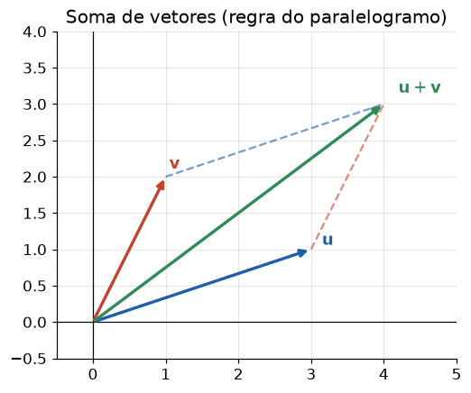
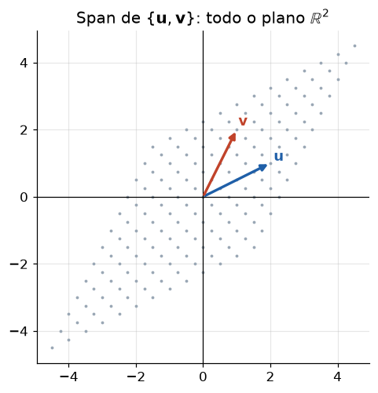

# Lição 001 — Vetores e espaços vetoriais

> **Módulo:** M00 — Fundamentos Matemáticos · **Ordem de estudo:** 1 · **Tempo:** ~55 min
> **Pré-requisitos:** sem pré-requisitos (fundamento absoluto)
> **Classificação:** complemento de aprofundamento à ementa

## Seção_Teórica

### Motivação

Todo sistema de IA — de uma regressão simples a um LLM com bilhões de parâmetros —
opera sobre **números organizados em vetores**. Um modelo não "vê" uma foto, um
texto ou um cliente: ele vê uma **lista ordenada de números** que descreve aquele
objeto. A foto vira um vetor de intensidades de pixels; a palavra vira um vetor de
*embedding*; o cliente vira um vetor de atributos (idade, gasto médio, recência).

Sem o conceito de vetor não há como falar de distância entre dois textos, de
similaridade entre dois usuários ou de "direção" em que um modelo deve ajustar
seus pesos. **Vetores e espaços vetoriais são a linguagem na qual todo o resto da
IA é escrito.** Esta é a primeira lição da Trilha justamente porque tudo o que
vem depois — matrizes, gradientes, redes neurais, atenção, busca vetorial —
pressupõe que você pensa em dados como pontos e direções num espaço.

### Princípio de funcionamento

Um **vetor** é uma lista ordenada de números reais, por exemplo
$\mathbf{v} = (3, 1, 4)$. O número de componentes define a **dimensão**:
$\mathbf{v}$ vive no espaço $\mathbb{R}^3$. Sobre vetores definimos duas
operações fundamentais:

- **Soma** componente a componente: $(a, b) + (c, d) = (a+c,\; b+d)$.
- **Multiplicação por escalar**: $k\,(a, b) = (k\,a,\; k\,b)$.

Um **espaço vetorial** é qualquer conjunto fechado sob essas duas operações (somar
dois elementos ou escalá-los nunca o tira do conjunto) e que respeita axiomas como
existência do vetor nulo e da inversa aditiva. A partir delas surgem três ideias
que usaremos o curso inteiro:

1. **Combinação linear** — somar versões escaladas de vetores:
   $a\,\mathbf{u} + b\,\mathbf{w}$.
2. **Span** — o conjunto de *todos* os pontos alcançáveis por combinações lineares
   de um grupo de vetores:

$$ \operatorname{span}\{\mathbf{u},\mathbf{w}\} = \{\, a\,\mathbf{u} + b\,\mathbf{w} \;:\; a, b \in \mathbb{R} \,\}. $$

3. **Base e dimensão** — um conjunto mínimo de vetores **linearmente independentes**
   cujo span é o espaço inteiro; a quantidade deles é a dimensão.

Geometricamente, somar é "andar um deslocamento depois do outro" e escalar é
"esticar ou encolher uma direção". Manter essa intuição geométrica viva é o que
permite, mais tarde, enxergar um *embedding* como um ponto e a similaridade de
cosseno como um ângulo.

---

### Conceito central 1 — Vetores e operações

Um vetor é, ao mesmo tempo, um **ponto** (uma localização no espaço) e uma
**direção com magnitude** (uma seta da origem até esse ponto). Em IA, a leitura
mais útil é "vetor = uma amostra de dados": cada componente é um atributo medido.
Somar dois vetores combina atributos; multiplicar por um escalar amplifica ou
reduz proporcionalmente todos os atributos de uma vez.



*A soma $\mathbf{u}+\mathbf{v}$ é a diagonal do paralelogramo formado por $\mathbf{u}$ e $\mathbf{v}$.*

#### Exemplo_Resolvido 1.1

```python
import numpy as np

# Um imóvel descrito por 3 atributos numéricos vira um vetor em R^3.
imovel = np.array([70.0, 2.0, 350.0])   # [área (m²), quartos, preço (mil R$)]
outro = np.array([30.0, 1.0, 150.0])

soma = imovel + outro          # soma componente a componente
dobro = 2.0 * imovel           # multiplicação por escalar

print("imovel:", imovel.tolist())
print("outro: ", outro.tolist())
print("soma:  ", soma.tolist())
print("dobro: ", dobro.tolist())
```

**Explicação passo a passo:**
- **Bloco 1 (`imovel`/`outro`):** cada imóvel é um vetor em `R^3`; a posição de
  cada número tem um significado fixo (área, quartos, preço).
- **Bloco 2 (`soma`):** a soma vetorial combina os dois imóveis atributo a
  atributo — somar só faz sentido entre vetores da mesma dimensão.
- **Bloco 3 (`dobro`):** multiplicar por `2.0` escala **todos** os atributos
  proporcionalmente, sem mudar a "direção" do vetor.
- **Bloco 4 (`print`):** `tolist()` imprime os valores de forma exata e
  reproduzível, sem depender da formatação de arrays.

**Saída esperada:**
```
imovel: [70.0, 2.0, 350.0]
outro:  [30.0, 1.0, 150.0]
soma:   [100.0, 3.0, 500.0]
dobro:  [140.0, 4.0, 700.0]
```

---

### Conceito central 2 — Combinação linear e span

Uma **combinação linear** de $\mathbf{u}$ e $\mathbf{w}$ é qualquer vetor da forma
$a\,\mathbf{u} + b\,\mathbf{w}$, com $a$ e $b$ escalares. Perguntar "este vetor é
combinação linear daqueles?" é o mesmo que perguntar "existem coeficientes que o
reconstroem?" — e isso é resolver um sistema linear. O **span** de um conjunto de
vetores é a coleção de tudo o que eles conseguem gerar por combinação linear; em
$\mathbb{R}^2$, dois vetores não-paralelos já geram o plano inteiro.



*Cada ponto cinza é uma combinação $a\,\mathbf{u}+b\,\mathbf{w}$; juntas, elas preenchem todo o $\mathbb{R}^2$.*

#### Exemplo_Resolvido 2.1

```python
import numpy as np

# Vetores da base canônica do plano R^2.
e1 = np.array([1.0, 0.0])
e2 = np.array([0.0, 1.0])

# Combinação linear: 3*e1 + 2*e2 produz o ponto (3, 2).
v = 3.0 * e1 + 2.0 * e2
print("combinacao 3*e1 + 2*e2 =", v.tolist())

# alvo é combinação linear de u1 e u2? Resolver a1*u1 + a2*u2 = alvo.
u1 = np.array([2.0, 1.0])
u2 = np.array([1.0, 3.0])
alvo = np.array([5.0, 5.0])
A = np.column_stack([u1, u2])          # colunas são u1 e u2
coef = np.linalg.solve(A, alvo)        # coeficientes da combinação
print("coeficientes:", np.round(coef, 4).tolist())
print("reconstrucao:", np.round(coef[0] * u1 + coef[1] * u2, 4).tolist())
```

**Explicação passo a passo:**
- **Bloco 1 (`e1`/`e2`):** a base canônica; qualquer ponto do plano é uma
  combinação `x·e1 + y·e2`.
- **Bloco 2 (`v`):** mostramos diretamente que `3·e1 + 2·e2` é o ponto `(3, 2)` —
  os coeficientes da combinação são as próprias coordenadas.
- **Bloco 3 (`A`/`coef`):** para descobrir se `alvo` está no span de `u1` e `u2`,
  montamos a matriz com essas colunas e resolvemos `A·coef = alvo`.
- **Bloco 4 (`reconstrucao`):** aplicar os coeficientes encontrados reproduz o
  `alvo`, confirmando que ele é combinação linear de `u1` e `u2`.

**Saída esperada:**
```
combinacao 3*e1 + 2*e2 = [3.0, 2.0]
coeficientes: [2.0, 1.0]
reconstrucao: [5.0, 5.0]
```

---

### Conceito central 3 — Base e dimensão

Um conjunto de vetores é **linearmente independente** quando nenhum deles é
combinação linear dos outros — ou seja, nenhum é "redundante". Uma **base** é um
conjunto independente que gera o espaço inteiro; o número de vetores da base é a
**dimensão**. A grande utilidade de uma base é que **todo** vetor do espaço tem
**coordenadas únicas** nela: trocar de base é trocar o sistema de referência sem
perder informação — exatamente o que PCA e *embeddings* fazem mais adiante.

#### Exemplo_Resolvido 3.1

```python
import numpy as np

# Uma base de R^2 formada por vetores linearmente independentes.
b1 = np.array([1.0, 1.0])
b2 = np.array([1.0, -1.0])
B = np.column_stack([b1, b2])

# Independência linear: determinante != 0 => os vetores formam base.
det = float(np.linalg.det(B))
print("determinante da base:", round(det, 4))

# Coordenadas de x na base {b1, b2}: resolver B @ c = x.
x = np.array([4.0, 2.0])
coords = np.linalg.solve(B, x)
print("coordenadas de x:", np.round(coords, 4).tolist())

# Reconstruir x a partir das coordenadas.
x_rec = coords[0] * b1 + coords[1] * b2
print("x reconstruido:", np.round(x_rec, 4).tolist())
print("dimensao do espaco:", B.shape[0])
```

**Explicação passo a passo:**
- **Bloco 1 (`b1`/`b2`/`B`):** colocamos os candidatos a base como colunas de uma
  matriz `B`.
- **Bloco 2 (`det`):** um determinante diferente de zero garante independência
  linear; logo `{b1, b2}` é base de `R^2`.
- **Bloco 3 (`coords`):** as coordenadas de `x` na nova base são a solução de
  `B·c = x` — é a "tradução" de `x` para o sistema de referência `{b1, b2}`.
- **Bloco 4 (`x_rec`):** recombinar as coordenadas com os vetores da base devolve
  `x` exatamente, e a dimensão é o número de vetores da base.

**Saída esperada:**
```
determinante da base: -2.0
coordenadas de x: [3.0, 1.0]
x reconstruido: [4.0, 2.0]
dimensao do espaco: 2
```

## Seção_Prática

> **Como reproduzir:** execute cada solução de referência com
> `python trilha/solucoes/001-vetores-e-espacos-vetoriais/solucao_<n>.py` e
> compare a saída com o arquivo `.saida.txt` correspondente. Os enunciados/esqueletos
> ficam em `trilha/pratica/001-vetores-e-espacos-vetoriais/exercicio_<n>.py`.

### Exercício 1 — Operações vetoriais do zero
- **Entrada inicial / setup:** os vetores `u = [1.0, 2.0, 3.0]` e `v = [4.0, 5.0, 6.0]` em `R^3`; implemente sem numpy.
- **Passos de execução:** implemente `soma(u, v)` (componente a componente) e `escala(c, u)` (multiplicação por escalar); use-as para imprimir `u + v`, `2 * u` e `u + 2*v`. Rode `python trilha/pratica/001-vetores-e-espacos-vetoriais/exercicio_1.py`.
- **Critério de conclusão (binário):** a saída é **exatamente** igual a `trilha/solucoes/001-vetores-e-espacos-vetoriais/solucao_1.saida.txt`, isto é, `u + v   = [5.0, 7.0, 9.0]`, `2 * u   = [2.0, 4.0, 6.0]` e `u + 2*v = [9.0, 12.0, 15.0]`; qualquer divergência reprova.
- **Solução de referência:** `trilha/solucoes/001-vetores-e-espacos-vetoriais/solucao_1.py`
- **Saída esperada:** `trilha/solucoes/001-vetores-e-espacos-vetoriais/solucao_1.saida.txt`

### Exercício 2 — Coeficientes de uma combinação linear
- **Entrada inicial / setup:** os vetores `u1 = [1.0, 2.0]`, `u2 = [3.0, 1.0]` e `alvo = [5.0, 5.0]`.
- **Passos de execução:** monte a matriz cujas colunas são `u1` e `u2`, resolva o sistema para achar os coeficientes da combinação e reconstrua o `alvo` a partir deles. Rode `python trilha/pratica/001-vetores-e-espacos-vetoriais/exercicio_2.py`.
- **Critério de conclusão (binário):** a saída imprime `coeficientes: [2.0, 1.0]` e `reconstrucao: [5.0, 5.0]`, idêntica a `solucao_2.saida.txt`; caso contrário, reprovado.
- **Solução de referência:** `trilha/solucoes/001-vetores-e-espacos-vetoriais/solucao_2.py`
- **Saída esperada:** `trilha/solucoes/001-vetores-e-espacos-vetoriais/solucao_2.saida.txt`

### Exercício 3 — Independência linear e coordenadas
- **Entrada inicial / setup:** os vetores `b1 = [2.0, 0.0]`, `b2 = [0.0, 3.0]` e o vetor `x = [6.0, 9.0]`.
- **Passos de execução:** calcule o determinante da matriz `[b1 b2]`, decida se formam base (determinante diferente de zero) e calcule as coordenadas de `x` nessa base resolvendo `B·c = x`. Rode `python trilha/pratica/001-vetores-e-espacos-vetoriais/exercicio_3.py`.
- **Critério de conclusão (binário):** a saída imprime `determinante: 6.0`, `forma base?  True` e `coordenadas: [3.0, 3.0]`, idêntica a `solucao_3.saida.txt`; qualquer divergência reprova.
- **Solução de referência:** `trilha/solucoes/001-vetores-e-espacos-vetoriais/solucao_3.py`
- **Saída esperada:** `trilha/solucoes/001-vetores-e-espacos-vetoriais/solucao_3.saida.txt`
