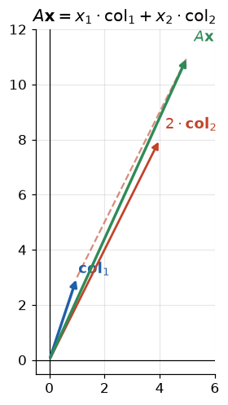

# Lição 002 — Matrizes e operações matriciais

> **Módulo:** M00 — Fundamentos Matemáticos · **Ordem de estudo:** 2 · **Tempo:** ~55 min
> **Pré-requisitos:** [001] Vetores e espaços vetoriais
> **Classificação:** complemento de aprofundamento à ementa

## Seção_Teórica

### Motivação

Um vetor descreve **uma** amostra. Mas dados reais vêm em lotes: milhares de
imagens, frases ou clientes ao mesmo tempo. Empilhar muitos vetores produz uma
**matriz** — uma tabela de números onde cada linha (ou coluna) é uma amostra.
Mais do que armazenar dados, a matriz é a peça que **conecta** dois espaços
vetoriais: os pesos de uma camada de rede neural, a matriz de covariância em PCA,
a matriz de atenção num Transformer — todas são matrizes, e tudo o que esses
modelos fazem em sua essência é **multiplicar matrizes**.

Entender as operações matriciais (multiplicação, transposta, identidade, inversa)
é, portanto, entender o "verbo" da IA. Quando um framework executa `model(x)`, no
fundo ele está encadeando produtos de matrizes em hardware otimizado. Esta lição
constrói essa base operacional sobre os vetores da Lição 001.

### Princípio de funcionamento

Uma matriz $A$ de forma $m \times n$ tem $m$ linhas e $n$ colunas. As operações
centrais são:

- **Transposta** $A^{\mathsf{T}}$: troca linhas por colunas; a forma $m \times n$ vira $n \times m$.
- **Identidade** $I$: matriz quadrada com 1 na diagonal e 0 fora; é o **elemento
  neutro** da multiplicação ($A\,I = A$).
- **Multiplicação** $C = A\,B$: só é definida quando o número de colunas de $A$
  iguala o número de linhas de $B$. O elemento $C_{ij}$ é o **produto interno**
  da linha $i$ de $A$ com a coluna $j$ de $B$:

$$ C_{ij} = \sum_{k=1}^{n} A_{ik}\,B_{kj}. $$

  A multiplicação **não é comutativa**: em geral $A\,B \neq B\,A$.
- **Inversa** $A^{-1}$: para uma matriz quadrada, é a matriz tal que
  $A\,A^{-1} = I$. Existe somente quando o determinante é diferente de zero.
  Resolver $A\,\mathbf{x} = \mathbf{b}$ equivale a $\mathbf{x} = A^{-1}\mathbf{b}$.

A intuição que carregamos adiante: **multiplicar por uma matriz é aplicar uma
transformação** (assunto da Lição 003), e a multiplicação de matriz por vetor
combina as **colunas** da matriz usando as componentes do vetor como pesos:

$$ A\mathbf{x} = x_1\,\mathbf{a}_1 + x_2\,\mathbf{a}_2 + \cdots + x_n\,\mathbf{a}_n, $$

onde $\mathbf{a}_j$ é a $j$-ésima coluna de $A$.



*$A\mathbf{x}$ é a soma das colunas de $A$ ponderadas pelas componentes de $\mathbf{x}$.*

---

### Conceito central 1 — Matriz e representação

A primeira coisa a dominar é a **forma** (`shape`): `(linhas, colunas)`. Ela
governa quais operações são válidas. A transposta reorganiza os dados sem alterar
seu conteúdo, e a identidade serve de referência neutra. Pensar "linha = amostra,
coluna = atributo" é a convenção dominante em ML (cada linha de `X` é um exemplo).

#### Exemplo_Resolvido 1.1

```python
import numpy as np

# Matriz 2x3: 2 amostras (linhas) descritas por 3 atributos (colunas).
A = np.array([[1.0, 2.0, 3.0],
              [4.0, 5.0, 6.0]])

print("forma (linhas, colunas):", A.shape)
print("transposta:", A.T.tolist())
print("identidade 3x3:", np.eye(3).tolist())
```

**Explicação passo a passo:**
- **Bloco 1 (`A`):** define uma matriz `2 × 3`; cada linha é uma amostra com três
  atributos.
- **Bloco 2 (`A.shape`):** a forma `(2, 3)` confirma 2 linhas e 3 colunas — é o
  que decide a compatibilidade nas multiplicações.
- **Bloco 3 (`A.T`):** a transposta vira uma matriz `3 × 2`; o que era linha
  agora é coluna.
- **Bloco 4 (`np.eye(3)`):** a identidade `3 × 3` é o elemento neutro da
  multiplicação, com 1 na diagonal e 0 no resto.

**Saída esperada:**
```
forma (linhas, colunas): (2, 3)
transposta: [[1.0, 4.0], [2.0, 5.0], [3.0, 6.0]]
identidade 3x3: [[1.0, 0.0, 0.0], [0.0, 1.0, 0.0], [0.0, 0.0, 1.0]]
```

---

### Conceito central 2 — Multiplicação e transposta

A multiplicação de matrizes é a operação mais importante do curso. Cada entrada
do resultado é o produto interno de uma linha com uma coluna; por isso as
dimensões internas precisam casar. Uma consequência prática que confunde
iniciantes: a ordem importa ($A\,B \neq B\,A$). A transposta aparece o tempo todo nas
fórmulas — inclusive na regra $(A\,B)^{\mathsf{T}} = B^{\mathsf{T}}A^{\mathsf{T}}$, que inverte a ordem.

#### Exemplo_Resolvido 2.1

```python
import numpy as np

A = np.array([[1.0, 2.0],
              [3.0, 4.0]])
B = np.array([[5.0, 6.0],
              [7.0, 8.0]])

AB = A @ B
BA = B @ A
print("A@B:", AB.tolist())
print("B@A:", BA.tolist())
print("comutativo?", np.array_equal(AB, BA))

# Matriz por vetor: combina as colunas de A com os pesos do vetor x.
x = np.array([1.0, 2.0])
print("A@x:", (A @ x).tolist())
```

**Explicação passo a passo:**
- **Bloco 1 (`A`/`B`):** duas matrizes `2 × 2` compatíveis para multiplicação nas
  duas ordens.
- **Bloco 2 (`AB`/`BA`):** calculamos os dois produtos; cada entrada é uma linha
  vezes uma coluna.
- **Bloco 3 (`comutativo?`):** a comparação dá `False`, evidenciando que a
  multiplicação de matrizes **não comuta**.
- **Bloco 4 (`A@x`):** multiplicar matriz por vetor produz `1·(coluna 1) +
  2·(coluna 2)`, isto é, uma combinação linear das colunas de `A`.

**Saída esperada:**
```
A@B: [[19.0, 22.0], [43.0, 50.0]]
B@A: [[23.0, 34.0], [31.0, 46.0]]
comutativo? False
A@x: [5.0, 11.0]
```

---

### Conceito central 3 — Inversa e sistemas lineares

Resolver sistemas lineares $A\,\mathbf{x} = \mathbf{b}$ é onipresente: ajustar uma regressão por
mínimos quadrados, projetar vetores, inverter transformações. Quando $A$ é
quadrada e tem determinante diferente de zero, existe a **inversa** $A^{-1}$ e a
solução é $\mathbf{x} = A^{-1}\mathbf{b}$. Na prática numérica, preferimos `np.linalg.solve` (mais
estável que inverter explicitamente), mas as duas vias devem concordar.

#### Exemplo_Resolvido 3.1

```python
import numpy as np

A = np.array([[2.0, 1.0],
              [1.0, 3.0]])

A_inv = np.linalg.inv(A)
print("inversa:", np.round(A_inv, 4).tolist())
print("A@A_inv:", (np.round(A @ A_inv, 4) + 0.0).tolist())

# Resolver A x = b pela inversa e por solve.
b = np.array([5.0, 10.0])
x_inv = A_inv @ b
x_solve = np.linalg.solve(A, b)
print("x via inversa:", np.round(x_inv, 4).tolist())
print("x via solve:  ", np.round(x_solve, 4).tolist())
```

**Explicação passo a passo:**
- **Bloco 1 (`A`):** matriz quadrada com determinante $5 \neq 0$, logo inversível.
- **Bloco 2 (`A_inv`):** calculamos a inversa; o `+ 0.0` na linha seguinte apenas
  normaliza eventuais `-0.0` para impressão limpa.
- **Bloco 3 (`A@A_inv`):** o produto reproduz a identidade, confirmando que
  `A_inv` é de fato a inversa.
- **Bloco 4 (`x_inv`/`x_solve`):** resolver `A·x = b` pelas duas vias dá o mesmo
  resultado `[1, 3]`, validando a equivalência `x = A⁻¹·b`.

**Saída esperada:**
```
inversa: [[0.6, -0.2], [-0.2, 0.4]]
A@A_inv: [[1.0, 0.0], [0.0, 1.0]]
x via inversa: [1.0, 3.0]
x via solve:   [1.0, 3.0]
```

## Seção_Prática

> **Como reproduzir:** execute cada solução de referência com
> `python trilha/solucoes/002-matrizes-e-operacoes/solucao_<n>.py` e compare a
> saída com o arquivo `.saida.txt` correspondente. Os enunciados/esqueletos ficam
> em `trilha/pratica/002-matrizes-e-operacoes/exercicio_<n>.py`.

### Exercício 1 — Multiplicação de matrizes do zero
- **Entrada inicial / setup:** `A = [[1.0, 2.0], [3.0, 4.0]]` e `B = [[5.0, 6.0], [7.0, 8.0]]` como listas de listas.
- **Passos de execução:** implemente `matmul(A, B)` com laços (cada entrada é a soma dos produtos linha×coluna), imprima o resultado e confirme com `np.allclose` contra `np.array(A) @ np.array(B)`. Rode `python trilha/pratica/002-matrizes-e-operacoes/exercicio_1.py`.
- **Critério de conclusão (binário):** a saída imprime `A@B (do zero): [[19.0, 22.0], [43.0, 50.0]]` e `confere numpy? True`, idêntica a `solucao_1.saida.txt`; qualquer divergência reprova.
- **Solução de referência:** `trilha/solucoes/002-matrizes-e-operacoes/solucao_1.py`
- **Saída esperada:** `trilha/solucoes/002-matrizes-e-operacoes/solucao_1.saida.txt`

### Exercício 2 — Propriedades da transposta
- **Entrada inicial / setup:** `A` é a matriz `2 × 3` `[[1,2,3],[4,5,6]]` e `B` é a matriz `3 × 2` `[[1,0],[0,1],[2,1]]`.
- **Passos de execução:** verifique que `(A.T).T == A` e que `(A@B).T == B.T@A.T` usando `np.array_equal`, e imprima `A@B`. Rode `python trilha/pratica/002-matrizes-e-operacoes/exercicio_2.py`.
- **Critério de conclusão (binário):** a saída imprime `(A.T).T == A? True`, `(A@B).T == B.T@A.T? True` e `A@B: [[7.0, 5.0], [16.0, 11.0]]`, idêntica a `solucao_2.saida.txt`; caso contrário, reprovado.
- **Solução de referência:** `trilha/solucoes/002-matrizes-e-operacoes/solucao_2.py`
- **Saída esperada:** `trilha/solucoes/002-matrizes-e-operacoes/solucao_2.saida.txt`

### Exercício 3 — Inversa e sistema linear
- **Entrada inicial / setup:** a matriz `A = [[4.0, 3.0], [6.0, 3.0]]` e o vetor `b = [10.0, 12.0]`.
- **Passos de execução:** calcule `A_inv` com `np.linalg.inv`, confirme `A @ A_inv` igual à identidade (some `+ 0.0` após arredondar para evitar `-0.0`) e resolva `x = A_inv @ b`. Rode `python trilha/pratica/002-matrizes-e-operacoes/exercicio_3.py`.
- **Critério de conclusão (binário):** a saída imprime `inversa: [[-0.5, 0.5], [1.0, -0.6667]]`, `A@A_inv: [[1.0, 0.0], [0.0, 1.0]]` e `x: [1.0, 2.0]`, idêntica a `solucao_3.saida.txt`; qualquer divergência reprova.
- **Solução de referência:** `trilha/solucoes/002-matrizes-e-operacoes/solucao_3.py`
- **Saída esperada:** `trilha/solucoes/002-matrizes-e-operacoes/solucao_3.saida.txt`
