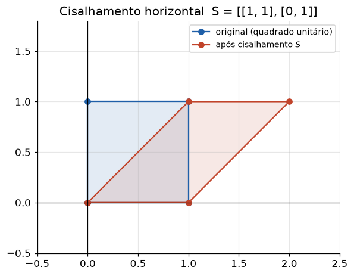
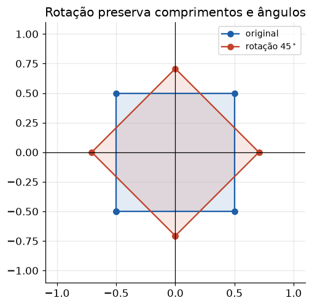

# Lição 003 — Transformações lineares e multiplicação matriz-vetor

> **Módulo:** M00 — Fundamentos Matemáticos · **Ordem de estudo:** 3 · **Tempo:** ~55 min
> **Pré-requisitos:** [002] Matrizes e operações matriciais
> **Classificação:** complemento de aprofundamento à ementa

## Seção_Teórica

### Motivação

Na Lição 002 vimos que multiplicar uma matriz por um vetor combina as colunas da
matriz. Agora damos o salto conceitual que sustenta praticamente toda a IA: **uma
matriz é uma função**. Quando escrevemos $\mathbf{y} = A\mathbf{x}$, a matriz $A$
**transforma** o vetor de entrada $\mathbf{x}$ em um novo vetor $\mathbf{y}$ —
girando, esticando, comprimindo ou inclinando o espaço.

Essa é exatamente a operação que uma **camada de rede neural** executa: ela recebe
um vetor de ativações, multiplica por uma matriz de pesos (uma transformação
linear) e soma um viés. Entender geometricamente o que uma matriz *faz* com o
espaço — e como **compor** várias transformações encadeando produtos de matrizes —
é o que transforma "multiplicar matrizes" em intuição sobre o que um modelo
aprende. Sem essa visão, redes profundas parecem mágica; com ela, são pilhas de
transformações geométricas.

### Princípio de funcionamento

Uma **transformação linear** $T$ é uma função entre espaços vetoriais que respeita
soma e multiplicação por escalar:

$$ T(a\,\mathbf{u} + b\,\mathbf{w}) = a\,T(\mathbf{u}) + b\,T(\mathbf{w}). $$

O fato central é que **toda** transformação linear em dimensão finita pode ser
escrita como uma multiplicação por matriz, $T(\mathbf{x}) = A\mathbf{x}$, e as
**colunas de $A$ são as imagens dos vetores da base**:

$$ A = \big[\; T(\mathbf{e}_1) \;\;|\;\; T(\mathbf{e}_2) \;\big]. $$

Isso dá uma receita para *ler* uma matriz: veja para onde ela leva $\mathbf{e}_1$ e
$\mathbf{e}_2$ e você sabe o que ela faz com qualquer ponto. Algumas transformações
$2\times 2$ recorrentes:

- **Escala** $\begin{smallmatrix}s_x & 0\\ 0 & s_y\end{smallmatrix}$: estica cada eixo por um fator.
- **Rotação** por ângulo $\theta$:

$$ R(\theta) = \begin{bmatrix} \cos\theta & -\sin\theta \\ \sin\theta & \cos\theta \end{bmatrix}. $$

- **Cisalhamento** (shear) $\begin{smallmatrix}1 & k\\ 0 & 1\end{smallmatrix}$: "entorta" o espaço deslizando uma direção.

Por fim, **compor** transformações é **multiplicar** as matrizes: aplicar primeiro
$B$ e depois $A$ equivale a multiplicar por $A B$. Como o produto de matrizes não
comuta, a **ordem importa**: $AB \neq BA$ em geral.



*O cisalhamento mantém a base no eixo $x$ e desliza o topo: retas continuam retas, mas ângulos mudam.*

---

### Conceito central 1 — Transformação linear como matriz

Aplicar $A$ a um vetor é avaliar a transformação naquele ponto. A propriedade de
linearidade $T(a\mathbf{u} + b\mathbf{w}) = a\,T(\mathbf{u}) + b\,T(\mathbf{w})$ é o
que define "linear" e o que permite decompor entradas complicadas em combinações
de entradas simples. As colunas de $A$ revelam imediatamente o destino dos vetores
da base canônica.

#### Exemplo_Resolvido 1.1

```python
import numpy as np

# A transformacao de escala: 2x no eixo x, 3x no eixo y.
A = np.array([[2.0, 0.0],
              [0.0, 3.0]])

e1 = np.array([1.0, 0.0])
e2 = np.array([0.0, 1.0])

print("A e1 (1a coluna):", (A @ e1).tolist())
print("A e2 (2a coluna):", (A @ e2).tolist())

x = np.array([1.0, 1.0])
print("A x:", (A @ x).tolist())
```

**Explicação passo a passo:**
- **Bloco 1 (`A`):** define uma transformação de **escala** que estica o eixo `x` por 2 e o eixo `y` por 3.
- **Bloco 2 (`e1`/`e2`):** os vetores da base canônica do plano.
- **Bloco 3 (`A @ e1`/`A @ e2`):** as imagens da base são exatamente as **colunas** de `A` — `(2, 0)` e `(0, 3)`.
- **Bloco 4 (`A @ x`):** um ponto qualquer `(1, 1)` é levado a `(2, 3)`, o resultado de escalar cada coordenada.

**Saída esperada:**
```
A e1 (1a coluna): [2.0, 0.0]
A e2 (2a coluna): [0.0, 3.0]
A x: [2.0, 3.0]
```

---

### Conceito central 2 — Intuição geométrica: rotação, escala e cisalhamento

Matrizes específicas produzem movimentos geométricos reconhecíveis. A **rotação**
preserva comprimentos e ângulos; a **escala** estica eixos; o **cisalhamento**
entorta o espaço. Saber identificar o efeito a partir dos números da matriz é a
ponte entre álgebra e geometria.



*A matriz de rotação preserva a forma e o tamanho do quadrado; só muda sua orientação.*

#### Exemplo_Resolvido 2.1

```python
import numpy as np

# Rotacao de 90 graus no sentido anti-horario.
ang = np.pi / 2
R = np.array([[np.cos(ang), -np.sin(ang)],
              [np.sin(ang),  np.cos(ang)]])

rot = R @ np.array([1.0, 0.0])
print("rotacao de (1,0) por 90 graus:", [round(float(c), 4) + 0.0 for c in rot])

# Cisalhamento horizontal.
S = np.array([[1.0, 1.0],
              [0.0, 1.0]])
print("cisalhamento de (0,1):", (S @ np.array([0.0, 1.0])).tolist())
print("cisalhamento de (1,1):", (S @ np.array([1.0, 1.0])).tolist())
```

**Explicação passo a passo:**
- **Bloco 1 (`R`):** monta a matriz de rotação de `90°` com seno e cosseno.
- **Bloco 2 (`rot`):** o vetor `(1, 0)` gira para `(0, 1)`; o `round(...) + 0.0` zera o ruído numérico do cosseno e evita `-0.0`.
- **Bloco 3 (`S`):** define um cisalhamento horizontal de fator 1.
- **Bloco 4 (`S @ ...`):** o ponto `(0, 1)` desliza para `(1, 1)` e `(1, 1)` para `(2, 1)` — a base no eixo `x` fica parada, o topo escorrega.

**Saída esperada:**
```
rotacao de (1,0) por 90 graus: [0.0, 1.0]
cisalhamento de (0,1): [1.0, 1.0]
cisalhamento de (1,1): [2.0, 1.0]
```

---

### Conceito central 3 — Composição de transformações

Encadear transformações é multiplicar matrizes: "aplique $R$ e depois $E$" é a
matriz $E R$. Como o produto não comuta, **a ordem altera o resultado** — rotacionar
e depois esticar é diferente de esticar e depois rotacionar. É exatamente assim que
uma rede neural empilha camadas.

#### Exemplo_Resolvido 3.1

```python
import numpy as np

ang = np.pi / 2
R = np.array([[np.cos(ang), -np.sin(ang)],
              [np.sin(ang),  np.cos(ang)]])      # rotacao 90 graus
E = np.array([[2.0, 0.0],
              [0.0, 1.0]])                       # escala 2x no eixo x

v = np.array([1.0, 0.0])
ER = E @ R     # primeiro rotaciona, depois escala
RE = R @ E     # primeiro escala, depois rotaciona

print("E@R aplicado a v:", [round(float(c), 4) + 0.0 for c in (ER @ v)])
print("R@E aplicado a v:", [round(float(c), 4) + 0.0 for c in (RE @ v)])
print("E@R == R@E ?", np.array_equal(np.round(ER, 6), np.round(RE, 6)))
```

**Explicação passo a passo:**
- **Bloco 1 (`R`/`E`):** uma rotação de `90°` e uma escala que dobra o eixo `x`.
- **Bloco 2 (`ER`/`RE`):** as duas ordens de composição; lembre que `E @ R` significa "aplicar `R` primeiro".
- **Bloco 3 (`ER @ v`):** rotacionar `(1,0)` para `(0,1)` e então escalar mantém `(0, 1)` (o eixo `y` não é esticado).
- **Bloco 4 (`RE @ v`/comparação):** escalar primeiro leva `(1,0)` a `(2,0)` e a rotação o leva a `(0, 2)`; como os resultados diferem, a comparação imprime `False` — a ordem importa.

**Saída esperada:**
```
E@R aplicado a v: [0.0, 1.0]
R@E aplicado a v: [0.0, 2.0]
E@R == R@E ? False
```

## Seção_Prática

> **Como reproduzir:** execute cada solução de referência com
> `python trilha/solucoes/003-transformacoes-lineares/solucao_<n>.py` e compare a
> saída com o arquivo `.saida.txt` correspondente. Os enunciados/esqueletos ficam
> em `trilha/pratica/003-transformacoes-lineares/exercicio_<n>.py`.

### Exercício 1 — Produto matriz-vetor do zero e teste de linearidade
- **Entrada inicial / setup:** a matriz `A = [[2.0, -1.0], [0.0, 3.0]]`, os vetores `u = [1.0, 2.0]`, `v = [3.0, -1.0]` e os escalares `a = 2.0`, `b = -1.0`.
- **Passos de execução:** implemente `matvec(A, x)` com laços (cada saída é o produto interno de uma linha por `x`); calcule `T(a*u + b*v)` e `a*T(u) + b*T(v)` e verifique a igualdade com `np.allclose`.
- **Critério de conclusão (binário):** a saída é **exatamente** `T(a*u + b*v): [-7.0, 15.0]`, `a*T(u)+b*T(v): [-7.0, 15.0]` e `linear? True`, idêntica a `solucao_1.saida.txt`; qualquer divergência reprova.
- **Solução de referência:** `trilha/solucoes/003-transformacoes-lineares/solucao_1.py`
- **Saída esperada:** `trilha/solucoes/003-transformacoes-lineares/solucao_1.saida.txt`

### Exercício 2 — Rotação de 180° aplicada a um conjunto de pontos
- **Entrada inicial / setup:** a matriz de rotação de 180° `R = [[-1.0, 0.0], [0.0, -1.0]]` e os pontos `[[1, 0], [0, 2], [3, -4]]` (como linhas).
- **Passos de execução:** aplique a transformação a todos os pontos de uma vez (`(R @ pts.T).T`) e confirme com `np.allclose` que aplicá-la **duas** vezes retorna aos pontos originais.
- **Critério de conclusão (binário):** a saída imprime `rotacionados: [[-1.0, 0.0], [0.0, -2.0], [-3.0, 4.0]]` e `dupla rotacao volta ao inicio? True`, idêntica a `solucao_2.saida.txt`; caso contrário, reprovado.
- **Solução de referência:** `trilha/solucoes/003-transformacoes-lineares/solucao_2.py`
- **Saída esperada:** `trilha/solucoes/003-transformacoes-lineares/solucao_2.saida.txt`

### Exercício 3 — Forward pass de uma rede neural de 2 camadas
- **Entrada inicial / setup:** a entrada `x = [1.0, 2.0]`, os pesos `W1` (3×2) e `b1` e os pesos `W2` (2×3) e `b2` fornecidos na solução.
- **Passos de execução:** calcule a camada oculta `h = ReLU(W1 @ x + b1)` e a saída `y = W2 @ h + b2`, imprimindo `h` e `y`; reconheça que cada camada é uma transformação (matriz) seguida de viés e não-linearidade.
- **Critério de conclusão (binário):** a saída é **exatamente** `h (camada oculta): [0.0, 2.0, 2.0]` e `y (saida): [-2.0, 2.0]`, idêntica a `solucao_3.saida.txt`; qualquer divergência reprova.
- **Solução de referência:** `trilha/solucoes/003-transformacoes-lineares/solucao_3.py`
- **Saída esperada:** `trilha/solucoes/003-transformacoes-lineares/solucao_3.saida.txt`
