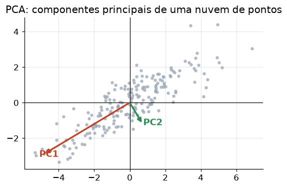

# Lição 004 — Autovalores, autovetores, SVD/PCA (intuição)

> **Módulo:** M00 — Fundamentos Matemáticos · **Ordem de estudo:** 4 · **Tempo:** ~55 min
> **Pré-requisitos:** [003] Transformações lineares e multiplicação matriz-vetor
> **Classificação:** complemento de aprofundamento à ementa

## Seção_Teórica

### Motivação

Uma matriz `A` representa uma **transformação linear**: ela pega um vetor e o
gira, estica, comprime ou reflete. Olhar para os 4, 9 ou milhares de números de
uma matriz, porém, não revela o que ela **faz** geometricamente. Precisamos de
uma forma de enxergar a "essência" de uma transformação — quais direções ela
preserva, em quais fatores ela amplifica o espaço, e quanta informação podemos
descartar sem perder o que importa.

Esse é o problema que **autovalores/autovetores** e a **SVD** resolvem: eles
expõem o esqueleto de uma matriz. E é exatamente sobre esse esqueleto que se
apoia o **PCA** (Análise de Componentes Principais), a técnica clássica de
**redução de dimensionalidade**. Em Engenharia de IA isso aparece o tempo todo:
um *embedding* de um texto pode viver em 1.536 dimensões, mas a maior parte da
"forma" dos dados costuma estar concentrada em pouquíssimas direções. Comprimir,
visualizar em 2D, remover ruído e acelerar a busca vetorial são todas aplicações
diretas das ideias desta lição.

### Princípio de funcionamento

Para uma matriz quadrada `A`, um **autovetor** `v` é uma direção especial que a
transformação **não desvia**: aplicar `A` a `v` apenas o reescala por um número
`λ` (o **autovalor**):

$$ A\,\mathbf{v} = \lambda\,\mathbf{v}, \qquad \mathbf{v} \neq \mathbf{0}. $$

Geometricamente, ao longo de um autovetor a transformação age como uma simples
multiplicação por `λ`. Para matrizes **simétricas** (como as matrizes de
covariância do PCA) os autovetores são ortogonais entre si e os autovalores são
reais — eles formam um novo sistema de eixos no qual a transformação é apenas um
"esticar/encolher" em cada eixo.

Quando a matriz **não é quadrada** (o caso geral de dados: `n` amostras × `d`
features), usamos a **SVD** (*Singular Value Decomposition*), que fatoriza
**qualquer** matriz `M` como:

$$ M = U\,\Sigma\,V^{\mathsf{T}}, $$

onde `U` e `V` são rotações (bases ortonormais) e `Σ` é uma matriz diagonal com
os **valores singulares** `σ₁ ≥ σ₂ ≥ … ≥ 0`. Cada `σ` mede **quanta energia**
(variância) a matriz coloca naquela direção. Guardar apenas os `k` maiores `σ`
produz a **melhor aproximação de posto `k`** possível (teorema de
Eckart–Young) — é assim que comprimimos dados com perda mínima. O **PCA** é
exatamente a SVD (ou a decomposição em autovalores da covariância) aplicada aos
dados **centralizados**: os autovetores da covariância são as **direções de
máxima variância**, e os autovalores dizem **quanta variância** cada direção
carrega.

---

### Conceito central 1 — Autovalores e autovetores

A equação $A\,\mathbf{v} = \lambda\,\mathbf{v}$ define os autopares. Resolver
$\det(A - \lambda I) = 0$ dá os autovalores; para cada $\lambda$, o espaço nulo de
$(A - \lambda I)$ dá os autovetores. Duas
identidades úteis para conferir contas: a **soma** dos autovalores é igual ao
**traço** (soma da diagonal) e o **produto** dos autovalores é igual ao
**determinante**.

#### Exemplo_Resolvido 1.1

```python
import numpy as np

A = np.array([[2.0, 1.0],
              [1.0, 2.0]])
valores, vetores = np.linalg.eigh(A)   # matriz simétrica: autovalores reais, crescentes

print(f"Matriz A = [[2, 1], [1, 2]]")
print(f"Autovalores (crescente): {[round(float(v), 4) for v in valores]}")
print("Verificacao A v = lambda v (norma do residuo):")
for i in range(len(valores)):
    v = vetores[:, i]
    residuo = np.linalg.norm(A @ v - valores[i] * v)
    print(f"  lambda={valores[i]:.4f} -> residuo={residuo:.6f}")
print(f"Traco(A)={np.trace(A):.4f}  soma dos autovalores={valores.sum():.4f}")
detA = np.linalg.det(A)
print(f"Det(A)={detA:.4f}  produto dos autovalores={np.prod(valores):.4f}")
```

**Explicação passo a passo:**
- **Bloco 1 (`A`):** define a matriz simétrica `[[2,1],[1,2]]`.
- **Bloco 2 (`eigh`):** `numpy.linalg.eigh` é o método indicado para matrizes simétricas; devolve autovalores reais em ordem crescente e autovetores ortonormais nas colunas de `vetores`.
- **Bloco 3 (laço de verificação):** para cada autopar $(\lambda, \mathbf{v})$, calcula o resíduo $\|A\mathbf{v} - \lambda\mathbf{v}\|$; valores ~0 confirmam que `v` é mesmo um autovetor.
- **Bloco 4 (identidades):** confirma `traço = soma` (= 4) e `det = produto` (= 3) dos autovalores, dois "checksums" clássicos de álgebra linear.

**Saída esperada:**
```
Matriz A = [[2, 1], [1, 2]]
Autovalores (crescente): [1.0, 3.0]
Verificacao A v = lambda v (norma do residuo):
  lambda=1.0000 -> residuo=0.000000
  lambda=3.0000 -> residuo=0.000000
Traco(A)=4.0000  soma dos autovalores=4.0000
Det(A)=3.0000  produto dos autovalores=3.0000
```

---

### Conceito central 2 — SVD (decomposição em valores singulares)

A SVD generaliza a ideia de autovalores para **qualquer** matriz. Os valores
singulares `σ` são sempre reais e não-negativos, ordenados do maior para o menor.
Manter apenas os `k` primeiros produz a melhor aproximação de posto `k`: o
**erro** de reconstrução (em norma de Frobenius) é $\sqrt{\sigma_{k+1}^2 + \cdots}$, e a
**energia capturada** é a fração $\sum_{i=1}^{k}\sigma_i^2 \,/\, \sum_i \sigma_i^2$. É a base matemática da
compressão com perda e da remoção de ruído.

#### Exemplo_Resolvido 2.1

```python
import numpy as np

M = np.array([[0.0, 2.0],
              [3.0, 0.0]])
U, S, Vt = np.linalg.svd(M, full_matrices=False)

print(f"Valores singulares: {[round(float(s), 4) for s in S]}")
rank1 = S[0] * np.outer(U[:, 0], Vt[0, :])     # melhor aproximacao de posto 1
erro = np.linalg.norm(M - rank1)
print(f"Norma de Frobenius de M: {np.linalg.norm(M):.4f}")
print(f"Erro de reconstrucao rank-1: {erro:.4f}")
energia = (S[0] ** 2) / (S ** 2).sum()
print(f"Energia capturada pelo 1o componente: {energia * 100:.1f}%")
```

**Explicação passo a passo:**
- **Bloco 1 (`M`):** uma matriz **não diagonal** `[[0,2],[3,0]]`, para deixar claro que a SVD funciona em qualquer matriz, não só nas "bonitas".
- **Bloco 2 (`svd`):** `full_matrices=False` devolve a forma econômica; `S` traz os valores singulares `[3, 2]` em ordem decrescente.
- **Bloco 3 (`rank1`):** reconstrói `M` usando só o maior valor singular — note que o produto `U₀·Vᵀ₀` é insensível ao sinal (os sinais de `U` e `V` se cancelam), então o resultado é determinístico.
- **Bloco 4 (energia):** o 1º componente carrega `9/13 ≈ 69,2%` da energia; o erro de reconstrução de posto 1 é `√(2²) = 2`.

**Saída esperada:**
```
Valores singulares: [3.0, 2.0]
Norma de Frobenius de M: 3.6056
Erro de reconstrucao rank-1: 2.0000
Energia capturada pelo 1o componente: 69.2%
```

---

### Conceito central 3 — PCA e a ligação com embeddings

O **PCA** procura os eixos ao longo dos quais os dados mais variam. O
procedimento: (1) centralizar os dados (subtrair a média), (2) calcular a matriz
de **covariância**, (3) pegar seus autovetores (os **componentes principais**) e
autovalores (a **variância** em cada componente). Projetar os dados nos `k`
componentes de maior variância reduz a dimensionalidade preservando o máximo de
informação. É exatamente o que fazemos com **embeddings**: um vetor de centenas
de dimensões frequentemente tem sua "forma" concentrada em poucas direções, e o
PCA permite comprimir, visualizar em 2D/3D ou acelerar buscas.



*O PC1 aponta na direção de maior variância dos dados; o PC2, ortogonal, na segunda maior. Projetar no PC1 reduz a dimensão preservando o máximo de informação.*

#### Exemplo_Resolvido 3.1

```python
import numpy as np

# 5 "embeddings" em 3D (cada linha é um vetor); aqui todos vivem sobre uma reta.
X = np.array([
    [ 2.0,  1.0,  0.0],
    [ 1.0,  0.5,  0.0],
    [-1.0, -0.5,  0.0],
    [-2.0, -1.0,  0.0],
    [ 0.0,  0.0,  0.0],
])
Xc = X - X.mean(axis=0)                 # 1) centralizar
cov = (Xc.T @ Xc) / (len(X) - 1)        # 2) matriz de covariancia
valores, vetores = np.linalg.eigh(cov)  # 3) componentes principais
ordem = np.argsort(valores)[::-1]       # ordem decrescente de variancia
valores = valores[ordem]
razao = valores / valores.sum()
print(f"Variancia por componente: {[round(float(v), 4) + 0.0 for v in valores]}")
print(f"Razao de variancia explicada: {[round(float(r), 4) + 0.0 for r in razao]}")
print(f"Variancia explicada pelos 2 primeiros PCs: {razao[:2].sum() * 100:.1f}%")
pc1 = vetores[:, ordem[0]]
proj = Xc @ pc1
recon = np.outer(proj, pc1)             # reconstrucao usando 1 componente
erro = np.linalg.norm(Xc - recon)
print(f"Erro de reconstrucao usando 1 componente: {erro:.4f}")
```

**Explicação passo a passo:**
- **Bloco 1 (`X`):** cinco vetores em 3D que, por construção, são todos múltiplos de `(2,1,0)` — ou seja, os dados são **intrinsecamente 1D** mergulhados em 3D.
- **Bloco 2 (centralizar + covariância):** subtrai a média (aqui já é zero) e monta a covariância amostral `Xcᵀ·Xc/(n−1)`.
- **Bloco 3 (autovalores ordenados):** os autovalores da covariância são as variâncias por componente; ordenamos do maior para o menor. O truque `round(...) + 0.0` evita imprimir `-0.0` de ruído numérico.
- **Bloco 4 (reconstrução):** como os dados são 1D, **um único** componente reconstrói tudo: razão de variância `[1, 0, 0]` e erro de reconstrução **zero** — a essência da redução de dimensionalidade sem perda.

**Saída esperada:**
```
Variancia por componente: [3.125, 0.0, 0.0]
Razao de variancia explicada: [1.0, 0.0, 0.0]
Variancia explicada pelos 2 primeiros PCs: 100.0%
Erro de reconstrucao usando 1 componente: 0.0000
```

## Seção_Prática

> **Como reproduzir:** execute cada solução de referência com
> `python trilha/solucoes/004-autovalores-autovetores-svd-pca/solucao_<n>.py` e
> compare a saída com o arquivo `.saida.txt` correspondente.

### Exercício 1 — Verificar a equação de autovalores
- **Entrada inicial / setup:** matriz simétrica `B = [[4, 1], [1, 4]]`; use `numpy.linalg.eigh`.
- **Passos de execução:** calcule os autovalores/autovetores, imprima os autovalores (4 casas), confirme `traço = soma` e `det = produto`, calcule o resíduo máximo `‖B·v − λ·v‖` e imprima `OK`/`FALHOU`.
- **Critério de conclusão (binário):** a saída é **exatamente** igual a `solucao_1.saida.txt` (primeira linha `Autovalores: [3.0, 5.0]` e última linha `OK`) — caso contrário, reprovado.
- **Solução de referência:** `trilha/solucoes/004-autovalores-autovetores-svd-pca/solucao_1.py`
- **Saída esperada:** `trilha/solucoes/004-autovalores-autovetores-svd-pca/solucao_1.saida.txt`

### Exercício 2 — Aproximação de baixo posto via SVD
- **Entrada inicial / setup:** matriz `C = diag(3, 2, 1)` (3×3); `numpy.linalg.svd` com `full_matrices=False`.
- **Passos de execução:** imprima os valores singulares; para `k = 1, 2, 3`, reconstrua a aproximação de posto `k` e imprima o erro de Frobenius e a energia (variância) capturada em `%`.
- **Critério de conclusão (binário):** a saída é **exatamente** igual a `solucao_2.saida.txt` (`rank-2` deve mostrar `energia=92.9%`) — qualquer divergência reprova.
- **Solução de referência:** `trilha/solucoes/004-autovalores-autovetores-svd-pca/solucao_2.py`
- **Saída esperada:** `trilha/solucoes/004-autovalores-autovetores-svd-pca/solucao_2.saida.txt`

### Exercício 3 — PCA: quantos componentes para 90% da variância
- **Entrada inicial / setup:** conjunto `X` de 4 pontos em 3D (fornecido no enunciado), variando em duas direções (eixos x e y).
- **Passos de execução:** centralize, calcule a covariância, obtenha as variâncias por componente (ordem decrescente, sem ruído negativo), imprima a razão de variância e a variância acumulada, e determine o menor `k` com variância acumulada `≥ 90%`.
- **Critério de conclusão (binário):** a saída é **exatamente** igual a `solucao_3.saida.txt` (última linha `Componentes para >=90% da variancia: 2`) — caso contrário, reprovado.
- **Solução de referência:** `trilha/solucoes/004-autovalores-autovetores-svd-pca/solucao_3.py`
- **Saída esperada:** `trilha/solucoes/004-autovalores-autovetores-svd-pca/solucao_3.saida.txt`
