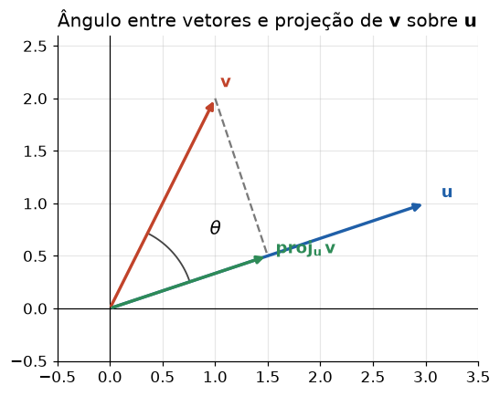
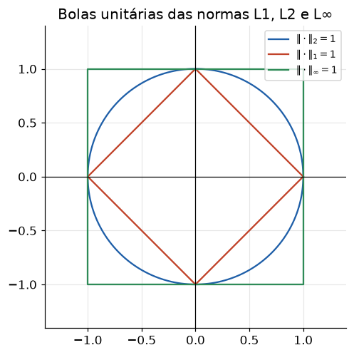

# Lição 005 — Normas, produto interno e distâncias

> **Módulo:** M00 — Fundamentos Matemáticos · **Ordem de estudo:** 5 · **Tempo:** ~55 min
> **Pré-requisitos:** [001] Vetores e espaços vetoriais
> **Classificação:** complemento de aprofundamento à ementa

## Seção_Teórica

### Motivação

Quando um sistema de busca semântica decide que dois textos são "parecidos", ou
quando um modelo recupera os documentos mais relevantes para uma pergunta, no
fundo ele está medindo **distância** e **ângulo** entre vetores de *embedding*.
Tudo isso depende de três ferramentas: **normas** (o "tamanho" de um vetor),
**produto interno** (o quanto dois vetores apontam na mesma direção) e
**distâncias** (o quão longe um do outro eles estão).

Esta é a base matemática direta da **busca vetorial** e do **RAG**. A famosa
**similaridade do cosseno** — métrica padrão para comparar embeddings — sai
diretamente do produto interno e das normas. Entender por que o cosseno ignora a
magnitude e foca na direção, e quando a distância euclidiana é preferível,
separa quem usa uma biblioteca de vetores às cegas de quem entende o que ela
mede.

### Princípio de funcionamento

A **norma** generaliza a ideia de comprimento. Para um vetor
$\mathbf{x} = (x_1, \ldots, x_n)$, as mais usadas são:

$$ \|\mathbf{x}\|_1 = \sum_{i} |x_i|, \qquad \|\mathbf{x}\|_2 = \sqrt{\sum_{i} x_i^2}, \qquad \|\mathbf{x}\|_\infty = \max_i |x_i|. $$

A norma L2 (euclidiana) é a mais comum; **normalizar** um vetor é dividi-lo pela
sua norma L2 para obter um vetor de comprimento 1 (mesma direção). O **produto
interno** (ou produto escalar) entre dois vetores é

$$ \langle \mathbf{u}, \mathbf{v} \rangle = \mathbf{u} \cdot \mathbf{v} = \sum_i u_i\,v_i, $$

e conecta-se ao **ângulo** $\theta$ entre eles pela identidade
$\mathbf{u} \cdot \mathbf{v} = \|\mathbf{u}\|_2\,\|\mathbf{v}\|_2 \cos\theta$. Isolando o cosseno, obtemos a
**similaridade do cosseno**:

$$ \cos\theta = \frac{\mathbf{u} \cdot \mathbf{v}}{\|\mathbf{u}\|_2\,\|\mathbf{v}\|_2}. $$

Ela vale 1 quando os vetores apontam na mesma direção, 0 quando são ortogonais e
−1 quando são opostos — **independentemente da magnitude**. Por fim, a **distância
euclidiana** $\|\mathbf{u} - \mathbf{v}\|_2$ mede a separação absoluta entre dois pontos. A
diferença crucial: o cosseno compara **direção**; a distância L2 compara
**posição** (e portanto sofre influência da magnitude).



*O produto interno mede o quanto $\mathbf{v}$ "anda na direção" de $\mathbf{u}$; o cosseno do ângulo $\theta$ normaliza isso pelas magnitudes.*

---

### Conceito central 1 — Normas L1, L2 e L∞

Cada norma mede tamanho de um jeito: a **L1** soma valores absolutos (distância
"quarteirão"), a **L2** é o comprimento geométrico usual, e a **L∞** é a maior
coordenada em módulo. A escolha da norma muda o formato da "bola unitária"
(conjunto de vetores de norma 1) e aparece em regularização (L1 promove
esparsidade, L2 penaliza grandes pesos).



*Cada curva é o conjunto de vetores com norma igual a 1: um losango (L1), um círculo (L2) e um quadrado (L∞).*

#### Exemplo_Resolvido 1.1

```python
import math

w = [3.0, -4.0]
l1 = sum(abs(x) for x in w)
l2 = math.sqrt(sum(x * x for x in w))
linf = max(abs(x) for x in w)
print(f"L1={l1:.4f} L2={l2:.4f} Linf={linf:.4f}")

# Normalizar pela norma L2 produz um vetor de comprimento 1.
u = [x / l2 for x in w]
print("normalizado:", [round(x, 4) for x in u])
print(f"norma do normalizado: {math.sqrt(sum(x * x for x in u)):.4f}")
```

**Explicação passo a passo:**
- **Bloco 1 (`w`):** o vetor `(3, -4)`, escolhido porque sua norma L2 é exatamente 5 (triângulo 3-4-5).
- **Bloco 2 (`l1`/`l2`/`linf`):** L1 = `|3| + |-4| = 7`; L2 = `√(9 + 16) = 5`; L∞ = `max(3, 4) = 4`.
- **Bloco 3 (`u`):** dividir por `l2 = 5` dá o vetor unitário `(0.6, -0.8)` na mesma direção.
- **Bloco 4 (`print`):** a norma do vetor normalizado é `1.0000`, confirmando a normalização.

**Saída esperada:**
```
L1=7.0000 L2=5.0000 Linf=4.0000
normalizado: [0.6, -0.8]
norma do normalizado: 1.0000
```

---

### Conceito central 2 — Produto interno e similaridade do cosseno

O **produto interno** soma os produtos componente a componente; é grande quando os
vetores apontam para o mesmo lado e zero quando são perpendiculares. A
**similaridade do cosseno** normaliza o produto interno pelas magnitudes, isolando
o **ângulo**. É a métrica que mede "semelhança de direção" entre embeddings.

#### Exemplo_Resolvido 2.1

```python
import math

def dot(u, v):
    return sum(a * b for a, b in zip(u, v))

def norm(u):
    return math.sqrt(dot(u, u))

def cos_sim(u, v):
    return dot(u, v) / (norm(u) * norm(v))

a = [1.0, 0.0]
b = [1.0, 1.0]
print(f"dot = {dot(a, b):.4f}")
print(f"cos = {cos_sim(a, b):.4f}")
print(f"angulo (graus) = {math.degrees(math.acos(cos_sim(a, b))):.4f}")
```

**Explicação passo a passo:**
- **Bloco 1 (`dot`/`norm`/`cos_sim`):** implementa produto interno, norma L2 e a similaridade do cosseno do zero.
- **Bloco 2 (`a`/`b`):** os vetores `(1, 0)` e `(1, 1)`.
- **Bloco 3 (`dot`):** o produto interno é `1·1 + 0·1 = 1`.
- **Bloco 4 (`cos`/ângulo):** o cosseno é `1 / (1 · √2) = 0.7071`, que corresponde a um ângulo de exatamente `45°` entre os vetores.

**Saída esperada:**
```
dot = 1.0000
cos = 0.7071
angulo (graus) = 45.0000
```

---

### Conceito central 3 — Distâncias e busca semântica

Em busca vetorial, dois critérios competem: a **distância euclidiana** (quão longe
os pontos estão) e a **similaridade do cosseno** (quão alinhados eles estão). O
cosseno é **invariante à escala** — multiplicar um vetor por uma constante positiva
não muda sua direção — e por isso é preferido para embeddings, onde a magnitude
costuma refletir comprimento de texto, não significado.

#### Exemplo_Resolvido 3.1

```python
import math

def dot(u, v):
    return sum(a * b for a, b in zip(u, v))

def norm(u):
    return math.sqrt(dot(u, u))

def cos_sim(u, v):
    return dot(u, v) / (norm(u) * norm(v))

def l2(u, v):
    return math.sqrt(sum((a - b) ** 2 for a, b in zip(u, v)))

q = [1.0, 1.0]
d1 = [2.0, 2.0]   # mesma direcao de q, magnitude maior
d2 = [1.0, 0.0]
print(f"cos(q,d1) = {cos_sim(q, d1):.4f}")
print(f"cos(q,d2) = {cos_sim(q, d2):.4f}")
print(f"L2(q,d1)  = {l2(q, d1):.4f}")
print(f"L2(q,d2)  = {l2(q, d2):.4f}")
```

**Explicação passo a passo:**
- **Bloco 1 (funções):** produto interno, norma, cosseno e distância L2 implementados do zero.
- **Bloco 2 (`q`/`d1`/`d2`):** a consulta `q = (1, 1)`; `d1` aponta na **mesma direção** (mas é maior) e `d2` aponta para outra direção.
- **Bloco 3 (cossenos):** `cos(q, d1) = 1.0000` (direção idêntica), enquanto `cos(q, d2) = 0.7071`.
- **Bloco 4 (distâncias):** pela L2, porém, `d2` está mais perto (`1.0000 < 1.4142`) — os dois critérios discordam, exatamente porque a magnitude de `d1` o afasta apesar do alinhamento perfeito.

**Saída esperada:**
```
cos(q,d1) = 1.0000
cos(q,d2) = 0.7071
L2(q,d1)  = 1.4142
L2(q,d2)  = 1.0000
```

## Seção_Prática

> **Como reproduzir:** execute cada solução de referência com
> `python trilha/solucoes/005-normas-produto-interno-distancias/solucao_<n>.py` e
> compare a saída com o arquivo `.saida.txt` correspondente. Os enunciados/esqueletos
> ficam em `trilha/pratica/005-normas-produto-interno-distancias/exercicio_<n>.py`.

### Exercício 1 — Normas do zero e normalização
- **Entrada inicial / setup:** o vetor `w = [1.0, -2.0, 2.0]`; use apenas o módulo `math`.
- **Passos de execução:** implemente as normas L1, L2 e L∞, normalize `w` pela L2 e confirme que o vetor resultante tem norma 1, imprimindo `OK` em caso afirmativo.
- **Critério de conclusão (binário):** a saída é **exatamente** `L1=5.0000 L2=3.0000 Linf=2.0000`, `normalizado: [0.3333, -0.6667, 0.6667]`, `norma do normalizado: 1.0000` e `OK`, idêntica a `solucao_1.saida.txt`; qualquer divergência reprova.
- **Solução de referência:** `trilha/solucoes/005-normas-produto-interno-distancias/solucao_1.py`
- **Saída esperada:** `trilha/solucoes/005-normas-produto-interno-distancias/solucao_1.saida.txt`

### Exercício 2 — Ranking por cosseno vs. por distância L2
- **Entrada inicial / setup:** a consulta `q = [1.0, 1.0]` e os documentos `A = [10.0, 10.0]`, `B = [1.0, 0.0]`, `C = [0.0, 2.0]`.
- **Passos de execução:** implemente `cos_sim` e `l2`, ordene os documentos por similaridade do cosseno (decrescente) e por distância L2 (crescente), e imprima o top de cada critério.
- **Critério de conclusão (binário):** a saída termina **exatamente** com `top cosseno=A top L2=B`, idêntica a `solucao_2.saida.txt`; caso contrário, reprovado.
- **Solução de referência:** `trilha/solucoes/005-normas-produto-interno-distancias/solucao_2.py`
- **Saída esperada:** `trilha/solucoes/005-normas-produto-interno-distancias/solucao_2.saida.txt`

### Exercício 3 — Invariância do cosseno à escala
- **Entrada inicial / setup:** a referência `ref = [1.0, 2.0]`, o vetor `x = [2.0, 1.0]` e sua versão escalada `5x`.
- **Passos de execução:** calcule `cos(ref, x)` e `cos(ref, 5x)`, além de `dot` e `L2` para os dois, e verifique que o cosseno não muda enquanto produto interno e distância mudam.
- **Critério de conclusão (binário):** a saída é **exatamente** `cos(ref, x)  = 0.8000`, `cos(ref, 5x) = 0.8000` e termina com `cosseno invariante a escala`, idêntica a `solucao_3.saida.txt`; qualquer divergência reprova.
- **Solução de referência:** `trilha/solucoes/005-normas-produto-interno-distancias/solucao_3.py`
- **Saída esperada:** `trilha/solucoes/005-normas-produto-interno-distancias/solucao_3.saida.txt`
