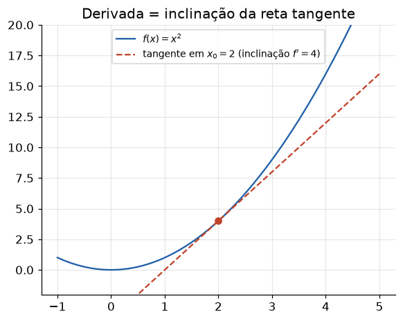

# Lição 006 — Funções, limites e derivadas

> **Módulo:** M00 — Fundamentos Matemáticos · **Ordem de estudo:** 6 · **Tempo:** ~55 min
> **Pré-requisitos:** sem pré-requisitos
> **Classificação:** complemento de aprofundamento à ementa

## Seção_Teórica

### Motivação

Treinar um modelo de IA é, no fundo, **ajustar números** (os parâmetros) para que
o modelo erre o mínimo possível. Mas como saber **em que direção** mexer cada número
para reduzir o erro? A resposta vem do cálculo: precisamos medir **como uma saída
muda quando mexemos numa entrada**. Essa medida de sensibilidade é a **derivada**.

Sem derivadas, "melhorar o modelo" seria adivinhação cega. Com elas, conseguimos
responder perguntas como: "se eu aumentar este peso um pouquinho, o erro sobe ou
desce, e com que intensidade?". Toda a maquinaria de treino — gradient descent,
backpropagation — é construída sobre a ideia de derivada. Esta lição parte do
fundamento absoluto (o que é uma função) e chega à intuição central de IA: **otimizar
é caminhar até onde a derivada zera**.

### Princípio de funcionamento

Uma **função** `f` é uma regra que associa cada entrada `x` a uma única saída `f(x)`.
Para medir o quanto `f` muda, começamos pela **taxa de variação média** entre dois
pontos `a` e `b`:

$$ \text{taxa média} = \frac{f(b) - f(a)}{b - a}. $$

Isso é a inclinação da reta que liga os dois pontos do gráfico. Quando aproximamos
`b` de `a` — formalmente, tomamos o **limite** com a distância `h = b − a` tendendo
a zero — a reta secante vira a reta **tangente**, e a inclinação vira a **derivada**:

$$ f'(x) = \lim_{h \to 0} \frac{f(x + h) - f(x)}{h}. $$

A derivada `f'(x)` é a **taxa de variação instantânea** de `f` em `x`: o quão
rápido a saída muda naquele ponto exato. **Otimizar** uma função significa procurar
seus pontos de mínimo ou máximo; nesses pontos a tangente é horizontal, ou seja,
`f'(x) = 0` (chamados **pontos críticos**). Esse é exatamente o critério que o
treino de modelos persegue: encontrar os parâmetros onde a derivada da perda zera.

---

### Conceito central 1 — Função e taxa de variação média

A taxa de variação média responde "em média, quanto a saída muda por unidade de
entrada, entre dois pontos?". É a primeira e mais concreta forma de medir mudança,
e não exige nenhum limite — apenas avaliar a função em dois pontos.

#### Exemplo_Resolvido 1.1

```python
def f(x):
    return x ** 2

a, b = 1.0, 3.0
taxa_media = (f(b) - f(a)) / (b - a)
print(f"f({a}) = {f(a)}")
print(f"f({b}) = {f(b)}")
print(f"taxa de variacao media em [{a}, {b}] = {taxa_media}")
```

**Explicação passo a passo:**
- **Bloco 1 (`f`):** define a função `f(x) = x²`, uma parábola.
- **Bloco 2 (pontos):** escolhe o intervalo `[1, 3]` para medir a variação.
- **Bloco 3 (`taxa_media`):** aplica `(f(b) − f(a)) / (b − a) = (9 − 1) / (3 − 1) = 4`, a inclinação média da função nesse trecho.
- **Bloco 4 (`print`):** mostra os valores da função e a taxa média resultante.

**Saída esperada:**
```
f(1.0) = 1.0
f(3.0) = 9.0
taxa de variacao media em [1.0, 3.0] = 4.0
```

---

### Conceito central 2 — Limite e derivada

A taxa média depende de **dois** pontos. Para obter a taxa **num único ponto**,
encolhemos a distância `h` entre eles até quase zero: esse processo de limite é a
**derivada**. Numericamente, basta usar um `h` bem pequeno e observar que a razão
incremental se aproxima do valor analítico (para $f(x) = x^2$, a derivada exata é
$2x$).



*A derivada em $x_0$ é a inclinação da reta tangente ao gráfico naquele ponto.*

#### Exemplo_Resolvido 2.1

```python
def f(x):
    return x ** 2

def derivada_aprox(f, x, h):
    return (f(x + h) - f(x)) / h

x = 2.0
for h in [1.0, 0.1, 0.01, 0.001]:
    print(f"h={h:<6} aprox={derivada_aprox(f, x, h):.4f}")
print(f"derivada exata 2x em x={x}: {2 * x:.4f}")
```

**Explicação passo a passo:**
- **Bloco 1 (`f`):** a mesma parábola `x²`.
- **Bloco 2 (`derivada_aprox`):** implementa a razão incremental `(f(x+h) − f(x)) / h`.
- **Bloco 3 (laço de `h`):** usa valores de `h` cada vez menores; a aproximação converge de `5.0` para perto de `4.0` à medida que `h → 0`.
- **Bloco 4 (`print` final):** mostra a derivada exata `2x = 4` em `x = 2`, confirmando o limite.

**Saída esperada:**
```
h=1.0    aprox=5.0000
h=0.1    aprox=4.1000
h=0.01   aprox=4.0100
h=0.001  aprox=4.0010
derivada exata 2x em x=2.0: 4.0000
```

---

### Conceito central 3 — Otimização e ponto crítico

**Otimizar** é encontrar o ponto de mínimo (ou máximo) de uma função. A pista
geométrica é simples: no fundo do "vale", a reta tangente é horizontal, então a
derivada vale **zero**. Encontrar onde `f'(x) = 0` é, portanto, o critério para
localizar o ótimo — a ideia que sustenta todo o treino de modelos.

#### Exemplo_Resolvido 3.1

```python
def f(x):
    return (x - 3.0) ** 2 + 2.0

def df(x):
    return 2.0 * (x - 3.0)

melhor_x = None
melhor_valor = None
x = 0.0
while x <= 6.0:
    if melhor_valor is None or f(x) < melhor_valor:
        melhor_valor = f(x)
        melhor_x = x
    x += 0.5

print(f"derivada em x=3: {df(3.0)}")
print(f"x que minimiza f: {melhor_x}")
print(f"valor minimo f(x): {melhor_valor}")
```

**Explicação passo a passo:**
- **Bloco 1 (`f`/`df`):** define `f(x) = (x − 3)² + 2`, uma parábola com mínimo em `x = 3`, e sua derivada `2(x − 3)`.
- **Bloco 2 (varredura):** percorre `x` de `0` a `6` em passos de `0.5`, guardando o menor valor de `f` encontrado.
- **Bloco 3 (`print`):** mostra que a derivada zera em `x = 3` e que a varredura encontra exatamente esse ponto, com valor mínimo `2`.

**Saída esperada:**
```
derivada em x=3: 0.0
x que minimiza f: 3.0
valor minimo f(x): 2.0
```

## Seção_Prática

> **Como reproduzir:** execute cada solução de referência com
> `python trilha/solucoes/006-funcoes-limites-derivadas/solucao_<n>.py` e compare a
> saída com o arquivo `.saida.txt` correspondente.

### Exercício 1 — Taxa de variação média de uma função linear
- **Entrada inicial / setup:** função `f(x) = 3x + 2`; intervalo `[2, 5]`.
- **Passos de execução:** implemente `f`, calcule `(f(5) − f(2)) / (5 − 2)` e imprima `taxa media = <valor>`.
- **Critério de conclusão (binário):** a saída é **exatamente** `taxa media = 3.0` — caso contrário, reprovado.
- **Solução de referência:** `trilha/solucoes/006-funcoes-limites-derivadas/solucao_1.py`
- **Saída esperada:** `trilha/solucoes/006-funcoes-limites-derivadas/solucao_1.saida.txt`

### Exercício 2 — Derivada numérica pela razão incremental
- **Entrada inicial / setup:** função `f(x) = x³`; ponto `x = 1.0`; passo `h = 1e-5`.
- **Passos de execução:** calcule a derivada aproximada `(f(x + h) − f(x)) / h` e a derivada exata `3x²`, imprimindo ambas com 2 casas decimais.
- **Critério de conclusão (binário):** a saída é **exatamente** `derivada aproximada = 3.00` seguida de `derivada exata = 3.00` — qualquer divergência reprova.
- **Solução de referência:** `trilha/solucoes/006-funcoes-limites-derivadas/solucao_2.py`
- **Saída esperada:** `trilha/solucoes/006-funcoes-limites-derivadas/solucao_2.saida.txt`

### Exercício 3 — Encontrar o ponto crítico (otimização)
- **Entrada inicial / setup:** função `f(x) = (x − 2)² + 1`; varredura de `x` de `-1.0` a `5.0` em passos de `0.5`.
- **Passos de execução:** encontre o `x` que minimiza `f`, e confirme que a derivada `f'(x) = 2(x − 2)` é zero nesse ponto; imprima `x otimo`, `f(x otimo)` e `derivada no otimo`.
- **Critério de conclusão (binário):** a saída é **exatamente** `x otimo = 2.0`, `f(x otimo) = 1.0` e `derivada no otimo = 0.0`, nessa ordem — caso contrário, reprovado.
- **Solução de referência:** `trilha/solucoes/006-funcoes-limites-derivadas/solucao_3.py`
- **Saída esperada:** `trilha/solucoes/006-funcoes-limites-derivadas/solucao_3.saida.txt`
