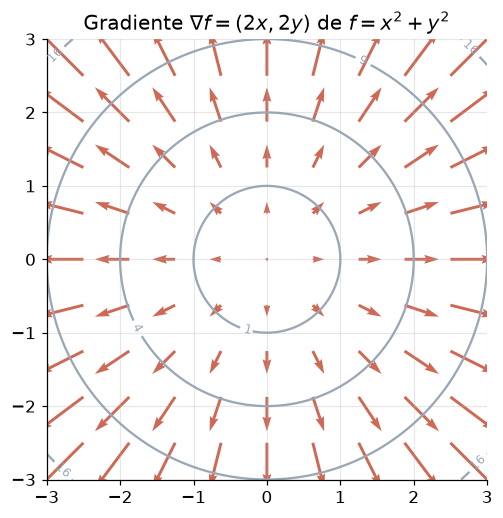

# Lição 007 — Derivadas parciais, gradiente e regra da cadeia

> **Módulo:** M00 — Fundamentos Matemáticos · **Ordem de estudo:** 7 · **Tempo:** ~60 min
> **Pré-requisitos:** [006] Funções, limites e derivadas
> **Classificação:** complemento de aprofundamento à ementa

## Seção_Teórica

### Motivação

Na lição anterior, a derivada media a sensibilidade de uma função de **uma** variável.
Mas modelos de IA têm **milhões** de parâmetros: a perda `L` depende de muitas
entradas ao mesmo tempo. Precisamos saber como `L` muda em relação a **cada** parâmetro
isoladamente — e depois juntar tudo num único objeto que aponte a melhor direção de
ajuste.

Além disso, redes neurais são **funções compostas**: a saída de uma camada alimenta a
próxima. Para descobrir como um parâmetro lá no início afeta a perda lá no fim, é
preciso "encadear" derivadas camada a camada. As três ferramentas desta lição —
**derivadas parciais**, **gradiente** e **regra da cadeia** — são exatamente o que
torna o **backpropagation** possível. Sem elas, treinar uma rede profunda seria
inviável.

### Princípio de funcionamento

Quando uma função depende de várias variáveis, por exemplo `f(x, y)`, a **derivada
parcial** em relação a `x` mede a variação de `f` mexendo **só** em `x` e mantendo
`y` fixo (e vice-versa). Notação: `∂f/∂x` e `∂f/∂y`. Cada parcial é uma derivada
comum onde as outras variáveis são tratadas como constantes.

Empilhar todas as derivadas parciais num vetor produz o **gradiente**:

$$ \nabla f = \left[\, \frac{\partial f}{\partial x},\; \frac{\partial f}{\partial y},\; \ldots \,\right]. $$

O gradiente tem uma propriedade geométrica central: ele **aponta na direção de maior
crescimento** de `f`, e sua norma diz o quão íngreme é essa subida. Por isso o treino
caminha no sentido **oposto** ao gradiente (descida).

Por fim, a **regra da cadeia** trata funções compostas $y = f(g(x))$:

$$ \frac{dy}{dx} = f'(g(x)) \cdot g'(x), $$

ou seja, a derivada da função externa avaliada no ponto interno, **multiplicada** pela
derivada da função interna. Aplicada repetidamente, ela propaga a influência de cada
parâmetro através de todas as camadas — o coração do **backpropagation**.

---

### Conceito central 1 — Derivadas parciais

Uma derivada parcial isola **uma** variável: derivamos normalmente em relação a ela e
tratamos as demais como números fixos. Isso responde "como `f` reage a um empurrãozinho
nesta variável específica?".

#### Exemplo_Resolvido 1.1

```python
def f(x, y):
    return x ** 2 + 3.0 * x * y + y ** 2

def parcial_x(x, y):
    return 2.0 * x + 3.0 * y

def parcial_y(x, y):
    return 3.0 * x + 2.0 * y

x, y = 1.0, 2.0
print(f"f({x}, {y}) = {f(x, y)}")
print(f"df/dx em ({x}, {y}) = {parcial_x(x, y)}")
print(f"df/dy em ({x}, {y}) = {parcial_y(x, y)}")
```

**Explicação passo a passo:**
- **Bloco 1 (`f`):** define `f(x, y) = x² + 3xy + y²`.
- **Bloco 2 (`parcial_x`):** derivando em `x` e fixando `y`: $\partial f/\partial x = 2x + 3y$.
- **Bloco 3 (`parcial_y`):** derivando em `y` e fixando `x`: $\partial f/\partial y = 3x + 2y$.
- **Bloco 4 (`print`):** avalia em `(1, 2)`: $f = 11$, $\partial f/\partial x = 8$, $\partial f/\partial y = 7$.

**Saída esperada:**
```
f(1.0, 2.0) = 11.0
df/dx em (1.0, 2.0) = 8.0
df/dy em (1.0, 2.0) = 7.0
```

---

### Conceito central 2 — Gradiente

O **gradiente** reúne todas as derivadas parciais num único vetor. Ele aponta para
onde a função **cresce mais rápido**; seu negativo aponta para a descida mais íngreme.
A **norma** do gradiente mede a intensidade dessa inclinação.



*As setas (o gradiente $\nabla f = (2x, 2y)$) apontam para fora, na direção de maior crescimento, sempre perpendiculares às curvas de nível.*

#### Exemplo_Resolvido 2.1

```python
import math

def grad(x, y):
    return [2.0 * x + 3.0 * y, 3.0 * x + 2.0 * y]

x, y = 1.0, 2.0
g = grad(x, y)
norma = math.sqrt(g[0] ** 2 + g[1] ** 2)
print(f"gradiente em ({x}, {y}): {g}")
print(f"norma do gradiente: {norma:.4f}")
```

**Explicação passo a passo:**
- **Bloco 1 (`import`):** traz `math` para calcular a raiz quadrada.
- **Bloco 2 (`grad`):** monta o vetor $\nabla f = [\partial f/\partial x, \partial f/\partial y]$ da mesma `f` do exemplo anterior.
- **Bloco 3 (avaliação):** em `(1, 2)` o gradiente é `[8, 7]`.
- **Bloco 4 (`norma`/`print`):** a norma `√(8² + 7²) = √113 ≈ 10.6301` indica o quão íngreme é a subida naquele ponto.

**Saída esperada:**
```
gradiente em (1.0, 2.0): [8.0, 7.0]
norma do gradiente: 10.6301
```

---

### Conceito central 3 — Regra da cadeia (base do backpropagation)

Quando uma função é **composta** (`y = f(g(x))`), a regra da cadeia diz que a derivada
total é o **produto** das derivadas de cada etapa. É assim que o backpropagation
propaga gradientes: cada camada multiplica a derivada local pela derivada que vem da
camada seguinte.

#### Exemplo_Resolvido 3.1

```python
def g(x):
    return 2.0 * x + 1.0

def f(u):
    return u ** 2

def dg(x):
    return 2.0

def df(u):
    return 2.0 * u

x = 1.0
u = g(x)
# regra da cadeia: dy/dx = df/du * du/dx
dy_dx = df(u) * dg(x)

# conferencia numerica
h = 1e-6
dy_dx_num = (f(g(x + h)) - f(g(x))) / h

print(f"u = g(x) = {u}")
print(f"dy/dx (regra da cadeia) = {dy_dx}")
print(f"dy/dx (numerico) = {dy_dx_num:.4f}")
```

**Explicação passo a passo:**
- **Bloco 1 (`g`/`f`):** a função interna `g(x) = 2x + 1` e a externa `f(u) = u²`, formando `y = (2x + 1)²`.
- **Bloco 2 (`dg`/`df`):** as derivadas locais `g'(x) = 2` e `f'(u) = 2u`.
- **Bloco 3 (regra da cadeia):** em `x = 1`, `u = 3`, então `dy/dx = f'(u)·g'(x) = 6·2 = 12`.
- **Bloco 4 (conferência numérica):** a razão incremental com `h = 1e-6` confirma `≈ 12.0000`, validando a regra da cadeia.

**Saída esperada:**
```
u = g(x) = 3.0
dy/dx (regra da cadeia) = 12.0
dy/dx (numerico) = 12.0000
```

## Seção_Prática

> **Como reproduzir:** execute cada solução de referência com
> `python trilha/solucoes/007-derivadas-parciais-gradiente-regra-da-cadeia/solucao_<n>.py`
> e compare a saída com o arquivo `.saida.txt` correspondente.

### Exercício 1 — Derivadas parciais de uma função de duas variáveis
- **Entrada inicial / setup:** função `f(x, y) = x²·y + y³`; ponto `(2, 1)`.
- **Passos de execução:** implemente `∂f/∂x = 2xy` e `∂f/∂y = x² + 3y²`, avalie em `(2, 1)` e imprima `df/dx` e `df/dy`.
- **Critério de conclusão (binário):** a saída é **exatamente** `df/dx = 4.0` seguida de `df/dy = 7.0` — caso contrário, reprovado.
- **Solução de referência:** `trilha/solucoes/007-derivadas-parciais-gradiente-regra-da-cadeia/solucao_1.py`
- **Saída esperada:** `trilha/solucoes/007-derivadas-parciais-gradiente-regra-da-cadeia/solucao_1.saida.txt`

### Exercício 2 — Gradiente e sua norma
- **Entrada inicial / setup:** função `f(x, y) = x² + y²`, cujo gradiente é `[2x, 2y]`; ponto `(3, 4)`.
- **Passos de execução:** calcule o vetor gradiente em `(3, 4)` e sua norma euclidiana, imprimindo `gradiente` e `norma`.
- **Critério de conclusão (binário):** a saída é **exatamente** `gradiente = [6.0, 8.0]` seguida de `norma = 10.0` — qualquer divergência reprova.
- **Solução de referência:** `trilha/solucoes/007-derivadas-parciais-gradiente-regra-da-cadeia/solucao_2.py`
- **Saída esperada:** `trilha/solucoes/007-derivadas-parciais-gradiente-regra-da-cadeia/solucao_2.saida.txt`

### Exercício 3 — Regra da cadeia no gradiente de um neurônio
- **Entrada inicial / setup:** perda `L(w) = (w·x − y)²` com `w = 2`, `x = 3`, `y = 5`.
- **Passos de execução:** calcule o forward (`z = w·x` e `L`) e o gradiente do peso pela regra da cadeia `dL/dw = 2·(w·x − y)·x`; imprima `z`, `L` e `dL/dw`.
- **Critério de conclusão (binário):** a saída é **exatamente** `z = 6.0`, `L = 1.0` e `dL/dw = 6.0`, nessa ordem — caso contrário, reprovado.
- **Solução de referência:** `trilha/solucoes/007-derivadas-parciais-gradiente-regra-da-cadeia/solucao_3.py`
- **Saída esperada:** `trilha/solucoes/007-derivadas-parciais-gradiente-regra-da-cadeia/solucao_3.saida.txt`
