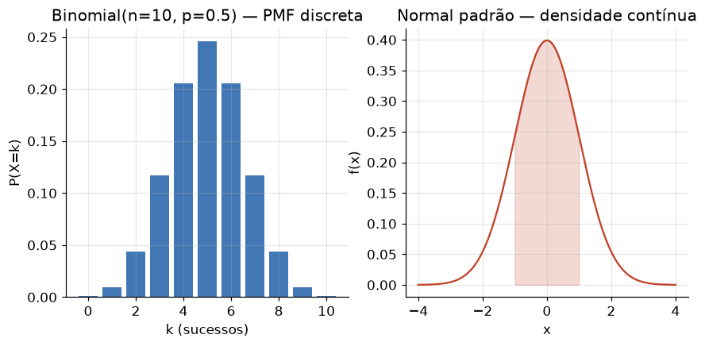

# Lição 008 — Probabilidade e Distribuições

> **Módulo:** M00 — Fundamentos Matemáticos · **Ordem de estudo:** 8 · **Tempo:** ~55 min
> **Pré-requisitos:** sem pré-requisitos
> **Classificação:** complemento de aprofundamento à ementa

## Seção_Teórica

### Motivação

O mundo que um modelo de IA observa é **incerto e ruidoso**. Um classificador de
spam nunca tem certeza absoluta de que uma mensagem é spam; um modelo de
linguagem não sabe qual será a próxima palavra — ele estima **quão provável** é
cada palavra. Para raciocinar sobre incerteza de forma disciplinada (em vez de
chutar), precisamos de uma linguagem matemática que atribua **graus de crença**
a eventos e que diga como combiná-los e atualizá-los quando chega nova
informação. Essa linguagem é a **teoria da probabilidade**.

Probabilidade é o alicerce silencioso de quase tudo em ML: funções de perda como
a entropia cruzada saem diretamente de modelos probabilísticos; a saída de uma
rede de classificação é uma **distribuição** sobre classes; amostragem de LLMs
(temperatura, top-p) é manipulação direta de distribuições. Sem probabilidade,
"o modelo está 87% confiante" é só um número sem significado.

### Princípio de funcionamento

Probabilidade associa a cada **evento** (um subconjunto do **espaço amostral**
`Ω`, o conjunto de todos os resultados possíveis) um número em `[0, 1]` que
obedece a três axiomas de Kolmogorov:

1. $P(A) \geq 0$ para todo evento $A$ (não-negatividade);
2. $P(\Omega) = 1$ (algo do espaço amostral certamente ocorre);
3. se $A$ e $B$ são **disjuntos** (não podem ocorrer juntos), $P(A \cup B) = P(A) + P(B)$ (aditividade).

Desses axiomas derivam todas as regras úteis. A **regra da soma** (inclusão-exclusão)
$P(A \cup B) = P(A) + P(B) - P(A \cap B)$ corrige a contagem dupla quando os eventos se
sobrepõem. A **probabilidade condicional** $P(A \mid B) = P(A \cap B) / P(B)$ reescala o
espaço para o universo em que `B` ocorreu, e dela nasce o **teorema de Bayes**, o
motor de atualização de crença. Sobre eventos definimos **variáveis aleatórias**,
que mapeiam resultados em números e cuja **distribuição** resume o comportamento
da incerteza por meio de medidas como **esperança** (valor médio) e **variância**
(dispersão). É exatamente uma distribuição sobre saídas que um modelo de ML
aprende a prever.

---

### Conceito central 1 — Espaço amostral e axiomas

Tudo começa com `Ω`, o conjunto de resultados possíveis, e com a atribuição de
probabilidades a seus subconjuntos (eventos). Quando todos os resultados são
**equiprováveis**, `P(A)` reduz-se à razão `|A| / |Ω|` — "casos favoráveis sobre
casos totais". A regra da soma garante que combinar eventos sobrepostos não conte
o mesmo resultado duas vezes.

#### Exemplo_Resolvido 1.1

```python
# Espaco amostral de um dado honesto de 6 faces (resultados equiprovaveis).
espaco = [1, 2, 3, 4, 5, 6]
n = len(espaco)

def prob(evento):
    # P(A) = |A| / |Omega| para espaco equiprovavel.
    favoraveis = [x for x in espaco if evento(x)]
    return len(favoraveis) / n

p_par = prob(lambda x: x % 2 == 0)
p_maior_4 = prob(lambda x: x > 4)
p_par_ou_maior_4 = prob(lambda x: x % 2 == 0 or x > 4)
p_par_e_maior_4 = prob(lambda x: x % 2 == 0 and x > 4)

print(f"P(par)             = {p_par:.4f}")
print(f"P(>4)              = {p_maior_4:.4f}")
print(f"P(par ou >4)       = {p_par_ou_maior_4:.4f}")
print(f"P(par e >4)        = {p_par_e_maior_4:.4f}")
# Regra da soma (inclusao-exclusao): P(A ou B) = P(A) + P(B) - P(A e B).
soma = p_par + p_maior_4 - p_par_e_maior_4
print(f"soma (verificacao) = {soma:.4f}")
```

**Explicação passo a passo:**
- **Bloco 1 (`espaco`/`n`):** define `Ω = {1,...,6}` e o tamanho do espaço amostral, que serve de denominador da razão.
- **Bloco 2 (`prob`):** implementa `P(A) = |A| / |Ω|` filtrando os resultados que satisfazem o predicado do evento.
- **Bloco 3 (eventos):** calcula `P(par)`, `P(>4)`, a união e a interseção dos dois eventos.
- **Bloco 4 (`soma`):** verifica numericamente a regra da soma — $P(\text{par} \cup {>}4)$ coincide com $P(\text{par}) + P({>}4) - P(\text{par} \cap {>}4)$, confirmando que a sobreposição (o resultado 6) não foi contada duas vezes.

**Saída esperada:**
```
P(par)             = 0.5000
P(>4)              = 0.3333
P(par ou >4)       = 0.6667
P(par e >4)        = 0.1667
soma (verificacao) = 0.6667
```

---

### Conceito central 2 — Variáveis aleatórias e distribuições

Uma **variável aleatória** `X` atribui um número a cada resultado de `Ω`. Sua
**distribuição** diz com que probabilidade `X` assume cada valor: em variáveis
**discretas** isso é uma **função de massa** `P(X = k)`; em **contínuas**, uma
**densidade** sobre intervalos. Dois resumos fundamentais descrevem qualquer
distribuição: a **esperança** $E[X] = \sum_k k \cdot P(X = k)$ (o "centro de massa", o valor
médio a longo prazo) e a **variância** $\operatorname{Var}[X] = E[X^2] - (E[X])^2$ (o quanto os
valores se espalham em torno da média). A saída de um classificador é, ela mesma,
uma distribuição discreta sobre as classes possíveis.



*À esquerda, uma PMF discreta atribui massa a valores isolados; à direita, uma densidade contínua distribui probabilidade ao longo de intervalos.*

#### Exemplo_Resolvido 2.1

```python
# Distribuicao binomial: numero de caras em 3 lancamentos de uma moeda honesta.
from math import comb

n, p = 3, 0.5

def pmf(k):
    # P(X = k) = C(n, k) * p^k * (1 - p)^(n - k)
    return comb(n, k) * p ** k * (1 - p) ** (n - k)

dist = [(k, pmf(k)) for k in range(n + 1)]
esperanca = sum(k * pk for k, pk in dist)
e_x2 = sum(k * k * pk for k, pk in dist)
variancia = e_x2 - esperanca ** 2

for k, pk in dist:
    print(f"P(X={k}) = {pk:.4f}")
print(f"soma das probabilidades = {sum(pk for _, pk in dist):.4f}")
print(f"E[X]   = {esperanca:.4f}")
print(f"Var[X] = {variancia:.4f}")
```

**Explicação passo a passo:**
- **Bloco 1 (`n`, `p`):** parametriza uma binomial com 3 ensaios e probabilidade de sucesso `0.5`.
- **Bloco 2 (`pmf`):** implementa a função de massa da binomial usando o coeficiente binomial `comb(n, k)`.
- **Bloco 3 (`dist`/`esperanca`/`variancia`):** tabula a distribuição e calcula $E[X] = \sum_k k\,P(X=k)$ e $\operatorname{Var}[X] = E[X^2] - (E[X])^2$.
- **Bloco 4 (`print`):** mostra a PMF, confirma que as probabilidades somam 1 (axioma da normalização) e exibe `E[X] = 1.5 = n·p` e `Var[X] = 0.75 = n·p·(1−p)`.

**Saída esperada:**
```
P(X=0) = 0.1250
P(X=1) = 0.3750
P(X=2) = 0.3750
P(X=3) = 0.1250
soma das probabilidades = 1.0000
E[X]   = 1.5000
Var[X] = 0.7500
```

---

### Conceito central 3 — Teorema de Bayes

O **teorema de Bayes** formaliza como atualizar uma crença diante de evidência:

$$ P(H \mid E) = \frac{P(E \mid H) \cdot P(H)}{P(E)}, $$

onde `P(H)` é a crença **a priori** na hipótese, `P(E | H)` é a **verossimilhança**
da evidência sob a hipótese, e `P(H | E)` é a crença **a posteriori**. O
denominador `P(E)` (a evidência total) sai da **lei da probabilidade total**.
Bayes é o coração de filtros de spam, diagnóstico, e da própria interpretação
probabilística do que um modelo "acredita". Um resultado contra-intuitivo
importante: mesmo um teste muito acurado pode gerar um posterior baixo quando a
hipótese é **rara a priori** (efeito da base rate).

#### Exemplo_Resolvido 3.1

```python
# Teste medico para uma doenca rara. P(D|+) = P(+|D) P(D) / P(+).
prior = 0.01            # P(doente): 1% da populacao
sensibilidade = 0.99    # P(+ | doente)
especificidade = 0.95   # P(- | sao)  =>  P(+ | sao) = 0.05

p_pos_dado_sao = 1 - especificidade
# Lei da probabilidade total: P(+) = P(+|D)P(D) + P(+|sao)P(sao).
p_pos = sensibilidade * prior + p_pos_dado_sao * (1 - prior)
posterior = sensibilidade * prior / p_pos

print(f"P(+)          = {p_pos:.4f}")
print(f"P(doente | +) = {posterior:.4f}")
print(f"P(doente)     = {prior:.4f}")
print(f"ganho         = {posterior / prior:.2f}x")
```

**Explicação passo a passo:**
- **Bloco 1 (priors/likelihoods):** define a prevalência `P(D) = 1%`, a sensibilidade `P(+|D)` e a especificidade `P(−|são)`.
- **Bloco 2 (`p_pos_dado_sao`):** o complemento da especificidade é a taxa de falso-positivo `P(+|são)`.
- **Bloco 3 (`p_pos`):** aplica a lei da probabilidade total para obter `P(+)`.
- **Bloco 4 (`posterior`/`print`):** aplica Bayes; apesar do teste 99% sensível, `P(doente|+) ≈ 0.17`, porque a doença é rara — o teste eleva a crença ~17x sobre a base rate, mas não a torna dominante.

**Saída esperada:**
```
P(+)          = 0.0594
P(doente | +) = 0.1667
P(doente)     = 0.0100
ganho         = 16.67x
```

## Seção_Prática

> **Como reproduzir:** execute cada solução de referência com
> `python trilha/solucoes/008-probabilidade-e-distribuicoes/solucao_<n>.py` e
> compare a saída com o arquivo `.saida.txt` correspondente.

### Exercício 1 — Probabilidade clássica com dois dados
- **Entrada inicial / setup:** dois dados honestos de 6 faces; espaço amostral de todos os pares ordenados `(a, b)`; evento de interesse `soma == 7`.
- **Passos de execução:** construa o espaço amostral com uma compreensão de listas, conte os casos favoráveis em que `a + b == 7`, calcule `P = favoráveis / total` e imprima `|Omega|`, o número de favoráveis e `P(soma=7)` com 4 casas decimais.
- **Critério de conclusão (binário):** a saída é **exatamente** `|Omega| = 36`, `favoraveis (soma=7) = 6` e `P(soma=7) = 0.1667` — qualquer divergência reprova.
- **Solução de referência:** `trilha/solucoes/008-probabilidade-e-distribuicoes/solucao_1.py`
- **Saída esperada:** `trilha/solucoes/008-probabilidade-e-distribuicoes/solucao_1.saida.txt`

### Exercício 2 — Esperança e variância de uma distribuição discreta
- **Entrada inicial / setup:** um dado viciado com valores `[1, 2, 3, 4, 5, 6]` e PMF `[0.10, 0.10, 0.20, 0.20, 0.15, 0.25]`.
- **Passos de execução:** verifique com `assert` que a PMF soma 1, calcule `E[X] = Σ v·P(v)`, `E[X²] = Σ v²·P(v)` e `Var[X] = E[X²] − (E[X])²`, e imprima `E[X]`, `Var[X]` e o desvio padrão `√Var[X]` com 4 casas decimais.
- **Critério de conclusão (binário):** a saída é **exatamente** `E[X] = 3.9500`, `Var[X] = 2.6475` e `DP[X] = 1.6271` — caso contrário, reprovado.
- **Solução de referência:** `trilha/solucoes/008-probabilidade-e-distribuicoes/solucao_2.py`
- **Saída esperada:** `trilha/solucoes/008-probabilidade-e-distribuicoes/solucao_2.saida.txt`

### Exercício 3 — Atualização bayesiana em um filtro de spam
- **Entrada inicial / setup:** `P(spam) = 0.40`, `P(palavra | spam) = 0.70`, `P(palavra | ham) = 0.10`.
- **Passos de execução:** calcule `P(palavra)` pela lei da probabilidade total e aplique o teorema de Bayes para obter `P(spam | palavra)`, imprimindo ambos com 4 casas decimais.
- **Critério de conclusão (binário):** a saída é **exatamente** `P(palavra) = 0.3400` e `P(spam | palavra) = 0.8235` — qualquer divergência reprova.
- **Solução de referência:** `trilha/solucoes/008-probabilidade-e-distribuicoes/solucao_3.py`
- **Saída esperada:** `trilha/solucoes/008-probabilidade-e-distribuicoes/solucao_3.saida.txt`
