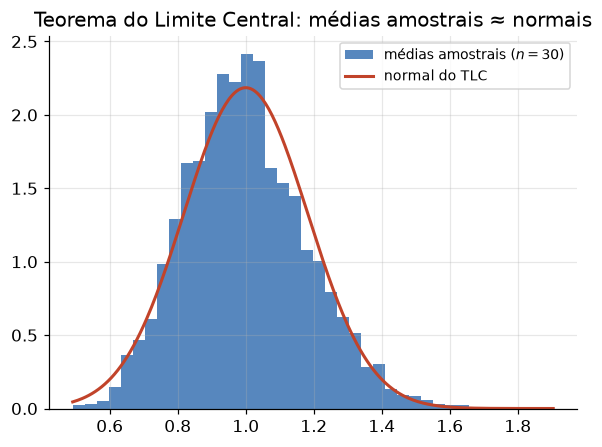

# Lição 009 — Estatística Descritiva e Inferência

> **Módulo:** M00 — Fundamentos Matemáticos · **Ordem de estudo:** 9 · **Tempo:** ~55 min
> **Pré-requisitos:** [008] Probabilidade e distribuições
> **Classificação:** complemento de aprofundamento à ementa

## Seção_Teórica

### Motivação

Em ML, nunca observamos a população inteira — observamos **amostras**: um
conjunto de treino, um conjunto de avaliação, os usuários de um teste A/B. A
estatística é a disciplina que nos ensina a **resumir** o que vimos (estatística
descritiva) e a **generalizar** dele para o que não vimos (inferência), sempre
quantificando a incerteza. Sem ela, não dá para responder perguntas
fundamentais: "o modelo B é mesmo melhor que o A, ou a diferença foi sorte da
amostra?", "qual a margem de erro desta métrica de acurácia?".

Essa lição é a base direta da **avaliação de modelos** e de **experimentação
online**. Um número de acurácia sem intervalo de confiança é uma meia-verdade; um
teste A/B sem teste de significância é um palpite disfarçado de decisão. Aqui
construímos as ferramentas para transformar dados em conclusões defensáveis.

### Princípio de funcionamento

A estatística descritiva comprime uma amostra em poucos números. A **tendência
central** (média, mediana) indica onde os dados se concentram; a **dispersão**
(variância, desvio padrão) indica o quanto se espalham. Um detalhe técnico
crucial: ao estimar a variância de uma **população** a partir de uma **amostra**,
dividimos por `n − 1` (correção de Bessel) em vez de `n`, porque usar a média
amostral subestima a dispersão real — é uma correção que torna o estimador
**não-viesado**.

A inferência conecta amostra e população através de duas ideias. O **Teorema do
Limite Central** garante que a média de uma amostra grande se distribui de forma
aproximadamente **normal** em torno da média verdadeira, com desvio igual ao
**erro padrão** $\sigma/\sqrt{n}$ — que encolhe conforme $\sqrt{n}$, motivo pelo qual mais dados
geram estimativas mais precisas. A partir disso construímos **intervalos de
confiança** (uma faixa plausível para o parâmetro) e **testes de hipótese**: assumimos
uma hipótese nula `H₀` (ex.: "não há diferença entre A e B"), medimos quão extremo
é o resultado observado sob `H₀` (a estatística de teste e seu **p-valor**) e
rejeitamos `H₀` quando o p-valor cai abaixo de um nível `α` (tipicamente 0,05).

---

### Conceito central 1 — Estatística descritiva

Antes de inferir, resumimos. A **média** é o centro de massa dos dados; a
**mediana** é o valor central, robusto a outliers. A **variância** mede o desvio
quadrático médio em torno da média, e o **desvio padrão** (sua raiz) volta à
escala original dos dados. Distinguir o divisor `n` (variância populacional) do
`n − 1` (variância amostral) é o que separa "descrever o que tenho" de "estimar a
população de onde a amostra veio".

#### Exemplo_Resolvido 1.1

```python
# Medidas descritivas de uma amostra.
import statistics as st

dados = [4, 8, 15, 16, 23, 42]
media = sum(dados) / len(dados)
mediana = st.median(dados)
var_amostral = st.variance(dados)   # divisor n-1 (estimativa da populacao)
desvio_amostral = st.stdev(dados)
amplitude = max(dados) - min(dados)

print(f"n        = {len(dados)}")
print(f"media    = {media:.4f}")
print(f"mediana  = {mediana:.4f}")
print(f"amplitude= {amplitude}")
print(f"variancia (amostral) = {var_amostral:.4f}")
print(f"desvio padrao        = {desvio_amostral:.4f}")
```

**Explicação passo a passo:**
- **Bloco 1 (`import`/`dados`):** carrega o módulo `statistics` da biblioteca padrão e define a amostra.
- **Bloco 2 (`media`/`mediana`):** a média é a soma sobre o tamanho; a mediana, com 6 elementos, é a média dos dois centrais (15 e 16 → 15.5).
- **Bloco 3 (`var_amostral`/`desvio_amostral`/`amplitude`):** `st.variance` usa divisor `n − 1`; o desvio padrão é a raiz da variância; a amplitude é o alcance bruto.
- **Bloco 4 (`print`):** mostra média 18, mediana 15.5 (diferença que revela assimetria pelo outlier 42) e a dispersão.

**Saída esperada:**
```
n        = 6
media    = 18.0000
mediana  = 15.5000
amplitude= 38
variancia (amostral) = 182.0000
desvio padrao        = 13.4907
```

---

### Conceito central 2 — Amostragem e estimação

Uma estatística calculada sobre uma amostra (como a média amostral) é, ela mesma,
uma variável aleatória: outra amostra daria outro valor. O **erro padrão**
$\sigma/\sqrt{n}$ quantifica essa flutuação da média amostral. Pelo Teorema do Limite
Central, para `n` grande a média amostral é aproximadamente normal, o que permite
construir um **intervalo de confiança de 95%** como
$\bar{x} \pm 1{,}96 \cdot \sigma/\sqrt{n}$. Note como o erro padrão cai com
$\sqrt{n}$: quadruplicar a amostra reduz o erro pela metade.



*Mesmo partindo de uma população assimétrica, as médias de muitas amostras formam uma distribuição aproximadamente normal — a essência do Teorema do Limite Central.*

#### Exemplo_Resolvido 2.1

```python
# Erro padrao e intervalo de confianca de 95% (aproximacao normal).
from math import sqrt

media_amostral = 50.0
desvio_padrao = 10.0
n = 100
erro_padrao = desvio_padrao / sqrt(n)
z = 1.96                      # quantil de 97.5% da normal padrao
ic_inf = media_amostral - z * erro_padrao
ic_sup = media_amostral + z * erro_padrao
print(f"erro padrao = {erro_padrao:.4f}")
print(f"IC 95% = [{ic_inf:.4f}, {ic_sup:.4f}]")

# Efeito de quadruplicar a amostra: o erro padrao cai pela metade.
n2 = 400
erro_padrao_2 = desvio_padrao / sqrt(n2)
print(f"erro padrao (n=400) = {erro_padrao_2:.4f}")
```

**Explicação passo a passo:**
- **Bloco 1 (parâmetros):** define a média amostral, o desvio padrão e o tamanho `n = 100`.
- **Bloco 2 (`erro_padrao`/`z`):** calcula $\sigma/\sqrt{n} = 1.0$ e fixa o quantil normal `1.96` para 95% de confiança.
- **Bloco 3 (`ic_inf`/`ic_sup`):** constrói o intervalo `[48.04, 51.96]`.
- **Bloco 4 (`n2`):** com `n = 400` (4×), o erro padrão cai para `0.5` (metade), ilustrando a regra do $\sqrt{n}$.

**Saída esperada:**
```
erro padrao = 1.0000
IC 95% = [48.0400, 51.9600]
erro padrao (n=400) = 0.5000
```

---

### Conceito central 3 — Teste de hipótese e significância

Um **teste de hipótese** decide, com controle de risco, se um efeito observado é
real ou ruído amostral. Em um teste A/B comparando duas taxas de conversão,
formulamos `H₀: p_A = p_B`, calculamos uma estatística `z` que mede quantos erros
padrão separam as proporções (usando a proporção combinada sob `H₀`) e obtemos o
**p-valor** — a probabilidade de ver uma diferença tão extrema quanto a observada
**se** `H₀` fosse verdadeira. Se o p-valor `< α` (ex.: 0,05), rejeitamos `H₀` e
declaramos significância estatística.

#### Exemplo_Resolvido 3.1

```python
# Teste A/B: teste z de duas proporcoes com proporcao combinada (pooled).
from math import sqrt, erf

def normal_cdf(z):
    return 0.5 * (1 + erf(z / sqrt(2)))

n_a, c_a = 1000, 100   # controle: 10% de conversao
n_b, c_b = 1000, 130   # variante: 13% de conversao
p_a = c_a / n_a
p_b = c_b / n_b
p_pool = (c_a + c_b) / (n_a + n_b)
se = sqrt(p_pool * (1 - p_pool) * (1 / n_a + 1 / n_b))
z = (p_b - p_a) / se
p_valor = 2 * (1 - normal_cdf(abs(z)))    # bicaudal
print(f"taxa A  = {p_a:.4f}")
print(f"taxa B  = {p_b:.4f}")
print(f"z       = {z:.4f}")
print(f"p-valor = {p_valor:.4f}")
print("significativo (alpha=0.05)?", p_valor < 0.05)
```

**Explicação passo a passo:**
- **Bloco 1 (`normal_cdf`):** implementa a CDF da normal padrão via função erro `erf`, sem dependências externas.
- **Bloco 2 (dados/`p_a`/`p_b`):** as taxas observadas são 10% e 13%.
- **Bloco 3 (`p_pool`/`se`/`z`):** sob `H₀` estimamos uma proporção combinada, derivamos o erro padrão da diferença e a estatística `z`.
- **Bloco 4 (`p_valor`/`print`):** o p-valor bicaudal `≈ 0.0355 < 0.05`, então rejeitamos `H₀`: a variante B é significativamente melhor.

**Saída esperada:**
```
taxa A  = 0.1000
taxa B  = 0.1300
z       = 2.1027
p-valor = 0.0355
significativo (alpha=0.05)? True
```

## Seção_Prática

> **Como reproduzir:** execute cada solução de referência com
> `python trilha/solucoes/009-estatistica-descritiva-e-inferencia/solucao_<n>.py`
> e compare a saída com o arquivo `.saida.txt` correspondente.

### Exercício 1 — Medidas descritivas e o divisor n-1
- **Entrada inicial / setup:** a amostra `dados = [2, 4, 4, 4, 5, 5, 7, 9]` e o módulo `statistics` da biblioteca padrão.
- **Passos de execução:** calcule a média, a mediana, a variância populacional (`pvariance`, divisor `n`), a variância amostral (`variance`, divisor `n − 1`) e o desvio padrão amostral (`stdev`); imprima cada um com 4 casas decimais.
- **Critério de conclusão (binário):** a saída é **exatamente** `media = 5.0000`, `mediana = 4.5000`, `var (populacional) = 4.0000`, `var (amostral) = 4.5714` e `desvio (amostral) = 2.1381` — qualquer divergência reprova.
- **Solução de referência:** `trilha/solucoes/009-estatistica-descritiva-e-inferencia/solucao_1.py`
- **Saída esperada:** `trilha/solucoes/009-estatistica-descritiva-e-inferencia/solucao_1.saida.txt`

### Exercício 2 — Erro padrão e intervalo de confiança
- **Entrada inicial / setup:** média amostral `2.5`, desvio padrão `1.2`, tamanho `n = 64` e `z = 1.96`.
- **Passos de execução:** calcule o erro padrão `σ/√n`, construa o IC de 95% como `média ± z · erro_padrão` e imprima o erro padrão e o intervalo `[inf, sup]` com 4 casas decimais.
- **Critério de conclusão (binário):** a saída é **exatamente** `erro padrao = 0.1500` e `IC 95% = [2.2060, 2.7940]` — caso contrário, reprovado.
- **Solução de referência:** `trilha/solucoes/009-estatistica-descritiva-e-inferencia/solucao_2.py`
- **Saída esperada:** `trilha/solucoes/009-estatistica-descritiva-e-inferencia/solucao_2.saida.txt`

### Exercício 3 — Decisão de um teste A/B
- **Entrada inicial / setup:** controle com `40` conversões em `500` e variante com `65` conversões em `500`; nível de significância `α = 0.05`.
- **Passos de execução:** implemente `normal_cdf` via `erf`, calcule as taxas, a proporção combinada, o erro padrão, a estatística `z` e o p-valor bicaudal `2·(1 − Φ(|z|))`; imprima taxas, `z`, p-valor e a decisão de rejeição de `H₀`.
- **Critério de conclusão (binário):** a saída é **exatamente** `taxa A = 0.0800`, `taxa B = 0.1300`, `z = 2.5789`, `p-valor = 0.0099` e `rejeita H0 (alpha=0.05)? True` — qualquer divergência reprova.
- **Solução de referência:** `trilha/solucoes/009-estatistica-descritiva-e-inferencia/solucao_3.py`
- **Saída esperada:** `trilha/solucoes/009-estatistica-descritiva-e-inferencia/solucao_3.saida.txt`
