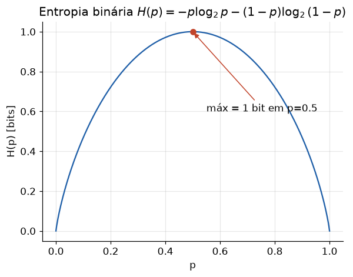

# Lição 010 — Verossimilhança, Entropia e Divergência KL

> **Módulo:** M00 — Fundamentos Matemáticos · **Ordem de estudo:** 10 · **Tempo:** ~60 min
> **Pré-requisitos:** [008] Probabilidade e distribuições · [007] Derivadas parciais, gradiente e regra da cadeia
> **Classificação:** complemento de aprofundamento à ementa

## Seção_Teórica

### Motivação

Treinar um modelo é escolher parâmetros que tornam os **dados observados
prováveis**. Mas o que significa, precisamente, "tornar os dados prováveis"? E
por que quase toda rede neural de classificação é treinada minimizando a tal
**entropia cruzada**? As respostas vêm de três ideias profundamente conectadas:
**verossimilhança** (quão bem um modelo explica os dados), **entropia** (quanta
incerteza/informação há em uma distribuição) e **divergência KL** (quão distante
uma distribuição está de outra).

Esta lição revela a origem matemática das funções de perda que você vai usar o
tempo todo. A perda de entropia cruzada não é uma escolha arbitrária: ela cai
diretamente do princípio de máxima verossimilhança e da teoria da informação.
Entender essa derivação separa quem "usa `nn.CrossEntropyLoss`" de quem entende
**por que** ela é a escolha certa — e o que minimizar essa perda realmente faz
com a distribuição prevista pelo modelo.

### Princípio de funcionamento

A **verossimilhança** $L(\theta)$ é a probabilidade dos dados observados vista como
função dos parâmetros $\theta$. O **estimador de máxima verossimilhança (MLE)** escolhe
$\theta$ que maximiza $L(\theta)$; por conveniência numérica, maximizamos o **log** da
verossimilhança (soma em vez de produto, sem underflow). Maximizar a
log-verossimilhança é equivalente a **minimizar a log-verossimilhança negativa** —
e é aí que surge a perda.

A **entropia** $H(p) = -\sum_i p_i \log p_i$ mede a incerteza média de uma distribuição: é
máxima quando tudo é equiprovável e zero quando há certeza. A **entropia cruzada**
$H(p, q) = -\sum_i p_i \log q_i$ mede o custo (em bits, se $\log_2$) de codificar eventos que
realmente seguem `p` usando um código otimizado para `q`. A **divergência KL**
$\operatorname{KL}(p \,\|\, q) = \sum_i p_i \log(p_i/q_i)$ é o **excesso** desse custo, e vale a identidade central:

$$ H(p, q) = H(p) + \operatorname{KL}(p \,\|\, q). $$

Como `H(p)` (a entropia do rótulo verdadeiro) é fixa, **minimizar a entropia
cruzada equivale a minimizar a KL** entre a distribuição prevista e a verdadeira —
ou seja, aproximar `q` (a previsão) de `p` (a realidade). E como o rótulo
verdadeiro costuma ser one-hot, a entropia cruzada se reduz exatamente à
**log-verossimilhança negativa** da classe correta. Os três conceitos são a mesma
ideia vista de ângulos diferentes. (A conexão com o treino se completa com
gradiente e regra da cadeia, da Lição 007, que nos dão como minimizar essa perda.)

---

### Conceito central 1 — Verossimilhança e MLE

Dado um modelo com parâmetro `θ` e dados independentes, a verossimilhança é o
produto das probabilidades de cada observação. Para uma moeda (Bernoulli) com `k`
caras em `n` lançamentos, $\log L(p) = k\log p + (n-k)\log(1-p)$. Derivando e
igualando a zero (ou por intuição), o `p` que maximiza é simplesmente $p^* = k/n$,
a frequência observada. O MLE formaliza a ideia de "ajustar o modelo aos dados".

#### Exemplo_Resolvido 1.1

```python
# MLE de uma moeda (Bernoulli) a partir de lancamentos observados.
from math import log

dados = [1, 1, 0, 1, 0, 1, 1, 0, 1, 1]   # 7 caras (1), 3 coroas (0)
k = sum(dados)
n = len(dados)

def log_verossimilhanca(p):
    # log L(p) = k log p + (n - k) log(1 - p)
    return k * log(p) + (n - k) * log(1 - p)

for p in [0.5, 0.6, 0.7, 0.8]:
    print(f"p={p:.1f}  logL={log_verossimilhanca(p):.4f}")

p_mle = k / n
print(f"MLE analitico p* = k/n = {p_mle:.4f}")
print(f"logL no MLE = {log_verossimilhanca(p_mle):.4f}")
```

**Explicação passo a passo:**
- **Bloco 1 (`dados`/`k`/`n`):** registra 7 caras em 10 lançamentos.
- **Bloco 2 (`log_verossimilhanca`):** implementa a log-verossimilhança da Bernoulli como soma (estável numericamente).
- **Bloco 3 (laço):** avalia `logL` em uma grade de valores de `p`; o valor cresce até `p = 0.7` e cai depois.
- **Bloco 4 (`p_mle`):** confirma que o máximo analítico `p* = k/n = 0.7` coincide com o ponto de maior `logL` da grade — o MLE é a frequência amostral.

**Saída esperada:**
```
p=0.5  logL=-6.9315
p=0.6  logL=-6.3247
p=0.7  logL=-6.1086
p=0.8  logL=-6.3903
MLE analitico p* = k/n = 0.7000
logL no MLE = -6.1086
```

---

### Conceito central 2 — Entropia e entropia cruzada

A **entropia** quantifica a incerteza de uma distribuição: uma moeda honesta tem
1 bit de entropia; um dado equiprovável de 4 faces tem 2 bits; uma distribuição
concentrada tem entropia baixa. A **entropia cruzada** $H(p, q) = -\sum_i p_i \log q_i$
mede o custo de usar `q` para descrever dados gerados por `p`. Quando `p` é o
rótulo verdadeiro (one-hot) e `q` é a previsão do modelo, $H(p, q)$ se reduz a
$-\log q_{\text{classe correta}}$ — a perda de classificação que penaliza prever baixa
probabilidade na classe certa.



*A incerteza é máxima (1 bit) quando $p=0{,}5$ e cai a zero quando o resultado é certo ($p=0$ ou $p=1$).*

#### Exemplo_Resolvido 2.1

```python
# Entropia e entropia cruzada em bits (log base 2).
from math import log2

def entropia(dist):
    return -sum(p * log2(p) for p in dist if p > 0)

uniforme = [0.25, 0.25, 0.25, 0.25]
concentrada = [0.7, 0.1, 0.1, 0.1]
print(f"H(uniforme)    = {entropia(uniforme):.4f} bits")
print(f"H(concentrada) = {entropia(concentrada):.4f} bits")

# Entropia cruzada H(p, q) = -sum p log q, com rotulo verdadeiro one-hot.
p = [1, 0, 0, 0]          # classe 0 e a verdadeira
q_bom = [0.7, 0.1, 0.1, 0.1]
q_ruim = [0.1, 0.3, 0.3, 0.3]
def cross_entropy(p, q):
    return -sum(pi * log2(qi) for pi, qi in zip(p, q) if pi > 0)
print(f"H(p, q_bom)  = {cross_entropy(p, q_bom):.4f} bits")
print(f"H(p, q_ruim) = {cross_entropy(p, q_ruim):.4f} bits")
```

**Explicação passo a passo:**
- **Bloco 1 (`entropia`):** soma $-p\log_2 p$ ignorando termos com `p = 0` (onde $0\log 0 = 0$ por convenção).
- **Bloco 2 (`uniforme`/`concentrada`):** a uniforme atinge a entropia máxima de 2 bits para 4 categorias; a concentrada tem incerteza menor (~1.36 bits).
- **Bloco 3 (`p`/`q_bom`/`q_ruim`):** define o rótulo one-hot e duas previsões.
- **Bloco 4 (`cross_entropy`):** como `p` é one-hot, a entropia cruzada vira $-\log_2 q_0$; prever 0.7 na classe certa custa 0.51 bits, prever 0.1 custa 3.32 bits — a perda dispara quando o modelo erra com confiança.

**Saída esperada:**
```
H(uniforme)    = 2.0000 bits
H(concentrada) = 1.3568 bits
H(p, q_bom)  = 0.5146 bits
H(p, q_ruim) = 3.3219 bits
```

---

### Conceito central 3 — Divergência KL

A **divergência de Kullback-Leibler** $\operatorname{KL}(p \,\|\, q) = \sum_i p_i \log(p_i/q_i)$ mede quão diferente
`q` é de `p`. Ela é sempre $\geq 0$, vale exatamente 0 quando `p = q`, e é
**assimétrica** ($\operatorname{KL}(p \,\|\, q) \neq \operatorname{KL}(q \,\|\, p)$), por isso não é uma distância métrica. A
identidade $H(p, q) = H(p) + \operatorname{KL}(p \,\|\, q)$ mostra que a entropia cruzada é a entropia
do rótulo mais a divergência da previsão — logo, treinar minimizando entropia
cruzada **empurra a previsão `q` em direção à verdade `p`**.

#### Exemplo_Resolvido 3.1

```python
# Divergencia KL: assimetria e a identidade com entropia cruzada.
from math import log2

def entropia(dist):
    return -sum(p * log2(p) for p in dist if p > 0)
def cross_entropy(p, q):
    return -sum(pi * log2(qi) for pi, qi in zip(p, q) if pi > 0)
def kl(p, q):
    return sum(pi * log2(pi / qi) for pi, qi in zip(p, q) if pi > 0)

p = [0.5, 0.25, 0.25]
q = [0.1, 0.2, 0.7]
print(f"KL(p||q) = {kl(p, q):.4f} bits")
print(f"KL(q||p) = {kl(q, p):.4f} bits")   # assimetria: valor diferente
print(f"KL(p||p) = {kl(p, p):.4f} bits")   # zero quando p == q
# Identidade: H(p, q) = H(p) + KL(p || q)
print(f"H(p,q)        = {cross_entropy(p, q):.4f}")
print(f"H(p)+KL(p||q) = {entropia(p) + kl(p, q):.4f}")
```

**Explicação passo a passo:**
- **Bloco 1 (funções):** define entropia, entropia cruzada e KL, todas em bits.
- **Bloco 2 (`p`/`q`):** duas distribuições diferentes sobre 3 categorias.
- **Bloco 3 (`KL(p||q)`/`KL(q||p)`):** os dois valores diferem (0.87 vs 0.74), evidenciando a assimetria; `KL(p||p) = 0` confirma que a divergência some quando as distribuições coincidem.
- **Bloco 4 (identidade):** `H(p, q)` e `H(p) + KL(p||q)` imprimem o mesmo `2.3701`, confirmando numericamente a identidade que fundamenta a perda de entropia cruzada.

**Saída esperada:**
```
KL(p||q) = 0.8701 bits
KL(q||p) = 0.7432 bits
KL(p||p) = 0.0000 bits
H(p,q)        = 2.3701
H(p)+KL(p||q) = 2.3701
```

## Seção_Prática

> **Como reproduzir:** execute cada solução de referência com
> `python trilha/solucoes/010-verossimilhanca-entropia-kl/solucao_<n>.py` e
> compare a saída com o arquivo `.saida.txt` correspondente.

### Exercício 1 — MLE de uma Bernoulli
- **Entrada inicial / setup:** os lançamentos `dados = [1, 0, 0, 1, 0, 0, 1, 0]` (3 sucessos em 8) e a log-verossimilhança `logL(p) = k·log p + (n−k)·log(1−p)`.
- **Passos de execução:** calcule `k` e `n`, defina `logL`, obtenha o MLE analítico `p* = k/n` e imprima `k`, `n`, `p*` (4 casas), `logL(p*)` e `logL(0.5)` (4 casas) para comparar o ajuste no MLE contra o de uma moeda honesta.
- **Critério de conclusão (binário):** a saída é **exatamente** `k=3 n=8`, `MLE p* = 0.3750`, `logL(p*) = -5.2925` e `logL(0.5) = -5.5452` — qualquer divergência reprova.
- **Solução de referência:** `trilha/solucoes/010-verossimilhanca-entropia-kl/solucao_1.py`
- **Saída esperada:** `trilha/solucoes/010-verossimilhanca-entropia-kl/solucao_1.saida.txt`

### Exercício 2 — Entropia e entropia cruzada
- **Entrada inicial / setup:** o rótulo verdadeiro one-hot `p = [1, 0]`, as previsões `q1 = [0.9, 0.1]` e `q2 = [0.5, 0.5]`, e a distribuição `[0.5, 0.5]` para a entropia.
- **Passos de execução:** implemente `entropia` e `cross_entropy` em bits (`log2`, ignorando `p = 0`), e imprima `H([0.5, 0.5])`, `H(p, q1)` e `H(p, q2)` com 4 casas decimais.
- **Critério de conclusão (binário):** a saída é **exatamente** `H([0.5, 0.5]) = 1.0000`, `H(p, q1) = 0.1520` e `H(p, q2) = 1.0000` — caso contrário, reprovado.
- **Solução de referência:** `trilha/solucoes/010-verossimilhanca-entropia-kl/solucao_2.py`
- **Saída esperada:** `trilha/solucoes/010-verossimilhanca-entropia-kl/solucao_2.saida.txt`

### Exercício 3 — Divergência KL e a identidade da entropia cruzada
- **Entrada inicial / setup:** as distribuições `p = [0.7, 0.2, 0.1]` e `q = [0.5, 0.3, 0.2]`.
- **Passos de execução:** implemente `entropia`, `cross_entropy` e `kl` em bits; calcule `KL(p||q)`, `H(p, q)` e `H(p) + KL(p||q)`; imprima os três com 4 casas decimais e verifique a identidade comparando os valores arredondados a 9 casas, imprimindo `identidade ok? True`.
- **Critério de conclusão (binário):** a saída é **exatamente** `KL(p||q) = 0.1228`, `H(p,q) = 1.2796`, `H(p)+KL(p||q) = 1.2796` e `identidade ok? True` — qualquer divergência reprova.
- **Solução de referência:** `trilha/solucoes/010-verossimilhanca-entropia-kl/solucao_3.py`
- **Saída esperada:** `trilha/solucoes/010-verossimilhanca-entropia-kl/solucao_3.saida.txt`
