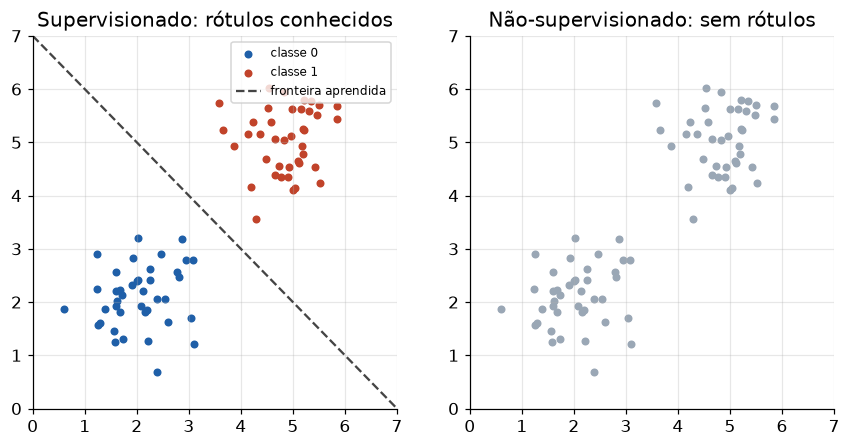

# Lição 011 — O que é Machine Learning: supervisionado, não-supervisionado e por reforço

> **Módulo:** M01 — Fundamentos de ML · **Ordem de estudo:** 11 · **Tempo:** ~45 min
> **Pré-requisitos:** [009] Estatística descritiva e inferência
> **Classificação:** complemento de aprofundamento à ementa

## Seção_Teórica

### Motivação

Toda a engenharia de IA moderna — LLMs, RAG, agentes — repousa sobre uma ideia
simples: em vez de **programar regras explícitas**, deixamos um algoritmo
**aprender os padrões a partir de dados**. Quando o problema é "detectar spam",
ninguém escreve `if "ganhe dinheiro" in email`. Em vez disso, mostramos milhares
de e-mails e deixamos o modelo descobrir os padrões que separam spam de não-spam.

Antes de treinar qualquer modelo, é preciso responder a uma pergunta de
enquadramento: **que tipo de aprendizado o meu problema é?** A resposta determina
quais dados você precisa, qual algoritmo usar e como medir sucesso. Confundir os
paradigmas é o erro de base mais comum — e mais caro — em projetos de ML.

### Princípio de funcionamento

Machine learning é o estudo de algoritmos que melhoram seu desempenho em uma
tarefa **com a experiência** (os dados). Os três grandes paradigmas se distinguem
pelo **sinal de aprendizado** disponível:

- **Supervisionado:** os dados vêm em pares $(\mathbf{x}, y)$ — entrada e
  **rótulo correto**. O objetivo é aprender uma função $f(\mathbf{x}) \approx y$
  que generalize para entradas novas. Subdivide-se em **regressão** (quando $y$ é
  contínuo) e **classificação** (quando $y$ é uma categoria).
- **Não-supervisionado:** os dados têm apenas as entradas $\mathbf{x}$, **sem
  rótulos**. O objetivo é descobrir **estrutura** — agrupar pontos parecidos
  (*clustering*), reduzir dimensão ou estimar densidade.
- **Por reforço (RL):** não há um conjunto fixo de exemplos. Um **agente**
  interage com um ambiente, toma **ações** e recebe **recompensas**; ele aprende,
  por tentativa e erro, uma **política** que maximiza a recompensa acumulada.

A distinção operacional é direta: **tenho rótulos?** Se sim, supervisionado. Se
não, e quero achar estrutura, não-supervisionado. Se aprendo agindo e recebendo
recompensas, reforço.



*À esquerda, o paradigma supervisionado conhece a classe de cada ponto (cor) e aprende a fronteira; à direita, o não-supervisionado vê os mesmos pontos sem cor e precisa descobrir os agrupamentos sozinho.*

---

### Conceito central 1 — Aprendizado supervisionado

No supervisionado, cada exemplo de treino traz a **resposta certa**. O modelo mais
intuitivo é o **k-vizinhos-mais-próximos (k-NN)**: para classificar um ponto novo,
olhe o(s) exemplo(s) de treino mais próximo(s) e copie o rótulo. Com $k=1$ (1-NN),
basta o vizinho mais próximo. É "aprendizado" no sentido de que a predição depende
inteiramente dos dados rotulados memorizados.

#### Exemplo_Resolvido 1.1

```python
# Classificacao supervisionada com 1-NN (vizinho mais proximo) do zero.
# Dados rotulados: cada exemplo e (altura_cm, peso_kg) -> classe ("gato"/"cao").
treino = [
    ((50.0, 4.0), "gato"),
    ((55.0, 5.0), "gato"),
    ((48.0, 3.5), "gato"),
    ((90.0, 25.0), "cao"),
    ((85.0, 22.0), "cao"),
    ((100.0, 30.0), "cao"),
]

def distancia(a, b):
    return ((a[0] - b[0]) ** 2 + (a[1] - b[1]) ** 2) ** 0.5

def prever(x):
    # retorna a classe do exemplo de treino mais proximo
    melhor = min(treino, key=lambda par: distancia(par[0], x))
    return melhor[1]

novos = [(52.0, 4.5), (95.0, 28.0), (70.0, 12.0)]
for x in novos:
    print(f"x={x} -> classe prevista: {prever(x)}")
```

**Explicação passo a passo:**
- **Bloco 1 (`treino`):** seis exemplos **rotulados** — o sinal de supervisão. Gatos são leves e baixos; cães, pesados e altos.
- **Bloco 2 (`distancia`):** distância euclidiana entre dois pontos no plano (altura, peso).
- **Bloco 3 (`prever`):** o coração do 1-NN — escolhe o exemplo de treino de menor distância e devolve seu rótulo.
- **Bloco 4 (laço):** os dois primeiros pontos caem claramente em "gato" e "cao"; o terceiro `(70, 12)` fica no meio, mas seu vizinho mais próximo ainda é um gato.

**Saída esperada:**
```
x=(52.0, 4.5) -> classe prevista: gato
x=(95.0, 28.0) -> classe prevista: cao
x=(70.0, 12.0) -> classe prevista: gato
```

---

### Conceito central 2 — Aprendizado não-supervisionado

Sem rótulos, o objetivo muda: queremos **descobrir estrutura**. O **k-means** é o
algoritmo de *clustering* canônico. Ele alterna dois passos até estabilizar:
(1) **atribuir** cada ponto ao centróide mais próximo; (2) **mover** cada centróide
para a média dos pontos atribuídos a ele. Note que em nenhum momento usamos um
rótulo "verdadeiro" — só as posições dos próprios dados.

#### Exemplo_Resolvido 2.1

```python
# Aprendizado nao-supervisionado: k-means (k=2) do zero, SEM rotulos.
# Agrupa pontos 1D em dois clusters a partir de centroides iniciais fixos.
dados = [1.0, 1.5, 2.0, 8.0, 8.5, 9.0]
centroides = [0.0, 10.0]   # inicializacao deterministica

def atribuir(dados, centroides):
    grupos = {0: [], 1: []}
    for x in dados:
        # indice do centroide mais proximo
        c = 0 if abs(x - centroides[0]) <= abs(x - centroides[1]) else 1
        grupos[c].append(x)
    return grupos

for passo in range(3):
    grupos = atribuir(dados, centroides)
    centroides = [sum(grupos[c]) / len(grupos[c]) for c in (0, 1)]
    print(f"passo {passo}: centroides = [{centroides[0]:.4f}, {centroides[1]:.4f}]")

print("grupo 0:", grupos[0])
print("grupo 1:", grupos[1])
```

**Explicação passo a passo:**
- **Bloco 1 (`dados`/`centroides`):** seis pontos 1D em dois aglomerados óbvios; centróides iniciais em 0 e 10.
- **Bloco 2 (`atribuir`):** cada ponto vai para o centróide mais próximo, formando dois grupos.
- **Bloco 3 (laço):** a cada passo recalculamos os centróides como médias dos grupos; eles já estabilizam em `1.5` e `8.5` no primeiro passo.
- **Bloco 4 (`print`):** o algoritmo recuperou os dois grupos naturais **sem nenhum rótulo**.

**Saída esperada:**
```
passo 0: centroides = [1.5000, 8.5000]
passo 1: centroides = [1.5000, 8.5000]
passo 2: centroides = [1.5000, 8.5000]
grupo 0: [1.0, 1.5, 2.0]
grupo 1: [8.0, 8.5, 9.0]
```

---

### Conceito central 3 — Aprendizado por reforço

No RL, não há dataset fixo: um **agente** age, observa **recompensas** e ajusta seu
comportamento. O caso mais simples é o **bandit de k braços** (caça-níqueis com
vários braços): cada braço paga 1 com uma probabilidade desconhecida. A estratégia
**epsilon-greedy** equilibra **exploração** (testar braços ao acaso) e **explotação**
(puxar o melhor braço conhecido), aprendendo o valor de cada ação pela média das
recompensas observadas.

#### Exemplo_Resolvido 3.1

```python
# Aprendizado por reforco: bandit de k bracos com epsilon-greedy (semente fixa).
# O agente aprende, por tentativa e erro, qual braco da maquina paga mais.
import random

random.seed(42)
probabilidades_reais = [0.2, 0.5, 0.8]   # braco 2 e o melhor
n_bracos = len(probabilidades_reais)
Q = [0.0] * n_bracos          # estimativa de valor de cada braco
contagem = [0] * n_bracos     # quantas vezes cada braco foi puxado
epsilon = 0.1

def puxar(braco):
    # recompensa 1 com a probabilidade real do braco, senao 0
    return 1.0 if random.random() < probabilidades_reais[braco] else 0.0

for _ in range(2000):
    if random.random() < epsilon:
        a = random.randrange(n_bracos)        # explora
    else:
        a = max(range(n_bracos), key=lambda i: Q[i])  # explota
    r = puxar(a)
    contagem[a] += 1
    Q[a] += (r - Q[a]) / contagem[a]          # media incremental

print("Q estimado:", [round(q, 3) for q in Q])
print("braco escolhido (maior Q):", max(range(n_bracos), key=lambda i: Q[i]))
```

**Explicação passo a passo:**
- **Bloco 1 (setup):** três braços com probabilidades reais ocultas; o agente só conhece as recompensas que recebe.
- **Bloco 2 (`puxar`):** simula o ambiente — devolve recompensa 1 com a probabilidade real do braço.
- **Bloco 3 (laço):** a regra epsilon-greedy explora 10% das vezes e explota o resto; a média incremental atualiza a estimativa `Q` de cada braço.
- **Bloco 4 (`print`):** as estimativas convergem para perto das probabilidades reais e o agente identifica o braço 2 como o melhor.

**Saída esperada:**
```
Q estimado: [0.178, 0.458, 0.801]
braco escolhido (maior Q): 2
```

## Seção_Prática

> **Como reproduzir:** execute cada solução de referência com
> `python trilha/solucoes/011-o-que-e-ml/solucao_<n>.py` e compare a saída com o
> arquivo `.saida.txt` correspondente. Os esqueletos ficam em
> `trilha/pratica/011-o-que-e-ml/exercicio_<n>.py`.

### Exercício 1 — Classificador supervisionado 1-NN
- **Entrada inicial / setup:** o conjunto de treino rotulado `(peso_g, indice_de_cor) -> rótulo` (maçãs e bananas) e os pontos `novos = [(155.0, 0.88), (125.0, 0.18), (145.0, 0.7)]`; use apenas Python puro.
- **Passos de execução:** implemente `distancia` (euclidiana) e `prever` (1-NN), classifique cada ponto novo imprimindo `x=<ponto> -> <rótulo>` e, ao final, `acertos: <n>/3` contra o gabarito `["maca", "banana", "maca"]`.
- **Critério de conclusão (binário):** a saída é **idêntica** a `solucao_1.saida.txt`, terminando com `acertos: 3/3`; qualquer divergência reprova.
- **Solução de referência:** `trilha/solucoes/011-o-que-e-ml/solucao_1.py`
- **Saída esperada:** `trilha/solucoes/011-o-que-e-ml/solucao_1.saida.txt`

### Exercício 2 — Clustering não-supervisionado com k-means
- **Entrada inicial / setup:** `dados = [2.0, 2.5, 3.0, 10.0, 10.5, 11.0, 11.5]` e centróides iniciais `[0.0, 20.0]`.
- **Passos de execução:** itere atribuição + atualização até os centróides não mudarem; imprima `iteracoes ate convergir: <n>`, `centroides finais: [c0, c1]` (4 casas) e os dois grupos.
- **Critério de conclusão (binário):** a saída é **idêntica** a `solucao_2.saida.txt` (convergência em `3` iterações, centróides `2.5000` e `10.7500`); caso contrário, reprovado.
- **Solução de referência:** `trilha/solucoes/011-o-que-e-ml/solucao_2.py`
- **Saída esperada:** `trilha/solucoes/011-o-que-e-ml/solucao_2.saida.txt`

### Exercício 3 — Bandit por reforço (epsilon-greedy)
- **Entrada inicial / setup:** `random.seed(7)`, 4 braços com probabilidades reais `[0.1, 0.3, 0.6, 0.9]`, `epsilon = 0.1`, 3000 passos.
- **Passos de execução:** rode o epsilon-greedy com média incremental de `Q`; imprima `Q estimado: [...]` (3 casas), `braco escolhido: <i>` e `correto: <bool>` (verdadeiro sse o braço escolhido for o de índice 3).
- **Critério de conclusão (binário):** a saída é **idêntica** a `solucao_3.saida.txt`, terminando com `correto: True`; qualquer divergência reprova.
- **Solução de referência:** `trilha/solucoes/011-o-que-e-ml/solucao_3.py`
- **Saída esperada:** `trilha/solucoes/011-o-que-e-ml/solucao_3.saida.txt`
