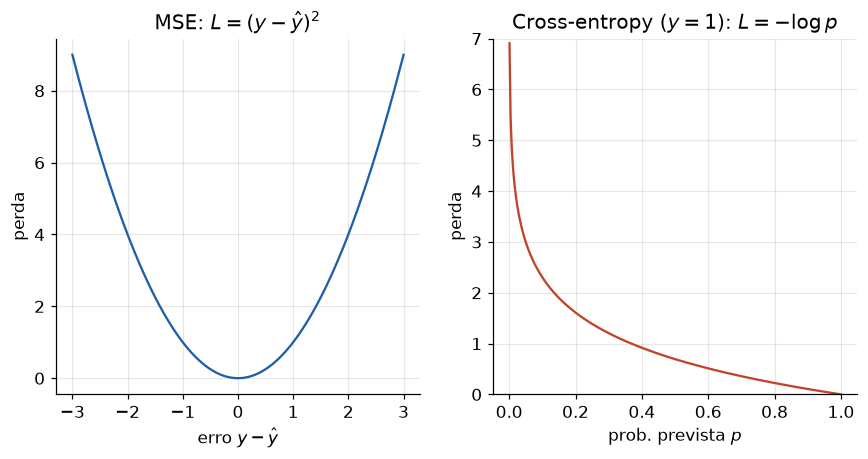

# Lição 012 — Funções de perda: MSE e cross-entropy

> **Módulo:** M01 — Fundamentos de ML · **Ordem de estudo:** 12 · **Tempo:** ~50 min
> **Pré-requisitos:** [010] Verossimilhança, entropia e KL · [011] O que é ML
> **Classificação:** complemento de aprofundamento à ementa

## Seção_Teórica

### Motivação

"Treinar um modelo" significa **ajustar parâmetros para reduzir o erro**. Mas o que
é "erro"? A **função de perda** (ou *loss*) é a definição quantitativa e diferenciável
de quão ruins são as predições do modelo. Ela é a bússola do treinamento: o gradient
descent (próxima lição) só sabe para onde caminhar porque mede a inclinação **da perda**.

Escolher a perda errada sabota o modelo silenciosamente. Usar MSE para classificação,
por exemplo, dá gradientes fracos e modelos mal calibrados. Entender **por que** cada
problema pede uma perda específica — e como elas saem da **máxima verossimilhança** —
é o que separa ajustar hiperparâmetros no escuro de diagnosticar o treino com método.

### Princípio de funcionamento

Uma função de perda $L(y, \hat{y})$ mede a discrepância entre o rótulo verdadeiro $y$
e a predição $\hat{y}$. Treinar é minimizar a perda **média** sobre o conjunto de
dados. As duas perdas fundamentais são:

- **Erro quadrático médio (MSE)** — para **regressão** ($y$ contínuo):

$$ \text{MSE} = \frac{1}{n}\sum_{i=1}^{n} (y_i - \hat{y}_i)^2. $$

  Por elevar ao quadrado, pune **desproporcionalmente** erros grandes (outliers).

- **Entropia cruzada (cross-entropy)** — para **classificação** ($y$ categórico). No
  caso binário, com probabilidade prevista $p$ para a classe 1:

$$ \text{BCE} = -\big[\,y\log p + (1-y)\log(1-p)\,\big]. $$

  No caso multiclasse, com $p_c$ a probabilidade prevista da classe correta $c$:
  $\text{CE} = -\log p_c$.

A conexão profunda (vista na Lição 010): **minimizar a cross-entropy é maximizar a
verossimilhança** dos dados sob o modelo, e minimizar o MSE corresponde à máxima
verossimilhança sob ruído gaussiano. A perda não é arbitrária — ela codifica uma
suposição probabilística sobre os dados.



*À esquerda, o MSE cresce com o quadrado do erro (parábola). À direita, a entropia cruzada binária para $y=1$ explode quando a predição $p \to 0$ (errar com confiança é caríssimo).*

---

### Conceito central 1 — Erro quadrático médio (MSE)

O MSE é a perda padrão de regressão. Ao elevar os resíduos ao quadrado, ele penaliza
um erro de 10 não dez, mas **cem** vezes mais que um erro de 1. Isso o torna sensível
a outliers — uma propriedade às vezes desejável (queremos evitar grandes erros), às
vezes não (um único dado ruim distorce o ajuste).

#### Exemplo_Resolvido 1.1

```python
import math
# Erro quadratico medio (MSE) para regressao, do zero.
y_real = [3.0, -0.5, 2.0, 7.0]
def mse(y_real, y_pred):
    n = len(y_real)
    return sum((yr - yp) ** 2 for yr, yp in zip(y_real, y_pred)) / n

pred_boa = [2.5, 0.0, 2.0, 8.0]
pred_ruim = [0.0, 0.0, 0.0, 0.0]
print(f"MSE (predicao boa):  {mse(y_real, pred_boa):.4f}")
print(f"MSE (chute zero):    {mse(y_real, pred_ruim):.4f}")
print(f"RMSE (predicao boa): {math.sqrt(mse(y_real, pred_boa)):.4f}")
```

**Explicação passo a passo:**
- **Bloco 1 (`y_real`/`mse`):** define os alvos e a média dos quadrados dos resíduos.
- **Bloco 2 (`pred_boa`/`pred_ruim`):** uma predição próxima dos alvos e um chute trivial de zeros.
- **Bloco 3 (`print`):** a predição boa tem MSE pequeno (`0.375`); o chute zero é muito pior (`15.5625`). O **RMSE** (raiz do MSE) volta à unidade original dos dados, facilitando a interpretação.

**Saída esperada:**
```
MSE (predicao boa):  0.3750
MSE (chute zero):    15.5625
RMSE (predicao boa): 0.6124
```

---

### Conceito central 2 — Entropia cruzada binária

Na classificação binária, o modelo prevê uma **probabilidade** $p \in (0,1)$. A BCE
recompensa probabilidades altas para a classe certa e pune severamente a confiança no
erro: quando $y=1$ e $p \to 0$, a perda $-\log p \to \infty$. É exatamente esse
gradiente forte no erro confiante que faz a cross-entropy treinar classificadores
muito melhor que o MSE.

#### Exemplo_Resolvido 2.1

```python
import math
# Entropia cruzada binaria (BCE): perda de classificacao para rotulos 0/1.
def bce(y, p, eps=1e-12):
    p = min(max(p, eps), 1 - eps)   # evita log(0)
    return -(y * math.log(p) + (1 - y) * math.log(1 - p))

# Mesmo rotulo verdadeiro (y=1), tres niveis de confianca da predicao.
print(f"y=1, p=0.9 (confiante e certo):  {bce(1, 0.9):.4f}")
print(f"y=1, p=0.5 (incerto):            {bce(1, 0.5):.4f}")
print(f"y=1, p=0.1 (confiante e errado): {bce(1, 0.1):.4f}")
```

**Explicação passo a passo:**
- **Bloco 1 (`bce`):** implementa a fórmula com um *clamp* em `p` para nunca calcular `log(0)`.
- **Bloco 2 (`print`):** com `y=1` fixo, variamos a confiança da predição. Acertar com confiança (`p=0.9`) custa pouco (`0.1054`); ficar em cima do muro (`p=0.5`) custa `0.6931` ($=\log 2$); errar com confiança (`p=0.1`) custa `2.3026` — mais de vinte vezes o acerto confiante.

**Saída esperada:**
```
y=1, p=0.9 (confiante e certo):  0.1054
y=1, p=0.5 (incerto):            0.6931
y=1, p=0.1 (confiante e errado): 2.3026
```

---

### Conceito central 3 — Entropia cruzada multiclasse (com softmax)

Com mais de duas classes, o modelo produz um vetor de **logits** (pontuações brutas).
A função **softmax** os converte em uma distribuição de probabilidade, e a
cross-entropy mede $-\log$ da probabilidade atribuída à classe correta. Essa dupla
softmax + cross-entropy é a saída padrão de praticamente todo classificador neural,
de visão a LLMs (que preveem o próximo token entre dezenas de milhares de classes).

#### Exemplo_Resolvido 3.1

```python
import math
# Entropia cruzada multiclasse com softmax (3 classes), do zero.
def softmax(z):
    m = max(z)
    exps = [math.exp(v - m) for v in z]   # estabilidade numerica
    s = sum(exps)
    return [e / s for e in exps]

def cross_entropy(logits, classe_certa):
    p = softmax(logits)
    return -math.log(p[classe_certa]), p

# logits do modelo para 3 classes; a classe correta e a de indice 1.
logits = [1.0, 3.0, 0.5]
perda, probs = cross_entropy(logits, classe_certa=1)
print("probabilidades:", [round(x, 4) for x in probs])
print(f"cross-entropy (classe certa=1): {perda:.4f}")
# Se a classe certa fosse a de menor probabilidade (indice 2), a perda sobe:
perda2, _ = cross_entropy(logits, classe_certa=2)
print(f"cross-entropy (classe certa=2): {perda2:.4f}")
```

**Explicação passo a passo:**
- **Bloco 1 (`softmax`):** subtrai o máximo antes de exponenciar — truque de estabilidade numérica que evita overflow sem mudar o resultado.
- **Bloco 2 (`cross_entropy`):** converte logits em probabilidades e devolve `-log` da probabilidade da classe certa.
- **Bloco 3 (`print`):** o modelo dá `0.8214` para a classe 1; como ela é a correta, a perda é baixa (`0.1967`). Se a classe correta fosse a de menor probabilidade (índice 2, `0.0674`), a perda saltaria para `2.6967`.

**Saída esperada:**
```
probabilidades: [0.1112, 0.8214, 0.0674]
cross-entropy (classe certa=1): 0.1967
cross-entropy (classe certa=2): 2.6967
```

## Seção_Prática

> **Como reproduzir:** execute cada solução de referência com
> `python trilha/solucoes/012-funcoes-de-perda/solucao_<n>.py` e compare a saída com o
> arquivo `.saida.txt` correspondente. Os esqueletos ficam em
> `trilha/pratica/012-funcoes-de-perda/exercicio_<n>.py`.

### Exercício 1 — MSE vs. MAE e sensibilidade a outliers
- **Entrada inicial / setup:** `y_real = [10, 12, 14, 16, 18]`, `pred_a` (erros pequenos espalhados) e `pred_b` (um único outlier grande), todos como floats; Python puro.
- **Passos de execução:** implemente `mse` e `mae`, imprima `pred_a: MSE=... MAE=...` e `pred_b: MSE=... MAE=...` (4 casas) e a linha `MSE pune mais o outlier: <bool>`.
- **Critério de conclusão (binário):** a saída é **idêntica** a `solucao_1.saida.txt`, terminando com `MSE pune mais o outlier: True`; qualquer divergência reprova.
- **Solução de referência:** `trilha/solucoes/012-funcoes-de-perda/solucao_1.py`
- **Saída esperada:** `trilha/solucoes/012-funcoes-de-perda/solucao_1.saida.txt`

### Exercício 2 — BCE média de um lote
- **Entrada inicial / setup:** `ys = [1, 0, 1, 0]`, `ps_bom = [0.9, 0.1, 0.8, 0.2]` e `ps_ruim = [0.9, 0.1, 0.8, 0.99]` (o último é um erro confiante: `y=0`, `p=0.99`).
- **Passos de execução:** implemente `bce_media` com *clamp* em `[eps, 1-eps]`; imprima `BCE lote bom: ...`, `BCE lote ruim: ...` (4 casas) e `erro confiante domina: <bool>` (verdadeiro sse `BCE_ruim > 2 * BCE_bom`).
- **Critério de conclusão (binário):** a saída é **idêntica** a `solucao_2.saida.txt`, terminando com `erro confiante domina: True`; caso contrário, reprovado.
- **Solução de referência:** `trilha/solucoes/012-funcoes-de-perda/solucao_2.py`
- **Saída esperada:** `trilha/solucoes/012-funcoes-de-perda/solucao_2.saida.txt`

### Exercício 3 — Softmax + cross-entropy multiclasse
- **Entrada inicial / setup:** `logits_confiante = [4.0, 1.0, 0.0]` e `logits_indeciso = [1.0, 0.9, 0.8]`, ambos com a classe correta no índice 0.
- **Passos de execução:** implemente `softmax` (estável) e `cross_entropy`; imprima `cross-entropy (confiante): ...`, `cross-entropy (indeciso): ...` (4 casas) e `menor perda = mais confianca na classe certa: <bool>`.
- **Critério de conclusão (binário):** a saída é **idêntica** a `solucao_3.saida.txt`, terminando com `... True`; qualquer divergência reprova.
- **Solução de referência:** `trilha/solucoes/012-funcoes-de-perda/solucao_3.py`
- **Saída esperada:** `trilha/solucoes/012-funcoes-de-perda/solucao_3.saida.txt`
