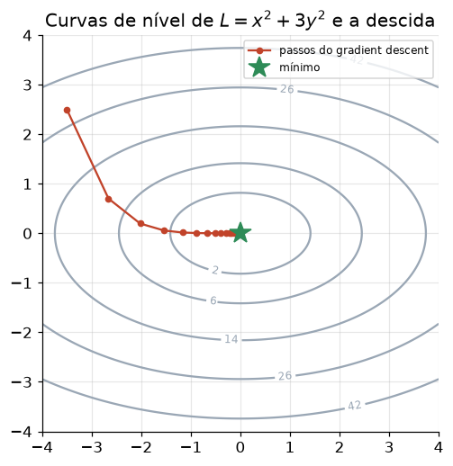
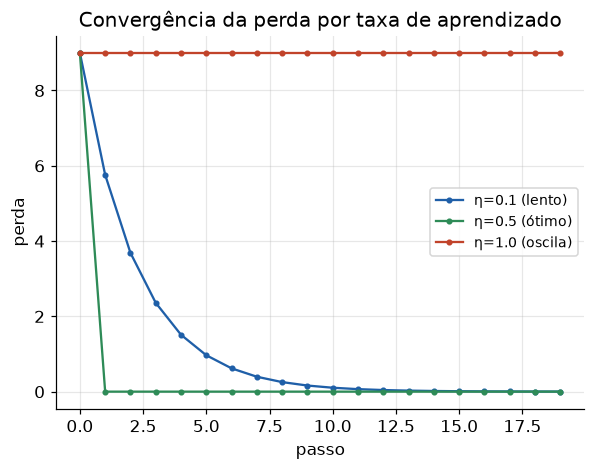

# Lição 013 — Gradient Descent

> **Módulo:** M01 — Fundamentos de ML · **Ordem de estudo:** 13 · **Tempo:** ~50 min
> **Pré-requisitos:** [007] Derivadas parciais, gradiente e regra da cadeia · [012] Funções de perda
> **Classificação:** complemento de aprofundamento à ementa

## Seção_Teórica

### Motivação

Treinar um modelo é, no fundo, **minimizar uma função de perda** $L(\theta)$ em
relação aos parâmetros $\theta$. Para a maioria dos modelos úteis (redes neurais,
regressões não triviais) **não existe solução fechada** que zere a derivada: não dá
para isolar $\theta$ algebricamente. Precisamos de um método **iterativo** que,
partindo de um chute inicial, caminhe progressivamente em direção a um mínimo usando
apenas informação local da função. O **gradient descent** é esse método e é o motor
que treina praticamente todo modelo de deep learning moderno.

### Princípio de funcionamento

O gradiente $\nabla L(\theta)$ aponta para a direção de **maior crescimento** de $L$.
Logo, o seu **negativo** aponta para a direção de maior decrescimento. O gradient
descent dá pequenos passos nessa direção:

$$ \theta \leftarrow \theta - \eta \, \nabla L(\theta), $$

onde $\eta$ (eta) é a **taxa de aprendizado** (tamanho do passo). Geometricamente,
estamos "descendo a montanha" sempre pela direção mais íngreme local. Repetindo a
atualização, $\theta$ se aproxima de um ponto onde $\nabla L(\theta) \approx 0$ (um
mínimo). Três fatores governam o comportamento: a **regra de atualização**, o **valor
de $\eta$** (passo grande demais diverge; pequeno demais converge devagar) e **quanto
dado** usamos por passo (batch, mini-batch ou SGD).



*Cada passo segue o negativo do gradiente (perpendicular às curvas de nível), encurtando a distância ao mínimo no centro.*

---

### Conceito central 1 — Regra de atualização

A regra $\theta \leftarrow \theta - \eta\,\nabla L(\theta)$ é a definição operacional
do método. Para entender o "porquê", considere uma perda quadrática simples
$L(\theta) = (\theta - 3)^2$, cujo mínimo exato é $\theta = 3$. O gradiente é
$\nabla L(\theta) = 2(\theta - 3)$. A cada passo, o termo $-\eta\,\nabla L(\theta)$
empurra $\theta$ na direção que reduz a perda.

#### Exemplo_Resolvido 1.1

```python
# Minimizacao de L(theta) = (theta - 3)^2 por gradient descent.
def perda(theta):
    return (theta - 3.0) ** 2

def gradiente(theta):
    return 2.0 * (theta - 3.0)

theta = 0.0          # chute inicial
eta = 0.1            # taxa de aprendizado
perda_inicial = perda(theta)

for _ in range(50):                      # 50 passos de atualizacao
    theta = theta - eta * gradiente(theta)

print(f"theta inicial: 0.0")
print(f"perda inicial: {perda_inicial:.4f}")
print(f"theta final:   {theta:.4f}")
print(f"perda final:   {perda(theta):.4f}")
```

**Explicação passo a passo:**
- **Bloco 1 (`perda`/`gradiente`):** define a função de perda e sua derivada analítica $2(\theta-3)$.
- **Bloco 2 (inicialização):** parte de $\theta = 0$, longe do mínimo $\theta = 3$, com $\eta = 0.1$.
- **Bloco 3 (laço):** aplica a regra $\theta \leftarrow \theta - \eta\,\nabla L(\theta)$ 50 vezes; cada passo encolhe a distância ao mínimo por um fator $(1 - 2\eta) = 0.8$.
- **Bloco 4 (`print`):** mostra que a perda cai de 9 para ~0 e $\theta$ converge para 3.

**Saída esperada:**
```
theta inicial: 0.0
perda inicial: 9.0000
theta final:   3.0000
perda final:   0.0000
```

---

### Conceito central 2 — Taxa de aprendizado

A taxa $\eta$ controla o tamanho do passo. Se $\eta$ é pequena, a convergência é
lenta; se é grande demais, o método **oscila ou diverge**. Para
$L(\theta) = (\theta-3)^2$ a regra vira $\theta \leftarrow (1 - 2\eta)\,\theta + 6\eta$,
então o **fator de contração** é $|1 - 2\eta|$: a convergência só ocorre quando esse
fator é menor que 1 (isto é, $0 < \eta < 1$).



*Com $\eta$ pequeno a perda cai devagar; com $\eta$ bem escolhido cai rápido; com $\eta$ grande demais ela oscila e não converge.*

#### Exemplo_Resolvido 2.1

```python
def perda(theta):
    return (theta - 3.0) ** 2

def gradiente(theta):
    return 2.0 * (theta - 3.0)

def treinar(eta, passos=20):
    theta = 0.0
    for _ in range(passos):
        theta = theta - eta * gradiente(theta)
    return theta, perda(theta)

for eta in [0.1, 0.5, 1.0]:
    theta, l = treinar(eta)
    print(f"eta={eta}: theta={theta:.4f} perda={l:.4f}")
```

**Explicação passo a passo:**
- **Bloco 1 (`perda`/`gradiente`):** mesma perda quadrática do exemplo anterior.
- **Bloco 2 (`treinar`):** roda 20 passos de gradient descent para uma dada $\eta$.
- **Bloco 3 (laço de `eta`):** compara três regimes — $\eta=0.1$ (contração 0.8, converge devagar), $\eta=0.5$ (contração 0, atinge o mínimo em um passo) e $\eta=1.0$ (contração $|-1|=1$, **oscila e não converge**, ficando preso entre 0 e 6).

**Saída esperada:**
```
eta=0.1: theta=2.9654 perda=0.0012
eta=0.5: theta=3.0000 perda=0.0000
eta=1.0: theta=0.0000 perda=9.0000
```

---

### Conceito central 3 — Variantes: batch, mini-batch e SGD

Quando a perda é uma média sobre $m$ exemplos, podemos calcular o gradiente usando
**todo** o conjunto (batch), um **subconjunto** (mini-batch) ou **um único exemplo**
por vez (SGD — *stochastic gradient descent*). Menos dados por passo significa
atualizações mais baratas e frequentes, ao custo de mais ruído na direção. Todos
convergem para a mesma solução em um problema convexo; mudam a quantidade de
atualizações por época.

#### Exemplo_Resolvido 3.1

```python
# Regressao linear y = w*x (sem vies) sobre dados perfeitamente lineares (w real = 2).
X = [1.0, 2.0, 3.0, 4.0]
Y = [2.0, 4.0, 6.0, 8.0]

def grad_subconjunto(w, idxs):
    n = len(idxs)
    return (2.0 / n) * sum((w * X[i] - Y[i]) * X[i] for i in idxs)

def treinar(tamanho_lote, epocas=200, eta=0.01):
    w = 0.0
    atualizacoes = 0
    for _ in range(epocas):
        for inicio in range(0, len(X), tamanho_lote):
            idxs = list(range(inicio, min(inicio + tamanho_lote, len(X))))
            w = w - eta * grad_subconjunto(w, idxs)
            atualizacoes += 1
    return w, atualizacoes

for nome, lote in [("batch", 4), ("mini-batch", 2), ("sgd", 1)]:
    w, n = treinar(lote)
    print(f"{nome:>10}: w={w:.2f} atualizacoes={n}")
```

**Explicação passo a passo:**
- **Bloco 1 (dados):** conjunto sintético onde a solução exata é $w = 2$.
- **Bloco 2 (`grad_subconjunto`):** gradiente do MSE restrito a um subconjunto de índices — generaliza batch/mini-batch/SGD.
- **Bloco 3 (`treinar`):** percorre as épocas dividindo os dados em lotes de tamanho fixo e atualizando $w$ por lote, contando o número de atualizações.
- **Bloco 4 (laço):** compara as três variantes; todas convergem para $w \approx 2.00$, mas o número de atualizações por época cresce conforme o lote encolhe (1, 2 e 4 lotes por época).

**Saída esperada:**
```
     batch: w=2.00 atualizacoes=200
mini-batch: w=2.00 atualizacoes=400
       sgd: w=2.00 atualizacoes=800
```

## Seção_Prática

> **Como reproduzir:** execute cada solução de referência com
> `python trilha/solucoes/013-gradient-descent/solucao_<n>.py` e compare a saída
> com o arquivo `.saida.txt` correspondente. Os esqueletos ficam em
> `trilha/pratica/013-gradient-descent/exercicio_<n>.py`.

### Exercício 1 — Implementar gradient descent 1D do zero
- **Entrada inicial / setup:** função $L(\theta) = (\theta - 5)^2$, $\theta$ inicial $= 0.0$, $\eta = 0.1$.
- **Passos de execução:** implemente o gradiente analítico $\nabla L(\theta) = 2(\theta - 5)$, rode 100 passos da regra $\theta \leftarrow \theta - \eta\,\nabla L(\theta)$ e imprima $\theta$ final com 4 casas decimais.
- **Critério de conclusão (binário):** a saída é **exatamente** `theta final: 5.0000` — caso contrário, reprovado.
- **Solução de referência:** `trilha/solucoes/013-gradient-descent/solucao_1.py`
- **Saída esperada:** `trilha/solucoes/013-gradient-descent/solucao_1.saida.txt`

### Exercício 2 — Diagnosticar a taxa de aprendizado
- **Entrada inicial / setup:** a mesma perda $L(\theta) = (\theta - 5)^2$, $\theta$ inicial $= 0.0$, lista de taxas $\eta \in \{0.05, 0.5, 1.0\}$, 30 passos.
- **Passos de execução:** para cada $\eta$, classifique o resultado como `converge`, `passo unico` ou `nao converge` segundo o fator de contração $|1 - 2\eta|$.
- **Critério de conclusão (binário):** a classificação impressa é `0.05 -> converge`, `0.5 -> passo unico`, `1.0 -> nao converge`, nessa ordem — qualquer divergência reprova.
- **Solução de referência:** `trilha/solucoes/013-gradient-descent/solucao_2.py`
- **Saída esperada:** `trilha/solucoes/013-gradient-descent/solucao_2.saida.txt`

### Exercício 3 — Comparar batch, mini-batch e SGD
- **Entrada inicial / setup:** dados `X = [1, 2, 3, 4, 5]`, `Y = [2, 4, 6, 8, 10]` (relação $y = 2x$, modelo $w \cdot x$), $w$ inicial $= 0.0$, $\eta = 0.01$, 300 épocas.
- **Passos de execução:** implemente uma função de treino parametrizada pelo tamanho do lote (5, 2 e 1) e imprima, para cada variante, o $w$ final (2 casas) e o número de atualizações.
- **Critério de conclusão (binário):** as três variantes devem convergir para o **mesmo** $w$ (até 2 casas decimais) e o número de atualizações deve ser `300`, `900` e `1500` respectivamente — caso contrário, reprovado.
- **Solução de referência:** `trilha/solucoes/013-gradient-descent/solucao_3.py`
- **Saída esperada:** `trilha/solucoes/013-gradient-descent/solucao_3.saida.txt`
