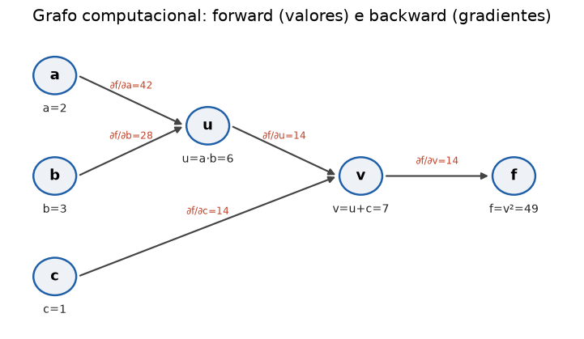

# Lição 014 — Backpropagation

> **Módulo:** M01 — Fundamentos de ML · **Ordem de estudo:** 14 · **Tempo:** ~55 min
> **Pré-requisitos:** [013] Gradient descent
> **Classificação:** complemento de aprofundamento à ementa

## Seção_Teórica

### Motivação

O gradient descent precisa do gradiente $\nabla L(\theta)$ para dar cada passo. Mas
uma rede neural moderna tem **bilhões** de parâmetros encadeados em dezenas de
camadas. Calcular cada derivada parcial separadamente, refazendo a conta inteira,
seria proibitivo. A **backpropagation** (retropropagação) é o algoritmo que computa
**todos** os gradientes de forma exata e eficiente, em um único passo para trás pelo
grafo de operações — reaproveitando resultados como uma aplicação organizada da
**regra da cadeia**.

Backprop é o algoritmo que tornou o deep learning viável. Entendê-lo é o que permite
diagnosticar gradientes que somem ou explodem (Lição 027), implementar camadas
customizadas e ler o código de qualquer framework (PyTorch, JAX) sem mágica.

### Princípio de funcionamento

Todo modelo é um **grafo computacional**: nós são operações elementares (soma,
produto, sigmoide) e arestas carregam valores. O treino tem duas passagens:

1. **Forward pass:** calcula a saída e a perda, guardando os valores intermediários.
2. **Backward pass:** parte de $\frac{\partial L}{\partial L} = 1$ na saída e propaga
   os gradientes **para trás**, multiplicando, em cada nó, o gradiente que chega pela
   **derivada local** da operação. Isto é exatamente a regra da cadeia:

$$ \frac{\partial L}{\partial x} = \frac{\partial L}{\partial v}\,\frac{\partial v}{\partial x}. $$

Duas regras locais resolvem quase tudo: na **soma** $v = a + b$, o gradiente passa
inalterado para os dois ramos ($\partial v/\partial a = \partial v/\partial b = 1$);
no **produto** $v = a \cdot b$, cada ramo recebe o gradiente multiplicado pelo **outro
fator**. E quando uma variável alimenta vários caminhos, suas contribuições de
gradiente **se somam**.



*Em preto, os valores calculados no forward pass; em vermelho, os gradientes propagados de volta no backward pass.*

---

### Conceito central 1 — Regra da cadeia em grafos

A backprop é a regra da cadeia aplicada nó a nó. Considere $f = (a\cdot b + c)^2$. No
forward calculamos $u = a b$, $v = u + c$, $f = v^2$. No backward começamos de
$\partial f/\partial v = 2v$ e descemos: como $v = u + c$, o gradiente passa igual
para $u$ e $c$; como $u = a b$, ele se multiplica por $b$ para chegar em $a$ e por $a$
para chegar em $b$.

#### Exemplo_Resolvido 1.1

```python
# Backprop em um grafo computacional pequeno: f = (a*b + c)^2.
# Forward guarda valores intermediarios; backward aplica a regra da cadeia.
a, b, c = 2.0, 3.0, 1.0

# forward
u = a * b          # u = 6
v = u + c          # v = 7
f = v * v          # f = 49

# backward: derivada de f em relacao a cada no
df_dv = 2.0 * v    # d(v^2)/dv = 2v
df_du = df_dv * 1.0   # v = u + c => dv/du = 1
df_dc = df_dv * 1.0   # dv/dc = 1
df_da = df_du * b     # u = a*b => du/da = b
df_db = df_du * a     # du/db = a

print(f"forward: u={u} v={v} f={f}")
print(f"df/da={df_da} df/db={df_db} df/dc={df_dc}")
```

**Explicação passo a passo:**
- **Bloco 1 (`a, b, c`):** as três entradas do grafo.
- **Bloco 2 (forward):** calcula e guarda $u=6$, $v=7$, $f=49$.
- **Bloco 3 (backward):** começa em $\partial f/\partial v = 2v = 14$; a soma propaga igual para $u$ e $c$; o produto multiplica por $b=3$ (para $a$) e por $a=2$ (para $b$).
- **Bloco 4 (`print`):** confere os gradientes $\partial f/\partial a = 14\cdot 3 = 42$, $\partial f/\partial b = 14\cdot 2 = 28$, $\partial f/\partial c = 14$.

**Saída esperada:**
```
forward: u=6.0 v=7.0 f=49.0
df/da=42.0 df/db=28.0 df/dc=14.0
```

---

### Conceito central 2 — Backprop em um neurônio

Um neurônio logístico calcula $z = w x + b$, $p = \sigma(z)$ e a perda BCE
$L = -[y\log p + (1-y)\log(1-p)]$. Encadeando as derivadas locais, ocorre uma
simplificação famosa: $\partial L/\partial z = p - y$. A partir dela,
$\partial L/\partial w = (p-y)\,x$ e $\partial L/\partial b = (p-y)$. Essa forma
limpa é a razão de a dupla sigmoide + cross-entropy ser tão usada.

#### Exemplo_Resolvido 2.1

```python
import math
# Backprop em um neuronio sigmoide com perda BCE, para um unico exemplo.
# forward: z = w*x + b ; p = sigmoid(z) ; L = BCE(y, p)
x, y = 2.0, 1.0
w, b = 0.5, 0.0

def sigmoid(z):
    return 1.0 / (1.0 + math.exp(-z))

# forward
z = w * x + b
p = sigmoid(z)
L = -(y * math.log(p) + (1 - y) * math.log(1 - p))

# backward (a derivada de BCE+sigmoid simplifica para (p - y))
dL_dz = p - y
dL_dw = dL_dz * x
dL_db = dL_dz * 1.0

print(f"z={z:.4f} p={p:.4f} L={L:.4f}")
print(f"dL/dw={dL_dw:.4f} dL/db={dL_db:.4f}")
```

**Explicação passo a passo:**
- **Bloco 1 (entradas):** um exemplo `x=2, y=1` e parâmetros iniciais `w=0.5, b=0`.
- **Bloco 2 (`sigmoid`):** a função de ativação que mapeia $z$ para uma probabilidade.
- **Bloco 3 (forward):** $z=1$, $p=\sigma(1)=0.7311$, perda $0.3133$.
- **Bloco 4 (backward):** usa a simplificação $\partial L/\partial z = p - y = -0.2689$; multiplicando por $x=2$ obtém $\partial L/\partial w = -0.5379$. O sinal negativo indica que aumentar $w$ **reduz** a perda — coerente, pois `y=1` e queremos $p$ maior.

**Saída esperada:**
```
z=1.0000 p=0.7311 L=0.3133
dL/dw=-0.5379 dL/db=-0.2689
```

---

### Conceito central 3 — Gradiente numérico vs. analítico (gradient checking)

Como saber se a sua implementação de backprop está correta? Comparando com o
**gradiente numérico** por diferenças finitas centrais:
$\frac{\partial L}{\partial w} \approx \frac{L(w+h) - L(w-h)}{2h}$ para um $h$
pequeno. Se o analítico e o numérico baterem com muitas casas decimais, a derivada
está certa. Essa técnica — *gradient checking* — é o teste de unidade padrão para
código de backprop.

#### Exemplo_Resolvido 3.1

```python
import math
# Gradient checking: compara o gradiente analitico do backprop com a
# aproximacao numerica por diferencas finitas centrais.
x, y = 2.0, 1.0

def sigmoid(z):
    return 1.0 / (1.0 + math.exp(-z))

def perda(w, b):
    p = sigmoid(w * x + b)
    return -(y * math.log(p) + (1 - y) * math.log(1 - p))

w, b = 0.5, 0.0
p = sigmoid(w * x + b)

# gradiente analitico (do backprop)
dL_dw_analitico = (p - y) * x

# gradiente numerico: (L(w+h) - L(w-h)) / (2h)
h = 1e-5
dL_dw_numerico = (perda(w + h, b) - perda(w - h, b)) / (2 * h)

print(f"analitico: {dL_dw_analitico:.6f}")
print(f"numerico:  {dL_dw_numerico:.6f}")
print(f"diferenca absoluta < 1e-6: {abs(dL_dw_analitico - dL_dw_numerico) < 1e-6}")
```

**Explicação passo a passo:**
- **Bloco 1 (`perda`):** define a perda como função de `(w, b)`, permitindo perturbá-la.
- **Bloco 2 (analítico):** usa a fórmula do backprop $(p-y)x$.
- **Bloco 3 (numérico):** estima a derivada perturbando $w$ por $\pm h$.
- **Bloco 4 (`print`):** os dois valores coincidem em 6 casas, confirmando que o backprop está correto.

**Saída esperada:**
```
analitico: -0.537883
numerico:  -0.537883
diferenca absoluta < 1e-6: True
```

## Seção_Prática

> **Como reproduzir:** execute cada solução de referência com
> `python trilha/solucoes/014-backpropagation/solucao_<n>.py` e compare a saída com o
> arquivo `.saida.txt` correspondente. Os esqueletos ficam em
> `trilha/pratica/014-backpropagation/exercicio_<n>.py`.

### Exercício 1 — Backprop em um grafo com nó compartilhado
- **Entrada inicial / setup:** $f = (a + b)(b + c)$ com `a=1, b=2, c=3`; note que `b` alimenta dois caminhos.
- **Passos de execução:** faça o forward (guardando `u=a+b`, `v=b+c`, `f=u*v`) e o backward; lembre que $\partial f/\partial b$ é a **soma** das contribuições pelos dois ramos; imprima os valores do forward e os três gradientes.
- **Critério de conclusão (binário):** a saída é **idêntica** a `solucao_1.saida.txt` (em particular `df/db=8.0`); qualquer divergência reprova.
- **Solução de referência:** `trilha/solucoes/014-backpropagation/solucao_1.py`
- **Saída esperada:** `trilha/solucoes/014-backpropagation/solucao_1.saida.txt`

### Exercício 2 — Um passo de backprop + gradient descent
- **Entrada inicial / setup:** neurônio sigmoide com BCE; `x=1.5, y=1.0, w=-1.0, b=0.0, eta=0.5`.
- **Passos de execução:** calcule a perda inicial, os gradientes `dL/dw` e `dL/db` (via $p-y$), aplique um passo de gradient descent e recalcule a perda; imprima `perda antes`, os gradientes (4 casas), `perda depois` e `perda diminuiu: <bool>`.
- **Critério de conclusão (binário):** a saída é **idêntica** a `solucao_2.saida.txt`, terminando com `perda diminuiu: True`; caso contrário, reprovado.
- **Solução de referência:** `trilha/solucoes/014-backpropagation/solucao_2.py`
- **Saída esperada:** `trilha/solucoes/014-backpropagation/solucao_2.saida.txt`

### Exercício 3 — Gradient checking de w e b
- **Entrada inicial / setup:** neurônio sigmoide com BCE; `x=-1.0, y=0.0, w=0.8, b=-0.2`; `h=1e-5`.
- **Passos de execução:** calcule os gradientes analíticos `(p-y)x` e `(p-y)` e os numéricos por diferenças centrais para cada parâmetro; imprima as duas comparações (6 casas) e `gradientes conferem: <bool>` (ambas as diferenças < 1e-6).
- **Critério de conclusão (binário):** a saída é **idêntica** a `solucao_3.saida.txt`, terminando com `gradientes conferem: True`; qualquer divergência reprova.
- **Solução de referência:** `trilha/solucoes/014-backpropagation/solucao_3.py`
- **Saída esperada:** `trilha/solucoes/014-backpropagation/solucao_3.saida.txt`
