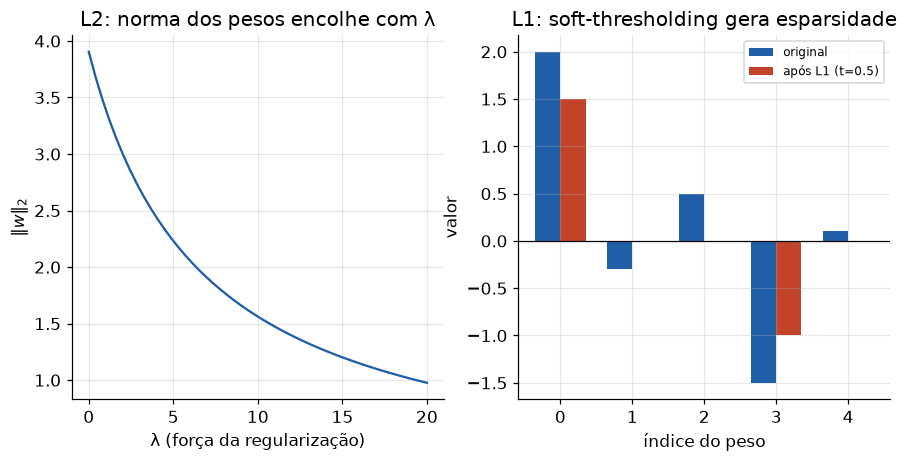

# Lição 015 — Regularização: L1, L2, dropout e early stopping

> **Módulo:** M01 — Fundamentos de ML · **Ordem de estudo:** 15 · **Tempo:** ~55 min
> **Pré-requisitos:** [012] Funções de perda
> **Classificação:** complemento de aprofundamento à ementa

## Seção_Teórica

### Motivação

Um modelo com capacidade suficiente consegue **memorizar** o conjunto de treino —
inclusive seu ruído — atingindo perda quase zero no treino e desempenho péssimo em
dados novos. Esse é o **overfitting**. A **regularização** é o conjunto de técnicas
que restringe a complexidade efetiva do modelo para que ele **generalize** em vez de
decorar. É uma das ferramentas mais usadas no dia a dia: sem ela, redes grandes
overfittam quase sempre.

A ideia une-se à navalha de Occam: entre dois modelos que explicam os dados, prefira
o **mais simples**. Regularização traduz "mais simples" em penalidades matemáticas
(pesos menores, menos pesos ativos) ou em procedimentos de treino (dropout, parada
antecipada).

### Princípio de funcionamento

A forma clássica adiciona à perda um termo que **penaliza pesos grandes**:

$$ L_{\text{reg}}(\mathbf{w}) = L_{\text{dados}}(\mathbf{w}) + \lambda\,R(\mathbf{w}). $$

- **L2 (ridge):** $R(\mathbf{w}) = \|\mathbf{w}\|_2^2 = \sum_j w_j^2$. Encolhe todos
  os pesos suavemente em direção a zero (mas raramente os zera). Tem solução fechada
  e gradiente $2\lambda \mathbf{w}$.
- **L1 (lasso):** $R(\mathbf{w}) = \|\mathbf{w}\|_1 = \sum_j |w_j|$. Produz
  **esparsidade** — leva muitos pesos a **exatamente zero**, fazendo seleção de
  variáveis. O passo proximal correspondente é o *soft-thresholding*.

O hiperparâmetro $\lambda$ controla a força: $\lambda$ grande regulariza mais (mais
viés, menos variância — assunto da Lição 016). Além das penalidades, duas técnicas
procedimentais são onipresentes em deep learning: **dropout** (desligar
aleatoriamente uma fração das ativações no treino, forçando redundância) e **early
stopping** (parar o treino quando a perda de validação começa a subir).



*À esquerda, a penalidade L2 encolhe os pesos suavemente conforme $\lambda$ cresce. À direita, a L1 zera coeficientes pequenos (esparsidade), mantendo apenas os relevantes.*

---

### Conceito central 1 — Regularização L2 (ridge)

A L2 adiciona $\lambda\|\mathbf{w}\|_2^2$ à perda. Para regressão linear, isso tem
solução fechada: $\mathbf{w} = (X^\top X + \lambda I)^{-1} X^\top \mathbf{y}$. O termo
$\lambda I$ "infla" a diagonal, o que **estabiliza** a inversão e **encolhe** os
pesos. Quanto maior $\lambda$, menor a norma dos pesos resultantes.

#### Exemplo_Resolvido 1.1

```python
import numpy as np
# Regressao ridge (L2) por solucao fechada: w = (X^T X + lambda I)^-1 X^T y.
# Aumentar lambda encolhe a norma dos pesos (regularizacao L2).
np.random.seed(0)
X = np.array([[1.0, 2.0],
              [1.0, 0.0],
              [1.0, -1.0],
              [1.0, 3.0],
              [1.0, 1.0]])
y = np.array([5.0, 1.0, -1.0, 7.0, 3.0])

def ridge(X, y, lam):
    n_feat = X.shape[1]
    A = X.T @ X + lam * np.eye(n_feat)
    return np.linalg.solve(A, X.T @ y)

for lam in [0.0, 1.0, 10.0]:
    w = ridge(X, y, lam)
    print(f"lambda={lam:>4}: w=[{w[0]:.4f}, {w[1]:.4f}] norma_L2={np.linalg.norm(w):.4f}")
```

**Explicação passo a passo:**
- **Bloco 1 (dados):** uma matriz de projeto com coluna de 1s (viés) e uma feature; `y` é quase linear.
- **Bloco 2 (`ridge`):** resolve o sistema regularizado com `np.linalg.solve` (mais estável que inverter).
- **Bloco 3 (laço):** com `lambda=0` recupera a regressão usual (`w=[1, 2]`); conforme $\lambda$ cresce, a norma cai de `2.2361` para `1.4070` — os pesos foram encolhidos.

**Saída esperada:**
```
lambda= 0.0: w=[1.0000, 2.0000] norma_L2=2.2361
lambda= 1.0: w=[0.9155, 1.9014] norma_L2=2.1103
lambda=10.0: w=[0.5714, 1.2857] norma_L2=1.4070
```

---

### Conceito central 2 — Regularização L1 e esparsidade

A L1 penaliza a **soma dos valores absolutos**. Geometricamente, sua "bola unitária"
tem quinas nos eixos, e a solução ótima tende a cair exatamente sobre elas — onde
coordenadas são **zero**. O efeito prático é o operador de **soft-thresholding**:
coeficientes de módulo menor que o limiar viram zero; os demais são encolhidos em
direção a zero. Por isso a L1 faz **seleção automática de variáveis**.

#### Exemplo_Resolvido 2.1

```python
# Regularizacao L1 e esparsidade: operador de soft-thresholding.
# A solucao do termo L1 zera coeficientes pequenos (|w| <= limiar).
def soft_threshold(w, limiar):
    saida = []
    for x in w:
        if x > limiar:
            saida.append(x - limiar)
        elif x < -limiar:
            saida.append(x + limiar)
        else:
            saida.append(0.0)
    return saida

w = [2.0, -0.3, 0.5, -1.5, 0.1]
for limiar in [0.0, 0.5, 1.0]:
    s = soft_threshold(w, limiar)
    zeros = sum(1 for v in s if v == 0.0)
    print(f"limiar={limiar}: {[round(v, 2) for v in s]} (zeros={zeros})")
```

**Explicação passo a passo:**
- **Bloco 1 (`soft_threshold`):** implementa a função `sign(x)·max(|x|−limiar, 0)`, o passo proximal da L1.
- **Bloco 2 (`w`):** um vetor com pesos grandes e pequenos misturados.
- **Bloco 3 (laço):** com limiar 0 nada muda; com limiar 0.5 três coeficientes pequenos zeram; o vetor fica **esparso**, mantendo apenas os pesos verdadeiramente grandes.

**Saída esperada:**
```
limiar=0.0: [2.0, -0.3, 0.5, -1.5, 0.1] (zeros=0)
limiar=0.5: [1.5, 0.0, 0.0, -1.0, 0.0] (zeros=3)
limiar=1.0: [1.0, 0.0, 0.0, -0.5, 0.0] (zeros=3)
```

---

### Conceito central 3 — Dropout e early stopping

Em deep learning, duas técnicas procedimentais regularizam sem alterar a perda.
O **dropout** desliga aleatoriamente uma fração $p$ das ativações a cada passo de
treino, impedindo que neurônios co-dependam e forçando representações redundantes
(no teste, nada é desligado). O **early stopping** monitora a perda de **validação**
e interrompe o treino quando ela para de melhorar por algumas épocas (*paciência*),
evitando que o modelo continue overfittando o treino.

#### Exemplo_Resolvido 3.1

```python
# Early stopping: parar no melhor epoch segundo a perda de VALIDACAO.
# Treino cai sempre; validacao tem formato de U (sobe quando comeca overfitting).
perda_treino = [1.00, 0.70, 0.50, 0.38, 0.30, 0.25, 0.21, 0.18, 0.16, 0.15]
perda_val =    [1.10, 0.80, 0.62, 0.55, 0.52, 0.54, 0.59, 0.66, 0.74, 0.83]

paciencia = 2
melhor_epoch = 0
melhor_val = perda_val[0]
contador = 0
parou_em = len(perda_val) - 1
for epoch in range(1, len(perda_val)):
    if perda_val[epoch] < melhor_val:
        melhor_val = perda_val[epoch]
        melhor_epoch = epoch
        contador = 0
    else:
        contador += 1
        if contador >= paciencia:
            parou_em = epoch
            break

print(f"melhor epoch: {melhor_epoch} (val={melhor_val:.2f})")
print(f"parou no epoch: {parou_em}")
print(f"epochs economizados: {len(perda_val) - 1 - parou_em}")
```

**Explicação passo a passo:**
- **Bloco 1 (curvas):** a perda de treino cai monotonamente, mas a de validação tem formato de U — sinal claro de overfitting após o vale.
- **Bloco 2 (laço):** rastreia o melhor epoch de validação e incrementa um contador de paciência quando não há melhora.
- **Bloco 3 (`print`):** o melhor epoch é o 4 (val mínima `0.52`); a paciência de 2 dispara a parada no epoch 6, economizando 3 épocas de treino inútil.

**Saída esperada:**
```
melhor epoch: 4 (val=0.52)
parou no epoch: 6
epochs economizados: 3
```

## Seção_Prática

> **Como reproduzir:** execute cada solução de referência com
> `python trilha/solucoes/015-regularizacao/solucao_<n>.py` e compare a saída com o
> arquivo `.saida.txt` correspondente. Os esqueletos ficam em
> `trilha/pratica/015-regularizacao/exercicio_<n>.py`.

### Exercício 1 — Ridge (L2) e encolhimento dos pesos
- **Entrada inicial / setup:** a matriz `X` (coluna de 1s + uma feature) e `y` dados no esqueleto; use numpy.
- **Passos de execução:** implemente `ridge(X, y, lam)` com `np.linalg.solve`, imprima `w` e a norma L2 para `lambda` em `[0.0, 5.0, 50.0]` e a linha `norma decresce com lambda: <bool>`.
- **Critério de conclusão (binário):** a saída é **idêntica** a `solucao_1.saida.txt`, terminando com `norma decresce com lambda: True`; qualquer divergência reprova.
- **Solução de referência:** `trilha/solucoes/015-regularizacao/solucao_1.py`
- **Saída esperada:** `trilha/solucoes/015-regularizacao/solucao_1.saida.txt`

### Exercício 2 — Soft-thresholding (L1) e esparsidade
- **Entrada inicial / setup:** o vetor `w = [1.2, -0.4, 0.9, -0.1, 2.5, 0.2]`.
- **Passos de execução:** implemente `soft_threshold`, imprima o vetor resultante e a contagem de zeros para limiar em `[0.0, 0.5, 1.0]`, e a linha `esparsidade aumenta com o limiar: <bool>`.
- **Critério de conclusão (binário):** a saída é **idêntica** a `solucao_2.saida.txt`, terminando com `esparsidade aumenta com o limiar: True`; caso contrário, reprovado.
- **Solução de referência:** `trilha/solucoes/015-regularizacao/solucao_2.py`
- **Saída esperada:** `trilha/solucoes/015-regularizacao/solucao_2.saida.txt`

### Exercício 3 — Early stopping com paciência
- **Entrada inicial / setup:** a curva `perda_val = [0.90, 0.70, 0.55, 0.48, 0.45, 0.44, 0.47, 0.50, 0.55, 0.60]` e `paciencia=3`.
- **Passos de execução:** implemente `early_stopping`, devolvendo o melhor epoch, a melhor val e o epoch de parada; imprima `melhor epoch`, `parou no epoch` e `epochs economizados`.
- **Critério de conclusão (binário):** a saída é **idêntica** a `solucao_3.saida.txt` (melhor epoch `5`, parada no epoch `8`); qualquer divergência reprova.
- **Solução de referência:** `trilha/solucoes/015-regularizacao/solucao_3.py`
- **Saída esperada:** `trilha/solucoes/015-regularizacao/solucao_3.saida.txt`
