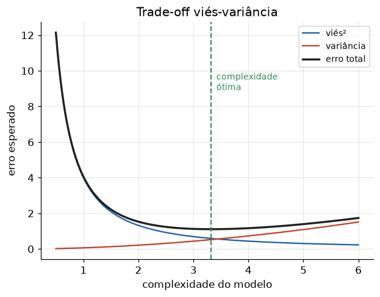

# Lição 016 — Trade-off viés-variância

> **Módulo:** M01 — Fundamentos de ML · **Ordem de estudo:** 16 · **Tempo:** ~55 min
> **Pré-requisitos:** [011] O que é ML · [015] Regularização
> **Classificação:** complemento de aprofundamento à ementa

## Seção_Teórica

### Motivação

Por que um modelo mais poderoso às vezes generaliza **pior**? Por que adicionar
regularização, que aumenta o erro de treino, pode **reduzir** o erro de teste? A
resposta está no **trade-off viés-variância** — o conceito mais importante para
entender a generalização e um clássico absoluto de entrevistas de ML.

Dominar esse trade-off é o que permite responder, com método e não por tentativa:
"meu modelo está underfittando ou overfittando? devo aumentar a capacidade, coletar
mais dados ou regularizar mais?". Cada uma dessas decisões mexe em um lado da balança.

### Princípio de funcionamento

Para um modelo $\hat{f}$ treinado em um conjunto aleatório, o **erro quadrático
esperado** em um ponto $x_0$ se decompõe em três parcelas:

$$ \mathbb{E}\big[(y - \hat{f}(x_0))^2\big] = \underbrace{\big(\mathbb{E}[\hat{f}(x_0)] - f(x_0)\big)^2}_{\text{viés}^2} + \underbrace{\operatorname{Var}\big(\hat{f}(x_0)\big)}_{\text{variância}} + \underbrace{\sigma^2}_{\text{ruído irredutível}}. $$

- **Viés:** erro por suposições simplistas. Modelos rígidos (poucos parâmetros)
  têm alto viés — **underfitting**: erram tanto no treino quanto no teste.
- **Variância:** sensibilidade do modelo ao conjunto de treino específico. Modelos
  flexíveis (muitos parâmetros) têm alta variância — **overfitting**: vão muito bem
  no treino e mal no teste.
- **Ruído irredutível** $\sigma^2$: a aleatoriedade inerente aos dados, que nenhum
  modelo elimina.

O trade-off: **aumentar a complexidade reduz o viés mas aumenta a variância**, e
vice-versa. O erro total tem formato de **U** em função da complexidade; o ponto
ótimo equilibra os dois. Regularização (Lição 015) e mais dados deslocam esse
equilíbrio reduzindo a variância.



*Conforme a complexidade do modelo cresce, o vi² cai e a variância sobe; o erro total (soma) atinge um mínimo na complexidade ótima.*

---

### Conceito central 1 — Decomposição viés-variância

Podemos **medir** viés e variância empiricamente: reamostramos muitos conjuntos de
treino, ajustamos o modelo em cada um e olhamos as predições num ponto fixo $x_0$. O
**viés²** é o quadrado da diferença entre a predição média e o valor verdadeiro; a
**variância** é o espalhamento das predições. Um modelo simples e um flexível trocam
um pelo outro.

#### Exemplo_Resolvido 1.1

```python
import numpy as np
# Decomposicao vies-variancia empirica em um ponto de teste.
# Funcao verdadeira f(x) = x^2; observamos y = f(x) + ruido gaussiano.
rng = np.random.default_rng(0)
def f(x):
    return x ** 2

x_treino = np.linspace(-3, 3, 15)
x0 = 1.5                      # ponto de teste
sigma = 1.0                   # desvio do ruido
M = 2000                      # numero de datasets reamostrados

pred_const = []   # modelo de grau 0 (constante): alto vies
pred_grau2 = []   # modelo de grau 2: baixo vies
for _ in range(M):
    y = f(x_treino) + rng.normal(0, sigma, size=x_treino.shape)
    c = np.polyfit(x_treino, y, 0)        # constante
    p2 = np.polyfit(x_treino, y, 2)       # parabola
    pred_const.append(np.polyval(c, x0))
    pred_grau2.append(np.polyval(p2, x0))

for nome, preds in [("grau 0", pred_const), ("grau 2", pred_grau2)]:
    preds = np.array(preds)
    vies2 = (preds.mean() - f(x0)) ** 2
    var = preds.var()
    print(f"{nome}: vies^2={vies2:.4f} variancia={var:.4f}")
```

**Explicação passo a passo:**
- **Bloco 1 (`f`/setup):** a função verdadeira é uma parábola; o ruído gaussiano tem $\sigma=1$.
- **Bloco 2 (laço):** para cada um dos 2000 datasets reamostrados, ajusta um modelo constante (grau 0) e uma parábola (grau 2) e guarda a predição em `x0`.
- **Bloco 3 (`print`):** o modelo de grau 0 não consegue representar a curvatura → **viés² alto** (`1.40`) e variância baixa; o de grau 2 capta a forma → **viés² quase zero** mas variância maior. Esse é o trade-off em ação.

**Saída esperada:**
```
grau 0: vies^2=1.3985 variancia=0.0637
grau 2: vies^2=0.0001 variancia=0.1202
```

---

### Conceito central 2 — Complexidade e overfitting

Visto pela ótica de **erro de treino vs. teste**: ao aumentar a complexidade, o erro
de **treino** sempre cai (o modelo se ajusta cada vez melhor aos dados vistos). Já o
erro de **teste** cai até um ponto e depois **sobe** — é a assinatura do overfitting.
A distância entre as duas curvas é a "lacuna de generalização".

#### Exemplo_Resolvido 2.1

```python
import numpy as np
# Erro de treino vs teste conforme a complexidade (grau do polinomio) cresce.
rng = np.random.default_rng(1)
def f(x):
    return np.sin(1.5 * x)

x_treino = np.linspace(-3, 3, 10)
x_teste = np.linspace(-3, 3, 200)
y_treino = f(x_treino) + rng.normal(0, 0.25, size=x_treino.shape)
y_teste = f(x_teste)   # alvo verdadeiro (sem ruido)

def mse(a, b):
    return float(np.mean((a - b) ** 2))

for grau in [1, 4, 9]:
    coef = np.polyfit(x_treino, y_treino, grau)
    erro_tr = mse(np.polyval(coef, x_treino), y_treino)
    erro_te = mse(np.polyval(coef, x_teste), y_teste)
    print(f"grau={grau}: erro_treino={erro_tr:.4f} erro_teste={erro_te:.4f}")
```

**Explicação passo a passo:**
- **Bloco 1 (setup):** alvo $\sin(1.5x)$ com 10 pontos de treino ruidosos.
- **Bloco 2 (laço):** ajusta polinômios de grau crescente e mede erro de treino e de teste.
- **Bloco 3 (`print`):** grau 1 **underfitta** (erros altos); grau 4 é o melhor compromisso (erro de teste mínimo `0.0960`); grau 9 **overfitta** — erro de treino vai a `0.0000` enquanto o de teste **sobe** para `0.1239`. A curva de teste tem o formato de U esperado.

**Saída esperada:**
```
grau=1: erro_treino=0.5737 erro_teste=0.5030
grau=4: erro_treino=0.1369 erro_teste=0.0960
grau=9: erro_treino=0.0000 erro_teste=0.1239
```

---

### Conceito central 3 — Estimativa empírica e complexidade ótima

Somando viés² e variância ao longo das complexidades, vemos o **erro total** desenhar
o U e podemos escolher a complexidade que o minimiza. Esse procedimento — medir as
duas componentes por reamostragem — é a forma operacional de diagnosticar onde um
modelo está na balança.

#### Exemplo_Resolvido 3.1

```python
import numpy as np
# Erro total = vies^2 + variancia: varrendo a complexidade e achando o melhor grau.
rng = np.random.default_rng(2)
def f(x):
    return x ** 2

x_treino = np.linspace(-3, 3, 15)
x0 = 1.5
sigma = 1.0
M = 2000

print("grau | vies^2 | variancia | total")
melhor_grau, melhor_total = None, float("inf")
for grau in range(0, 6):
    preds = []
    for _ in range(M):
        y = f(x_treino) + rng.normal(0, sigma, size=x_treino.shape)
        coef = np.polyfit(x_treino, y, grau)
        preds.append(np.polyval(coef, x0))
    preds = np.array(preds)
    vies2 = (preds.mean() - f(x0)) ** 2
    var = preds.var()
    total = vies2 + var
    if total < melhor_total:
        melhor_total, melhor_grau = total, grau
    print(f"  {grau}  | {vies2:.4f} |  {var:.4f}  | {total:.4f}")

print(f"melhor grau (menor total): {melhor_grau}")
```

**Explicação passo a passo:**
- **Bloco 1 (setup):** mesma parábola verdadeira; varremos graus de 0 a 5.
- **Bloco 2 (laço):** para cada grau, reamostra 2000 datasets e calcula viés² e variância em `x0`.
- **Bloco 3 (`print`):** os graus 0 e 1 têm viés² gigante (não captam a curvatura); a partir do grau 2 o viés² zera, mas a variância **cresce** com o grau. O erro total é mínimo no grau 2 — exatamente a complexidade da função verdadeira.

**Saída esperada:**
```
grau | vies^2 | variancia | total
  0  | 1.4037 |  0.0672  | 1.4709
  1  | 1.3669 |  0.1082  | 1.4751
  2  | 0.0000 |  0.1261  | 0.1261
  3  | 0.0000 |  0.2248  | 0.2248
  4  | 0.0000 |  0.2564  | 0.2564
  5  | 0.0000 |  0.2721  | 0.2721
melhor grau (menor total): 2
```

## Seção_Prática

> **Como reproduzir:** execute cada solução de referência com
> `python trilha/solucoes/016-vies-variancia/solucao_<n>.py` e compare a saída com o
> arquivo `.saida.txt` correspondente. Os esqueletos ficam em
> `trilha/pratica/016-vies-variancia/exercicio_<n>.py`.

### Exercício 1 — Medir viés e variância
- **Entrada inicial / setup:** `f(x) = 0.5*x²`, `x0=2.0`, `sigma=1.0`, `M=2000`, `np.random.default_rng(10)`, `x_treino = linspace(-3, 3, 15)`.
- **Passos de execução:** estime viés² e variância para um modelo de grau 0 e um de grau 3; imprima as duas linhas (4 casas) e as comparações `grau 0 tem mais vies` e `grau 3 tem mais variancia`.
- **Critério de conclusão (binário):** a saída é **idêntica** a `solucao_1.saida.txt`, com ambas as comparações `True`; qualquer divergência reprova.
- **Solução de referência:** `trilha/solucoes/016-vies-variancia/solucao_1.py`
- **Saída esperada:** `trilha/solucoes/016-vies-variancia/solucao_1.saida.txt`

### Exercício 2 — Encontrar a complexidade ótima
- **Entrada inicial / setup:** `f(x) = sin(1.5x)`, `np.random.default_rng(3)`, `x_treino = linspace(-3, 3, 11)` com ruído `N(0, 0.25)`, `x_teste = linspace(-3, 3, 200)`.
- **Passos de execução:** para grau de 1 a 9, ajuste o polinômio e meça o erro de teste; imprima `grau=<g>: erro_teste=...` e a linha `melhor grau (menor erro_teste): <g>`.
- **Critério de conclusão (binário):** a saída é **idêntica** a `solucao_2.saida.txt` (melhor grau `5`); caso contrário, reprovado.
- **Solução de referência:** `trilha/solucoes/016-vies-variancia/solucao_2.py`
- **Saída esperada:** `trilha/solucoes/016-vies-variancia/solucao_2.saida.txt`

### Exercício 3 — Mais dados reduzem a variância
- **Entrada inicial / setup:** `f(x) = 0.5*x²`, modelo de grau 4, `x0=1.5`, `sigma=1.0`, `M=1500`, `np.random.default_rng(5)`.
- **Passos de execução:** para `n` em `[10, 40, 160]`, estime a variância das predições em `x0`; imprima `n=<n>: variancia=...` e `variancia cai com mais dados: <bool>`.
- **Critério de conclusão (binário):** a saída é **idêntica** a `solucao_3.saida.txt`, terminando com `variancia cai com mais dados: True`; qualquer divergência reprova.
- **Solução de referência:** `trilha/solucoes/016-vies-variancia/solucao_3.py`
- **Saída esperada:** `trilha/solucoes/016-vies-variancia/solucao_3.saida.txt`
