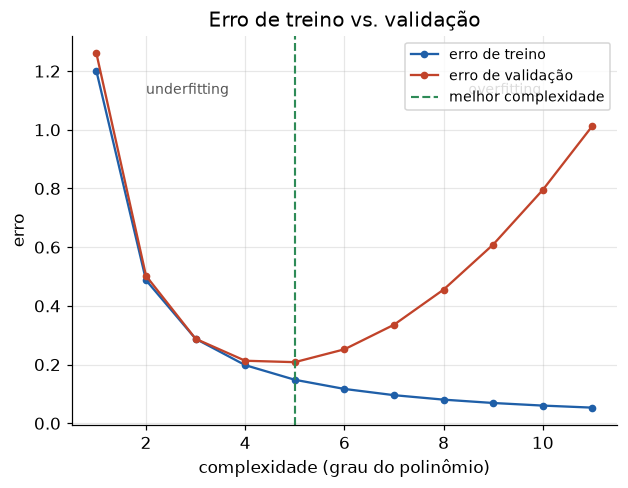

# Lição 017 — Overfitting, underfitting e validação cruzada

> **Módulo:** M01 — Fundamentos de ML · **Ordem de estudo:** 17 · **Tempo:** ~55 min
> **Pré-requisitos:** [016] Trade-off viés-variância
> **Classificação:** complemento de aprofundamento à ementa

## Seção_Teórica

### Motivação

Você treinou um modelo e ele acertou 99% no treino. Isso é bom? **Não dá para saber**
olhando só o treino — talvez ele tenha decorado os exemplos (overfitting) e vá falhar
em produção. A única forma honesta de estimar o desempenho real é medir em dados que o
modelo **não viu**. Daí nascem a separação treino/validação/teste e a **validação
cruzada**, ferramentas que todo engenheiro de IA usa para escolher modelos e
hiperparâmetros sem se enganar.

Esta lição operacionaliza o trade-off viés-variância da Lição 016: como **detectar**
de que lado da balança o modelo está e como **escolher** a complexidade certa com um
procedimento confiável.

### Princípio de funcionamento

- **Underfitting:** o modelo é simples demais — erro **alto no treino e na validação**.
  Sintoma de alto viés. Solução: mais capacidade, melhores features, menos regularização.
- **Overfitting:** o modelo é flexível demais — erro **baixo no treino mas alto na
  validação** (lacuna de generalização grande). Sintoma de alta variância. Solução:
  mais dados, regularização, menos capacidade.
- **Bom ajuste:** erros de treino e validação **baixos e próximos**.

Para estimar o erro de validação de forma robusta — sobretudo com poucos dados — usamos
**validação cruzada k-fold**: dividimos os dados em $k$ blocos (*folds*); treinamos $k$
vezes, cada uma deixando um bloco de fora para validar; a estimativa é a **média** dos
$k$ erros. Isso usa todos os dados tanto para treino quanto para validação e reduz a
sorte de um único split.

As **curvas de aprendizado** (erro vs. tamanho do treino) completam o diagnóstico: se
treino e validação convergem para um erro **alto**, o problema é viés (mais dados não
ajudam); se há uma **lacuna grande** que diminui com mais dados, o problema é variância.



*O erro de treino cai sempre; o de validação tem formato de U. À esquerda do vale, underfitting; à direita, overfitting.*

---

### Conceito central 1 — Overfitting vs. underfitting

O diagnóstico nasce da comparação entre dois números: o erro de **treino** e o de
**validação**. Ambos altos → underfitting. Treino baixo e validação muito acima →
overfitting. Ambos baixos e próximos → o ponto que queremos.

#### Exemplo_Resolvido 1.1

```python
# Diagnostico: underfitting vs overfitting a partir dos erros de treino/validacao.
def diagnosticar(erro_treino, erro_val, limiar_alto=0.20, folga_max=0.10):
    if erro_treino > limiar_alto and erro_val > limiar_alto:
        return "underfitting"
    if erro_val - erro_treino > folga_max:
        return "overfitting"
    return "bom ajuste"

casos = [
    ("modelo simples", 0.35, 0.38),
    ("modelo complexo", 0.02, 0.30),
    ("modelo equilibrado", 0.08, 0.11),
]
for nome, tr, val in casos:
    print(f"{nome}: treino={tr:.2f} val={val:.2f} -> {diagnosticar(tr, val)}")
```

**Explicação passo a passo:**
- **Bloco 1 (`diagnosticar`):** codifica as duas regras — ambos altos (underfitting) e lacuna grande (overfitting).
- **Bloco 2 (`casos`):** três cenários típicos.
- **Bloco 3 (laço):** o modelo simples erra muito nos dois (underfitting); o complexo acerta no treino mas erra na validação (overfitting); o equilibrado tem erros baixos e próximos (bom ajuste).

**Saída esperada:**
```
modelo simples: treino=0.35 val=0.38 -> underfitting
modelo complexo: treino=0.02 val=0.30 -> overfitting
modelo equilibrado: treino=0.08 val=0.11 -> bom ajuste
```

---

### Conceito central 2 — Validação cruzada k-fold

Um único split treino/validação pode ser enganoso: e se, por sorte, os dados fáceis
caíram na validação? A **k-fold** elimina essa loteria treinando $k$ vezes e fazendo a
média. É o método padrão para **selecionar hiperparâmetros** (aqui, o grau do
polinômio) usando os dados de forma eficiente.

#### Exemplo_Resolvido 2.1

```python
import numpy as np
# Validacao cruzada k-fold do zero para escolher o grau do polinomio.
rng = np.random.default_rng(0)
def f(x):
    return np.sin(1.2 * x)

X = np.linspace(-3, 3, 30)
y = f(X) + rng.normal(0, 0.3, size=X.shape)

def kfold_indices(n, k):
    idx = np.arange(n)
    folds = np.array_split(idx, k)
    return folds

def cv_erro(grau, k=5):
    folds = kfold_indices(len(X), k)
    erros = []
    for i in range(k):
        val_idx = folds[i]
        tr_idx = np.concatenate([folds[j] for j in range(k) if j != i])
        coef = np.polyfit(X[tr_idx], y[tr_idx], grau)
        pred = np.polyval(coef, X[val_idx])
        erros.append(np.mean((pred - y[val_idx]) ** 2))
    return float(np.mean(erros))

for grau in [1, 3, 5, 9]:
    print(f"grau={grau}: erro_cv={cv_erro(grau):.4f}")
```

**Explicação passo a passo:**
- **Bloco 1 (dados):** alvo $\sin(1.2x)$ com 30 pontos ruidosos.
- **Bloco 2 (`kfold_indices`):** divide os índices em 5 blocos com `np.array_split`.
- **Bloco 3 (`cv_erro`):** treina deixando cada bloco de fora e devolve o erro médio de validação.
- **Bloco 4 (laço):** o grau 3 tem o menor erro de CV (`0.6524`); graus altos disparam (overfitting), com o grau 9 explodindo para milhares. A k-fold revela claramente o melhor grau.

**Saída esperada:**
```
grau=1: erro_cv=0.9898
grau=3: erro_cv=0.6524
grau=5: erro_cv=4.4403
grau=9: erro_cv=4946.2286
```

---

### Conceito central 3 — Curvas de aprendizado

Plotar o erro de treino e de validação em função do **tamanho do conjunto de treino**
diz se vale a pena coletar mais dados. Com poucos dados, o modelo se ajusta bem ao
treino (erro baixo) mas generaliza mal (validação alta) — lacuna grande. Conforme os
dados crescem, o erro de treino sobe um pouco, o de validação cai, e as duas curvas
**convergem**. Se convergem num erro baixo, ótimo; se num erro alto, há viés.

#### Exemplo_Resolvido 3.1

```python
import numpy as np
# Curva de aprendizado: erro de treino e de validacao em funcao do tamanho do treino.
rng = np.random.default_rng(1)
def f(x):
    return 0.5 * x ** 2

X_full = np.linspace(-4, 4, 80)
y_full = f(X_full) + rng.normal(0, 1.0, size=X_full.shape)
# separa validacao fixa (1 a cada 4 pontos) e embaralha o pool de treino
val_idx = np.arange(0, 80, 4)
tr_pool = np.array([i for i in range(80) if i not in set(val_idx)])
rng.shuffle(tr_pool)               # treino espalhado por todo o dominio
Xv, yv = X_full[val_idx], y_full[val_idx]

def mse(a, b):
    return float(np.mean((a - b) ** 2))

for n in [5, 15, 60]:
    sub = tr_pool[:n]
    coef = np.polyfit(X_full[sub], y_full[sub], 2)
    e_tr = mse(np.polyval(coef, X_full[sub]), y_full[sub])
    e_val = mse(np.polyval(coef, Xv), yv)
    print(f"n_treino={n:>2}: erro_treino={e_tr:.4f} erro_val={e_val:.4f}")
```

**Explicação passo a passo:**
- **Bloco 1 (setup):** alvo quadrático com ruído; separamos uma validação fixa e embaralhamos o pool de treino para que subconjuntos pequenos cubram todo o domínio.
- **Bloco 2 (`mse`):** erro quadrático médio.
- **Bloco 3 (laço):** com `n=5`, o treino erra pouco (`0.65`) mas a validação erra muito (`1.77`) — lacuna grande. Com `n=60`, treino (`0.67`) e validação (`0.79`) quase coincidem: o modelo (grau 2, igual à função verdadeira) generaliza bem e mais dados estabilizaram a estimativa.

**Saída esperada:**
```
n_treino= 5: erro_treino=0.6517 erro_val=1.7742
n_treino=15: erro_treino=0.8431 erro_val=0.9604
n_treino=60: erro_treino=0.6747 erro_val=0.7866
```

## Seção_Prática

> **Como reproduzir:** execute cada solução de referência com
> `python trilha/solucoes/017-overfitting-validacao-cruzada/solucao_<n>.py` e compare a
> saída com o arquivo `.saida.txt` correspondente. Os esqueletos ficam em
> `trilha/pratica/017-overfitting-validacao-cruzada/exercicio_<n>.py`.

### Exercício 1 — Diagnóstico por erros de treino/validação
- **Entrada inicial / setup:** os casos `A=(0.40, 0.42)`, `B=(0.03, 0.25)`, `C=(0.07, 0.10)`, `D=(0.30, 0.31)`; `limiar_alto=0.20`, `folga_max=0.10`.
- **Passos de execução:** implemente `diagnosticar` com as duas regras e imprima `<nome>: treino=.. val=.. -> <diagnóstico>` para cada caso.
- **Critério de conclusão (binário):** a saída é **idêntica** a `solucao_1.saida.txt` (B é overfitting, A e D underfitting, C bom ajuste); qualquer divergência reprova.
- **Solução de referência:** `trilha/solucoes/017-overfitting-validacao-cruzada/solucao_1.py`
- **Saída esperada:** `trilha/solucoes/017-overfitting-validacao-cruzada/solucao_1.saida.txt`

### Exercício 2 — Seleção de grau por k-fold
- **Entrada inicial / setup:** `f(x) = sin(1.2x)`, `np.random.default_rng(42)`, `X = linspace(-3, 3, 40)`, `y = f(X) + N(0, 0.3)`, `k=5`.
- **Passos de execução:** implemente a k-fold com `np.array_split`, calcule o erro de validação médio para grau em `[1, 2, 3, 4, 5]`, imprima cada um e `melhor grau (k-fold): <g>`.
- **Critério de conclusão (binário):** a saída é **idêntica** a `solucao_2.saida.txt` (melhor grau `3`); caso contrário, reprovado.
- **Solução de referência:** `trilha/solucoes/017-overfitting-validacao-cruzada/solucao_2.py`
- **Saída esperada:** `trilha/solucoes/017-overfitting-validacao-cruzada/solucao_2.saida.txt`

### Exercício 3 — Curva de aprendizado e lacuna de generalização
- **Entrada inicial / setup:** `f(x) = 0.5x²`, `np.random.default_rng(7)`, `X_full = linspace(-4, 4, 100)`, validação = 1 a cada 5 pontos, pool de treino embaralhado.
- **Passos de execução:** para `n` em `[6, 20, 80]`, ajuste grau 2, meça erro de treino, de validação e a `lacuna = val - treino`; imprima as linhas e `lacuna encolhe com mais dados: <bool>`.
- **Critério de conclusão (binário):** a saída é **idêntica** a `solucao_3.saida.txt`, terminando com `lacuna encolhe com mais dados: True`; qualquer divergência reprova.
- **Solução de referência:** `trilha/solucoes/017-overfitting-validacao-cruzada/solucao_3.py`
- **Saída esperada:** `trilha/solucoes/017-overfitting-validacao-cruzada/solucao_3.saida.txt`
