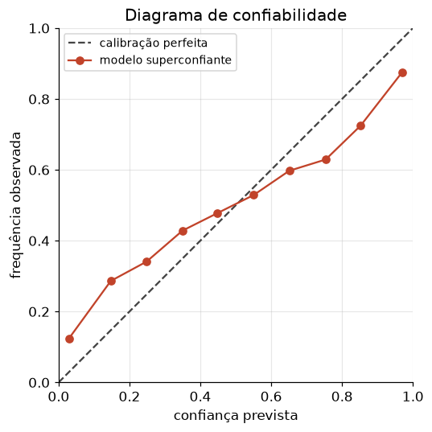

# Lição 018 — Calibração de modelos

> **Módulo:** M01 — Fundamentos de ML · **Ordem de estudo:** 18 · **Tempo:** ~50 min
> **Pré-requisitos:** [008] Probabilidade e distribuições · [017] Overfitting e validação cruzada
> **Classificação:** complemento de aprofundamento à ementa

## Seção_Teórica

### Motivação

Quando um modelo diz "90% de probabilidade de fraude", esse número significa algo? Se
o modelo for **calibrado**, sim: entre todos os casos em que ele diz 90%, cerca de 90%
serão realmente fraude. Se não, a probabilidade é só um placar interno sem
interpretação. Em sistemas de IA que **tomam decisões com base em limiares** (aprovar
crédito, escalar para um humano, acionar uma ferramenta), a calibração é tão importante
quanto a acurácia — e é um clássico de entrevistas.

Modelos modernos, especialmente redes neurais profundas e LLMs, tendem a ser
**superconfiantes**: cospem probabilidades altas demais. Saber **medir** e **corrigir**
isso é uma habilidade prática essencial para confiar nas saídas de um sistema.

### Princípio de funcionamento

Um classificador é **calibrado** se a confiança prevista bate com a frequência
observada: dentre as predições com probabilidade $p$, a fração de positivos é $\approx p$.
Acurácia e calibração são **independentes** — um modelo pode acertar muito e ainda ser
mal calibrado (e vice-versa).

Para medir, usamos o **diagrama de confiabilidade**: agrupamos as predições em faixas de
probabilidade e, em cada faixa, comparamos a **confiança média** (média das $p$
previstas) com a **acurácia** (frequência de positivos). No modelo perfeito, os pontos
ficam sobre a diagonal. O **Expected Calibration Error (ECE)** resume o desvio em um
número — a média ponderada (pelo tamanho da faixa) de $|\text{confiança} - \text{acurácia}|$:

$$ \text{ECE} = \sum_{b=1}^{B} \frac{n_b}{N}\,\big|\,\text{conf}(b) - \text{acc}(b)\,\big|. $$

Para **recalibrar** sem retreinar, a técnica mais simples é o **temperature scaling**:
dividir os logits por uma temperatura $T$ antes do softmax/sigmoide. $T > 1$ "amacia" as
probabilidades (combate a superconfiança); $T < 1$ as agudiza. Como $T$ é um único
escalar que não altera a ordem das predições, a **acurácia não muda** — só a calibração.



*A diagonal é a calibração perfeita. A curva do modelo superconfiante fica abaixo da diagonal nas faixas altas (promete mais do que entrega).*

---

### Conceito central 1 — O que é calibração

Calibração é uma propriedade das **probabilidades**, não das decisões. Para vê-la,
agrupamos as predições por faixa e checamos se a frequência de positivos acompanha a
probabilidade prevista. Um modelo bem calibrado fica "na diagonal".

#### Exemplo_Resolvido 1.1

```python
import numpy as np
# Calibracao: entre as predicoes com prob ~p, a fracao de positivos deveria ser ~p.
rng = np.random.default_rng(0)
N = 5000
# Probabilidade verdadeira de cada exemplo (uniforme em [0,1]).
p_verdadeira = rng.uniform(0, 1, size=N)
# Rotulos amostrados segundo a prob verdadeira.
y = (rng.uniform(0, 1, size=N) < p_verdadeira).astype(int)
# Modelo BEM calibrado: preve a propria prob verdadeira.
p_pred = p_verdadeira

# Agrupa em 5 faixas e compara prob media prevista vs frequencia observada.
bins = np.linspace(0, 1, 6)
idx = np.digitize(p_pred, bins) - 1
idx = np.clip(idx, 0, 4)
print("faixa | prob_media | freq_positivos")
for b in range(5):
    sel = idx == b
    if sel.sum() == 0:
        continue
    print(f"  {b}   |   {p_pred[sel].mean():.3f}   |   {y[sel].mean():.3f}")
```

**Explicação passo a passo:**
- **Bloco 1 (setup):** geramos uma probabilidade verdadeira por exemplo e amostramos rótulos segundo ela.
- **Bloco 2 (`p_pred`):** o modelo "ideal" prevê exatamente a probabilidade verdadeira.
- **Bloco 3 (laço):** em cada faixa, a probabilidade média prevista e a frequência de positivos quase coincidem (`0.701` vs `0.701`, etc.) — calibração quase perfeita.

**Saída esperada:**
```
faixa | prob_media | freq_positivos
  0   |   0.101   |   0.105
  1   |   0.304   |   0.287
  2   |   0.500   |   0.479
  3   |   0.701   |   0.701
  4   |   0.897   |   0.893
```

---

### Conceito central 2 — Diagrama de confiabilidade e ECE

O **ECE** transforma o diagrama em um único número comparável entre modelos. Quanto
menor, melhor calibrado. Ele pondera cada faixa pelo número de exemplos, então faixas
mais populosas pesam mais.

#### Exemplo_Resolvido 2.1

```python
import numpy as np
# Expected Calibration Error (ECE): media ponderada |prob_media - freq| por faixa.
rng = np.random.default_rng(1)
N = 5000
p_verdadeira = rng.uniform(0, 1, size=N)
y = (rng.uniform(0, 1, size=N) < p_verdadeira).astype(int)

def ece(p_pred, y, n_bins=10):
    bins = np.linspace(0, 1, n_bins + 1)
    idx = np.clip(np.digitize(p_pred, bins) - 1, 0, n_bins - 1)
    total = 0.0
    for b in range(n_bins):
        sel = idx == b
        if sel.sum() == 0:
            continue
        conf = p_pred[sel].mean()
        acc = y[sel].mean()
        total += (sel.sum() / N) * abs(conf - acc)
    return total

# Modelo calibrado vs superconfiante (sigmoide empurra as probs para os extremos).
p_calibrado = p_verdadeira
p_superconfiante = 1.0 / (1.0 + np.exp(-4.0 * (p_verdadeira - 0.5)))
print(f"ECE calibrado:      {ece(p_calibrado, y):.4f}")
print(f"ECE superconfiante: {ece(p_superconfiante, y):.4f}")
```

**Explicação passo a passo:**
- **Bloco 1 (setup):** mesma geração de dados calibrados.
- **Bloco 2 (`ece`):** agrupa em 10 faixas e soma os desvios ponderados.
- **Bloco 3 (comparação):** o modelo calibrado tem ECE baixo (`0.0175`, só ruído amostral); o superconfiante, que empurra as probabilidades para os extremos, tem ECE bem maior (`0.0382`).

**Saída esperada:**
```
ECE calibrado:      0.0175
ECE superconfiante: 0.0382
```

---

### Conceito central 3 — Recalibração com temperature scaling

Se o modelo é superconfiante, não precisamos retreiná-lo: basta achar uma temperatura
$T$ que minimize o ECE em um conjunto de validação. Dividir os logits por $T>1$ amacia as
probabilidades. Como $T$ é um escalar único, a **acurácia permanece intacta** — só a
calibração melhora.

#### Exemplo_Resolvido 3.1

```python
import numpy as np
# Temperature scaling: dividir os logits por T>1 "amacia" probabilidades
# superconfiantes, reduzindo o ECE sem mudar a ordem das predicoes.
rng = np.random.default_rng(2)
N = 8000
p_verdadeira = rng.uniform(0.02, 0.98, size=N)
y = (rng.uniform(0, 1, size=N) < p_verdadeira).astype(int)

def sigmoid(z):
    return 1.0 / (1.0 + np.exp(-z))

# logit bem-calibrado seria log(p/(1-p)); o modelo e SUPERCONFIANTE: usa 2.5x isso.
logit_calibrado = np.log(p_verdadeira / (1 - p_verdadeira))
logits = 2.5 * logit_calibrado

def ece(p_pred, y, n_bins=10):
    bins = np.linspace(0, 1, n_bins + 1)
    idx = np.clip(np.digitize(p_pred, bins) - 1, 0, n_bins - 1)
    total = 0.0
    for b in range(n_bins):
        sel = idx == b
        if sel.sum() == 0:
            continue
        total += (sel.sum() / N) * abs(p_pred[sel].mean() - y[sel].mean())
    return total

ece_T1 = ece(sigmoid(logits), y)
melhor_T, melhor_ece = 1.0, ece_T1
for T in np.linspace(1.0, 4.0, 31):
    e = ece(sigmoid(logits / T), y)
    if e < melhor_ece:
        melhor_ece, melhor_T = e, T

print(f"ECE com T=1.0: {ece_T1:.4f}")
print(f"melhor T: {melhor_T:.1f}")
print(f"ECE com melhor T: {melhor_ece:.4f}")
print("temperature scaling melhorou:", melhor_ece < ece_T1)
```

**Explicação passo a passo:**
- **Bloco 1 (setup):** geramos dados e definimos um modelo superconfiante multiplicando o logit calibrado por 2.5.
- **Bloco 2 (`ece`):** mesma métrica de calibração.
- **Bloco 3 (busca de `T`):** varremos uma grade de temperaturas e guardamos a de menor ECE.
- **Bloco 4 (`print`):** sem ajuste (`T=1`) o ECE é alto (`0.1377`); a melhor temperatura (`2.6`, perto do fator de superconfiança 2.5) derruba o ECE para `0.0091` — recalibração sem retreinar.

**Saída esperada:**
```
ECE com T=1.0: 0.1377
melhor T: 2.6
ECE com melhor T: 0.0091
temperature scaling melhorou: True
```

## Seção_Prática

> **Como reproduzir:** execute cada solução de referência com
> `python trilha/solucoes/018-calibracao/solucao_<n>.py` e compare a saída com o
> arquivo `.saida.txt` correspondente. Os esqueletos ficam em
> `trilha/pratica/018-calibracao/exercicio_<n>.py`.

### Exercício 1 — Tabela de confiabilidade de um modelo superconfiante
- **Entrada inicial / setup:** `np.random.default_rng(3)`, `N=6000`, `p_verdadeira ~ U(0.02, 0.98)`, `y ~ Bernoulli(p_verdadeira)`, `p_pred = sigmoid(2·logit_cal)`.
- **Passos de execução:** agrupe `p_pred` em 5 faixas e imprima `faixa | prob_media | freq_positivos` (3 casas) por faixa.
- **Critério de conclusão (binário):** a saída é **idêntica** a `solucao_1.saida.txt` (nas faixas altas, a frequência fica abaixo da probabilidade prevista); qualquer divergência reprova.
- **Solução de referência:** `trilha/solucoes/018-calibracao/solucao_1.py`
- **Saída esperada:** `trilha/solucoes/018-calibracao/solucao_1.saida.txt`

### Exercício 2 — Calcular o ECE
- **Entrada inicial / setup:** `np.random.default_rng(11)`, `N=6000`, dados como acima; `p_calibrado = p_verdadeira` e `p_super = sigmoid(2.5·logit_cal)`.
- **Passos de execução:** implemente `ece` (10 faixas) e imprima `ECE calibrado`, `ECE superconfiante` (4 casas) e `calibrado tem ECE menor: <bool>`.
- **Critério de conclusão (binário):** a saída é **idêntica** a `solucao_2.saida.txt`, terminando com `calibrado tem ECE menor: True`; caso contrário, reprovado.
- **Solução de referência:** `trilha/solucoes/018-calibracao/solucao_2.py`
- **Saída esperada:** `trilha/solucoes/018-calibracao/solucao_2.saida.txt`

### Exercício 3 — Recalibrar com temperature scaling
- **Entrada inicial / setup:** `np.random.default_rng(20)`, `N=8000`, dados como acima; `logits = 3·logit_cal`; grade `T ∈ linspace(1.0, 5.0, 41)`.
- **Passos de execução:** busque o `T` que minimiza o ECE de `sigmoid(logits/T)`; imprima `ECE com T=1.0`, `melhor T` (1 casa), `ECE com melhor T` (4 casas) e `temperature scaling melhorou: <bool>`.
- **Critério de conclusão (binário):** a saída é **idêntica** a `solucao_3.saida.txt` (melhor `T = 3.0`), terminando com `temperature scaling melhorou: True`; qualquer divergência reprova.
- **Solução de referência:** `trilha/solucoes/018-calibracao/solucao_3.py`
- **Saída esperada:** `trilha/solucoes/018-calibracao/solucao_3.saida.txt`
