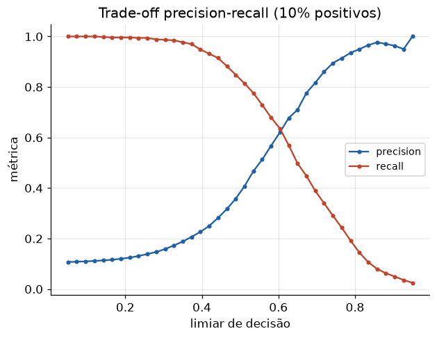

# Lição 019 — Desbalanceamento de classes

> **Módulo:** M01 — Fundamentos de ML · **Ordem de estudo:** 19 · **Tempo:** ~50 min
> **Pré-requisitos:** [017] Overfitting e validação cruzada
> **Classificação:** complemento de aprofundamento à ementa

## Seção_Teórica

### Motivação

Detecção de fraude, diagnóstico de doença rara, identificação de spam: nesses
problemas, a classe que **importa** é a **minoria** — às vezes 1% dos dados ou menos.
Um modelo que ignora completamente a classe rara pode exibir 99% de acurácia e ser
**inútil**. Essa armadilha, o **paradoxo da acurácia**, é uma das fontes mais comuns de
modelos que "passam no notebook" e falham em produção.

Saber escolher **as métricas certas** (precision, recall, F1) e **ajustar o limiar de
decisão** é o que torna um classificador útil quando as classes são desbalanceadas — um
tema recorrente tanto em projetos reais quanto em entrevistas.

### Princípio de funcionamento

Quando 99% dos exemplos são da classe negativa, **acurácia** ($\frac{\text{acertos}}{\text{total}}$)
é dominada pela maioria e não reflete o desempenho na classe rara. As métricas
adequadas vêm da **matriz de confusão** (VP, FP, FN, VN):

$$ \text{precision} = \frac{VP}{VP + FP}, \qquad \text{recall} = \frac{VP}{VP + FN}, \qquad F_1 = 2\cdot\frac{\text{precision}\cdot\text{recall}}{\text{precision} + \text{recall}}. $$

- **Precision:** dos que o modelo marcou como positivos, quantos eram mesmo? (custo de
  alarme falso)
- **Recall:** dos positivos reais, quantos o modelo pegou? (custo de deixar passar)
- **F1:** média harmônica das duas — alta só quando ambas são altas.

Há tensão entre precision e recall, governada pelo **limiar de decisão**. Baixar o
limiar marca mais exemplos como positivos → **recall sobe, precision cai**; subir o
limiar faz o oposto. Sob desbalanceamento, o limiar padrão de 0.5 quase nunca é o
melhor; escolhemos o limiar olhando a **curva precision-recall** e o objetivo de
negócio. Outras estratégias incluem **reamostragem** (oversampling da minoria,
undersampling da maioria) e **pesos de classe** na função de perda.



*Abaixar o limiar aumenta o recall e reduz a precision; subir o limiar faz o contrário. A escolha depende do custo relativo de falsos positivos e falsos negativos.*

---

### Conceito central 1 — O paradoxo da acurácia

Com classes desbalanceadas, um modelo trivial que sempre prevê a maioria atinge
acurácia altíssima e **zero** de utilidade. A **acurácia balanceada** (média dos
recalls por classe) expõe o problema imediatamente.

#### Exemplo_Resolvido 1.1

```python
# Paradoxo da acuracia: com classes muito desbalanceadas, prever sempre a
# classe majoritaria da acuracia alta mas e inutil.
# 1000 exemplos: 980 negativos (0), 20 positivos (1).
y = [0] * 980 + [1] * 20

# Classificador ingenuo: preve sempre 0 (negativo).
pred = [0] * 1000

acertos = sum(1 for yt, yp in zip(y, pred) if yt == yp)
acuracia = acertos / len(y)
# positivos detectados (recall da classe positiva)
verdadeiros_positivos = sum(1 for yt, yp in zip(y, pred) if yt == 1 and yp == 1)
recall = verdadeiros_positivos / sum(y)
print(f"acuracia: {acuracia:.4f}")
print(f"positivos detectados: {verdadeiros_positivos}")
print(f"recall da classe positiva: {recall:.4f}")
```

**Explicação passo a passo:**
- **Bloco 1 (`y`):** 980 negativos e apenas 20 positivos — 2% de classe rara.
- **Bloco 2 (`pred`):** o classificador preguiçoso que sempre diz "negativo".
- **Bloco 3 (`print`):** a acurácia é impressionantes `0.98`, mas o modelo **não detectou nenhum** positivo (recall `0.0`). A acurácia, sozinha, mente.

**Saída esperada:**
```
acuracia: 0.9800
positivos detectados: 0
recall da classe positiva: 0.0000
```

---

### Conceito central 2 — Precision, recall e F1

A matriz de confusão separa os acertos e erros por tipo, permitindo calcular as
métricas que realmente importam na classe rara. Precision e recall capturam custos
diferentes; o F1 os combina.

#### Exemplo_Resolvido 2.1

```python
# Matriz de confusao -> precision, recall, F1 (classe positiva = 1).
y_real = [1, 0, 1, 1, 0, 0, 1, 0, 1, 0]
y_pred = [1, 0, 0, 1, 0, 1, 1, 0, 1, 0]

VP = sum(1 for r, p in zip(y_real, y_pred) if r == 1 and p == 1)
FP = sum(1 for r, p in zip(y_real, y_pred) if r == 0 and p == 1)
FN = sum(1 for r, p in zip(y_real, y_pred) if r == 1 and p == 0)
VN = sum(1 for r, p in zip(y_real, y_pred) if r == 0 and p == 0)

precision = VP / (VP + FP)
recall = VP / (VP + FN)
f1 = 2 * precision * recall / (precision + recall)

print(f"VP={VP} FP={FP} FN={FN} VN={VN}")
print(f"precision: {precision:.4f}")
print(f"recall:    {recall:.4f}")
print(f"F1:        {f1:.4f}")
```

**Explicação passo a passo:**
- **Bloco 1 (dados):** rótulos verdadeiros e predições para 10 exemplos.
- **Bloco 2 (matriz):** conta VP, FP, FN, VN comparando par a par.
- **Bloco 3 (métricas):** com `VP=4, FP=1, FN=1`, precision e recall valem `0.8` e o F1 também. O modelo erra um positivo (FN) e gera um alarme falso (FP).

**Saída esperada:**
```
VP=4 FP=1 FN=1 VN=4
precision: 0.8000
recall:    0.8000
F1:        0.8000
```

---

### Conceito central 3 — Ajuste de limiar

Um classificador probabilístico produz um **score**; a decisão final depende do
**limiar**. Variando o limiar percorremos a curva precision-recall. Sob
desbalanceamento, escolher o limiar que maximiza o F1 (ou que atende a um recall
mínimo) costuma ser muito melhor que o padrão 0.5.

#### Exemplo_Resolvido 3.1

```python
import numpy as np
# Ajuste de limiar em dados desbalanceados: o trade-off precision-recall.
rng = np.random.default_rng(0)
N = 2000
# 10% positivos. Scores: positivos tendem a score alto, negativos baixo (com sobreposicao).
y = (rng.uniform(0, 1, size=N) < 0.10).astype(int)
score = np.where(y == 1,
                 rng.normal(0.65, 0.15, size=N),
                 rng.normal(0.35, 0.15, size=N))
score = np.clip(score, 0, 1)

def precision_recall(limiar):
    pred = (score >= limiar).astype(int)
    VP = int(((pred == 1) & (y == 1)).sum())
    FP = int(((pred == 1) & (y == 0)).sum())
    FN = int(((pred == 0) & (y == 1)).sum())
    prec = VP / (VP + FP) if (VP + FP) else 0.0
    rec = VP / (VP + FN) if (VP + FN) else 0.0
    return prec, rec

for limiar in [0.3, 0.5, 0.7]:
    prec, rec = precision_recall(limiar)
    print(f"limiar={limiar}: precision={prec:.3f} recall={rec:.3f}")
```

**Explicação passo a passo:**
- **Bloco 1 (dados):** 10% de positivos; os scores das duas classes se sobrepõem (problema realista).
- **Bloco 2 (`precision_recall`):** aplica um limiar e calcula as duas métricas.
- **Bloco 3 (laço):** com limiar `0.3`, recall é perfeito (`1.000`) mas precision péssima (`0.154`, muitos alarmes falsos); com `0.7`, precision sobe para `0.822` mas o recall cai para `0.352`. O limiar é a alavanca do trade-off.

**Saída esperada:**
```
limiar=0.3: precision=0.154 recall=1.000
limiar=0.5: precision=0.354 recall=0.795
limiar=0.7: precision=0.822 recall=0.352
```

## Seção_Prática

> **Como reproduzir:** execute cada solução de referência com
> `python trilha/solucoes/019-desbalanceamento-de-classes/solucao_<n>.py` e compare a
> saída com o arquivo `.saida.txt` correspondente. Os esqueletos ficam em
> `trilha/pratica/019-desbalanceamento-de-classes/exercicio_<n>.py`.

### Exercício 1 — Paradoxo da acurácia e acurácia balanceada
- **Entrada inicial / setup:** `y = 950 negativos + 50 positivos`; classificador que sempre prevê 0.
- **Passos de execução:** calcule acurácia, recall positivo, recall negativo e acurácia balanceada; imprima as quatro métricas e `acuracia engana: <bool>`.
- **Critério de conclusão (binário):** a saída é **idêntica** a `solucao_1.saida.txt` (acurácia `0.9500`, balanceada `0.5000`, `acuracia engana: True`); qualquer divergência reprova.
- **Solução de referência:** `trilha/solucoes/019-desbalanceamento-de-classes/solucao_1.py`
- **Saída esperada:** `trilha/solucoes/019-desbalanceamento-de-classes/solucao_1.saida.txt`

### Exercício 2 — Precision, recall e F1
- **Entrada inicial / setup:** os vetores `y_real` e `y_pred` (12 exemplos) dados no esqueleto.
- **Passos de execução:** implemente `metricas`, imprima `VP/FP/FN/VN` e `precision`, `recall`, `F1` (4 casas).
- **Critério de conclusão (binário):** a saída é **idêntica** a `solucao_2.saida.txt` (`precision=0.8333`, `recall=0.7143`, `F1=0.7692`); caso contrário, reprovado.
- **Solução de referência:** `trilha/solucoes/019-desbalanceamento-de-classes/solucao_2.py`
- **Saída esperada:** `trilha/solucoes/019-desbalanceamento-de-classes/solucao_2.saida.txt`

### Exercício 3 — Maximizar o F1 ajustando o limiar
- **Entrada inicial / setup:** `np.random.default_rng(5)`, `N=3000`, 8% positivos; scores positivos `~ N(0.60, 0.15)`, negativos `~ N(0.35, 0.15)`, clipados em `[0,1]`.
- **Passos de execução:** busque o limiar em `linspace(0.3, 0.8, 26)` que maximiza o F1; imprima `F1 com limiar 0.5`, `melhor limiar` (2 casas), `melhor F1` (4 casas) e `limiar ajustado supera 0.5: <bool>`.
- **Critério de conclusão (binário):** a saída é **idêntica** a `solucao_3.saida.txt` (melhor limiar `0.58`), terminando com `limiar ajustado supera 0.5: True`; qualquer divergência reprova.
- **Solução de referência:** `trilha/solucoes/019-desbalanceamento-de-classes/solucao_3.py`
- **Saída esperada:** `trilha/solucoes/019-desbalanceamento-de-classes/solucao_3.saida.txt`
