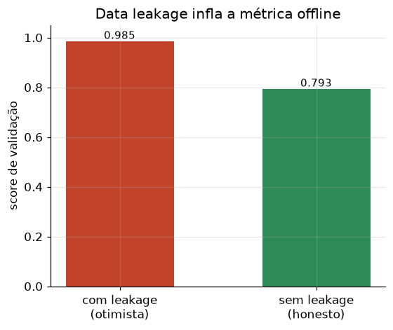

# Lição 020 — Data leakage (vazamento de dados)

> **Módulo:** M01 — Fundamentos de ML · **Ordem de estudo:** 20 · **Tempo:** ~50 min
> **Pré-requisitos:** [017] Overfitting e validação cruzada
> **Classificação:** complemento de aprofundamento à ementa

## Seção_Teórica

### Motivação

Seu modelo atingiu 99,8% de acurácia na validação. Comemore? **Desconfie.** Resultados
"bons demais para ser verdade" quase sempre indicam **data leakage**: informação que
**não estará disponível no momento da predição real** vazou para o treino. O modelo
não aprendeu o problema — aprendeu a trapacear. Em produção, o desempenho desaba.

Data leakage é um dos erros mais traiçoeiros de ML porque passa despercebido por todas
as métricas offline (que também estão contaminadas) e é um tópico clássico de
entrevista. Reconhecer suas três formas principais é uma habilidade defensiva
essencial.

### Princípio de funcionamento

Leakage ocorre quando o pipeline de treino usa informação que um sistema real não
teria ao prever. As três formas mais comuns:

- **Target leakage:** uma feature é (parcial ou totalmente) derivada do próprio rótulo,
  ou só existe **depois** de o desfecho ocorrer. Ex.: usar "valor pago do sinistro" para
  prever "houve sinistro". O modelo fica perfeito offline e inútil online.
- **Vazamento de pré-processamento:** calcular estatísticas (média/desvio para
  padronização, vocabulário, seleção de features) usando **todos** os dados antes de
  separar treino/teste. As estatísticas do teste "vazam" para o treino, inflando a
  métrica. O correto é **ajustar tudo apenas no treino** e aplicar ao teste.
- **Vazamento temporal:** em dados com ordem temporal, embaralhar e dividir
  aleatoriamente coloca **o futuro no treino**. O correto é o **split temporal**:
  treinar no passado e validar no futuro, imitando produção.

A defesa geral: **separe treino/teste primeiro** e trate o conjunto de teste como se
não existisse durante todo o desenvolvimento (incluindo pré-processamento e seleção de
features). Para séries temporais, respeite o tempo.



*O pipeline com vazamento exibe um score otimista; a avaliação correta (sem leakage) revela o desempenho real, sempre mais modesto.*

---

### Conceito central 1 — Target leakage

A forma mais grave: uma feature que codifica o rótulo. O sintoma é uma performance
quase perfeita com uma única feature suspeita. A pergunta-chave é: **essa informação
estará disponível no instante da predição?** Se não, é leakage.

#### Exemplo_Resolvido 1.1

```python
import numpy as np
# Target leakage: uma feature derivada do proprio rotulo infla a performance.
rng = np.random.default_rng(0)
N = 400
y = (rng.uniform(0, 1, size=N) < 0.5).astype(int)

# feature legitima: pouco informativa (ruido com leve sinal)
x_legit = 0.3 * (2 * y - 1) + rng.normal(0, 1.0, size=N)
# feature COM VAZAMENTO: calculada a partir do rotulo (nao existiria na inferencia)
x_leaky = (2 * y - 1) + rng.normal(0, 0.05, size=N)

def acuracia_threshold(x, y):
    # classificador trivial: prediz 1 se x >= 0
    pred = (x >= 0).astype(int)
    return float((pred == y).mean())

print(f"acuracia so com feature legitima: {acuracia_threshold(x_legit, y):.3f}")
print(f"acuracia com feature vazada:      {acuracia_threshold(x_leaky, y):.3f}")
print("performance boa demais (suspeita de leakage):", acuracia_threshold(x_leaky, y) > 0.95)
```

**Explicação passo a passo:**
- **Bloco 1 (setup):** rótulos binários equilibrados.
- **Bloco 2 (features):** `x_legit` tem só um leve sinal; `x_leaky` é praticamente o rótulo com um respingo de ruído.
- **Bloco 3 (`acuracia_threshold`):** um classificador trivial por limiar.
- **Bloco 4 (`print`):** a feature legítima dá `0.620`; a vazada dá `1.000` — o "modelo perfeito" só está lendo o rótulo disfarçado. Performance perfeita demais é red flag de leakage.

**Saída esperada:**
```
acuracia so com feature legitima: 0.620
acuracia com feature vazada:      1.000
performance boa demais (suspeita de leakage): True
```

---

### Conceito central 2 — Vazamento de pré-processamento

Um leakage sutil e comuníssimo: padronizar, normalizar ou selecionar features usando o
dataset inteiro **antes** do split. As estatísticas do teste contaminam o treino. A
correção é simples: ajuste o pré-processamento **só no treino**.

#### Exemplo_Resolvido 2.1

```python
import numpy as np
# Leakage de pre-processamento: padronizar ANTES de separar treino/teste usa
# estatisticas do teste (vazamento). O correto e ajustar o scaler so no treino.
rng = np.random.default_rng(1)
dados = rng.normal(50, 10, size=20)
treino, teste = dados[:15], dados[15:]

# ERRADO: media/desvio calculados sobre TODOS os dados (inclui teste)
mu_todos, sd_todos = dados.mean(), dados.std()
teste_errado = (teste - mu_todos) / sd_todos

# CORRETO: estatisticas apenas do treino, aplicadas ao teste
mu_tr, sd_tr = treino.mean(), treino.std()
teste_certo = (teste - mu_tr) / sd_tr

print(f"media usada (errado): {mu_todos:.4f}")
print(f"media usada (certo):  {mu_tr:.4f}")
print(f"teste[0] padronizado errado: {teste_errado[0]:.4f}")
print(f"teste[0] padronizado certo:  {teste_certo[0]:.4f}")
print("as estatisticas diferem:", abs(mu_todos - mu_tr) > 1e-9)
```

**Explicação passo a passo:**
- **Bloco 1 (dados):** 20 amostras divididas em treino e teste.
- **Bloco 2 (errado):** a média/desvio incluem o teste — o teste "se viu" na padronização.
- **Bloco 3 (certo):** as estatísticas vêm só do treino, como em produção.
- **Bloco 4 (`print`):** as médias diferem (`50.37` vs `50.96`) e o valor padronizado muda — prova de que o teste influenciou o pré-processamento na versão errada.

**Saída esperada:**
```
media usada (errado): 50.3749
media usada (certo):  50.9618
teste[0] padronizado errado: 0.9726
teste[0] padronizado certo:  0.8356
as estatisticas diferem: True
```

---

### Conceito central 3 — Vazamento temporal

Em dados temporais, embaralhar antes de dividir deixa o modelo "ver o futuro". O split
correto respeita o tempo. Sob mudanças de regime, o split temporal honesto revela um
erro bem maior — exatamente o que o sistema enfrentará em produção.

#### Exemplo_Resolvido 3.1

```python
import numpy as np
# Leakage temporal: numa serie com MUDANCA DE REGIME, o split aleatorio mistura
# passado e futuro (vaza) e parece otimo; o split temporal treina so no passado
# e precisa extrapolar o regime novo -> erro maior e honesto.
rng = np.random.default_rng(2)
T = 200
t = np.arange(T)
# regime 1 (inclinacao suave) ate t=100; regime 2 (inclinacao forte) depois.
serie = np.where(t < 100, 0.2 * t, 0.2 * 100 + 1.2 * (t - 100))
serie = serie + rng.normal(0, 3, size=T)

def ajustar_e_avaliar(idx_treino, idx_teste):
    coef = np.polyfit(t[idx_treino], serie[idx_treino], 1)
    pred = np.polyval(coef, t[idx_teste])
    return float(np.mean((pred - serie[idx_teste]) ** 2))

perm = rng.permutation(T)
erro_aleatorio = ajustar_e_avaliar(perm[:150], perm[150:])
erro_temporal = ajustar_e_avaliar(np.arange(150), np.arange(150, T))

print(f"erro com split aleatorio (otimista): {erro_aleatorio:.2f}")
print(f"erro com split temporal (honesto):   {erro_temporal:.2f}")
print("split temporal e mais conservador:", erro_temporal > erro_aleatorio)
```

**Explicação passo a passo:**
- **Bloco 1 (série):** uma série com **mudança de regime** na metade (a inclinação muda de 0.2 para 1.2).
- **Bloco 2 (`ajustar_e_avaliar`):** ajusta uma reta no treino e mede o MSE no teste.
- **Bloco 3 (splits):** o split aleatório mistura os dois regimes no treino (vê o futuro); o temporal treina só no regime antigo.
- **Bloco 4 (`print`):** o erro temporal (`1774.94`) é muito maior que o aleatório (`228.62`) — o split aleatório esconde a dificuldade real de extrapolar o regime novo. Só o split temporal diz a verdade.

**Saída esperada:**
```
erro com split aleatorio (otimista): 228.62
erro com split temporal (honesto):   1774.94
split temporal e mais conservador: True
```

## Seção_Prática

> **Como reproduzir:** execute cada solução de referência com
> `python trilha/solucoes/020-data-leakage/solucao_<n>.py` e compare a saída com o
> arquivo `.saida.txt` correspondente. Os esqueletos ficam em
> `trilha/pratica/020-data-leakage/exercicio_<n>.py`.

### Exercício 1 — Detectar target leakage
- **Entrada inicial / setup:** `np.random.default_rng(10)`, `N=500`, `y ~ Bernoulli(0.5)`, `x_legit = 0.4(2y-1)+N(0,1)`, `x_leaky = (2y-1)+N(0,0.03)`.
- **Passos de execução:** implemente `acuracia_threshold` (prediz 1 se x≥0), compare as duas features e imprima as acurácias (3 casas) e `suspeita de leakage: <bool>` (acc_leaky>0.95 e diferença>0.2).
- **Critério de conclusão (binário):** a saída é **idêntica** a `solucao_1.saida.txt` (feature vazada com acurácia `1.000`), terminando com `suspeita de leakage: True`; qualquer divergência reprova.
- **Solução de referência:** `trilha/solucoes/020-data-leakage/solucao_1.py`
- **Saída esperada:** `trilha/solucoes/020-data-leakage/solucao_1.saida.txt`

### Exercício 2 — Vazamento de pré-processamento
- **Entrada inicial / setup:** `np.random.default_rng(3)`, `dados = N(100, 20)` com 25 amostras, `treino = dados[:18]`, `teste = dados[18:]`.
- **Passos de execução:** padronize o teste com estatísticas de todos os dados (errado) e só do treino (certo); imprima as duas médias usadas, os dois valores de `teste[0]` (4 casas) e `houve vazamento nas estatisticas: <bool>`.
- **Critério de conclusão (binário):** a saída é **idêntica** a `solucao_2.saida.txt`, terminando com `houve vazamento nas estatisticas: True`; caso contrário, reprovado.
- **Solução de referência:** `trilha/solucoes/020-data-leakage/solucao_2.py`
- **Saída esperada:** `trilha/solucoes/020-data-leakage/solucao_2.saida.txt`

### Exercício 3 — Split temporal vs. aleatório
- **Entrada inicial / setup:** `np.random.default_rng(8)`, `T=220`, série com mudança de regime em `t=110` (slopes 0.15 e 1.4) + `N(0,3)`.
- **Passos de execução:** ajuste uma reta e compare o MSE de um split aleatório (`perm[:165]`/`perm[165:]`) com o de um split temporal (`arange(165)`/`arange(165, T)`); imprima os dois erros (2 casas) e `split temporal e mais conservador: <bool>`.
- **Critério de conclusão (binário):** a saída é **idêntica** a `solucao_3.saida.txt`, terminando com `split temporal e mais conservador: True`; qualquer divergência reprova.
- **Solução de referência:** `trilha/solucoes/020-data-leakage/solucao_3.py`
- **Saída esperada:** `trilha/solucoes/020-data-leakage/solucao_3.saida.txt`
