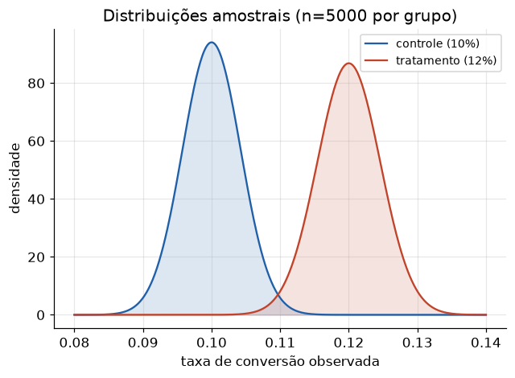

# Lição 021 — Metodologia de experimentação e testes A/B

> **Módulo:** M01 — Fundamentos de ML · **Ordem de estudo:** 21 · **Tempo:** ~55 min
> **Pré-requisitos:** [009] Estatística descritiva e inferência · [017] Overfitting e validação cruzada
> **Classificação:** complemento de aprofundamento à ementa

## Seção_Teórica

### Motivação

Você lançou um novo modelo de recomendação. Ele é **realmente** melhor que o anterior,
ou a melhora que você viu foi sorte? A única forma confiável de responder é o
**experimento controlado** — o **teste A/B**. Dividir usuários aleatoriamente entre o
sistema atual (controle) e o novo (tratamento) e medir a diferença com **rigor
estatístico** é como empresas de tecnologia decidem o que vai para produção.

Para o engenheiro de IA, isso é central: avaliar um sistema LLM, comparar dois prompts,
medir o impacto de um re-ranker em RAG — tudo passa por experimentação. E o terreno é
cheido de armadilhas (parar o teste cedo, comparar muitas métricas) que produzem
conclusões falsas. Esta lição dá o método e os alertas.

### Princípio de funcionamento

Um teste A/B compara duas variantes:

1. **Randomização:** cada unidade (usuário, sessão) é designada **ao acaso** para
   controle ou tratamento. Isso equilibra fatores de confusão e torna a diferença
   atribuível à variante.
2. **Métrica e hipótese:** define-se uma métrica (ex.: taxa de conversão) e a hipótese
   nula $H_0$ (as taxas são iguais) contra a alternativa.
3. **Teste de significância:** mede-se a probabilidade (**p-valor**) de observar uma
   diferença ao menos tão grande quanto a vista **se $H_0$ fosse verdadeira**. Para
   duas proporções, usa-se o **teste z** com a proporção combinada (*pooled*):

$$ z = \frac{\hat{p}_T - \hat{p}_C}{\sqrt{\hat{p}(1-\hat{p})\left(\tfrac{1}{n_C} + \tfrac{1}{n_T}\right)}}, \qquad \hat{p} = \frac{x_C + x_T}{n_C + n_T}. $$

  Se o p-valor $< \alpha$ (tipicamente 0.05), rejeitamos $H_0$ — a diferença é
  **estatisticamente significativa**.

Duas verdades incômodas governam a prática: (a) **tamanho de amostra importa** — a mesma
diferença real só é detectável com $n$ suficiente (poder estatístico); (b) **peeking**
(checar a significância repetidamente e parar no primeiro resultado bom) **infla a taxa
de falso-positivo** muito acima de $\alpha$. O experimento honesto fixa $n$ de antemão e
decide só no fim (ou usa métodos sequenciais apropriados).



*A separação entre as distribuições amostrais de controle e tratamento determina o p-valor; com mais dados, as distribuições ficam mais estreitas e a diferença, mais fácil de detectar.*

---

### Conceito central 1 — Desenho de experimento

O alicerce é a **randomização**. Simulamos um teste A/B com taxas reais conhecidas para
ver a mecânica: cada grupo recebe usuários ao acaso, medimos a conversão observada e o
**lift** (ganho relativo) do tratamento sobre o controle.

#### Exemplo_Resolvido 1.1

```python
import numpy as np
# Desenho de um teste A/B: grupo de controle vs tratamento, randomizados.
rng = np.random.default_rng(0)
n_por_grupo = 5000
p_controle_real = 0.10      # taxa de conversao verdadeira (controle)
p_tratamento_real = 0.12    # tratamento melhora de fato

# simula conversoes (0/1) em cada grupo
conv_controle = (rng.uniform(0, 1, size=n_por_grupo) < p_controle_real).astype(int)
conv_tratamento = (rng.uniform(0, 1, size=n_por_grupo) < p_tratamento_real).astype(int)

taxa_c = conv_controle.mean()
taxa_t = conv_tratamento.mean()
lift_relativo = (taxa_t - taxa_c) / taxa_c
print(f"conversao controle:   {taxa_c:.4f}")
print(f"conversao tratamento: {taxa_t:.4f}")
print(f"lift absoluto: {taxa_t - taxa_c:.4f}")
print(f"lift relativo: {lift_relativo:.4f}")
```

**Explicação passo a passo:**
- **Bloco 1 (setup):** taxas verdadeiras de 10% (controle) e 12% (tratamento).
- **Bloco 2 (simulação):** sorteia conversões 0/1 por grupo, imitando usuários reais.
- **Bloco 3 (`print`):** as taxas observadas (`0.1054` e `0.1200`) não são exatamente as reais por causa do ruído amostral; o lift relativo observado é `13.85%`. A pergunta seguinte: essa diferença é significativa?

**Saída esperada:**
```
conversao controle:   0.1054
conversao tratamento: 0.1200
lift absoluto: 0.0146
lift relativo: 0.1385
```

---

### Conceito central 2 — Teste de hipótese A/B

Para decidir se a diferença é real ou ruído, calculamos o **p-valor** com o teste z de
duas proporções. Um p-valor pequeno significa que seria muito improvável ver essa
diferença por acaso se as taxas fossem de fato iguais.

#### Exemplo_Resolvido 2.1

```python
import math
# Teste de hipotese para duas proporcoes (z-test) do zero.
# H0: as taxas de conversao sao iguais. Decisao por p-valor (alfa=0.05).
def phi(z):
    # CDF da normal padrao via funcao erro
    return 0.5 * (1 + math.erf(z / math.sqrt(2)))

def z_test_proporcoes(x1, n1, x2, n2):
    p1, p2 = x1 / n1, x2 / n2
    p_pool = (x1 + x2) / (n1 + n2)
    se = math.sqrt(p_pool * (1 - p_pool) * (1 / n1 + 1 / n2))
    z = (p2 - p1) / se
    p_valor = 2 * (1 - phi(abs(z)))   # bicaudal
    return z, p_valor

# controle: 500/5000 = 10%; tratamento: 600/5000 = 12%
z, p = z_test_proporcoes(500, 5000, 600, 5000)
print(f"z = {z:.4f}")
print(f"p-valor = {p:.4f}")
print(f"significativo (alfa=0.05): {p < 0.05}")
```

**Explicação passo a passo:**
- **Bloco 1 (`phi`):** a CDF da normal padrão, calculada a partir da função erro.
- **Bloco 2 (`z_test_proporcoes`):** computa o z com erro-padrão combinado e o p-valor bicaudal.
- **Bloco 3 (`print`):** com 10% vs 12% em 5000 por grupo, `z=3.196` e `p-valor=0.0014` — bem abaixo de 0.05. A diferença é estatisticamente significativa: rejeitamos $H_0$.

**Saída esperada:**
```
z = 3.1960
p-valor = 0.0014
significativo (alfa=0.05): True
```

---

### Conceito central 3 — Peeking e tamanho de amostra

A armadilha mais comum é o **peeking**: monitorar o p-valor continuamente e parar
assim que dá significativo. Como o p-valor flutua, cedo ou tarde ele cruza 0.05 por
acaso — mesmo sem efeito real. Demonstramos isso com testes **A/A** (sem diferença
real): o peeking dispara falso-positivos muito acima do $\alpha$ nominal.

#### Exemplo_Resolvido 3.1

```python
import math
import numpy as np
# Peeking (espiar): checar significancia repetidas vezes infla o falso positivo.
# Simulamos testes A/A (SEM diferenca real) e medimos quantas vezes "deu
# significativo" quando paramos no primeiro p<0.05 vs olhando so no fim.
rng = np.random.default_rng(1)

def phi(z):
    return 0.5 * (1 + math.erf(z / math.sqrt(2)))

def z_test(x1, n1, x2, n2):
    if n1 == 0 or n2 == 0:
        return 1.0
    p1, p2 = x1 / n1, x2 / n2
    p_pool = (x1 + x2) / (n1 + n2)
    if p_pool in (0.0, 1.0):
        return 1.0
    se = math.sqrt(p_pool * (1 - p_pool) * (1 / n1 + 1 / n2))
    if se == 0:
        return 1.0
    z = (p2 - p1) / se
    return 2 * (1 - phi(abs(z)))

p_real = 0.10           # MESMA taxa nos dois grupos (A/A): nao ha efeito real
n_experimentos = 1000
n_max = 2000
checkpoints = range(200, n_max + 1, 200)

falso_pos_peeking = 0
falso_pos_final = 0
for _ in range(n_experimentos):
    a = (rng.uniform(0, 1, size=n_max) < p_real).astype(int)
    b = (rng.uniform(0, 1, size=n_max) < p_real).astype(int)
    significou_no_caminho = False
    for n in checkpoints:
        if z_test(a[:n].sum(), n, b[:n].sum(), n) < 0.05:
            significou_no_caminho = True
            break
    if significou_no_caminho:
        falso_pos_peeking += 1
    if z_test(a.sum(), n_max, b.sum(), n_max) < 0.05:
        falso_pos_final += 1

print(f"falso-positivo so no fim:   {falso_pos_final / n_experimentos:.3f}")
print(f"falso-positivo com peeking: {falso_pos_peeking / n_experimentos:.3f}")
print("peeking infla o falso-positivo:",
      falso_pos_peeking / n_experimentos > falso_pos_final / n_experimentos)
```

**Explicação passo a passo:**
- **Bloco 1 (`phi`/`z_test`):** o mesmo teste z, protegido contra divisões por zero.
- **Bloco 2 (setup A/A):** os dois grupos têm a **mesma** taxa real — qualquer "significância" é falso-positivo.
- **Bloco 3 (laço):** para cada um dos 1000 experimentos, checamos significância em vários checkpoints (peeking) e também só no fim.
- **Bloco 4 (`print`):** decidir só no fim mantém o falso-positivo perto de `0.05` (`0.048`); o peeking o infla para `0.198` — quase 4× o nominal. Por isso não se espia o p-valor.

**Saída esperada:**
```
falso-positivo so no fim:   0.048
falso-positivo com peeking: 0.198
peeking infla o falso-positivo: True
```

## Seção_Prática

> **Como reproduzir:** execute cada solução de referência com
> `python trilha/solucoes/021-experimentacao-testes-ab/solucao_<n>.py` e compare a saída
> com o arquivo `.saida.txt` correspondente. Os esqueletos ficam em
> `trilha/pratica/021-experimentacao-testes-ab/exercicio_<n>.py`.

### Exercício 1 — Simular um teste A/B
- **Entrada inicial / setup:** `np.random.default_rng(7)`, `n=8000` por grupo, `p_controle=0.20`, `p_tratamento=0.23`.
- **Passos de execução:** simule conversões, calcule as taxas e o lift (absoluto e relativo); imprima as quatro linhas (4 casas) e `tratamento parece melhor: <bool>`.
- **Critério de conclusão (binário):** a saída é **idêntica** a `solucao_1.saida.txt`, terminando com `tratamento parece melhor: True`; qualquer divergência reprova.
- **Solução de referência:** `trilha/solucoes/021-experimentacao-testes-ab/solucao_1.py`
- **Saída esperada:** `trilha/solucoes/021-experimentacao-testes-ab/solucao_1.saida.txt`

### Exercício 2 — Teste z e efeito do tamanho de amostra
- **Entrada inicial / setup:** amostra pequena `33/300 vs 39/300` e grande `660/6000 vs 780/6000` (mesma proporção relativa).
- **Passos de execução:** implemente `phi` e `z_test_proporcoes`; imprima `z`, `p` e `significativo` (4 casas) para cada caso e a linha `mais dados detectam o mesmo efeito: <bool>`.
- **Critério de conclusão (binário):** a saída é **idêntica** a `solucao_2.saida.txt` (pequena não significativa, grande significativa); caso contrário, reprovado.
- **Solução de referência:** `trilha/solucoes/021-experimentacao-testes-ab/solucao_2.py`
- **Saída esperada:** `trilha/solucoes/021-experimentacao-testes-ab/solucao_2.saida.txt`

### Exercício 3 — Demonstrar o efeito do peeking
- **Entrada inicial / setup:** `np.random.default_rng(4)`, 1000 testes A/A com `p_real=0.15`, `n_max=2400`, checkpoints `range(300, n_max+1, 300)`.
- **Passos de execução:** conte falso-positivos com peeking (qualquer checkpoint com p<0.05) e só no fim; imprima as duas taxas (3 casas) e `peeking infla o falso-positivo: <bool>`.
- **Critério de conclusão (binário):** a saída é **idêntica** a `solucao_3.saida.txt`, terminando com `peeking infla o falso-positivo: True`; qualquer divergência reprova.
- **Solução de referência:** `trilha/solucoes/021-experimentacao-testes-ab/solucao_3.py`
- **Saída esperada:** `trilha/solucoes/021-experimentacao-testes-ab/solucao_3.saida.txt`
