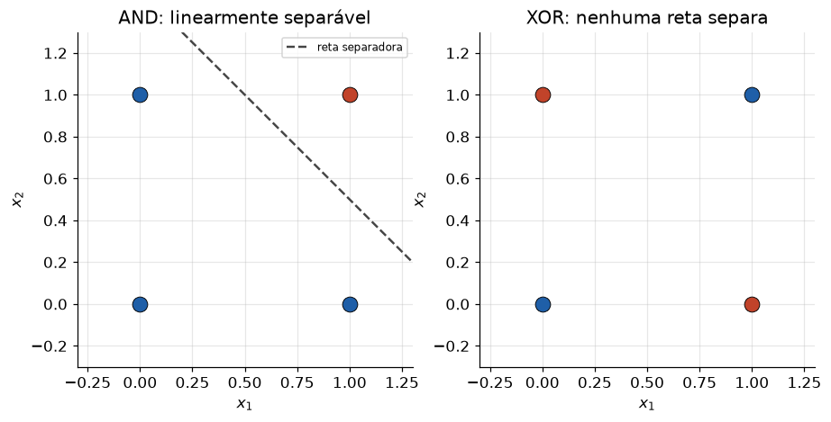

# Lição 022 — Perceptron e o neurônio artificial

> **Módulo:** M02 — Redes Neurais e Deep Learning · **Ordem de estudo:** 22 · **Tempo:** ~50 min
> **Pré-requisitos:** [014] Backpropagation
> **Classificação:** complemento de aprofundamento à ementa

> **Convenção de formatação:** matemática em LaTeX (`$...$` inline, `$$...$$` em
> destaque); figuras reprodutíveis geradas por `tools/figuras/gerar_figuras_m02.py`
> e incorporadas por caminho relativo `assets/<NNN>-<slug>/<nome>.png`; blocos
> ```python só para código e saída.

## Seção_Teórica

### Motivação

Toda rede neural, por mais profunda que seja, é feita de uma única peça repetida
milhões de vezes: o **neurônio artificial**. Antes de empilhar camadas (Lição 024)
ou treinar redes profundas (Lição 025), precisamos entender essa peça isolada — o
**perceptron**, proposto por Rosenblatt em 1958. Ele é o "átomo" do deep learning:
recebe entradas, pondera cada uma, soma, e decide uma saída.

Estudar o perceptron rende três coisas que carregamos para o resto do módulo: a
**forma do cálculo** de um neurônio ($w\cdot x + b$ seguido de ativação), uma
**regra de aprendizado** simples que ajusta pesos a partir de erros, e a **primeira
limitação fundamental** — a incapacidade de resolver o XOR — que foi exatamente o
que motivou as redes de múltiplas camadas.

### Princípio de funcionamento

Um neurônio recebe um vetor de entradas $x \in \mathbb{R}^n$, associa a cada
entrada um **peso** $w_i$, soma tudo com um **viés** $b$ e aplica uma **função de
ativação** $\phi$:

$$ \hat{y} = \phi\!\left(\sum_{i=1}^{n} w_i x_i + b\right) = \phi(w \cdot x + b). $$

No perceptron clássico, $\phi$ é a **função degrau**: $\phi(z) = 1$ se $z \ge 0$ e
$0$ caso contrário. Geometricamente, $w\cdot x + b = 0$ define um **hiperplano** que
parte o espaço de entradas em dois; o neurônio responde $1$ de um lado e $0$ do
outro. Treinar é **mover esse hiperplano** até ele separar as duas classes.

A regra de aprendizado é local e intuitiva: para cada exemplo, se a predição estiver
certa, não faça nada; se estiver errada por $\text{erro} = y - \hat{y}$, empurre os
pesos na direção da entrada:

$$ w \leftarrow w + \eta\,(y - \hat{y})\,x, \qquad b \leftarrow b + \eta\,(y - \hat{y}). $$


*Figura 1 — Um perceptron traça uma única reta. Para a porta AND existe reta que separa as classes; para o XOR, nenhuma reta separa, e por isso o perceptron falha.*

---

### Conceito central 1 — O neurônio artificial

A unidade de cálculo é a combinação linear $z = w\cdot x + b$ seguida da ativação.
Escolhendo os pesos à mão dá para implementar funções lógicas: com $w = (1, 1)$ e
$b = -1.5$, a soma só ultrapassa o limiar quando **ambas** as entradas valem 1 — ou
seja, a porta **AND**.

#### Exemplo_Resolvido 1.1

```python
import numpy as np

# O neuronio artificial: soma ponderada das entradas + vies, seguida da
# funcao de ativacao degrau. Pesos escolhidos a mao implementam a porta AND.
def degrau(z):
    return np.where(z >= 0.0, 1, 0)

w = np.array([1.0, 1.0])   # um peso por entrada
b = -1.5                   # vies (limiar deslocado)
X = np.array([[0, 0], [0, 1], [1, 0], [1, 1]], dtype=float)

z = X @ w + b              # combinacao linear: w . x + b
y = degrau(z)              # ativacao degrau -> {0, 1}
for entrada, zi, yi in zip(X, z, y):
    print(f"x={entrada.astype(int)} z={zi:+.1f} saida={yi}")
```

**Explicação passo a passo:**
- **Bloco 1 (`degrau`):** a ativação que devolve 1 quando $z \ge 0$ e 0 caso contrário.
- **Bloco 2 (`w`, `b`, `X`):** pesos e viés que codificam a AND e as quatro entradas binárias possíveis.
- **Bloco 3 (`z`, `y`):** `X @ w + b` calcula $w\cdot x + b$ para as quatro linhas de uma vez; o degrau converte em saída binária.
- **Bloco 4 (laço):** só a entrada $(1,1)$ atinge $z = +0.5 \ge 0$, produzindo saída 1 — exatamente a tabela-verdade da AND.

**Saída esperada:**
```
x=[0 0] z=-1.5 saida=0
x=[0 1] z=-0.5 saida=0
x=[1 0] z=-0.5 saida=0
x=[1 1] z=+0.5 saida=1
```

---

### Conceito central 2 — Regra de aprendizado do perceptron

Em vez de escolher os pesos à mão, deixamos o perceptron **aprendê-los** dos dados.
A regra percorre os exemplos; a cada erro, soma $\eta\,(y-\hat{y})\,x$ aos pesos. O
**teorema da convergência do perceptron** garante: se as classes forem linearmente
separáveis, a regra encontra um separador em um número finito de passos.

#### Exemplo_Resolvido 2.1

```python
import numpy as np

# Regra de aprendizado do perceptron: ajusta pesos quando erra um exemplo.
def degrau(z):
    return 1 if z >= 0.0 else 0

X = np.array([[0, 0], [0, 1], [1, 0], [1, 1]], dtype=float)
y = np.array([0, 0, 0, 1])          # porta AND (linearmente separavel)

w = np.zeros(2)
b = 0.0
eta = 1.0
for epoca in range(10):
    erros = 0
    for xi, alvo in zip(X, y):
        pred = degrau(np.dot(w, xi) + b)
        erro = alvo - pred
        if erro != 0:               # so atualiza quando classifica errado
            w = w + eta * erro * xi
            b = b + eta * erro
            erros += 1
    if erros == 0:                  # uma epoca sem erros => convergiu
        print(f"convergiu na epoca {epoca}")
        break

preds = [degrau(np.dot(w, xi) + b) for xi in X]
print(f"w={w} b={b}")
print(f"predicoes={preds} alvo={[int(v) for v in y]}")
```

**Explicação passo a passo:**
- **Bloco 1 (`degrau`):** ativação degrau aplicada a um escalar.
- **Bloco 2 (`X`, `y`):** dados da porta AND, que é linearmente separável.
- **Bloco 3 (laço de épocas):** percorre os exemplos; ao errar, aplica $w \leftarrow w + \eta(y-\hat{y})x$ e conta os erros da época.
- **Bloco 4 (`break` + `print`):** uma época sem nenhum erro indica convergência (época 5); os pesos finais classificam os quatro exemplos corretamente.

**Saída esperada:**
```
convergiu na epoca 5
w=[2. 1.] b=-3.0
predicoes=[0, 0, 0, 1] alvo=[0, 0, 0, 1]
```

---

### Conceito central 3 — Separabilidade linear (o limite do XOR)

O perceptron só desenha **uma reta**. Funções cujas classes não podem ser separadas
por uma reta — como o **XOR**, em que $(0,0)$ e $(1,1)$ são uma classe e $(0,1)$,
$(1,0)$ a outra — estão fora do seu alcance. Por mais que treinemos, ele nunca
classifica os quatro pontos do XOR corretamente. Essa limitação, apontada por Minsky
e Papert em 1969, é a razão de existirem **camadas ocultas** (Lição 024).

#### Exemplo_Resolvido 3.1

```python
import numpy as np

# Limitacao do perceptron: XOR nao e linearmente separavel.
def degrau(z):
    return 1 if z >= 0.0 else 0

X = np.array([[0, 0], [0, 1], [1, 0], [1, 1]], dtype=float)
y = np.array([0, 1, 1, 0])          # XOR

w = np.zeros(2)
b = 0.0
eta = 1.0
convergiu = False
for epoca in range(100):
    erros = 0
    for xi, alvo in zip(X, y):
        pred = degrau(np.dot(w, xi) + b)
        erro = alvo - pred
        if erro != 0:
            w = w + eta * erro * xi
            b = b + eta * erro
            erros += 1
    if erros == 0:
        convergiu = True
        break

preds = [degrau(np.dot(w, xi) + b) for xi in X]
acertos = sum(int(p == t) for p, t in zip(preds, y))
print(f"convergiu apos 100 epocas: {convergiu}")
print(f"acertos={acertos}/4 (um perceptron nunca acerta os 4 no XOR)")
```

**Explicação passo a passo:**
- **Bloco 1 (`degrau`):** mesma ativação dos exemplos anteriores.
- **Bloco 2 (`X`, `y`):** agora `y` é o XOR, que **não** é linearmente separável.
- **Bloco 3 (laço):** mesmo treino do exemplo 2.1, rodado por até 100 épocas.
- **Bloco 4 (`print`):** o laço nunca fecha uma época sem erros (`convergiu=False`) e a contagem de acertos fica abaixo de 4 — evidência empírica do limite teórico.

**Saída esperada:**
```
convergiu apos 100 epocas: False
acertos=2/4 (um perceptron nunca acerta os 4 no XOR)
```

## Seção_Prática

> **Como reproduzir:** execute cada solução de referência com
> `python trilha/solucoes/022-perceptron/solucao_<n>.py` e compare a saída com o
> arquivo `.saida.txt` correspondente. Os esqueletos ficam em
> `trilha/pratica/022-perceptron/exercicio_<n>.py`.

### Exercício 1 — Treinar um perceptron para a porta OR
- **Entrada inicial / setup:** `X = [[0,0],[0,1],[1,0],[1,1]]`, `y = [0,1,1,1]` (OR), `w = zeros(2)`, `b = 0.0`, `eta = 1.0`.
- **Passos de execução:** aplique a regra de aprendizado por até 20 épocas, parando quando uma época inteira passar sem erros; imprima a época de convergência, `w`, `b`, as predições, o alvo e se todos foram classificados corretamente.
- **Critério de conclusão (binário):** a saída é **idêntica** a `solucao_1.saida.txt`, terminando com `todos corretos: True`; qualquer divergência reprova.
- **Solução de referência:** `trilha/solucoes/022-perceptron/solucao_1.py`
- **Saída esperada:** `trilha/solucoes/022-perceptron/solucao_1.saida.txt`

### Exercício 2 — Projetar a mão a porta NOT
- **Entrada inicial / setup:** perceptron de uma entrada com `w = -1.0` e `b = 0.5`; ativação degrau.
- **Passos de execução:** para `x` em `{0, 1}`, calcule `z = w*x + b` e a saída; imprima por linha `x=... z=... NOT=...` (z com sinal e 1 casa decimal).
- **Critério de conclusão (binário):** a saída é **idêntica** a `solucao_2.saida.txt` (em particular `NOT=1` para `x=0` e `NOT=0` para `x=1`); caso contrário, reprovado.
- **Solução de referência:** `trilha/solucoes/022-perceptron/solucao_2.py`
- **Saída esperada:** `trilha/solucoes/022-perceptron/solucao_2.saida.txt`

### Exercício 3 — Confirmar o limite do XOR
- **Entrada inicial / setup:** `X` das quatro entradas binárias, `y = [0,1,1,0]` (XOR), `w = zeros(2)`, `b = 0.0`, `eta = 1.0`.
- **Passos de execução:** treine por 100 épocas e, a cada época, calcule a acurácia (acertos em 4); guarde a **melhor** acurácia observada; imprima-a e se o perceptron resolveu o XOR (melhor == 4).
- **Critério de conclusão (binário):** a saída é **idêntica** a `solucao_3.saida.txt`, terminando com `resolveu o XOR (4/4): False`; qualquer divergência reprova.
- **Solução de referência:** `trilha/solucoes/022-perceptron/solucao_3.py`
- **Saída esperada:** `trilha/solucoes/022-perceptron/solucao_3.saida.txt`
