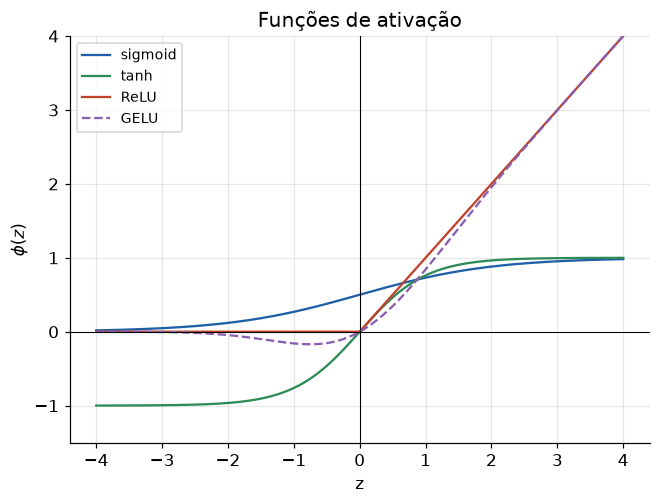

# Lição 023 — Funções de ativação (sigmoid, tanh, ReLU, GELU)

> **Módulo:** M02 — Redes Neurais e Deep Learning · **Ordem de estudo:** 23 · **Tempo:** ~50 min
> **Pré-requisitos:** [022] Perceptron e o neurônio artificial
> **Classificação:** complemento de aprofundamento à ementa

> **Convenção de formatação:** matemática em LaTeX (`$...$` inline, `$$...$$` em
> destaque); figuras reprodutíveis geradas por `tools/figuras/gerar_figuras_m02.py`
> e incorporadas por caminho relativo `assets/<NNN>-<slug>/<nome>.png`; blocos
> ```python só para código e saída.

## Seção_Teórica

### Motivação

Empilhar neurônios lineares não adianta: a composição de transformações lineares
**continua linear**. Se cada camada faz apenas $W x + b$, uma rede de 100 camadas
equivale a uma única camada linear e não consegue aprender o XOR (Lição 022) nem
nada curvo. A **função de ativação não linear** entre as camadas é o ingrediente que
dá à rede o poder de aproximar funções arbitrárias.

A escolha da ativação afeta diretamente o **treino**: ativações que **saturam**
(sigmoid, tanh) matam o gradiente em regiões extremas e causam o vanishing gradient
(Lição 027); a **ReLU** destravou o treino de redes profundas; e a **GELU** é o
padrão nos Transformers modernos (Lição 039+). Entender o trade-off de cada uma é
pré-requisito para diagnosticar redes que não treinam.

### Princípio de funcionamento

Uma ativação $\phi$ é aplicada elemento a elemento à pré-ativação $z = Wx + b$. As
quatro mais importantes:

$$ \sigma(z) = \frac{1}{1 + e^{-z}}, \qquad \tanh(z) = \frac{e^{z}-e^{-z}}{e^{z}+e^{-z}}, $$

$$ \mathrm{ReLU}(z) = \max(0, z), \qquad \mathrm{GELU}(z) = z\,\Phi(z), $$

onde $\Phi$ é a função de distribuição acumulada da normal padrão. O que importa para
o treino é a **derivada**: a regra de atualização propaga gradientes multiplicando
pela $\phi'(z)$ local. A sigmoid tem $\sigma'(z) = \sigma(z)(1-\sigma(z))$, que vale
no máximo $0.25$ e **tende a zero** longe da origem — daí a saturação. A ReLU tem
derivada $1$ para $z>0$, então **não satura** na região ativa, mas tem derivada $0$
para $z<0$ (o "neurônio morto").


*Figura 1 — As quatro ativações. Sigmoid e tanh achatam nas pontas (saturam); ReLU é linear por partes; GELU é uma versão suave da ReLU.*

---

### Conceito central 1 — Ativações saturantes: sigmoid e tanh

A sigmoid mapeia qualquer real para $(0,1)$ e a tanh para $(-1,1)$. Ambas são suaves,
mas **saturam**: para $|z|$ grande, a saída encosta no teto/piso e a derivada vira
quase zero. Isso é cômodo para interpretar saídas como probabilidades, mas
problemático no meio de uma rede profunda.

#### Exemplo_Resolvido 1.1

```python
import numpy as np

# Ativacoes saturantes: sigmoid e tanh comprimem z para uma faixa limitada.
def sigmoid(z):
    return 1.0 / (1.0 + np.exp(-z))

zs = np.array([-4.0, -1.0, 0.0, 1.0, 4.0])
print("z      sigmoid   tanh")
for z in zs:
    print(f"{z:+.1f}    {sigmoid(z):.4f}   {np.tanh(z):+.4f}")

# Derivada da sigmoid: s*(1-s). Longe de zero ela ~0 -> gradiente "satura".
s = sigmoid(zs)
print("deriv sigmoid:", np.round(s * (1.0 - s), 4))
```

**Explicação passo a passo:**
- **Bloco 1 (`sigmoid`):** define $\sigma(z) = 1/(1+e^{-z})$.
- **Bloco 2 (laço):** tabula sigmoid e tanh em cinco valores; note como ambas saturam perto de 0 (sigmoid) ou $\pm 1$ (tanh) nos extremos $\pm 4$.
- **Bloco 3 (`deriv`):** a derivada $\sigma(z)(1-\sigma(z))$ vale $0.25$ em $z=0$ e cai para $\approx 0.018$ em $z=\pm 4$ — o gradiente quase some longe da origem.

**Saída esperada:**
```
z      sigmoid   tanh
-4.0    0.0180   -0.9993
-1.0    0.2689   -0.7616
+0.0    0.5000   +0.0000
+1.0    0.7311   +0.7616
+4.0    0.9820   +0.9993
deriv sigmoid: [0.0177 0.1966 0.25   0.1966 0.0177]
```

---

### Conceito central 2 — ReLU e variantes

A **ReLU** ($\max(0,z)$) é a ativação padrão de redes profundas: é baratíssima,
não satura para $z>0$ e induz **esparsidade** (muitos zeros). Seu calcanhar é o
**neurônio morto**: para $z<0$ a derivada é $0$, e um neurônio preso nessa região
para de aprender. A **Leaky ReLU** ($z$ se $z\ge0$, senão $a\,z$ com $a$ pequeno)
corrige isso deixando passar um gradiente pequeno.

#### Exemplo_Resolvido 2.1

```python
import numpy as np

# ReLU e Leaky ReLU: nao saturam para z > 0 e sao baratas de calcular.
def relu(z):
    return np.maximum(0.0, z)

def leaky_relu(z, a=0.01):
    return np.where(z >= 0.0, z, a * z)

z = np.array([-2.0, -0.5, 0.0, 0.5, 2.0])
print("relu: ", relu(z))
print("leaky:", leaky_relu(z))

# Derivada da ReLU: 1 se z > 0, senao 0 (gradiente passa intacto na regiao ativa).
print("deriv relu:", np.where(z > 0.0, 1.0, 0.0))

# Esparsidade: fracao de neuronios "desligados" (saida zero).
print(f"fracao desligada: {np.mean(relu(z) == 0.0):.2f}")
```

**Explicação passo a passo:**
- **Bloco 1 (`relu`/`leaky_relu`):** a ReLU zera os negativos; a Leaky deixa um rastro $0.01z$.
- **Bloco 2 (`print` relu/leaky):** compara as duas saídas — onde a ReLU dá 0, a Leaky dá um valor pequeno negativo.
- **Bloco 3 (`deriv relu`):** a derivada é exatamente $1$ na região ativa e $0$ caso contrário.
- **Bloco 4 (`fracao`):** três das cinco entradas viram zero (60%), ilustrando a esparsidade.

**Saída esperada:**
```
relu:  [0.  0.  0.  0.5 2. ]
leaky: [-0.02  -0.005  0.     0.5    2.   ]
deriv relu: [0. 0. 0. 1. 1.]
fracao desligada: 0.60
```

---

### Conceito central 3 — GELU: ativação suave

A **GELU** (Gaussian Error Linear Unit) é a ativação dos Transformers (BERT, GPT).
Ela pesa a entrada pela probabilidade de ela ser positiva: $\mathrm{GELU}(x) = x\,\Phi(x)$.
O resultado é uma curva **suave** que se parece com a ReLU para $x$ grande, mas
permite valores **levemente negativos** perto da origem — preservando um pouco de
gradiente onde a ReLU já zerou.

#### Exemplo_Resolvido 3.1

```python
import numpy as np
from math import erf, sqrt

# GELU: ativacao suave usada em Transformers. GELU(x) = x * Phi(x), onde Phi e
# a CDF da normal padrao. Ela "pesa" a entrada pela probabilidade de ser positiva.
def gelu(x):
    return x * 0.5 * (1.0 + erf(x / sqrt(2.0)))

def relu(x):
    return max(0.0, x)

xs = [-2.0, -0.5, 0.0, 0.5, 2.0]
print(" x     gelu      relu")
for x in xs:
    print(f"{x:+.1f}   {gelu(x):+.4f}   {relu(x):+.4f}")
```

**Explicação passo a passo:**
- **Bloco 1 (`gelu`):** usa a CDF da normal via `erf` para calcular $x\,\Phi(x)$ exatamente.
- **Bloco 2 (`relu`):** ReLU escalar para comparação.
- **Bloco 3 (laço):** para $x<0$ a GELU dá valores pequenos negativos (ex.: $-0.1543$ em $-0.5$), enquanto a ReLU dá $0$; para $x$ grande as duas quase coincidem.

**Saída esperada:**
```
 x     gelu      relu
-2.0   -0.0455   +0.0000
-0.5   -0.1543   +0.0000
+0.0   +0.0000   +0.0000
+0.5   +0.3457   +0.5000
+2.0   +1.9545   +2.0000
```

## Seção_Prática

> **Como reproduzir:** execute cada solução de referência com
> `python trilha/solucoes/023-funcoes-de-ativacao/solucao_<n>.py` e compare a saída
> com o arquivo `.saida.txt` correspondente. Os esqueletos ficam em
> `trilha/pratica/023-funcoes-de-ativacao/exercicio_<n>.py`.

### Exercício 1 — Derivada da tanh por gradient checking
- **Entrada inicial / setup:** ponto $z = 0.8$, passo $h = 10^{-5}$; derivada analítica $\tanh'(z) = 1 - \tanh^2(z)$.
- **Passos de execução:** calcule a derivada analítica e a numérica por diferenças centrais; imprima $\tanh(0.8)$, as duas derivadas (6 casas) e se a diferença absoluta é menor que $10^{-6}$.
- **Critério de conclusão (binário):** a saída é **idêntica** a `solucao_1.saida.txt`, terminando com `diferenca < 1e-6: True`; qualquer divergência reprova.
- **Solução de referência:** `trilha/solucoes/023-funcoes-de-ativacao/solucao_1.py`
- **Saída esperada:** `trilha/solucoes/023-funcoes-de-ativacao/solucao_1.saida.txt`

### Exercício 2 — Esparsidade da ReLU
- **Entrada inicial / setup:** vetor `z = [-3, -1, -0.2, 0, 0.7, 1.5, 4]`.
- **Passos de execução:** aplique a ReLU, conte neurônios ativos (saída > 0) e desligados (saída == 0) e calcule a ativação média; imprima entrada, saída, contagens e a média (4 casas).
- **Critério de conclusão (binário):** a saída é **idêntica** a `solucao_2.saida.txt` (em particular `ativos=3 desligados=4`); caso contrário, reprovado.
- **Solução de referência:** `trilha/solucoes/023-funcoes-de-ativacao/solucao_2.py`
- **Saída esperada:** `trilha/solucoes/023-funcoes-de-ativacao/solucao_2.saida.txt`

### Exercício 3 — O problema do neurônio morto
- **Entrada inicial / setup:** vetor `z = [-2, -0.5, 0.3, 1.0]`; Leaky ReLU com $a = 0.01$.
- **Passos de execução:** calcule o gradiente da ReLU e da Leaky ReLU e conte quantos neurônios ficam sem gradiente (gradiente == 0) em cada caso; imprima os dois vetores de gradiente e as duas contagens.
- **Critério de conclusão (binário):** a saída é **idêntica** a `solucao_3.saida.txt`, mostrando 2 neurônios sem gradiente na ReLU e 0 na Leaky ReLU; qualquer divergência reprova.
- **Solução de referência:** `trilha/solucoes/023-funcoes-de-ativacao/solucao_3.py`
- **Saída esperada:** `trilha/solucoes/023-funcoes-de-ativacao/solucao_3.saida.txt`
