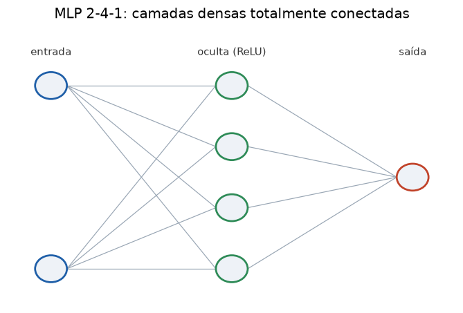

# Lição 024 — Multi-Layer Perceptron (MLP)

> **Módulo:** M02 — Redes Neurais e Deep Learning · **Ordem de estudo:** 24 · **Tempo:** ~55 min
> **Pré-requisitos:** [023] Funções de ativação
> **Classificação:** complemento de aprofundamento à ementa

> **Convenção de formatação:** matemática em LaTeX (`$...$` inline, `$$...$$` em
> destaque); figuras reprodutíveis geradas por `tools/figuras/gerar_figuras_m02.py`
> e incorporadas por caminho relativo `assets/<NNN>-<slug>/<nome>.png`; blocos
> ```python só para código e saída.

## Seção_Teórica

### Motivação

O perceptron sozinho traça uma reta e falha no XOR (Lição 022). A saída é
**empilhar** neurônios em camadas, com uma **ativação não linear** entre elas: o
**Multi-Layer Perceptron**. Com pelo menos uma **camada oculta**, o MLP é um
**aproximador universal** — em teoria, aproxima qualquer função contínua com
precisão arbitrária.

O MLP é a arquitetura-base de todo o deep learning: CNNs (Lição 029), RNNs
(Lição 030) e Transformers (Lição 039+) são todos feitos de camadas densas mais
estruturas especializadas. Implementar o forward pass e o treino de um MLP em numpy
puro desmistifica o que frameworks como PyTorch fazem por baixo.

### Princípio de funcionamento

Um MLP é uma sequência de **camadas densas**. A camada $\ell$ recebe a ativação
anterior $a^{(\ell-1)}$, aplica uma transformação afim e uma ativação:

$$ z^{(\ell)} = W^{(\ell)} a^{(\ell-1)} + b^{(\ell)}, \qquad a^{(\ell)} = \phi\!\left(z^{(\ell)}\right). $$

A entrada é $a^{(0)} = x$ e a saída da rede é $a^{(L)}$. Cada $W^{(\ell)}$ é uma
matriz $n_\ell \times n_{\ell-1}$ e cada $b^{(\ell)}$ um vetor de tamanho $n_\ell$. O
**forward pass** é só essa cadeia de multiplicações matriz-vetor intercaladas com
$\phi$. O **treino** usa backpropagation (Lição 014): calcula $\partial L/\partial W^{(\ell)}$
em todas as camadas e aplica gradient descent.

A não linearidade $\phi$ é essencial: sem ela, $W^{(2)}(W^{(1)}x) = (W^{(2)}W^{(1)})x$
colapsa em uma única transformação linear.


*Figura 1 — Um MLP 2-4-1: entradas à esquerda, uma camada oculta de 4 neurônios e a saída. Cada aresta é um peso; cada nó oculto aplica uma ativação.*

---

### Conceito central 1 — Arquitetura em camadas e forward pass

O forward pass é uma cadeia de operações `matriz @ vetor + viés`, seguidas de
ativação. As **shapes** têm que casar: se a camada tem $n_\ell$ neurônios e recebe
$n_{\ell-1}$ entradas, $W^{(\ell)}$ é $n_\ell \times n_{\ell-1}$.

#### Exemplo_Resolvido 1.1

```python
import numpy as np

# Forward pass de um MLP 3 -> 4 -> 1 com ativacao sigmoid na camada oculta.
# Cada camada e uma multiplicacao matriz-vetor seguida de ativacao.
def sigmoid(z):
    return 1.0 / (1.0 + np.exp(-z))

rng = np.random.default_rng(0)
W1 = rng.normal(0.0, 1.0, size=(4, 3))   # 4 neuronios ocultos, 3 entradas
b1 = np.zeros(4)
W2 = rng.normal(0.0, 1.0, size=(1, 4))   # 1 saida, 4 entradas ocultas
b2 = np.zeros(1)

x = np.array([0.5, -1.0, 2.0])
h = sigmoid(W1 @ x + b1)                  # camada oculta
y = sigmoid(W2 @ h + b2)                  # camada de saida
print(f"shapes: x={x.shape} h={h.shape} y={y.shape}")
print("h:", np.round(h, 4))
print("y:", np.round(y, 4))
```

**Explicação passo a passo:**
- **Bloco 1 (`sigmoid`):** a ativação não linear da camada oculta.
- **Bloco 2 (`rng`/`W`/`b`):** pesos fixados por uma semente para reprodutibilidade; `W1` é $4\times 3$ e `W2` é $1\times 4$.
- **Bloco 3 (forward):** `W1 @ x` projeta as 3 entradas em 4 ativações ocultas; `W2 @ h` reduz a 1 saída.
- **Bloco 4 (`print`):** confirma as shapes $(3,) \to (4,) \to (1,)$ e os valores das ativações.

**Saída esperada:**
```
shapes: x=(3,) h=(4,) y=(1,)
h: [0.8139 0.7877 0.1541 0.5183]
y: [0.0668]
```

---

### Conceito central 2 — Capacidade: a camada oculta resolve o XOR

O que o perceptron não conseguia, o MLP resolve. Com uma camada oculta de dois
neurônios ReLU, dá para construir à mão pesos que classificam o XOR perfeitamente: a
camada oculta cria uma representação onde as classes **passam a ser linearmente
separáveis**.

#### Exemplo_Resolvido 2.1

```python
import numpy as np

# Um MLP com UMA camada oculta resolve o XOR (que o perceptron nao resolve).
# Pesos escolhidos a mao com ativacao ReLU na camada oculta.
def relu(z):
    return np.maximum(0.0, z)

W1 = np.array([[1.0, 1.0], [1.0, 1.0]])   # 2 neuronios ocultos
b1 = np.array([0.0, -1.0])
W2 = np.array([1.0, -2.0])                # combina os 2 ocultos
b2 = 0.0

X = np.array([[0, 0], [0, 1], [1, 0], [1, 1]], dtype=float)
alvo = [0, 1, 1, 0]
for x, t in zip(X, alvo):
    h = relu(W1 @ x + b1)
    saida = W2 @ h + b2
    classe = int(saida >= 0.5)
    print(f"x={x.astype(int)} h={h} saida={saida:+.1f} classe={classe} alvo={t}")
```

**Explicação passo a passo:**
- **Bloco 1 (`relu`):** ativação da camada oculta.
- **Bloco 2 (pesos):** `b1 = [0, -1]` faz o segundo neurônio só "ligar" quando ambas as entradas valem 1.
- **Bloco 3 (laço):** para cada entrada, a camada oculta produz `h` e a saída combina os dois neurônios com `W2 = [1, -2]`.
- **Bloco 4 (resultado):** a classe bate com o alvo nas quatro linhas — o MLP resolve o XOR, ao contrário do perceptron.

**Saída esperada:**
```
x=[0 0] h=[0. 0.] saida=+0.0 classe=0 alvo=0
x=[0 1] h=[1. 0.] saida=+1.0 classe=1 alvo=1
x=[1 0] h=[1. 0.] saida=+1.0 classe=1 alvo=1
x=[1 1] h=[2. 1.] saida=+0.0 classe=0 alvo=0
```

---

### Conceito central 3 — Treino do MLP com backprop

Na prática não escolhemos os pesos à mão: deixamos o backprop (Lição 014) calcular os
gradientes e o gradient descent ajustá-los. Para a sigmoid + BCE, o gradiente da
saída simplifica para $(p - y)$, que retropropaga pela camada oculta multiplicando
pela derivada $h(1-h)$.

#### Exemplo_Resolvido 3.1

```python
import numpy as np

# Treinar um MLP 2-4-1 no XOR por gradient descent (backprop completo em numpy).
def sigmoid(z):
    return 1.0 / (1.0 + np.exp(-z))

rng = np.random.default_rng(42)
X = np.array([[0, 0], [0, 1], [1, 0], [1, 1]], dtype=float)
y = np.array([[0.0], [1.0], [1.0], [0.0]])

W1 = rng.normal(0.0, 1.0, size=(2, 4))
b1 = np.zeros((1, 4))
W2 = rng.normal(0.0, 1.0, size=(4, 1))
b2 = np.zeros((1, 1))
eta = 0.5

def forward(X):
    H = sigmoid(X @ W1 + b1)
    P = sigmoid(H @ W2 + b2)
    return H, P

def perda(P):
    eps = 1e-9
    return float(-np.mean(y * np.log(P + eps) + (1 - y) * np.log(1 - P + eps)))

_, P0 = forward(X)
perda_inicial = perda(P0)
for _ in range(5000):
    H, P = forward(X)
    dZ2 = (P - y) / len(X)              # gradiente da BCE+sigmoid
    dW2 = H.T @ dZ2
    db2 = dZ2.sum(axis=0, keepdims=True)
    dH = dZ2 @ W2.T
    dZ1 = dH * H * (1 - H)             # derivada da sigmoid oculta
    dW1 = X.T @ dZ1
    db1 = dZ1.sum(axis=0, keepdims=True)
    W2 -= eta * dW2; b2 -= eta * db2
    W1 -= eta * dW1; b1 -= eta * db1

_, Pf = forward(X)
print(f"perda inicial: {perda_inicial:.4f}")
print(f"perda final:   {perda(Pf):.4f}")
print(f"predicoes: {np.round(Pf.ravel(), 2)}")
print(f"classes:   {(Pf.ravel() >= 0.5).astype(int)} alvo: {y.ravel().astype(int)}")
```

**Explicação passo a passo:**
- **Bloco 1 (`forward`):** propaga a entrada pela camada oculta sigmoid e pela saída sigmoid, em batch (4 exemplos de uma vez).
- **Bloco 2 (`perda`):** entropia cruzada binária média sobre os quatro exemplos.
- **Bloco 3 (laço de treino):** o backward usa $(P-y)$ na saída e $h(1-h)$ na camada oculta; cada passo ajusta `W1, W2, b1, b2`.
- **Bloco 4 (`print`):** a perda cai de $0.7568$ para $\approx 0.0028$ e as quatro classes batem com o alvo — o MLP **aprendeu** o XOR.

**Saída esperada:**
```
perda inicial: 0.7568
perda final:   0.0028
predicoes: [0. 1. 1. 0.]
classes:   [0 1 1 0] alvo: [0 1 1 0]
```

## Seção_Prática

> **Como reproduzir:** execute cada solução de referência com
> `python trilha/solucoes/024-mlp/solucao_<n>.py` e compare a saída com o arquivo
> `.saida.txt` correspondente. Os esqueletos ficam em
> `trilha/pratica/024-mlp/exercicio_<n>.py`.

### Exercício 1 — Forward pass de um MLP 2-3-1
- **Entrada inicial / setup:** `W1 = [[0.5,-0.5],[1,1],[-1,0.5]]`, `b1 = [0,-0.5,0.2]`, `W2 = [1,-1,0.5]`, `b2 = 0.1`, `x = [1,2]`; ativação sigmoid na oculta e na saída.
- **Passos de execução:** calcule `h = sigmoid(W1 @ x + b1)` e `y = sigmoid(W2 @ h + b2)`; imprima as shapes de `x` e `h`, `h` (4 casas) e a saída (4 casas).
- **Critério de conclusão (binário):** a saída é **idêntica** a `solucao_1.saida.txt`; qualquer divergência reprova.
- **Solução de referência:** `trilha/solucoes/024-mlp/solucao_1.py`
- **Saída esperada:** `trilha/solucoes/024-mlp/solucao_1.saida.txt`

### Exercício 2 — Confirmar que o MLP resolve o XOR
- **Entrada inicial / setup:** rede ReLU com `W1 = [[1,1],[1,1]]`, `b1 = [0,-1]`, `W2 = [1,-2]`, `b2 = 0`; alvo XOR `[0,1,1,0]`.
- **Passos de execução:** para cada entrada, calcule `classe = int(W2 @ relu(W1 @ x + b1) + b2 >= 0.5)`, conte os acertos e imprima por linha `x=... classe=... alvo=...` e ao final `acertos=.../4 resolveu o XOR: <bool>`.
- **Critério de conclusão (binário):** a saída é **idêntica** a `solucao_2.saida.txt`, terminando com `resolveu o XOR: True`; caso contrário, reprovado.
- **Solução de referência:** `trilha/solucoes/024-mlp/solucao_2.py`
- **Saída esperada:** `trilha/solucoes/024-mlp/solucao_2.saida.txt`

### Exercício 3 — Contar parâmetros de um MLP
- **Entrada inicial / setup:** arquitetura `camadas = [3, 5, 5, 2]`.
- **Passos de execução:** para cada camada densa `n_in -> n_out`, calcule `n_in*n_out + n_out`; some tudo; imprima por camada `camada n_in->n_out: n_in*n_out+n_out = P parametros` e ao final `total de parametros: T`.
- **Critério de conclusão (binário):** a saída é **idêntica** a `solucao_3.saida.txt` (total `62`); qualquer divergência reprova.
- **Solução de referência:** `trilha/solucoes/024-mlp/solucao_3.py`
- **Saída esperada:** `trilha/solucoes/024-mlp/solucao_3.saida.txt`
