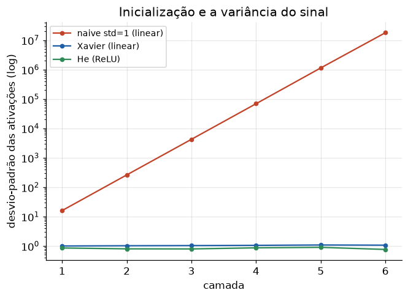

# Lição 025 — Treinamento de redes profundas e inicialização de pesos

> **Módulo:** M02 — Redes Neurais e Deep Learning · **Ordem de estudo:** 25 · **Tempo:** ~55 min
> **Pré-requisitos:** [024] Multi-Layer Perceptron (MLP)
> **Classificação:** complemento de aprofundamento à ementa

> **Convenção de formatação:** matemática em LaTeX (`$...$` inline, `$$...$$` em
> destaque); figuras reprodutíveis geradas por `tools/figuras/gerar_figuras_m02.py`
> e incorporadas por caminho relativo `assets/<NNN>-<slug>/<nome>.png`; blocos
> ```python só para código e saída.

## Seção_Teórica

### Motivação

Empilhar muitas camadas (Lição 024) parece simples, mas redes profundas têm um
problema sutil: **como inicializar os pesos**? Uma escolha ingênua faz a rede não
treinar — ou porque todos os neurônios aprendem a mesma coisa, ou porque o sinal
**explode** ou **desaparece** ao atravessar dezenas de camadas. Por anos, redes
profundas foram consideradas intreináveis exatamente por isso.

A virada veio com inicializações que **preservam a variância** do sinal camada a
camada: **Xavier/Glorot** (2010) para tanh/sigmoid e **He** (2015) para ReLU. Elas
são uma linha de código, mas a diferença entre uma rede que treina e uma que trava.
Este é também o pano de fundo do vanishing/exploding gradient (Lição 027).

### Princípio de funcionamento

Considere uma camada $z = W a$ com $a \in \mathbb{R}^{n_{in}}$ e entradas
independentes de média zero. A variância de cada saída é

$$ \mathrm{Var}(z_j) = n_{in}\,\mathrm{Var}(W)\,\mathrm{Var}(a). $$

Se $\mathrm{Var}(W) = 1$, a variância é **multiplicada por $n_{in}$** a cada camada —
e em redes profundas isso explode. Para **preservar** a variância
($\mathrm{Var}(z) = \mathrm{Var}(a)$), precisamos de

$$ \mathrm{Var}(W) = \frac{1}{n_{in}} \;\Rightarrow\; \text{std}(W) = \frac{1}{\sqrt{n_{in}}} \quad (\text{Xavier}). $$

A ReLU zera metade das ativações, cortando a variância pela metade; **He** compensa
usando $\text{std}(W) = \sqrt{2/n_{in}}$. Além disso, inicializar todos os pesos com
o **mesmo valor** (ex.: zeros) cria **simetria**: todos os neurônios da camada
computam o mesmo e recebem o mesmo gradiente, então nunca se diferenciam. A
aleatoriedade na inicialização é o que **quebra a simetria**.


*Figura 1 — Com pesos de std=1 (naive) a variância explode; Xavier a preserva em camadas lineares; He a preserva sob ReLU.*

---

### Conceito central 1 — O problema da simetria (init com zeros)

Inicializar `W = 0` (ou qualquer valor constante) é fatal: todos os neurônios de uma
camada produzem a **mesma** ativação e recebem o **mesmo** gradiente. As linhas da
matriz de gradiente ficam idênticas, então os pesos permanecem iguais para sempre — a
rede se comporta como se tivesse **um único** neurônio por camada.

#### Exemplo_Resolvido 1.1

```python
import numpy as np

# O problema da inicializacao com zeros: todos os neuronios ocultos ficam
# IDENTICOS (mesma ativacao, mesmo gradiente) e a rede nunca "quebra a simetria".
def sigmoid(z):
    return 1.0 / (1.0 + np.exp(-z))

x = np.array([1.0, 2.0, 3.0])
W1 = np.zeros((4, 3))    # inicializacao com zeros
b1 = np.zeros(4)

h = sigmoid(W1 @ x + b1)
# supondo um gradiente dL/dh = 1 chegando em cada neuronio oculto
dh = h * (1.0 - h) * 1.0
dW1 = np.outer(dh, x)
print("ativacoes ocultas:", h)
linhas_iguais = np.allclose(dW1[0], dW1[1]) and np.allclose(dW1[1], dW1[2])
print("linhas de dW1 identicas:", linhas_iguais)
print("dW1[0]:", dW1[0])
```

**Explicação passo a passo:**
- **Bloco 1 (`W1 = zeros`):** todos os pesos começam iguais a zero.
- **Bloco 2 (`h`):** com `W1 @ x + b1 = 0`, toda ativação oculta vale $\sigma(0) = 0.5$.
- **Bloco 3 (`dW1`):** o gradiente de cada neurônio é igual; as linhas de `dW1` são idênticas.
- **Bloco 4 (`print`):** confirma `linhas de dW1 identicas: True` — a simetria nunca se quebra e a rede não aprende.

**Saída esperada:**
```
ativacoes ocultas: [0.5 0.5 0.5 0.5]
linhas de dW1 identicas: True
dW1[0]: [0.25 0.5  0.75]
```

---

### Conceito central 2 — Inicialização de Xavier (variância)

Para o sinal não explodir nem sumir, a variância dos pesos precisa ser
$1/n_{in}$. Propagando um vetor por várias camadas **lineares**, a inicialização
naive (std=1) multiplica o desvio-padrão por $\sqrt{n_{in}}$ a cada camada
(explosão), enquanto Xavier mantém o desvio-padrão $\approx 1$.

#### Exemplo_Resolvido 2.1

```python
import numpy as np

# Escala da inicializacao e a variancia das ativacoes: propagar por varias
# camadas LINEARES mostra que pesos com std=1 EXPLODEM e Xavier (1/sqrt(n_in))
# preserva a escala (Var_out = n_in * Var_W * Var_in).
def propaga(escala_fn, n_camadas=5, n=512, semente=0):
    rng = np.random.default_rng(semente)
    a = rng.standard_normal(n)
    stds = []
    for _ in range(n_camadas):
        W = rng.standard_normal((n, n)) * escala_fn(n)
        a = W @ a
        stds.append(a.std())
    return stds

naive = propaga(lambda n: 1.0)
xavier = propaga(lambda n: 1.0 / np.sqrt(n))
print("std por camada (naive) :", [f"{s:.1e}" for s in naive])
print("std por camada (Xavier):", [f"{s:.2f}" for s in xavier])
```

**Explicação passo a passo:**
- **Bloco 1 (`propaga`):** propaga um vetor por 5 camadas lineares, guardando o desvio-padrão das ativações de cada camada.
- **Bloco 2 (`naive`):** com std=1, o desvio cresce por um fator $\sqrt{512}\approx 22.6$ por camada, chegando a $10^{6}$ na quinta.
- **Bloco 3 (`xavier`):** com std=$1/\sqrt{n_{in}}$, o desvio fica estável em torno de 1.
- **Bloco 4 (`print`):** a explosão da naive contrasta com a estabilidade da Xavier.

**Saída esperada:**
```
std por camada (naive) : ['2.3e+01', '5.2e+02', '1.1e+04', '2.6e+05', '6.1e+06']
std por camada (Xavier): ['1.04', '1.01', '0.97', '0.99', '1.03']
```

---

### Conceito central 3 — Inicialização de He (para ReLU)

A ReLU descarta os valores negativos, então corta a variância pela metade a cada
camada. A inicialização de **He** corrige isso usando $\text{std}(W) = \sqrt{2/n_{in}}$.
Com Xavier sob ReLU, o desvio-padrão **decai** camada a camada; com He, ele se
mantém estável.

#### Exemplo_Resolvido 3.1

```python
import numpy as np

# Inicializacao de He para ReLU: a ReLU zera metade das ativacoes, cortando a
# variancia pela metade. He usa std=sqrt(2/n_in) para compensar; Xavior
# (1/sqrt(n_in)) deixa a variancia DECAIR camada a camada com ReLU.
def propaga_relu(escala_fn, n_camadas=6, n=512, semente=1):
    rng = np.random.default_rng(semente)
    a = rng.standard_normal(n)
    stds = []
    for _ in range(n_camadas):
        W = rng.standard_normal((n, n)) * escala_fn(n)
        a = np.maximum(0.0, W @ a)
        stds.append(a.std())
    return stds

xavier = propaga_relu(lambda n: 1.0 / np.sqrt(n))
he = propaga_relu(lambda n: np.sqrt(2.0 / n))
print("std (Xavier + ReLU):", np.round(xavier, 4))
print("std (He + ReLU)    :", np.round(he, 4))
```

**Explicação passo a passo:**
- **Bloco 1 (`propaga_relu`):** mesma propagação, mas agora com ativação ReLU entre as camadas.
- **Bloco 2 (`xavier`):** sob ReLU, o desvio cai de $0.50$ para $0.09$ ao longo de 6 camadas — o sinal está desaparecendo.
- **Bloco 3 (`he`):** o fator $\sqrt{2}$ extra compensa o corte da ReLU; o desvio fica em torno de $0.6$-$0.7$.
- **Bloco 4 (`print`):** He preserva a escala do sinal em redes ReLU profundas.

**Saída esperada:**
```
std (Xavier + ReLU): [0.5023 0.3047 0.2128 0.1631 0.1137 0.0878]
std (He + ReLU)    : [0.7103 0.6093 0.6018 0.6526 0.6434 0.7021]
```

## Seção_Prática

> **Como reproduzir:** execute cada solução de referência com
> `python trilha/solucoes/025-treino-redes-profundas-inicializacao/solucao_<n>.py` e
> compare a saída com o arquivo `.saida.txt` correspondente. Os esqueletos ficam em
> `trilha/pratica/025-treino-redes-profundas-inicializacao/exercicio_<n>.py`.

### Exercício 1 — Inicialização aleatória quebra a simetria
- **Entrada inicial / setup:** `rng = default_rng(7)`, `x = [1,2,3]`, `W1 = rng.standard_normal((4,3))*0.5`, `b1 = zeros(4)`, ativação sigmoid.
- **Passos de execução:** calcule `h`, `dh = h*(1-h)` e `dW1 = outer(dh, x)`; verifique se as linhas de `dW1` são idênticas; imprima `h` (4 casas), `linhas de dW1 identicas: <bool>` e `simetria quebrada: <bool>`.
- **Critério de conclusão (binário):** a saída é **idêntica** a `solucao_1.saida.txt`, terminando com `simetria quebrada: True`; qualquer divergência reprova.
- **Solução de referência:** `trilha/solucoes/025-treino-redes-profundas-inicializacao/solucao_1.py`
- **Saída esperada:** `trilha/solucoes/025-treino-redes-profundas-inicializacao/solucao_1.saida.txt`

### Exercício 2 — Desvio-padrão teórico de Xavier e He
- **Entrada inicial / setup:** tamanhos de fan-in `n_in ∈ {16, 256, 1024}`.
- **Passos de execução:** calcule o std de Xavier ($1/\sqrt{n_{in}}$) e de He ($\sqrt{2/n_{in}}$); imprima por linha `n_in=...: Xavier std=... He std=...` (4 casas).
- **Critério de conclusão (binário):** a saída é **idêntica** a `solucao_2.saida.txt`; qualquer divergência reprova.
- **Solução de referência:** `trilha/solucoes/025-treino-redes-profundas-inicializacao/solucao_2.py`
- **Saída esperada:** `trilha/solucoes/025-treino-redes-profundas-inicializacao/solucao_2.saida.txt`

### Exercício 3 — He mantém a variância saudável sob ReLU
- **Entrada inicial / setup:** `rng = default_rng(3)`, `n = 256`, `a = rng.standard_normal(n)`, 5 camadas ReLU com init He.
- **Passos de execução:** a cada camada faça `W = rng.standard_normal((n,n))*sqrt(2/n)` e `a = relu(W @ a)`; guarde `a.std()`; verifique se todas têm `0.3 < std < 1.0` e imprima os std (4 casas) e o booleano.
- **Critério de conclusão (binário):** a saída é **idêntica** a `solucao_3.saida.txt`, terminando com `True`; qualquer divergência reprova.
- **Solução de referência:** `trilha/solucoes/025-treino-redes-profundas-inicializacao/solucao_3.py`
- **Saída esperada:** `trilha/solucoes/025-treino-redes-profundas-inicializacao/solucao_3.saida.txt`
