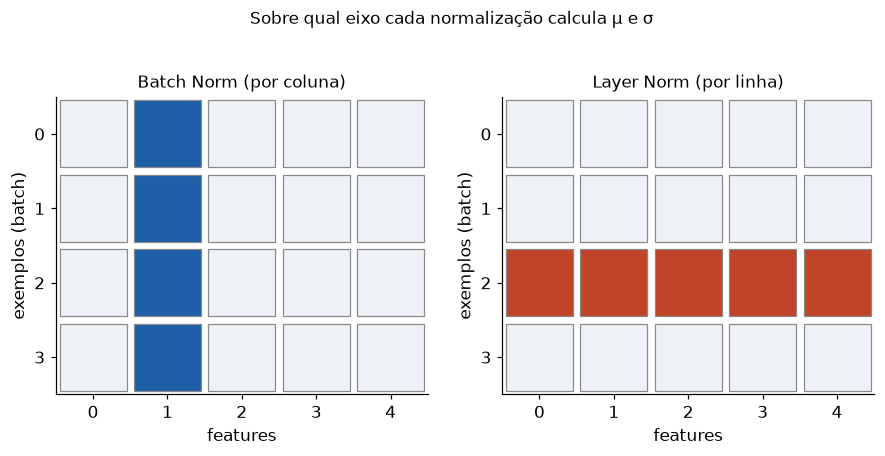

# Lição 026 — Normalização: batch norm e layer norm

> **Módulo:** M02 — Redes Neurais e Deep Learning · **Ordem de estudo:** 26 · **Tempo:** ~50 min
> **Pré-requisitos:** [025] Treinamento de redes profundas e inicialização de pesos
> **Classificação:** complemento de aprofundamento à ementa

> **Convenção de formatação:** matemática em LaTeX (`$...$` inline, `$$...$$` em
> destaque); figuras reprodutíveis geradas por `tools/figuras/gerar_figuras_m02.py`
> e incorporadas por caminho relativo `assets/<NNN>-<slug>/<nome>.png`; blocos
> ```python só para código e saída.

## Seção_Teórica

### Motivação

Mesmo com boa inicialização (Lição 025), as ativações **derivam** durante o treino:
conforme os pesos das camadas anteriores mudam, a distribuição que cada camada
recebe muda também (o chamado *internal covariate shift*). Isso obriga a usar taxas
de aprendizado pequenas e torna o treino lento e instável.

A **normalização** ataca o problema reescalando as ativações para média 0 e
variância 1 **dentro da rede**, a cada passo. **Batch normalization** acelerou
drasticamente o treino de redes convolucionais; **layer normalization** é a peça
equivalente nos Transformers (Lição 039+), onde o tamanho do batch varia. Saber a
diferença entre os dois eixos de normalização é essencial para ler qualquer
arquitetura moderna.

### Princípio de funcionamento

A operação base é a **padronização**: para um conjunto de valores, subtraia a média
$\mu$ e divida pelo desvio-padrão (com um $\epsilon$ para estabilidade numérica):

$$ \hat{x} = \frac{x - \mu}{\sqrt{\sigma^2 + \epsilon}}. $$

Para não engessar a rede, adicionam-se dois parâmetros **aprendíveis** por feature,
$\gamma$ (escala) e $\beta$ (deslocamento):

$$ y = \gamma\,\hat{x} + \beta. $$

A diferença entre as variantes é **sobre qual eixo** calculamos $\mu$ e $\sigma$:

- **Batch norm:** por feature, **sobre o batch** (eixo dos exemplos). Depende do
  tamanho do batch e usa estatísticas móveis na inferência.
- **Layer norm:** por exemplo, **sobre as features** (eixo das features). Independe
  do batch — ideal para sequências de tamanho variável.


*Figura 1 — Em uma matriz batch × features, batch norm calcula estatísticas pelas colunas e layer norm pelas linhas.*

---

### Conceito central 1 — Normalização de ativações

A padronização leva qualquer conjunto de valores para média 0 e variância 1. Em uma
matriz `batch × features`, normalizar **por feature** significa calcular média e
variância **por coluna**.

#### Exemplo_Resolvido 1.1

```python
import numpy as np

# Normalizar um batch: subtrair a media e dividir pelo desvio-padrao POR FEATURE
# (coluna) deixa cada feature com media ~0 e variancia ~1.
rng = np.random.default_rng(0)
X = rng.normal(5.0, 3.0, size=(4, 3))   # batch de 4 exemplos, 3 features
mu = X.mean(axis=0)
var = X.var(axis=0)
Xn = (X - mu) / np.sqrt(var + 1e-5)
print("media por feature (antes): ", np.round(mu, 4))
print("media por feature (depois):", np.round(Xn.mean(axis=0), 4))
print("std por feature (depois):  ", np.round(Xn.std(axis=0), 4))
```

**Explicação passo a passo:**
- **Bloco 1 (`X`):** um batch de 4 exemplos com 3 features, centrado em 5 com desvio 3.
- **Bloco 2 (`mu`, `var`):** média e variância calculadas **por coluna** (`axis=0`).
- **Bloco 3 (`Xn`):** subtrai a média e divide pelo desvio-padrão (com $\epsilon$).
- **Bloco 4 (`print`):** após normalizar, a média por feature vira 0 e o desvio-padrão vira 1.

**Saída esperada:**
```
media por feature (antes):  [5.2019 4.742  5.2547]
media por feature (depois): [0. 0. 0.]
std por feature (depois):   [1. 1. 1.]
```

---

### Conceito central 2 — Batch normalization

A batch norm completa a padronização com os parâmetros aprendíveis $\gamma$ e
$\beta$. Como $\hat{x}$ tem média 0 e variância 1, a saída $\gamma\hat{x}+\beta$ tem
média $\beta$ e desvio-padrão $|\gamma|$ por feature — a rede aprende a melhor escala.

#### Exemplo_Resolvido 2.1

```python
import numpy as np

# Batch Normalization: normaliza por feature (sobre o batch) e reescala com
# parametros aprendiveis gamma (escala) e beta (deslocamento).
def batch_norm(X, gamma, beta, eps=1e-5):
    mu = X.mean(axis=0)
    var = X.var(axis=0)
    Xn = (X - mu) / np.sqrt(var + eps)
    return gamma * Xn + beta

rng = np.random.default_rng(1)
X = rng.normal(0.0, 1.0, size=(5, 2))
gamma = np.array([2.0, 0.5])
beta = np.array([1.0, -1.0])
Y = batch_norm(X, gamma, beta)
# Apos BN, a media por feature ~= beta e o std por feature ~= |gamma|.
print("media por feature da saida:", np.round(Y.mean(axis=0), 4))
print("std por feature da saida:  ", np.round(Y.std(axis=0), 4))
```

**Explicação passo a passo:**
- **Bloco 1 (`batch_norm`):** padroniza por coluna e aplica `gamma * Xn + beta`.
- **Bloco 2 (`X`, `gamma`, `beta`):** batch de 5 exemplos, 2 features; `gamma=[2, 0.5]`, `beta=[1, -1]`.
- **Bloco 3 (`Y`):** aplica a transformação.
- **Bloco 4 (`print`):** a média da saída por feature é exatamente `beta = [1, -1]` e o desvio-padrão é `|gamma| = [2, 0.5]`.

**Saída esperada:**
```
media por feature da saida: [ 1. -1.]
std por feature da saida:   [2.  0.5]
```

---

### Conceito central 3 — Layer normalization

A layer norm troca o eixo: normaliza **por exemplo**, sobre as features de cada
linha. Não depende do batch, o que a torna ideal para sequências. Uma consequência
elegante: duas linhas que são múltiplos escalares uma da outra viram **o mesmo**
vetor normalizado.

#### Exemplo_Resolvido 3.1

```python
import numpy as np

# Layer Normalization: normaliza POR EXEMPLO (sobre as features de cada linha),
# independente do batch. Linhas que sao multiplos escalares uma da outra viram
# o MESMO vetor normalizado.
def layer_norm(X, eps=1e-5):
    mu = X.mean(axis=1, keepdims=True)
    var = X.var(axis=1, keepdims=True)
    return (X - mu) / np.sqrt(var + eps)

X = np.array([[1.0, 2.0, 3.0, 4.0],
              [10.0, 20.0, 30.0, 40.0]])   # linha 1 = 10 * linha 0
Y = layer_norm(X)
print("media por linha:", np.round(Y.mean(axis=1), 4))
print("std por linha:  ", np.round(Y.std(axis=1), 4))
print("linha 0 normalizada:", np.round(Y[0], 4))
print("linha 1 igual a linha 0:", np.allclose(Y[0], Y[1]))
```

**Explicação passo a passo:**
- **Bloco 1 (`layer_norm`):** média e variância calculadas **por linha** (`axis=1`, `keepdims=True`).
- **Bloco 2 (`X`):** a segunda linha é exatamente 10× a primeira.
- **Bloco 3 (`print` média/std):** cada linha fica com média 0 e desvio-padrão 1.
- **Bloco 4 (`allclose`):** como a normalização remove escala e deslocamento, as duas linhas viram o mesmo vetor — `True`.

**Saída esperada:**
```
media por linha: [0. 0.]
std por linha:   [1. 1.]
linha 0 normalizada: [-1.3416 -0.4472  0.4472  1.3416]
linha 1 igual a linha 0: True
```

## Seção_Prática

> **Como reproduzir:** execute cada solução de referência com
> `python trilha/solucoes/026-batch-layer-norm/solucao_<n>.py` e compare a saída com
> o arquivo `.saida.txt` correspondente. Os esqueletos ficam em
> `trilha/pratica/026-batch-layer-norm/exercicio_<n>.py`.

### Exercício 1 — Padronizar um batch por feature
- **Entrada inicial / setup:** `X = [[2,10],[4,20],[6,30],[8,40]]`; `eps = 1e-5`.
- **Passos de execução:** normalize por coluna `(X - média)/sqrt(var + eps)`; imprima a matriz normalizada (4 casas), a média por feature e o std por feature.
- **Critério de conclusão (binário):** a saída é **idêntica** a `solucao_1.saida.txt` (média por feature `[0. 0.]`, std `[1. 1.]`); qualquer divergência reprova.
- **Solução de referência:** `trilha/solucoes/026-batch-layer-norm/solucao_1.py`
- **Saída esperada:** `trilha/solucoes/026-batch-layer-norm/solucao_1.saida.txt`

### Exercício 2 — Batch norm com γ e β
- **Entrada inicial / setup:** `X = [[1,100],[3,300],[5,500],[7,700]]`, `gamma = [3, 0.5]`, `beta = [5, -2]`.
- **Passos de execução:** aplique `batch_norm(X, gamma, beta)`; imprima a média e o std da saída por feature (4 casas) e confirme com `np.allclose` que média ≈ β e std ≈ |γ| (atol=1e-3).
- **Critério de conclusão (binário):** a saída é **idêntica** a `solucao_2.saida.txt`, terminando com os dois `True`; caso contrário, reprovado.
- **Solução de referência:** `trilha/solucoes/026-batch-layer-norm/solucao_2.py`
- **Saída esperada:** `trilha/solucoes/026-batch-layer-norm/solucao_2.saida.txt`

### Exercício 3 — Eixos de batch norm vs layer norm
- **Entrada inicial / setup:** `X = [[1,2,6],[4,4,4]]`; `eps = 1e-5`.
- **Passos de execução:** implemente batch norm (normaliza por coluna, eixo 0) e layer norm (normaliza por linha, eixo 1); imprima a média por coluna após BN e a média por linha após LN.
- **Critério de conclusão (binário):** a saída é **idêntica** a `solucao_3.saida.txt` (ambas as médias ≈ 0 nos respectivos eixos); qualquer divergência reprova.
- **Solução de referência:** `trilha/solucoes/026-batch-layer-norm/solucao_3.py`
- **Saída esperada:** `trilha/solucoes/026-batch-layer-norm/solucao_3.saida.txt`
