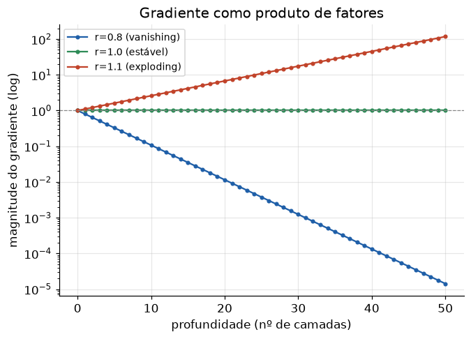

# Lição 027 — Vanishing e exploding gradients

> **Módulo:** M02 — Redes Neurais e Deep Learning · **Ordem de estudo:** 27 · **Tempo:** ~55 min
> **Pré-requisitos:** [014] Backpropagation · [025] Treinamento de redes profundas e inicialização
> **Classificação:** complemento de aprofundamento à ementa

> **Convenção de formatação:** matemática em LaTeX (`$...$` inline, `$$...$$` em
> destaque); figuras reprodutíveis geradas por `tools/figuras/gerar_figuras_m02.py`
> e incorporadas por caminho relativo `assets/<NNN>-<slug>/<nome>.png`; blocos
> ```python só para código e saída.

## Seção_Teórica

### Motivação

Redes profundas treinam por backpropagation (Lição 014), que multiplica gradientes
camada a camada. Quando há **muitas** camadas, esse produto de muitos fatores tende a
dois extremos patológicos: ou **desaparece** (vanishing) e as camadas iniciais param
de aprender, ou **explode** (exploding) e o treino diverge com `NaN`. Esse foi, por
décadas, o principal obstáculo ao deep learning.

Diagnosticar gradientes que somem ou explodem é uma habilidade prática e um clássico
de entrevista: saber **por que** acontece (produto de Jacobianos), **como detectar**
(monitorar a norma do gradiente) e **como mitigar** (inicialização, ReLU, normalização,
clipping, conexões residuais) separa quem só usa um framework de quem sabe depurá-lo.

### Princípio de funcionamento

Pela regra da cadeia, o gradiente da perda em relação a uma camada profunda $\ell$ é
um **produto** das derivadas de todas as camadas seguintes:

$$ \frac{\partial L}{\partial a^{(\ell)}} = \prod_{k=\ell+1}^{L} \left( W^{(k)} \right)^{\!\top} \mathrm{diag}\!\left(\phi'(z^{(k)})\right). $$

O comportamento é governado pela **magnitude típica** $r$ de cada fator. Se $r < 1$, o
produto $r^{L}$ tende a **zero** exponencialmente (vanishing); se $r > 1$, tende a
**infinito** (exploding). A escolha da ativação importa muito: a sigmoid tem derivada
$\le 0.25$, então redes sigmoidais profundas **sempre** sofrem vanishing; a ReLU tem
derivada $1$ na região ativa, atenuando o problema.

As mitigações atacam $r$: **inicialização** de Xavier/He (Lição 025) e
**normalização** (Lição 026) mantêm $r \approx 1$; **ReLU** evita derivadas pequenas;
**conexões residuais** criam um caminho com fator $1$; e o **gradient clipping** corta
explosões limitando a norma do gradiente.


*Figura 1 — O gradiente é um produto de fatores: $r<1$ desaparece, $r=1$ se mantém e $r>1$ explode com a profundidade (escala log).*

---

### Conceito central 1 — O produto de Jacobianos

A causa raiz é simples: retropropagar por $L$ camadas multiplica $L$ fatores. Se cada
fator vale $r$, o gradiente que chega na primeira camada é da ordem de $r^{L}$ — uma
exponencial em $L$ que é cruelmente sensível a $r$.

#### Exemplo_Resolvido 1.1

```python
import numpy as np

# O gradiente que retropropaga por L camadas e ~ um PRODUTO de L fatores.
# Se o fator tipico < 1, o produto desaparece (vanishing); se > 1, explode.
L = 50
for fator in [0.8, 1.0, 1.1]:
    grad = fator ** L
    print(f"fator={fator}: grad apos {L} camadas = {grad:.3e}")
```

**Explicação passo a passo:**
- **Bloco 1 (`L`):** profundidade de 50 camadas.
- **Bloco 2 (laço):** para cada fator típico, o gradiente acumulado é $\text{fator}^{50}$.
- **Resultado:** $0.8^{50}\approx 1.4\times10^{-5}$ (some), $1.0^{50}=1$ (estável) e $1.1^{50}\approx 117$ (explode) — pequenas diferenças em $r$ viram ordens de grandeza.

**Saída esperada:**
```
fator=0.8: grad apos 50 camadas = 1.427e-05
fator=1.0: grad apos 50 camadas = 1.000e+00
fator=1.1: grad apos 50 camadas = 1.174e+02
```

---

### Conceito central 2 — Vanishing gradient com sigmoid

A derivada da sigmoid é $\sigma'(z) = \sigma(z)(1-\sigma(z))$, com **máximo 0.25** em
$z=0$. Logo, cada camada sigmoidal multiplica o gradiente por no máximo $0.25$ — e
uma rede profunda de sigmoides faz o gradiente encolher como $0.25^{L}$.

#### Exemplo_Resolvido 2.1

```python
import numpy as np

# Vanishing gradient com sigmoid: a derivada da sigmoid vale no MAXIMO 0.25,
# entao o gradiente encolhe geometricamente ao atravessar muitas camadas.
def sigmoid(z):
    return 1.0 / (1.0 + np.exp(-z))

a = 0.5          # entrada
grad = 1.0       # gradiente que chega na saida (dL/dsaida = 1)
for camada in range(1, 11):
    z = a                       # peso 1, sem vies
    s = sigmoid(z)
    grad *= s * (1.0 - s)       # multiplica pela derivada local
    a = s
    if camada in (1, 5, 10):
        print(f"camada {camada:2d}: grad acumulado = {grad:.3e}")

print(f"limite teorico (0.25^10): {0.25 ** 10:.3e}")
```

**Explicação passo a passo:**
- **Bloco 1 (`sigmoid`):** a ativação saturante.
- **Bloco 2 (laço):** a cada camada o gradiente é multiplicado pela derivada local $s(1-s)$.
- **Bloco 3 (`print` por camada):** o gradiente cai de $0.235$ (camada 1) para $3.5\times10^{-7}$ (camada 10).
- **Bloco 4 (limite):** o valor fica abaixo de $0.25^{10}$ porque as derivadas reais são ainda menores que o máximo — vanishing confirmado.

**Saída esperada:**
```
camada  1: grad acumulado = 2.350e-01
camada  5: grad acumulado = 6.080e-04
camada 10: grad acumulado = 3.483e-07
limite teorico (0.25^10): 9.537e-07
```

---

### Conceito central 3 — Mitigações: clipping e ReLU

Contra o **exploding**, o **gradient clipping** por norma é a ferramenta padrão: se a
norma do vetor de gradientes ultrapassa um teto, reescalamos o vetor para esse teto,
preservando a direção. Contra o **vanishing**, trocar a sigmoid pela ReLU (derivada 1
na região ativa) já ajuda muito — além de inicialização e normalização das lições
anteriores.

#### Exemplo_Resolvido 3.1

```python
import numpy as np

# Exploding gradient: a mitigacao classica e o GRADIENT CLIPPING por norma.
# Se a norma do gradiente passa de um teto, reescalamos para esse teto,
# preservando a DIRECAO mas limitando o tamanho do passo.
def clip_por_norma(g, max_norma):
    norma = np.linalg.norm(g)
    if norma > max_norma:
        g = g * (max_norma / norma)
    return g, norma

g = np.array([3.0, 4.0, 12.0])      # norma = 13
g_clip, norma = clip_por_norma(g, 5.0)
print(f"norma original: {norma:.4f}")
print(f"gradiente clipado: {np.round(g_clip, 4)}")
print(f"norma apos clip:   {np.linalg.norm(g_clip):.4f}")
```

**Explicação passo a passo:**
- **Bloco 1 (`clip_por_norma`):** calcula a norma e, se passar do teto, reescala por `max_norma/norma`.
- **Bloco 2 (`g`):** vetor com norma exatamente 13 (de $3^2+4^2+12^2 = 169$).
- **Bloco 3 (`print`):** após o clip, a norma vira exatamente 5 e o vetor mantém a mesma direção (cada componente multiplicada por $5/13$).

**Saída esperada:**
```
norma original: 13.0000
gradiente clipado: [1.1538 1.5385 4.6154]
norma apos clip:   5.0000
```

## Seção_Prática

> **Como reproduzir:** execute cada solução de referência com
> `python trilha/solucoes/027-vanishing-exploding-gradients/solucao_<n>.py` e compare
> a saída com o arquivo `.saida.txt` correspondente. Os esqueletos ficam em
> `trilha/pratica/027-vanishing-exploding-gradients/exercicio_<n>.py`.

### Exercício 1 — Destino do gradiente em rede profunda
- **Entrada inicial / setup:** profundidade `L = 30`, fatores `r ∈ {0.5, 1.0, 1.5}`.
- **Passos de execução:** calcule `grad = r**L`; classifique `vanishing` (< 1e-3), `exploding` (> 1e3) ou `estavel`; imprima por linha `fator=...: grad=... -> classe`.
- **Critério de conclusão (binário):** a saída é **idêntica** a `solucao_1.saida.txt` (0.5 → vanishing, 1.0 → estavel, 1.5 → exploding); qualquer divergência reprova.
- **Solução de referência:** `trilha/solucoes/027-vanishing-exploding-gradients/solucao_1.py`
- **Saída esperada:** `trilha/solucoes/027-vanishing-exploding-gradients/solucao_1.saida.txt`

### Exercício 2 — Sigmoid some, ReLU preserva
- **Entrada inicial / setup:** 10 camadas, gradiente inicial 1.0; sigmoid começando em `a = 0.5`; ReLU na região ativa (derivada 1).
- **Passos de execução:** propague o gradiente nos dois casos; imprima o `grad final` de cada (formato `.3e`) e os booleanos `sigmoid desapareceu (< 1e-3)` e `ReLU preservou (~1)`.
- **Critério de conclusão (binário):** a saída é **idêntica** a `solucao_2.saida.txt`, com sigmoid `True` e ReLU `True`; caso contrário, reprovado.
- **Solução de referência:** `trilha/solucoes/027-vanishing-exploding-gradients/solucao_2.py`
- **Saída esperada:** `trilha/solucoes/027-vanishing-exploding-gradients/solucao_2.saida.txt`

### Exercício 3 — Gradient clipping por norma
- **Entrada inicial / setup:** teto `max_norma = 5.0`; gradientes `g = [0.3, 0.4]` (dentro) e `g = [6.0, 8.0]` (acima).
- **Passos de execução:** implemente `clip_por_norma` que só reescala quando `||g|| > max_norma`; imprima por linha `g=... norma=... clipado=... norma_final=...` (4 casas).
- **Critério de conclusão (binário):** a saída é **idêntica** a `solucao_3.saida.txt` (primeiro caso `clipado=False`, segundo `clipado=True` com `norma_final=5.0000`); qualquer divergência reprova.
- **Solução de referência:** `trilha/solucoes/027-vanishing-exploding-gradients/solucao_3.py`
- **Saída esperada:** `trilha/solucoes/027-vanishing-exploding-gradients/solucao_3.saida.txt`
