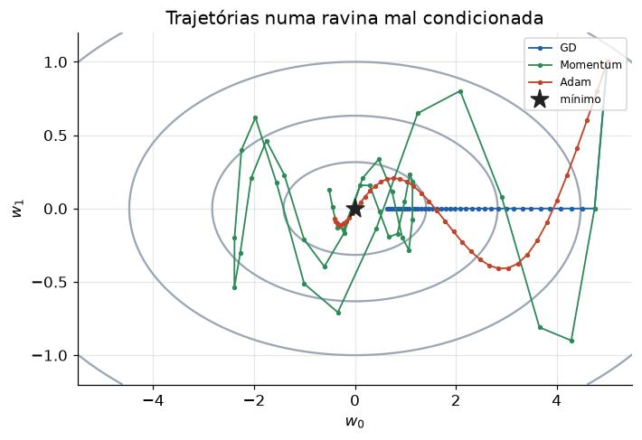

# Lição 028 — Otimizadores: momentum, RMSProp, Adam

> **Módulo:** M02 — Redes Neurais e Deep Learning · **Ordem de estudo:** 28 · **Tempo:** ~55 min
> **Pré-requisitos:** [013] Gradient descent · [025] Treinamento de redes profundas e inicialização
> **Classificação:** complemento de aprofundamento à ementa

> **Convenção de formatação:** matemática em LaTeX (`$...$` inline, `$$...$$` em
> destaque); figuras reprodutíveis geradas por `tools/figuras/gerar_figuras_m02.py`
> e incorporadas por caminho relativo `assets/<NNN>-<slug>/<nome>.png`; blocos
> ```python só para código e saída.

## Seção_Teórica

### Motivação

O gradient descent puro (Lição 013) tem dois problemas práticos em redes profundas:
ele **oscila** em "ravinas" mal condicionadas (onde uma direção é muito mais íngreme
que outra) e usa a **mesma** taxa de aprendizado para todos os parâmetros, mesmo que
cada um precise de um passo diferente. Treinar uma rede grande com GD puro é lento e
frágil.

Os otimizadores modernos resolvem isso. O **momentum** acumula uma média dos
gradientes e ganha inércia; o **RMSProp** adapta a taxa de cada parâmetro pela
magnitude recente do seu gradiente; e o **Adam** combina os dois com correção de bias,
sendo hoje o otimizador padrão de fato no deep learning. Entendê-los é essencial para
ajustar o treino e para entrevistas.

### Princípio de funcionamento

Todos partem do gradiente $g_t = \nabla L(\theta_t)$ e mudam **como** ele vira um
passo.

**Momentum** mantém uma velocidade $v$ (média exponencial dos gradientes) e anda na
direção dela:

$$ v_t = \beta\,v_{t-1} + g_t, \qquad \theta_t = \theta_{t-1} - \eta\,v_t. $$

**RMSProp** mantém uma média dos **quadrados** dos gradientes, $s$, e divide o passo
por $\sqrt{s}$, dando taxa adaptativa por parâmetro:

$$ s_t = \beta\,s_{t-1} + (1-\beta)\,g_t^2, \qquad \theta_t = \theta_{t-1} - \frac{\eta}{\sqrt{s_t}+\epsilon}\,g_t. $$

**Adam** combina os dois — primeiro momento $m$ (como momentum) e segundo momento $v$
(como RMSProp) — e corrige o **bias** de iniciar em zero:

$$ \hat{m}_t = \frac{m_t}{1-\beta_1^{t}}, \quad \hat{v}_t = \frac{v_t}{1-\beta_2^{t}}, \quad \theta_t = \theta_{t-1} - \frac{\eta}{\sqrt{\hat{v}_t}+\epsilon}\,\hat{m}_t. $$


*Figura 1 — Em uma ravina (curvatura muito maior em um eixo), o GD zigue-zagueia; momentum e Adam descem de forma mais direta.*

---

### Conceito central 1 — Momentum

O momentum substitui o gradiente instantâneo por uma **média móvel exponencial** dele.
Com gradiente constante, a velocidade cresce até o limite $1/(1-\beta)$ — um fator de
amplificação que acelera a marcha na direção consistente e cancela oscilações que se
alternam de sinal.

#### Exemplo_Resolvido 1.1

```python
import numpy as np

# Momentum acumula uma "velocidade" media dos gradientes, amortecendo a
# oscilacao em ravinas mal condicionadas e acelerando na direcao consistente.
# f(w) = 0.5*(w0^2 + 20*w1^2): vale estreito (curvatura 20x maior em w1).
def grad(w):
    return np.array([w[0], 20.0 * w[1]])

def perda(w):
    return 0.5 * (w[0] ** 2 + 20.0 * w[1] ** 2)

def gd(eta=0.05, passos=60):
    w = np.array([5.0, 1.0])
    for _ in range(passos):
        w = w - eta * grad(w)
    return perda(w)

def momentum(eta=0.05, beta=0.9, passos=60):
    w = np.array([5.0, 1.0])
    v = np.zeros(2)
    for _ in range(passos):
        v = beta * v + grad(w)
        w = w - eta * v
    return perda(w)

print(f"perda final GD:       {gd():.6f}")
print(f"perda final Momentum: {momentum():.6f}")
```

**Explicação passo a passo:**
- **Bloco 1 (`grad`/`perda`):** função quadrática mal condicionada (curvatura 20× maior em `w1`).
- **Bloco 2 (`gd`):** gradient descent puro por 60 passos.
- **Bloco 3 (`momentum`):** acumula `v = beta*v + grad` e anda na velocidade.
- **Bloco 4 (`print`):** na mesma quantidade de passos, o momentum atinge uma perda **menor** que o GD puro.

**Saída esperada:**
```
perda final GD:       0.026530
perda final Momentum: 0.021499
```

---

### Conceito central 2 — RMSProp: taxa adaptativa por parâmetro

O RMSProp divide o passo de cada parâmetro pela raiz da média dos quadrados dos seus
gradientes. O efeito é normalizar a **magnitude** do passo: no primeiro passo, ele
vale $\approx \eta/\sqrt{1-\beta}$ **independentemente** do tamanho do gradiente.

#### Exemplo_Resolvido 2.1

```python
import numpy as np

# RMSProp adapta a taxa de aprendizado POR PARAMETRO dividindo pelo RMS dos
# gradientes recentes (media movel dos quadrados). Direcoes ingremes recebem
# passos menores; direcoes planas, passos maiores.
def grad(w):
    return np.array([w[0], 20.0 * w[1]])

def perda(w):
    return 0.5 * (w[0] ** 2 + 20.0 * w[1] ** 2)

def rmsprop(eta=0.1, beta=0.9, eps=1e-8, passos=60):
    w = np.array([5.0, 1.0])
    s = np.zeros(2)
    for _ in range(passos):
        g = grad(w)
        s = beta * s + (1.0 - beta) * g * g
        w = w - eta * g / (np.sqrt(s) + eps)
    return perda(w), w

l, w = rmsprop()
print(f"perda final RMSProp: {l:.6f}")
print(f"w final: {np.round(w, 4)}")
```

**Explicação passo a passo:**
- **Bloco 1 (`grad`/`perda`):** mesma função mal condicionada.
- **Bloco 2 (`rmsprop`):** acumula `s` (média dos quadrados) e divide o passo por `sqrt(s)`.
- **Bloco 3 (`print`):** o parâmetro `w1` (íngreme) é levado a zero rapidamente e a perda final é menor que a do momentum, porque cada eixo recebe um passo proporcional à sua escala.

**Saída esperada:**
```
perda final RMSProp: 0.012759
w final: [0.1597 0.    ]
```

---

### Conceito central 3 — Adam e correção de bias

O Adam mantém dois momentos: $m$ (como o momentum) e $v$ (como o RMSProp). Como ambos
começam em **zero**, eles ficam enviesados para baixo nos primeiros passos; a correção
$\hat{m} = m/(1-\beta_1^{t})$ e $\hat{v} = v/(1-\beta_2^{t})$ compensa esse viés, e os
fatores tendem a 1 conforme $t$ cresce.

#### Exemplo_Resolvido 3.1

```python
import numpy as np

# Adam = Momentum (1o momento m) + RMSProp (2o momento v) + correcao de bias.
# A correcao de bias compensa o fato de m e v comecarem em zero.
def grad(w):
    return np.array([w[0], 20.0 * w[1]])

def perda(w):
    return 0.5 * (w[0] ** 2 + 20.0 * w[1] ** 2)

def adam(eta=0.2, b1=0.9, b2=0.999, eps=1e-8, passos=60):
    w = np.array([5.0, 1.0])
    m = np.zeros(2)
    v = np.zeros(2)
    for t in range(1, passos + 1):
        g = grad(w)
        m = b1 * m + (1.0 - b1) * g
        v = b2 * v + (1.0 - b2) * g * g
        m_hat = m / (1.0 - b1 ** t)     # correcao de bias do 1o momento
        v_hat = v / (1.0 - b2 ** t)     # correcao de bias do 2o momento
        w = w - eta * m_hat / (np.sqrt(v_hat) + eps)
    return perda(w)

print(f"perda final Adam: {adam():.6f}")
print(f"fator de correcao de bias no passo 1 (1o momento): {1.0 / (1.0 - 0.9 ** 1):.4f}")
```

**Explicação passo a passo:**
- **Bloco 1 (`grad`/`perda`):** a mesma função objetivo.
- **Bloco 2 (`adam`):** atualiza `m` e `v` e aplica a correção de bias antes do passo.
- **Bloco 3 (`print`):** o Adam minimiza a função e o fator de correção no passo 1 é $1/(1-0.9) = 10$ — um forte ajuste inicial que decai para 1.

**Saída esperada:**
```
perda final Adam: 0.023251
fator de correcao de bias no passo 1 (1o momento): 10.0000
```

## Seção_Prática

> **Como reproduzir:** execute cada solução de referência com
> `python trilha/solucoes/028-otimizadores/solucao_<n>.py` e compare a saída com o
> arquivo `.saida.txt` correspondente. Os esqueletos ficam em
> `trilha/pratica/028-otimizadores/exercicio_<n>.py`.

### Exercício 1 — Acúmulo de velocidade no momentum
- **Entrada inicial / setup:** gradiente constante `g = 1.0`, `beta = 0.9`, `v` inicial `0.0`, 5 passos.
- **Passos de execução:** atualize `v = beta*v + g` a cada passo; imprima `passo t: v=...` (4 casas) e ao final o limite teórico `1/(1-beta)`.
- **Critério de conclusão (binário):** a saída é **idêntica** a `solucao_1.saida.txt` (limite `10.0000`); qualquer divergência reprova.
- **Solução de referência:** `trilha/solucoes/028-otimizadores/solucao_1.py`
- **Saída esperada:** `trilha/solucoes/028-otimizadores/solucao_1.saida.txt`

### Exercício 2 — RMSProp normaliza o tamanho do passo
- **Entrada inicial / setup:** `eta = 0.01`, `beta = 0.9`, `eps = 1e-8`, `g = [100.0, 0.01]`.
- **Passos de execução:** calcule o primeiro passo `s = (1-beta)*g*g`, `passo = eta*g/(sqrt(s)+eps)`; imprima o gradiente, o passo efetivo (6 casas) e se os dois passos são quase iguais (`np.isclose`, atol=1e-4).
- **Critério de conclusão (binário):** a saída é **idêntica** a `solucao_2.saida.txt`, terminando com `True`; caso contrário, reprovado.
- **Solução de referência:** `trilha/solucoes/028-otimizadores/solucao_2.py`
- **Saída esperada:** `trilha/solucoes/028-otimizadores/solucao_2.saida.txt`

### Exercício 3 — Correção de bias do Adam
- **Entrada inicial / setup:** `b1 = 0.9`, `b2 = 0.999`, `t ∈ {1, 2, 3}`.
- **Passos de execução:** calcule os fatores `1/(1-b1**t)` e `1/(1-b2**t)`; imprima por linha `t=...: correcao 1o momento=... correcao 2o momento=...` (4 casas).
- **Critério de conclusão (binário):** a saída é **idêntica** a `solucao_3.saida.txt`; qualquer divergência reprova.
- **Solução de referência:** `trilha/solucoes/028-otimizadores/solucao_3.py`
- **Saída esperada:** `trilha/solucoes/028-otimizadores/solucao_3.saida.txt`
