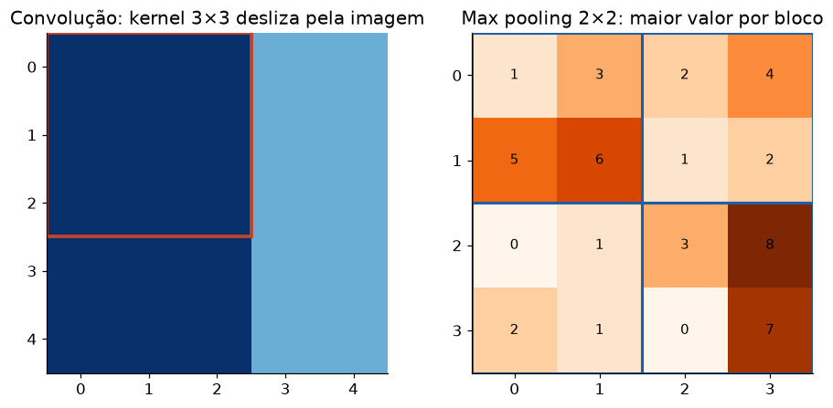

# Lição 029 — Redes Convolucionais (CNN): convolução e pooling

> **Módulo:** M02 — Redes Neurais e Deep Learning · **Ordem de estudo:** 29 · **Tempo:** ~55 min
> **Pré-requisitos:** [024] Multi-Layer Perceptron (MLP)
> **Classificação:** complemento de aprofundamento à ementa

> **Convenção de formatação:** matemática em LaTeX (`$...$` inline, `$$...$$` em
> destaque); figuras reprodutíveis geradas por `tools/figuras/gerar_figuras_m02.py`
> e incorporadas por caminho relativo `assets/<NNN>-<slug>/<nome>.png`; blocos
> ```python só para código e saída.

## Seção_Teórica

### Motivação

Aplicar um MLP denso a uma imagem é inviável: uma imagem $224\times224\times3$ tem
$\approx 150$ mil entradas, e uma única camada densa com mil neurônios teria $150$
**milhões** de pesos só na primeira camada. Pior: o MLP trata cada pixel como
independente e não aproveita a **estrutura espacial** — um padrão aprendido no canto
superior não é reconhecido no canto inferior.

As **redes convolucionais** resolvem os dois problemas com uma ideia: deslizar um
**filtro pequeno** por toda a imagem, **reaproveitando os mesmos pesos**. Isso captura
padrões locais (bordas, texturas) de forma **invariante à translação** e com ordens de
grandeza menos parâmetros. CNNs dominaram visão computacional e seus conceitos
(convolução, pooling, campos receptivos) aparecem até em arquiteturas de áudio e texto.

### Princípio de funcionamento

A operação central é a **convolução** (na prática, *cross-correlation*): um kernel
$K$ de tamanho $k\times k$ desliza pela imagem $I$ e, em cada posição, calcula a soma
do produto elemento a elemento:

$$ S(i,j) = \sum_{u=0}^{k-1}\sum_{v=0}^{k-1} I(i+u,\,j+v)\,K(u,v). $$

O resultado é um **mapa de ativação** que acende onde o padrão do kernel aparece. Os
hiperparâmetros são o **stride** $s$ (passo do deslizamento) e o **padding** $p$
(bordas adicionadas). O tamanho da saída é

$$ n_{out} = \left\lfloor \frac{n + 2p - k}{s} \right\rfloor + 1. $$

Depois da convolução costuma vir uma camada de **pooling**, que reduz a resolução
agregando blocos (o **max pooling** pega o maior valor; o **average pooling**, a
média), dando robustez a pequenas translações. A chave da eficiência é o
**compartilhamento de pesos**: os $k\times k$ parâmetros do kernel são os mesmos em
toda a imagem.


*Figura 1 — À esquerda, um kernel desliza e produz o mapa de ativação; à direita, o max pooling 2×2 reduz a resolução pela metade.*

---

### Conceito central 1 — Convolução 2D

Um kernel é um detector de padrão. Um kernel de **borda vertical**, com coluna
positiva à esquerda e negativa à direita, produz ativação alta exatamente onde a
imagem muda da esquerda para a direita.

#### Exemplo_Resolvido 1.1

```python
import numpy as np

# Convolucao 2D (cross-correlation): desliza um kernel pela imagem e calcula,
# em cada posicao, a soma do produto elemento a elemento (deteccao de padroes).
def conv2d(img, kernel):
    kh, kw = kernel.shape
    h, w = img.shape
    out = np.zeros((h - kh + 1, w - kw + 1))
    for i in range(out.shape[0]):
        for j in range(out.shape[1]):
            out[i, j] = np.sum(img[i:i + kh, j:j + kw] * kernel)
    return out

img = np.array([[1, 1, 1, 0, 0],
                [1, 1, 1, 0, 0],
                [1, 1, 1, 0, 0],
                [1, 1, 1, 0, 0],
                [1, 1, 1, 0, 0]], dtype=float)
kernel = np.array([[1, 0, -1],
                   [1, 0, -1],
                   [1, 0, -1]], dtype=float)   # detector de borda vertical
saida = conv2d(img, kernel)
print("shape:", img.shape, "->", saida.shape)
print("mapa de ativacao:\n", saida)
```

**Explicação passo a passo:**
- **Bloco 1 (`conv2d`):** desliza o kernel e calcula a soma do produto em cada posição válida.
- **Bloco 2 (`img`):** imagem com as três colunas da esquerda em 1 e as duas da direita em 0 — uma borda vertical entre as colunas 2 e 3.
- **Bloco 3 (`kernel`):** detector de borda vertical (coluna +1 à esquerda, −1 à direita).
- **Bloco 4 (`print`):** a saída $3\times3$ acende (valor 3) na coluna que cobre a transição $1\to0$ e é zero na região uniforme.

**Saída esperada:**
```
shape: (5, 5) -> (3, 3)
mapa de ativacao:
 [[0. 3. 3.]
 [0. 3. 3.]
 [0. 3. 3.]]
```

---

### Conceito central 2 — Pooling

O pooling reduz a resolução espacial agregando blocos disjuntos. O **max pooling**
mantém a ativação mais forte de cada bloco, o que dá invariância a pequenos
deslocamentos e diminui o custo das camadas seguintes.

#### Exemplo_Resolvido 2.1

```python
import numpy as np

# Pooling reduz a resolucao espacial agregando blocos. O max pooling pega o
# maior valor de cada bloco (preserva a ativacao mais forte e da robustez).
def max_pool(x, k=2):
    h, w = x.shape
    out = np.zeros((h // k, w // k))
    for i in range(h // k):
        for j in range(w // k):
            out[i, j] = x[i * k:(i + 1) * k, j * k:(j + 1) * k].max()
    return out

x = np.array([[1, 3, 2, 4],
              [5, 6, 1, 2],
              [0, 1, 3, 8],
              [2, 1, 0, 7]], dtype=float)
saida = max_pool(x, 2)
print("max pool 2x2:\n", saida)
print("shape:", x.shape, "->", saida.shape)
```

**Explicação passo a passo:**
- **Bloco 1 (`max_pool`):** percorre blocos $k\times k$ e guarda o máximo de cada um.
- **Bloco 2 (`x`):** uma matriz $4\times4$.
- **Bloco 3 (`print`):** cada bloco $2\times2$ vira seu maior valor — o canto inferior direito (que contém 8) preserva o 8; a saída é $2\times2$.

**Saída esperada:**
```
max pool 2x2:
 [[6. 4.]
 [2. 8.]]
shape: (4, 4) -> (2, 2)
```

---

### Conceito central 3 — Compartilhamento de parâmetros

A grande economia das CNNs vem de **reaproveitar** os pesos do kernel em toda a
imagem. Uma camada convolucional com poucos filtros pequenos tem ordens de grandeza
menos parâmetros que a camada densa equivalente.

#### Exemplo_Resolvido 3.1

```python
import numpy as np

# Compartilhamento de parametros: um filtro convolucional reaproveita os mesmos
# pesos em toda a imagem. Isso usa MUITO menos parametros que uma camada densa.
# Imagem 32x32x3, camada com 16 filtros 3x3x3 (stride 1, sem padding -> 30x30).
conv_params = 16 * (3 * 3 * 3 + 1)          # pesos do filtro + 1 vies por filtro
n_saida = 16 * 30 * 30                        # tamanho do mapa de saida achatado
dense_params = (32 * 32 * 3) * n_saida + n_saida   # densa totalmente conectada
print(f"parametros (conv):  {conv_params}")
print(f"parametros (densa): {dense_params}")
print(f"razao densa/conv: {dense_params / conv_params:.3e}")
```

**Explicação passo a passo:**
- **Bloco 1 (`conv_params`):** 16 filtros de $3\times3\times3$ mais um viés cada → 448 parâmetros, **independente** do tamanho da imagem.
- **Bloco 2 (`dense_params`):** uma camada densa que produzisse o mesmo número de saídas teria dezenas de milhões de pesos.
- **Bloco 3 (`print`):** a camada densa usa $\approx 10^{5}$ vezes mais parâmetros — daí a viabilidade das CNNs.

**Saída esperada:**
```
parametros (conv):  448
parametros (densa): 44251200
razao densa/conv: 9.878e+04
```

## Seção_Prática

> **Como reproduzir:** execute cada solução de referência com
> `python trilha/solucoes/029-cnn/solucao_<n>.py` e compare a saída com o arquivo
> `.saida.txt` correspondente. Os esqueletos ficam em
> `trilha/pratica/029-cnn/exercicio_<n>.py`.

### Exercício 1 — Convolução com detector de borda horizontal
- **Entrada inicial / setup:** `img = [[1,1,1,1],[1,1,1,1],[0,0,0,0],[0,0,0,0]]`; kernel horizontal `[[1,1,1],[0,0,0],[-1,-1,-1]]`; stride 1, sem padding.
- **Passos de execução:** implemente `conv2d` (cross-correlation) e aplique o kernel; imprima as shapes (entrada → saída) e o mapa de ativação.
- **Critério de conclusão (binário):** a saída é **idêntica** a `solucao_1.saida.txt` (mapa $2\times2$ com valor 3 na borda); qualquer divergência reprova.
- **Solução de referência:** `trilha/solucoes/029-cnn/solucao_1.py`
- **Saída esperada:** `trilha/solucoes/029-cnn/solucao_1.saida.txt`

### Exercício 2 — Average pooling 2×2
- **Entrada inicial / setup:** `x = [[1,3,2,4],[5,6,1,2],[0,1,3,8],[2,1,0,7]]`.
- **Passos de execução:** implemente `avg_pool(x, k=2)` (média de cada bloco) e aplique; imprima o resultado e as shapes (entrada → saída).
- **Critério de conclusão (binário):** a saída é **idêntica** a `solucao_2.saida.txt` (`[[3.75 2.25],[1. 4.5]]`); qualquer divergência reprova.
- **Solução de referência:** `trilha/solucoes/029-cnn/solucao_2.py`
- **Saída esperada:** `trilha/solucoes/029-cnn/solucao_2.saida.txt`

### Exercício 3 — Tamanho da saída de uma convolução
- **Entrada inicial / setup:** configs `(n,k,s,p)` = `(32,3,1,0)`, `(32,3,1,1)`, `(28,5,2,0)`.
- **Passos de execução:** implemente `dim_saida(n,k,s,p) = (n + 2p - k)//s + 1`; imprima por linha `n=... k=... s=... p=... -> out=...`.
- **Critério de conclusão (binário):** a saída é **idêntica** a `solucao_3.saida.txt` (`30`, `32`, `12`); qualquer divergência reprova.
- **Solução de referência:** `trilha/solucoes/029-cnn/solucao_3.py`
- **Saída esperada:** `trilha/solucoes/029-cnn/solucao_3.saida.txt`
