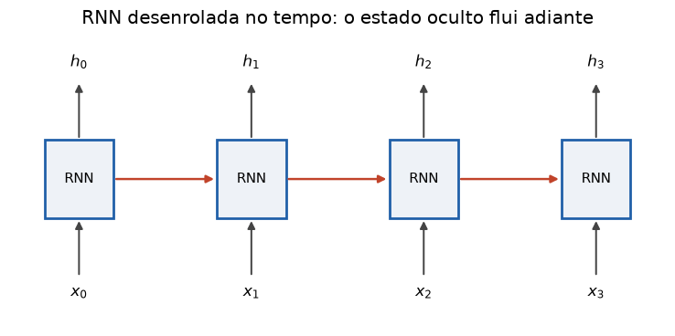

# Lição 030 — Redes Recorrentes: RNN, LSTM, GRU

> **Módulo:** M02 — Redes Neurais e Deep Learning · **Ordem de estudo:** 30 · **Tempo:** ~55 min
> **Pré-requisitos:** [024] Multi-Layer Perceptron (MLP) · [027] Vanishing e exploding gradients
> **Classificação:** complemento de aprofundamento à ementa

> **Convenção de formatação:** matemática em LaTeX (`$...$` inline, `$$...$$` em
> destaque); figuras reprodutíveis geradas por `tools/figuras/gerar_figuras_m02.py`
> e incorporadas por caminho relativo `assets/<NNN>-<slug>/<nome>.png`; blocos
> ```python só para código e saída.

## Seção_Teórica

### Motivação

MLPs e CNNs assumem entradas de **tamanho fixo**. Mas linguagem, áudio e séries
temporais são **sequências** de comprimento variável, onde a ordem importa e o
contexto passado influencia o presente. Precisamos de uma arquitetura com **memória**.

As **redes recorrentes (RNNs)** processam a sequência um passo de cada vez, mantendo
um **estado oculto** que resume o que já viram. Mas a RNN simples sofre de vanishing
gradient ao longo do tempo (Lição 027) e esquece dependências longas. **LSTM** e
**GRU** resolvem isso com **portões** que controlam o fluxo de memória. Embora os
Transformers (Lição 039+) tenham substituído RNNs em muitas tarefas, entender
recorrência e gating é essencial para a história e para muitos sistemas em produção.

### Princípio de funcionamento

Uma **RNN** aplica a **mesma** transformação a cada passo $t$, combinando a entrada
$x_t$ com o estado anterior $h_{t-1}$:

$$ h_t = \tanh\!\left(W_x x_t + W_h h_{t-1} + b\right). $$

O estado $h_t$ é a "memória". O problema: treinar uma RNN usa **backprop through
time**, que retropropaga pela mesma recorrência — o gradiente que volta $T$ passos é
um produto de $T$ fatores envolvendo $W_h$. Se a magnitude típica é $<1$, o gradiente
**desaparece** e a rede não aprende dependências longas.

A **LSTM** adiciona um **estado de célula** $c_t$ (uma memória de longo prazo) e três
portões — *forget* $f$, *input* $i$, *output* $o$:

$$ c_t = f \odot c_{t-1} + i \odot g, \qquad h_t = o \odot \tanh(c_t), $$

onde $g$ é um candidato. Quando $f \approx 1$ e $i \approx 0$, a célula é **preservada
quase intacta**, criando um caminho de gradiente estável. A **GRU** é uma versão mais
enxuta com um portão de atualização $z$ que **interpola** entre a memória antiga e a
nova: $h_t = (1-z)\,h_{t-1} + z\,\tilde{h}$.


*Figura 1 — A RNN desenrolada: a mesma célula é aplicada a cada passo, e o estado oculto $h_t$ carrega a memória adiante.*

---

### Conceito central 1 — A recorrência da RNN

A RNN é um laço: a cada passo, mistura a entrada atual com o estado anterior via
$\tanh$. O estado vai acumulando influência do passado, mas a $\tanh$ mantém os
valores limitados em $(-1, 1)$.

#### Exemplo_Resolvido 1.1

```python
import numpy as np

# RNN: estado oculto recorrente h_t = tanh(Wx*x_t + Wh*h_{t-1} + b).
# A cada passo, a rede combina a entrada atual com a "memoria" do passo anterior.
def rnn_step(x, h, Wx, Wh, b):
    return np.tanh(Wx * x + Wh * h + b)

Wx, Wh, b = 1.0, 0.5, 0.0
h = 0.0
seq = [1.0, -1.0, 0.5]
for t, x in enumerate(seq):
    h = rnn_step(x, h, Wx, Wh, b)
    print(f"t={t} x={x:+.1f} h={h:+.4f}")
```

**Explicação passo a passo:**
- **Bloco 1 (`rnn_step`):** a recorrência $\tanh(W_x x + W_h h + b)$.
- **Bloco 2 (parâmetros):** `Wh=0.5` dá peso à memória; `h` começa em 0.
- **Bloco 3 (laço):** processa a sequência; em `t=1`, o estado negativo reflete tanto a entrada `-1` quanto a memória positiva do passo anterior.
- **Resultado:** o estado oculto evolui passo a passo, sempre dentro de $(-1, 1)$.

**Saída esperada:**
```
t=0 x=+1.0 h=+0.7616
t=1 x=-1.0 h=-0.5506
t=2 x=+0.5 h=+0.2210
```

---

### Conceito central 2 — Vanishing gradient no tempo

Treinar uma RNN retropropaga pela recorrência: o gradiente que volta $T$ passos é
um produto de $T$ fatores ligados a $W_h$. É o mesmo fenômeno da Lição 027, agora ao
longo do **tempo**: com $|W_h| < 1$, dependências longas somem.

#### Exemplo_Resolvido 2.1

```python
import numpy as np

# Backprop through time (BPTT): o gradiente que volta T passos e ~ um produto de
# T fatores Wh (mesmo problema da Licao 027). Com |Wh| < 1 a memoria de longo
# prazo DESAPARECE; e por isso que LSTM/GRU foram inventadas.
for Wh in [0.5, 1.0]:
    print(f"Wh={Wh}:")
    for T in [5, 10, 20]:
        print(f"  T={T:2d}: |gradiente| ~ {abs(Wh) ** T:.3e}")
```

**Explicação passo a passo:**
- **Bloco 1 (laço de `Wh`):** compara um peso recorrente que encolhe ($0.5$) com um neutro ($1.0$).
- **Bloco 2 (laço de `T`):** o gradiente ao longo de `T` passos é $|W_h|^{T}$.
- **Resultado:** com `Wh=0.5`, o gradiente cai para $\approx 10^{-7}$ em 20 passos (memória longa perdida); com `Wh=1.0`, permanece — mas equilibrar isso na prática é difícil, daí o gating.

**Saída esperada:**
```
Wh=0.5:
  T= 5: |gradiente| ~ 3.125e-02
  T=10: |gradiente| ~ 9.766e-04
  T=20: |gradiente| ~ 9.537e-07
Wh=1.0:
  T= 5: |gradiente| ~ 1.000e+00
  T=10: |gradiente| ~ 1.000e+00
  T=20: |gradiente| ~ 1.000e+00
```

---

### Conceito central 3 — Gating de LSTM/GRU

Os portões são sigmoides em $(0,1)$ que funcionam como "válvulas". Na LSTM, o portão
de **forget** decide quanto da memória anterior manter; quando ele fica perto de 1, a
célula é preservada e o gradiente flui sem encolher.

#### Exemplo_Resolvido 3.1

```python
import numpy as np

# Celula LSTM: um estado de celula c (memoria de longo prazo) controlado por
# portoes (forget, input, output). O portao de forget perto de 1 PRESERVA a
# memoria, criando um caminho de gradiente estavel ao longo do tempo.
def sigmoid(z):
    return 1.0 / (1.0 + np.exp(-z))

x, h_prev, c_prev = 1.0, 0.0, 2.0
f = sigmoid(0.5 * x + 0.0 * h_prev + 2.0)    # forget: vies alto -> lembra
i = sigmoid(0.5 * x + 0.0 * h_prev + 0.0)    # input
g = np.tanh(1.0 * x + 0.0 * h_prev + 0.0)    # candidato
o = sigmoid(0.5 * x + 0.0 * h_prev + 0.0)    # output
c = f * c_prev + i * g
h = o * np.tanh(c)
print(f"forget={f:.4f} input={i:.4f} candidato={g:.4f} output={o:.4f}")
print(f"c_novo={c:.4f} h_novo={h:.4f}")
```

**Explicação passo a passo:**
- **Bloco 1 (`sigmoid`):** os portões são sigmoides em $(0,1)$.
- **Bloco 2 (portões):** o viés alto no forget o leva a $0.92$ (lembra quase tudo); os demais portões ficam em torno de $0.62$.
- **Bloco 3 (`c`):** o novo estado de célula combina a memória preservada `f*c_prev` com a nova informação `i*g`.
- **Bloco 4 (`print`):** a célula sobe de 2.0 para 2.32 e o estado oculto `h = o*tanh(c)` resume a memória para a saída.

**Saída esperada:**
```
forget=0.9241 input=0.6225 candidato=0.7616 output=0.6225
c_novo=2.3223 h_novo=0.6106
```

## Seção_Prática

> **Como reproduzir:** execute cada solução de referência com
> `python trilha/solucoes/030-rnn-lstm-gru/solucao_<n>.py` e compare a saída com o
> arquivo `.saida.txt` correspondente. Os esqueletos ficam em
> `trilha/pratica/030-rnn-lstm-gru/exercicio_<n>.py`.

### Exercício 1 — Forward de uma RNN escalar
- **Entrada inicial / setup:** `Wx=0.6`, `Wh=0.8`, `b=0.1`, `h` inicial `0.0`, sequência `[1.0, 0.0, -1.0, 0.5]`.
- **Passos de execução:** a cada passo calcule `h = tanh(Wx*x + Wh*h + b)`; imprima por linha `t=... x=... h=...` (h com 4 casas).
- **Critério de conclusão (binário):** a saída é **idêntica** a `solucao_1.saida.txt`; qualquer divergência reprova.
- **Solução de referência:** `trilha/solucoes/030-rnn-lstm-gru/solucao_1.py`
- **Saída esperada:** `trilha/solucoes/030-rnn-lstm-gru/solucao_1.saida.txt`

### Exercício 2 — Portão de atualização da GRU
- **Entrada inicial / setup:** `h_prev = 1.0`, `h_cand = 0.0`, `z ∈ {0.0, 0.25, 0.5, 1.0}`.
- **Passos de execução:** implemente `gru_update(z, h_prev, h_cand) = (1-z)*h_prev + z*h_cand`; imprima por linha `z=...: h=...` (z com 2 casas, h com 4 casas).
- **Critério de conclusão (binário):** a saída é **idêntica** a `solucao_2.saida.txt` (`z=0` mantém 1.0; `z=1` vira 0.0); qualquer divergência reprova.
- **Solução de referência:** `trilha/solucoes/030-rnn-lstm-gru/solucao_2.py`
- **Saída esperada:** `trilha/solucoes/030-rnn-lstm-gru/solucao_2.saida.txt`

### Exercício 3 — O portão de forget preserva a memória
- **Entrada inicial / setup:** `c` inicial `1.0`, input fechado, `f ∈ {0.5, 0.95}`, 10 passos.
- **Passos de execução:** evolua `c <- f*c` por 10 passos para cada `f`; imprima por linha `forget=...: c apos 10 passos = ...` (4 casas).
- **Critério de conclusão (binário):** a saída é **idêntica** a `solucao_3.saida.txt` (`0.5 → 0.0010`, `0.95 → 0.5987`); qualquer divergência reprova.
- **Solução de referência:** `trilha/solucoes/030-rnn-lstm-gru/solucao_3.py`
- **Saída esperada:** `trilha/solucoes/030-rnn-lstm-gru/solucao_3.saida.txt`
