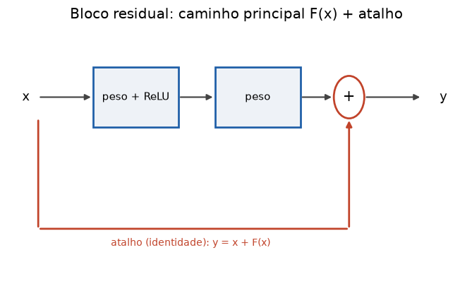

# Lição 031 — Arquiteturas profundas e transfer learning

> **Módulo:** M02 — Redes Neurais e Deep Learning · **Ordem de estudo:** 31 · **Tempo:** ~55 min
> **Pré-requisitos:** [029] Redes Convolucionais (CNN) · [030] Redes Recorrentes: RNN, LSTM, GRU
> **Classificação:** complemento de aprofundamento à ementa

> **Convenção de formatação:** matemática em LaTeX (`$...$` inline, `$$...$$` em
> destaque); figuras reprodutíveis geradas por `tools/figuras/gerar_figuras_m02.py`
> e incorporadas por caminho relativo `assets/<NNN>-<slug>/<nome>.png`; blocos
> ```python só para código e saída.

## Seção_Teórica

### Motivação

Em tese, redes mais profundas têm mais capacidade. Na prática, empilhar dezenas de
camadas piorava o resultado — não por overfitting, mas porque ficavam **difíceis de
otimizar** (o sinal e os gradientes degradam, Lições 025 e 027). A **conexão
residual** da ResNet (2015) resolveu isso e permitiu redes de centenas de camadas,
um marco do deep learning moderno (e a base dos Transformers, Lição 039+).

O segundo problema é prático: treinar uma rede grande do zero exige **muitos dados e
muito compute**. O **transfer learning** contorna isso reaproveitando um modelo já
treinado em uma tarefa grande e adaptando-o à sua tarefa com poucos dados. É a
abordagem dominante hoje — de visão a LLMs — e o que torna o deep learning acessível
sem um datacenter.

### Princípio de funcionamento

A **conexão residual** muda o que cada bloco aprende. Em vez de calcular diretamente a
saída $H(x)$, o bloco aprende um **resíduo** $F(x)$ e soma a entrada:

$$ y = x + F(x). $$

A consequência é dupla. Primeiro, se a camada ideal for próxima da identidade, basta
$F(x)\approx 0$ — fácil de aprender. Segundo, e mais importante, o gradiente tem um
**caminho direto**: $\frac{\partial y}{\partial x} = I + \frac{\partial F}{\partial x}$,
então mesmo que $\partial F/\partial x \approx 0$, o termo identidade garante que o
gradiente **flui sem desaparecer** — uma "rodovia" para o gradiente.

O **transfer learning** reaproveita um modelo pré-treinado em duas modalidades:

- **Feature extraction:** **congela** o backbone e treina apenas uma **cabeça** nova.
  Pouquíssimos parâmetros treináveis; ideal com poucos dados.
- **Fine-tuning:** descongela parte (ou todo) do backbone e ajusta com **taxa de
  aprendizado baixa**, refinando as features para a nova tarefa.


*Figura 1 — O bloco residual: a entrada `x` segue por F(x) e também por um atalho (skip), e as duas são somadas. O atalho é a rodovia do gradiente.*

---

### Conceito central 1 — Conexões residuais

A soma `x + F(x)` preserva o sinal. Empilhar muitas camadas comuns encolhe ou
distorce a entrada; com blocos residuais, mesmo que os blocos "não façam nada"
($F=0$), a informação atravessa intacta pelo atalho.

#### Exemplo_Resolvido 1.1

```python
import numpy as np

# Conexao residual (ResNet): y = x + F(x). O termo identidade cria uma "rodovia"
# para o gradiente: dy/dx = I + dF/dx, entao o gradiente flui mesmo se dF/dx ~ 0.
def relu(z):
    return np.maximum(0.0, z)

rng = np.random.default_rng(0)
x = rng.standard_normal(4)
W = rng.standard_normal((4, 4)) * 0.1
F = relu(W @ x)
y = x + F                       # conexao residual (skip connection)
print("x:        ", np.round(x, 4))
print("F(x):     ", np.round(F, 4))
print("y = x+F(x):", np.round(y, 4))
# Se o bloco F estiver "desligado" (F=0), y = x: a identidade e preservada.
print("com F=0, y==x:", np.allclose(x + np.zeros(4), x))
```

**Explicação passo a passo:**
- **Bloco 1 (`relu`):** ativação do resíduo.
- **Bloco 2 (`x`, `W`, `F`):** entrada aleatória e um resíduo pequeno `F(x)` (pesos escalados por 0.1).
- **Bloco 3 (`y`):** a saída soma a entrada ao resíduo — o atalho carrega `x` direto.
- **Bloco 4 (`allclose`):** com `F=0` o bloco vira a identidade, confirmando que o caminho do atalho preserva o sinal.

**Saída esperada:**
```
x:         [ 0.1257 -0.1321  0.6404  0.1049]
F(x):      [0.0819 0.     0.     0.0346]
y = x+F(x): [ 0.2077 -0.1321  0.6404  0.1395]
com F=0, y==x: True
```

---

### Conceito central 2 — Transfer learning: feature extraction

Na feature extraction, o backbone pré-treinado vira um **extrator de features
congelado** e só uma cabeça pequena é treinada. Isso reduz os parâmetros treináveis a
uma fração mínima do total — permitindo treinar com poucos exemplos sem overfitting.

#### Exemplo_Resolvido 2.1

```python
import numpy as np

# Transfer learning (feature extraction): reaproveita um backbone pre-treinado
# (CONGELADO) e treina apenas uma cabeca nova. So uma fracao minima dos pesos
# e treinavel, o que permite aprender com poucos dados.
base_params = 23_000_000              # backbone pre-treinado
head_params = 2048 * 10 + 10          # cabeca nova: 2048 features -> 10 classes
treinaveis = head_params
congelados = base_params
total = treinaveis + congelados
print(f"parametros base (congelados):   {congelados}")
print(f"parametros cabeca (treinaveis): {treinaveis}")
print(f"fracao treinavel: {treinaveis / total:.4%}")
```

**Explicação passo a passo:**
- **Bloco 1 (`base_params`):** um backbone típico com 23 milhões de pesos, todos congelados.
- **Bloco 2 (`head_params`):** uma cabeça linear de 2048 features para 10 classes (mais vieses).
- **Bloco 3 (`print`):** apenas $\approx 0.089\%$ dos parâmetros são treinados — é isso que torna a adaptação barata e rápida.

**Saída esperada:**
```
parametros base (congelados):   23000000
parametros cabeca (treinaveis): 20490
fracao treinavel: 0.0890%
```

---

### Conceito central 3 — Fine-tuning e o valor das features

Treinar uma cabeça pequena só funciona porque as features pré-treinadas já são
**boas**: elas carregam informação útil sobre os dados. Sobre features ricas, um
classificador linear simples atinge alta acurácia; sobre features sem sinal, fica no
acaso — é a evidência prática do porquê o transfer learning funciona.

#### Exemplo_Resolvido 3.1

```python
import numpy as np

# Feature extraction na pratica: sobre features "congeladas" (aqui simuladas por
# uma projecao fixa), basta treinar uma cabeca linear pequena para classificar.
def sigmoid(z):
    return 1.0 / (1.0 + np.exp(-z))

rng = np.random.default_rng(1)
N = 200
y = (rng.uniform(size=N) < 0.5).astype(float)
# features pre-treinadas (congeladas): a classe desloca a media -> separaveis
feats = rng.standard_normal((N, 8)) + y[:, None] * 1.5

w = np.zeros(8)
b = 0.0
eta = 0.1
for _ in range(300):                 # treina SO a cabeca linear
    p = sigmoid(feats @ w + b)
    g = p - y
    w -= eta * (feats.T @ g) / N
    b -= eta * g.mean()

pred = (sigmoid(feats @ w + b) >= 0.5).astype(float)
acc = (pred == y).mean()
print(f"acuracia da cabeca sobre features congeladas: {acc:.4f}")
print(f"parametros treinados: {w.size + 1}")
```

**Explicação passo a passo:**
- **Bloco 1 (`sigmoid`):** a cabeça é um classificador logístico.
- **Bloco 2 (`feats`):** features "pré-treinadas" em que a classe desloca a média — informativas.
- **Bloco 3 (laço):** treina apenas os 9 parâmetros da cabeça por gradient descent.
- **Bloco 4 (`print`):** com features boas, a cabeça atinge $97.5\%$ de acurácia treinando só 9 pesos.

**Saída esperada:**
```
acuracia da cabeca sobre features congeladas: 0.9750
parametros treinados: 9
```

## Seção_Prática

> **Como reproduzir:** execute cada solução de referência com
> `python trilha/solucoes/031-arquiteturas-profundas-transfer-learning/solucao_<n>.py`
> e compare a saída com o arquivo `.saida.txt` correspondente. Os esqueletos ficam em
> `trilha/pratica/031-arquiteturas-profundas-transfer-learning/exercicio_<n>.py`.

### Exercício 1 — Conexões residuais preservam o sinal
- **Entrada inicial / setup:** `rng = default_rng(5)`, `x0 = rng.standard_normal(4)`.
- **Passos de execução:** rede "plain" de 50 camadas `y = tanh(0.5*y)` (imprima a norma final); rede residual de 50 camadas com `F=0` (`y = y + 0.0`); confirme com `np.allclose` que a entrada é preservada e imprima a norma da entrada.
- **Critério de conclusão (binário):** a saída é **idêntica** a `solucao_1.saida.txt` (plain → norma `0.0000`; residual preserva → `True`); qualquer divergência reprova.
- **Solução de referência:** `trilha/solucoes/031-arquiteturas-profundas-transfer-learning/solucao_1.py`
- **Saída esperada:** `trilha/solucoes/031-arquiteturas-profundas-transfer-learning/solucao_1.saida.txt`

### Exercício 2 — Fração treinável por estratégia
- **Entrada inicial / setup:** `base = 23_000_000`, `ultimo_bloco = 2_000_000`, `cabeca = 20_490`; `total = base + cabeca`.
- **Passos de execução:** calcule os parâmetros treináveis de fine-tuning completo, feature extraction e fine-tuning parcial; imprima por linha `nome: treinaveis=... fracao=...` (fração em %, 4 casas).
- **Critério de conclusão (binário):** a saída é **idêntica** a `solucao_2.saida.txt` (feature extraction `0.0890%`, parcial `8.7769%`); qualquer divergência reprova.
- **Solução de referência:** `trilha/solucoes/031-arquiteturas-profundas-transfer-learning/solucao_2.py`
- **Saída esperada:** `trilha/solucoes/031-arquiteturas-profundas-transfer-learning/solucao_2.saida.txt`

### Exercício 3 — O valor das features pré-treinadas
- **Entrada inicial / setup:** `rng = default_rng(2)`, `N = 200`, `y = (uniform < 0.5)`; features úteis `= standard_normal((N,8)) + y*1.5` e aleatórias `= standard_normal((N,8))`.
- **Passos de execução:** treine a mesma cabeça logística (`w=zeros(8)`, `b=0`, `eta=0.1`, 300 passos) sobre cada conjunto; imprima a acurácia com features úteis e com aleatórias (4 casas).
- **Critério de conclusão (binário):** a saída é **idêntica** a `solucao_3.saida.txt` (úteis ≫ aleatórias); qualquer divergência reprova.
- **Solução de referência:** `trilha/solucoes/031-arquiteturas-profundas-transfer-learning/solucao_3.py`
- **Saída esperada:** `trilha/solucoes/031-arquiteturas-profundas-transfer-learning/solucao_3.saida.txt`
