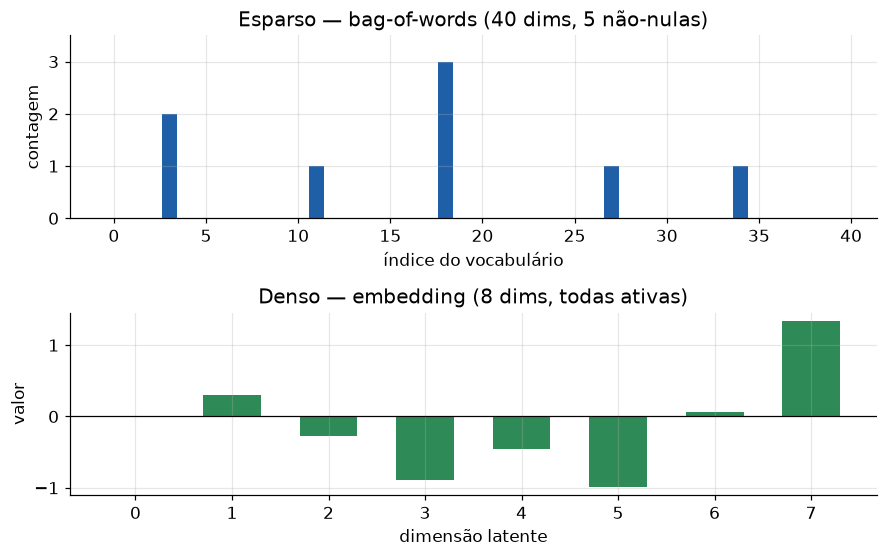

# Lição 032 — Fundamentos de NLP e representação de texto

> **Módulo:** M03 — NLP, Tokenização, Embeddings e Busca Vetorial · **Ordem de estudo:** 32 · **Tempo:** ~50 min
> **Pré-requisitos:** [011] O que é Machine Learning
> **Classificação:** complemento de aprofundamento à ementa

> **Convenção de formatação:** matemática em LaTeX (`$...$` inline, `$$...$$` em
> destaque, render nativo na pré-visualização do VS Code); figuras reprodutíveis
> geradas por `tools/figuras/gerar_figuras_m03.py` e incorporadas por caminho
> relativo `assets/<NNN>-<slug>/<nome>.png`; blocos ```python só para código e
> saída.

## Seção_Teórica

### Motivação

Um modelo de Machine Learning só sabe operar sobre **números**: produtos
internos, somas, gradientes. Texto, porém, chega como uma sequência de
caracteres. O primeiro problema de todo sistema de NLP — busca, classificação,
RAG — é **transformar texto em vetores** de forma que documentos parecidos
fiquem com vetores parecidos. Antes de embeddings neurais, a forma padrão (e
ainda hoje útil como linha de base e em buscadores como BM25) era contar
palavras: **bag-of-words** e **TF-IDF**. Entender essas representações esparsas
é o que dá sentido ao salto posterior para os vetores densos dos embeddings.

### Princípio de funcionamento

A ideia central é fixar um **vocabulário** $V = \{t_1, \ldots, t_{|V|}\}$ (todos
os termos distintos do corpus) e representar cada documento como um vetor em
$\mathbb{R}^{|V|}$. No **bag-of-words**, a coordenada $i$ é a contagem do termo
$t_i$ no documento — a ordem das palavras é ignorada ("saco" de palavras). Esse
vetor é **esparso**: quase todas as coordenadas são zero, pois um documento usa
poucas das milhares de palavras do vocabulário.

Contar puro dá peso demais a palavras muito comuns ("o", "de"). O **TF-IDF**
corrige isso multiplicando a frequência no documento (TF) por um fator que pune
termos presentes em muitos documentos (IDF):

$$ \text{tf}(t, d) = \frac{\text{contagem de } t \text{ em } d}{\text{total de tokens em } d}, \qquad \text{idf}(t) = \ln\!\frac{1 + N}{1 + \text{df}(t)} + 1, $$

onde $N$ é o número de documentos e $\text{df}(t)$ é em quantos deles $t$ aparece.
O peso final é $\text{tfidf}(t, d) = \text{tf}(t, d)\cdot\text{idf}(t)$: alto para
termos frequentes no documento e raros no corpus (os mais "discriminativos").
Para recuperar um pouco da ordem perdida, usamos **n-grams**: sequências
contíguas de $n$ tokens (o bigrama "nova york" carrega mais informação que "nova"
e "york" isolados).



*Figura 1 — Bag-of-words produz vetores longos e quase todos nulos; embeddings (próximas lições) produzem vetores curtos e densos que capturam semântica. Gerada por `tools/figuras/gerar_figuras_m03.py`.*

---

### Conceito central 1 — Bag-of-words

O **bag-of-words** (BoW) fixa um vocabulário ordenado e conta quantas vezes cada
termo aparece em cada documento. É a representação mais simples: descarta a ordem
e a gramática, mas já permite comparar documentos por sobreposição de palavras. O
vetor tem o tamanho do vocabulário e é **esparso**.

#### Exemplo_Resolvido 1.1

```python
# Bag-of-words: representa cada documento por contagens de palavras.
corpus = ["eu gosto de nlp", "eu gosto de python"]

def tokenizar(texto):
    return texto.split()

vocab = sorted({tok for doc in corpus for tok in tokenizar(doc)})
indice = {t: i for i, t in enumerate(vocab)}

def vetorizar(doc):
    v = [0] * len(vocab)
    for tok in tokenizar(doc):
        v[indice[tok]] += 1
    return v

print("vocabulario:", vocab)
for doc in corpus:
    print(f"{doc!r} -> {vetorizar(doc)}")
```

**Explicação passo a passo:**
- **Bloco 1 (`corpus`/`tokenizar`):** dois documentos curtos; a tokenização é a separação por espaços.
- **Bloco 2 (`vocab`/`indice`):** o vocabulário é o conjunto **ordenado** de termos distintos; `indice` mapeia cada termo a uma coordenada fixa do vetor.
- **Bloco 3 (`vetorizar`):** inicia um vetor de zeros do tamanho do vocabulário e soma 1 na posição de cada token encontrado.
- **Bloco 4 (`print`):** os documentos diferem só na última coordenada (`nlp` vs `python`); tudo o mais é compartilhado, o que torna os vetores parecidos.

**Saída esperada:**
```
vocabulario: ['de', 'eu', 'gosto', 'nlp', 'python']
'eu gosto de nlp' -> [1, 1, 1, 1, 0]
'eu gosto de python' -> [1, 1, 1, 0, 1]
```

---

### Conceito central 2 — TF-IDF

O **TF-IDF** pondera a contagem pela raridade do termo no corpus. Termos que
aparecem em todos os documentos (como "o") recebem IDF baixo e perdem peso;
termos raros e específicos recebem peso alto. É a base de buscadores clássicos e
uma linha de base forte para recuperação de documentos.

#### Exemplo_Resolvido 2.1

```python
import math

corpus2 = ["gato gato peixe", "cachorro peixe", "gato cachorro"]

def tf(termo, doc):
    toks = doc.split()
    return toks.count(termo) / len(toks)

def idf(termo, corpus):
    n = len(corpus)
    df = sum(1 for d in corpus if termo in d.split())
    return math.log((1 + n) / (1 + df)) + 1

doc0 = corpus2[0]  # "gato gato peixe"
for termo in ["gato", "peixe"]:
    print(f"{termo}: tf={tf(termo, doc0):.4f} "
          f"idf={idf(termo, corpus2):.4f} "
          f"tfidf={tf(termo, doc0) * idf(termo, corpus2):.4f}")
```

**Explicação passo a passo:**
- **Bloco 1 (`tf`):** a frequência do termo no documento é a contagem dividida pelo total de tokens; "gato" ocorre 2 de 3 vezes em `doc0` ($\approx 0.6667$).
- **Bloco 2 (`idf`):** usa a fórmula suavizada $\ln((1+N)/(1+\text{df})) + 1$; aqui "gato" e "peixe" têm a mesma df (2 documentos), logo o mesmo IDF.
- **Bloco 3 (laço):** com IDF igual, o TF-IDF de "gato" é o dobro do de "peixe" — porque "gato" é o dobro mais frequente **dentro** de `doc0`.

**Saída esperada:**
```
gato: tf=0.6667 idf=1.2877 tfidf=0.8585
peixe: tf=0.3333 idf=1.2877 tfidf=0.4292
```

---

### Conceito central 3 — N-grams

O bag-of-words descarta a ordem das palavras. Os **n-grams** recuperam parte dela
ao tratar sequências contíguas de $n$ tokens como unidades. Bigramas ($n=2$) e
trigramas ($n=3$) capturam expressões ("nova york", "não gostei") que mudam de
sentido quando quebradas. O custo é um vocabulário muito maior.

#### Exemplo_Resolvido 3.1

```python
def n_grams(tokens, n):
    return [tuple(tokens[i:i + n]) for i in range(len(tokens) - n + 1)]

tokens = "nlp transforma texto em numeros".split()
bigrams = n_grams(tokens, 2)
print("num bigramas:", len(bigrams))
for g in bigrams:
    print(" ".join(g))
```

**Explicação passo a passo:**
- **Bloco 1 (`n_grams`):** desliza uma janela de tamanho `n` sobre a lista de tokens; para `n` tokens há `len - n + 1` janelas.
- **Bloco 2 (`tokens`):** uma frase de 5 tokens, então há $5 - 2 + 1 = 4$ bigramas.
- **Bloco 3 (laço):** cada bigrama é um par contíguo; observe que a informação de sequência ("texto em", "em numeros") é preservada.

**Saída esperada:**
```
num bigramas: 4
nlp transforma
transforma texto
texto em
em numeros
```

## Seção_Prática

> **Como reproduzir:** execute cada solução de referência com
> `python trilha/solucoes/032-nlp-fundamentos/solucao_<n>.py` e compare a saída
> com o arquivo `.saida.txt` correspondente. Os enunciados/esqueletos ficam em
> `trilha/pratica/032-nlp-fundamentos/exercicio_<n>.py`.

### Exercício 1 — Vetorizador bag-of-words do zero
- **Entrada inicial / setup:** o corpus `["o gato dorme", "o cachorro corre", "o gato corre"]`; use apenas a biblioteca padrão.
- **Passos de execução:** construa o vocabulário **ordenado**, implemente `bag_of_words(doc, vocab)` que devolve o vetor de contagens e imprima o vocabulário e o vetor de cada documento.
- **Critério de conclusão (binário):** a saída é **exatamente** igual a `solucao_1.saida.txt` (vocabulário `['cachorro', 'corre', 'dorme', 'gato', 'o']` e os três vetores de contagem); qualquer divergência reprova.
- **Solução de referência:** `trilha/solucoes/032-nlp-fundamentos/solucao_1.py`
- **Saída esperada:** `trilha/solucoes/032-nlp-fundamentos/solucao_1.saida.txt`

### Exercício 2 — TF-IDF com IDF suavizado
- **Entrada inicial / setup:** o mesmo corpus do Exercício 1 e o documento alvo `"o gato dorme"`; use `math.log` (logaritmo natural).
- **Passos de execução:** implemente `tf`, `doc_freq`, `idf` (com a fórmula suavizada $\ln((1+N)/(1+\text{df})) + 1$) e `tfidf`, e imprima `df`, `idf` e `tfidf` dos termos `o`, `gato` e `dorme` com 4 casas decimais.
- **Critério de conclusão (binário):** a saída é **exatamente** igual a `solucao_2.saida.txt` (em particular `o` tem `idf=1.0000` e `gato` tem `tfidf=0.4292`); qualquer divergência reprova.
- **Solução de referência:** `trilha/solucoes/032-nlp-fundamentos/solucao_2.py`
- **Saída esperada:** `trilha/solucoes/032-nlp-fundamentos/solucao_2.saida.txt`

### Exercício 3 — N-grams e bigrama mais frequente
- **Entrada inicial / setup:** a frase `"o gato e o cachorro"` e o corpus `["o gato corre", "o gato dorme", "o cachorro corre"]`.
- **Passos de execução:** implemente `n_grams(tokens, n)`, imprima unigrams, bigrams e trigrams da frase e, usando `collections.Counter`, identifique o bigrama mais frequente do corpus e sua contagem.
- **Critério de conclusão (binário):** a saída é **exatamente** igual a `solucao_3.saida.txt` (o bigrama mais comum é `o gato -> 2`); qualquer divergência reprova.
- **Solução de referência:** `trilha/solucoes/032-nlp-fundamentos/solucao_3.py`
- **Saída esperada:** `trilha/solucoes/032-nlp-fundamentos/solucao_3.saida.txt`
