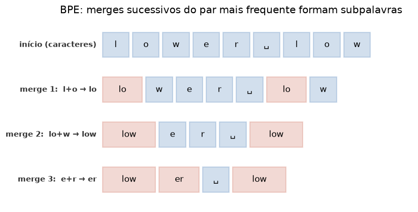

# Lição 033 — Tokenização: BPE, WordPiece e SentencePiece

> **Módulo:** M03 — NLP, Tokenização, Embeddings e Busca Vetorial · **Ordem de estudo:** 33 · **Tempo:** ~55 min
> **Pré-requisitos:** [032] Fundamentos de NLP e representação de texto
> **Classificação:** complemento de aprofundamento à ementa

> **Convenção de formatação:** matemática em LaTeX (`$...$` inline, `$$...$$` em
> destaque, render nativo na pré-visualização do VS Code); figuras reprodutíveis
> geradas por `tools/figuras/gerar_figuras_m03.py` e incorporadas por caminho
> relativo `assets/<NNN>-<slug>/<nome>.png`; blocos ```python só para código e
> saída.

## Seção_Teórica

### Motivação

Um LLM não enxerga caracteres nem palavras: ele opera sobre **tokens**, unidades
inteiras de um vocabulário fixo. Se tokenizássemos por caractere, as sequências
ficariam longas demais; se por palavra, o vocabulário seria gigante e qualquer
palavra nova viraria "desconhecida". A solução moderna é a **tokenização em
subpalavras**: pedaços frequentes viram um token só ("token", "##ização"),
enquanto palavras raras se decompõem em pedaços menores. Isso mantém o
vocabulário em dezenas de milhares de itens e **cobre qualquer texto** sem
"buracos". BPE, WordPiece e SentencePiece são as três famílias usadas por GPT,
BERT e Llama. Como o tokenizador fica entre o texto cru e o modelo, ele precisa
ser **reversível**: o que entra como texto tem de poder voltar a ser exatamente
o mesmo texto.

### Princípio de funcionamento

Todos os esquemas partem de unidades pequenas e **aprendem** quais pedaços valem
a pena fundir num corpus. O **BPE** (Byte-Pair Encoding) começa com caracteres e,
repetidamente, funde o **par adjacente mais frequente** num novo símbolo,
registrando a ordem dos merges. Aplicar o tokenizador é reexecutar esses merges
na mesma ordem. O **WordPiece** (BERT) usa um vocabulário fixo e segmenta cada
palavra pelo **maior pedaço que está no vocabulário** (greedy longest-match),
marcando continuações com o prefixo `##`. O **SentencePiece** trata o texto como
um fluxo bruto de Unicode — inclusive os espaços, codificados pelo metasímbolo
`▁` — o que o torna **reversível por construção** e independente de idioma.

A propriedade que amarra tudo é a **reversibilidade**. Se $E$ é a codificação
(texto → ids) e $D$ a decodificação (ids → texto), exigimos

$$ D(E(\text{texto})) = \text{texto} \quad \text{(igualdade exata, byte a byte).} $$

Essa é a propriedade de **ida-e-volta** (round-trip): qualquer perda aqui
corromperia silenciosamente as entradas e saídas do modelo.



*Figura 1 — Cada passo do BPE funde o par mais frequente; "l"+"o"→"lo", depois "lo"+"w"→"low". Gerada por `tools/figuras/gerar_figuras_m03.py`.*

---

### Conceito central 1 — BPE

O **Byte-Pair Encoding** aprende um vocabulário de subpalavras por fusões
gulosas: conta todos os pares de símbolos adjacentes no corpus, funde o mais
frequente e repete. A lista ordenada de merges *é* o tokenizador.

#### Exemplo_Resolvido 1.1

```python
from collections import Counter

# BPE: funde o par de caracteres adjacentes mais frequente.
vocab = {("a", "b", "a", "b", "</w>"): 4, ("a", "b", "c", "</w>"): 2}

def contar_pares(vocab):
    pares = Counter()
    for simbolos, freq in vocab.items():
        for i in range(len(simbolos) - 1):
            pares[(simbolos[i], simbolos[i + 1])] += freq
    return pares

pares = contar_pares(vocab)
melhor = max(pares.items(), key=lambda kv: (kv[1], kv[0]))
print("par mais frequente:", melhor[0], "freq", melhor[1])
```

**Explicação passo a passo:**
- **Bloco 1 (`vocab`):** cada palavra é uma tupla de símbolos com peso (frequência); `"abab"` ocorre 4 vezes e `"abc"` 2 vezes.
- **Bloco 2 (`contar_pares`):** soma, ponderada pela frequência, todas as ocorrências de cada par adjacente.
- **Bloco 3 (`melhor`):** o par `('a', 'b')` aparece 2 vezes em `abab` (×4) e 1 vez em `abc` (×2), totalizando $8 + 2 = 10$; é o primeiro a ser fundido.

**Saída esperada:**
```
par mais frequente: ('a', 'b') freq 10
```

---

### Conceito central 2 — WordPiece

O **WordPiece** parte de um vocabulário já treinado e segmenta cada palavra pelo
**maior prefixo presente no vocabulário**, repetindo a partir do ponto onde
parou. As continuações recebem o prefixo `##`. Se nenhum pedaço inicial casa, a
palavra vira `[UNK]`.

#### Exemplo_Resolvido 2.1

```python
vocab2 = {"token", "##iza", "##cao", "##s"}

def wordpiece(palavra, vocab):
    tokens, inicio = [], 0
    while inicio < len(palavra):
        fim = len(palavra)
        achou = None
        while fim > inicio:
            sub = palavra[inicio:fim]
            cand = sub if inicio == 0 else "##" + sub
            if cand in vocab:
                achou = cand
                break
            fim -= 1
        if achou is None:
            return ["[UNK]"]
        tokens.append(achou)
        inicio = fim
    return tokens

for p in ["tokenizacao", "tokens"]:
    print(f"{p} -> {wordpiece(p, vocab2)}")
```

**Explicação passo a passo:**
- **Bloco 1 (`vocab2`):** o vocabulário tem o pedaço inicial `token` e três continuações (`##iza`, `##cao`, `##s`).
- **Bloco 2 (`wordpiece`):** o laço externo avança pela palavra; o interno encurta o fim até achar o maior pedaço no vocabulário, adicionando `##` quando não está no início.
- **Bloco 3 (laço):** `tokenizacao` se decompõe em `token` + `##iza` + `##cao`; `tokens` em `token` + `##s`. A ordem greedy garante a segmentação mais longa primeiro.

**Saída esperada:**
```
tokenizacao -> ['token', '##iza', '##cao']
tokens -> ['token', '##s']
```

---

### Conceito central 3 — SentencePiece e reversibilidade

O **SentencePiece** trata o texto como um fluxo de Unicode e codifica o espaço
com o metasímbolo `▁`, o que o torna **reversível por construção**: basta
concatenar os pedaços e trocar `▁` de volta por espaço. Essa reversibilidade é a
base do exercício de ida-e-volta desta lição.

#### Exemplo_Resolvido 3.1

```python
ESPACO = "\u2581"

texto = "ola mundo"
vocab3 = {c: i for i, c in enumerate(sorted(set(texto.replace(" ", ESPACO))))}
inv = {i: c for c, i in vocab3.items()}

ids = [vocab3[c] for c in texto.replace(" ", ESPACO)]
recon = "".join(inv[i] for i in ids).replace(ESPACO, " ")
print("ids:", ids)
print("reconstruido:", repr(recon))
print("igual ao original:", recon == texto)
```

**Explicação passo a passo:**
- **Bloco 1 (`ESPACO`/`texto`):** o metasímbolo `▁` (U+2581) substitui o espaço, de modo que o limite entre palavras vira um caractere comum do vocabulário.
- **Bloco 2 (`vocab3`/`inv`):** o vocabulário mapeia cada caractere a um ID estável (ordem alfabética) e `inv` é o mapa inverso.
- **Bloco 3 (codifica/decodifica):** codificar é trocar caractere por ID; decodificar é concatenar os caracteres e devolver `▁` ao espaço.
- **Bloco 4 (`print`):** a reconstrução é **idêntica** ao original — a propriedade de ida-e-volta que a próxima seção exercita formalmente.

**Saída esperada:**
```
ids: [5, 2, 0, 7, 3, 6, 4, 1, 5]
reconstruido: 'ola mundo'
igual ao original: True
```

## Seção_Prática

> **Como reproduzir:** execute cada solução de referência com
> `python trilha/solucoes/033-tokenizacao/solucao_<n>.py` e compare a saída com o
> arquivo `.saida.txt` correspondente. Os enunciados/esqueletos ficam em
> `trilha/pratica/033-tokenizacao/exercicio_<n>.py`.

### Exercício 1 — Treinar merges de BPE
- **Entrada inicial / setup:** o corpus `{"low": 5, "lower": 2, "newest": 6, "widest": 3}` (palavra → frequência); cada palavra inicia como caracteres com o marcador `</w>`.
- **Passos de execução:** implemente `contar_pares` e `fundir_par`, execute **4 merges** escolhendo a cada passo o par mais frequente (desempate determinístico pelo par) e imprima cada merge e a lista final de subpalavras formadas.
- **Critério de conclusão (binário):** a saída é **exatamente** igual a `solucao_1.saida.txt` (o primeiro merge é `'t'+'</w>'` com freq 9 e a lista final é `['t</w>', 'st</w>', 'est</w>', 'ow']`); qualquer divergência reprova.
- **Solução de referência:** `trilha/solucoes/033-tokenizacao/solucao_1.py`
- **Saída esperada:** `trilha/solucoes/033-tokenizacao/solucao_1.saida.txt`

### Exercício 2 — Segmentação WordPiece (greedy longest-match)
- **Entrada inicial / setup:** o vocabulário `{"un", "happy", "##happy", "play", "##ing", "##ed", "##ness", "##ly"}` e as palavras `["unhappy", "playing", "playedly", "xyz"]`.
- **Passos de execução:** implemente `wordpiece(palavra, vocab)` que casa o maior prefixo disponível (com `##` nas continuações) e devolve `["[UNK]"]` quando falha; imprima cada palavra e seus tokens.
- **Critério de conclusão (binário):** a saída é **exatamente** igual a `solucao_2.saida.txt` (`unhappy -> ['un', '##happy']` e `xyz -> ['[UNK]']`); qualquer divergência reprova.
- **Solução de referência:** `trilha/solucoes/033-tokenizacao/solucao_2.py`
- **Saída esperada:** `trilha/solucoes/033-tokenizacao/solucao_2.saida.txt`

### Exercício 3 — Round-trip: ida-e-volta texto → ids → texto (igualdade exata)
- **Entrada inicial / setup:** os textos `["busca vetorial é incrível", "RAG: tokens -> ids -> tokens"]`, incluindo Unicode e pontuação; o espaço é codificado pelo metasímbolo `▁` (`"\u2581"`).
- **Passos de execução:** construa um vocabulário determinístico de caracteres, implemente `tokenizar(texto) -> ids` e `destokenizar(ids) -> texto` e verifique a propriedade de **ida-e-volta** `destokenizar(tokenizar(texto)) == texto`. Confirme também que um segundo parse produz os **mesmos** ids (parse → serialize → parse estável).
- **Critério de conclusão (binário):** para todo texto, `igual ao original: True` e `ids estaveis (2o parse igual): True`, terminando em `round-trip OK`; a saída deve ser idêntica a `solucao_3.saida.txt`. Qualquer divergência byte a byte reprova (R3.6).
- **Solução de referência:** `trilha/solucoes/033-tokenizacao/solucao_3.py`
- **Saída esperada:** `trilha/solucoes/033-tokenizacao/solucao_3.saida.txt`
