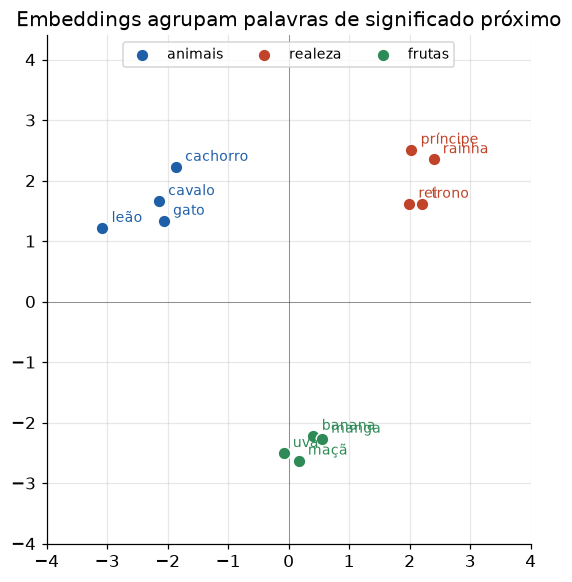

# Lição 034 — Embeddings: word2vec, GloVe e contextuais

> **Módulo:** M03 — NLP, Tokenização, Embeddings e Busca Vetorial · **Ordem de estudo:** 34 · **Tempo:** ~55 min
> **Pré-requisitos:** [005] Normas, produto interno e distâncias · [033] Tokenização
> **Classificação:** complemento de aprofundamento à ementa

> **Convenção de formatação:** matemática em LaTeX (`$...$` inline, `$$...$$` em
> destaque, render nativo na pré-visualização do VS Code); figuras reprodutíveis
> geradas por `tools/figuras/gerar_figuras_m03.py` e incorporadas por caminho
> relativo `assets/<NNN>-<slug>/<nome>.png`; blocos ```python só para código e
> saída.

## Seção_Teórica

### Motivação

O bag-of-words da Lição 032 trata "gato" e "felino" como coordenadas
**independentes**: seus vetores são ortogonais e a similaridade é zero, embora os
sentidos sejam próximos. **Embeddings** resolvem isso representando cada
token/palavra por um vetor **denso** de poucas centenas de dimensões, aprendido
de modo que palavras usadas em contextos parecidos fiquem **próximas** no espaço.
Esse é o substrato de toda busca semântica e de todo RAG: comparar significados
vira comparar vetores. Entender como esses vetores nascem (word2vec, GloVe) e
como evoluem para representações **contextuais** (BERT, GPT) é o que separa usar
embeddings como caixa-preta de saber escolher e diagnosticar uma representação.

### Princípio de funcionamento

A base é a **hipótese distribucional**: "uma palavra é caracterizada pela
companhia que mantém". O **word2vec** treina uma rede rasa para prever a palavra a
partir de sua vizinhança (CBOW) ou a vizinhança a partir da palavra (skip-gram);
os pesos da camada de entrada viram os embeddings. O **GloVe** parte de uma
matriz global de coocorrências e fatoriza-a para obter vetores cujos produtos
internos aproximam o log da coocorrência. Em ambos, o resultado é uma **tabela de
lookup**: token → vetor.

A geometria carrega significado. A proximidade é medida por **similaridade do
cosseno** (Lição 005); e relações semânticas viram **direções**, o que permite
**analogias** por aritmética de vetores:

$$ \vec{\text{rei}} - \vec{\text{homem}} + \vec{\text{mulher}} \approx \vec{\text{rainha}}. $$

O limite dos embeddings **estáticos** é que cada palavra tem um único vetor —
"manga" (fruta) e "manga" (da camisa) colidem. Os **embeddings contextuais**, dos
Transformers, geram um vetor **por ocorrência**, condicionado às palavras
vizinhas, desfazendo a ambiguidade.



*Figura 1 — Palavras de significado próximo formam clusters; relações (singular/plural, país/capital) aparecem como direções consistentes. Gerada por `tools/figuras/gerar_figuras_m03.py`.*

---

### Conceito central 1 — Embeddings densos e lookup

Um embedding é uma **tabela**: cada token mapeia para um vetor denso. A
semelhança entre dois tokens é a similaridade do cosseno entre seus vetores.
Buscar o "mais parecido" é, então, um problema de vizinho mais próximo nesse
espaço — exatamente o que a busca vetorial das próximas lições acelera.

#### Exemplo_Resolvido 1.1

```python
import math

def cos_sim(u, v):
    dot = sum(a * b for a, b in zip(u, v))
    nu = math.sqrt(sum(a * a for a in u))
    nv = math.sqrt(sum(b * b for b in v))
    return dot / (nu * nv)

# Embeddings densos pré-treinados (tabela de lookup), 3 dimensões.
emb = {
    "gato":     [0.9, 0.1, 0.0],
    "cachorro": [0.8, 0.2, 0.0],
    "carro":    [0.0, 0.1, 0.9],
}
print(f"cos(gato, cachorro) = {cos_sim(emb['gato'], emb['cachorro']):.4f}")
print(f"cos(gato, carro)    = {cos_sim(emb['gato'], emb['carro']):.4f}")
```

**Explicação passo a passo:**
- **Bloco 1 (`cos_sim`):** similaridade do cosseno do zero (produto interno normalizado pelas normas).
- **Bloco 2 (`emb`):** três vetores densos; "gato" e "cachorro" compartilham as duas primeiras dimensões (eixo "animal"), "carro" vive na terceira.
- **Bloco 3 (`print`):** o cosseno entre "gato" e "cachorro" é alto ($\approx 0.99$) e quase nulo entre "gato" e "carro" — a semântica virou geometria.

**Saída esperada:**
```
cos(gato, cachorro) = 0.9910
cos(gato, carro)    = 0.0122
```

---

### Conceito central 2 — Analogias vetoriais

Relações semânticas aparecem como **direções** constantes no espaço de
embeddings. Por isso a aritmética $b - a + c$ "transporta" uma relação e seu
vizinho mais próximo responde à analogia "a está para b assim como c está para
?".

#### Exemplo_Resolvido 2.1

```python
import math

def cos_sim(u, v):
    dot = sum(x * y for x, y in zip(u, v))
    nu = math.sqrt(sum(x * x for x in u))
    nv = math.sqrt(sum(y * y for y in v))
    return dot / (nu * nv)

emb = {
    "homem":  [2.0, 0.0],
    "mulher": [0.0, 2.0],
    "rei":    [2.0, 3.0],
    "rainha": [0.0, 5.0],
}
alvo = [r - h + m for r, h, m in zip(emb["rei"], emb["homem"], emb["mulher"])]
candidatos = {p: v for p, v in emb.items() if p not in ("rei", "homem", "mulher")}
mais_proximo = max(candidatos, key=lambda p: cos_sim(alvo, candidatos[p]))
print("vetor alvo:", alvo)
print("analogia rei - homem + mulher ~=", mais_proximo)
```

**Explicação passo a passo:**
- **Bloco 1 (`cos_sim`):** a mesma similaridade do cosseno.
- **Bloco 2 (`emb`):** vetores construídos de modo que a direção "realeza" e a direção "gênero" sejam ortogonais.
- **Bloco 3 (`alvo`):** $\vec{\text{rei}} - \vec{\text{homem}} + \vec{\text{mulher}} = [0, 5]$, que coincide com $\vec{\text{rainha}}$.
- **Bloco 4 (`mais_proximo`):** entre os candidatos, "rainha" é o de maior cosseno — a analogia se resolve por geometria.

**Saída esperada:**
```
vetor alvo: [0.0, 5.0]
analogia rei - homem + mulher ~= rainha
```

---

### Conceito central 3 — Embeddings contextuais

Embeddings **estáticos** dão um único vetor por palavra e não distinguem sentidos
de palavras ambíguas. Embeddings **contextuais** produzem um vetor **por
ocorrência**, condicionado à vizinhança. Modelamos isso de forma didática como a
média do vetor da palavra com os vetores do contexto.

#### Exemplo_Resolvido 3.1

```python
# Embedding contextual: a palavra é a média do seu vetor estático com o contexto.
estatico = {
    "banco": [0.5, 0.5],
    "dinheiro": [1.0, 0.0],
    "rio": [0.0, 1.0],
}
def contextual(palavra, contexto):
    vecs = [estatico[palavra]] + [estatico[c] for c in contexto]
    n = len(vecs)
    return [round(sum(v[i] for v in vecs) / n, 4) for i in range(2)]

c1 = contextual("banco", ["dinheiro"])
c2 = contextual("banco", ["rio"])
print("banco | dinheiro ->", c1)
print("banco | rio      ->", c2)
print("representacoes diferem:", c1 != c2)
```

**Explicação passo a passo:**
- **Bloco 1 (`estatico`):** "banco" tem um vetor neutro entre os eixos "finanças" e "natureza".
- **Bloco 2 (`contextual`):** a representação contextual é a média do vetor da palavra com os do contexto.
- **Bloco 3 (`print`):** com "dinheiro" o vetor pende para finanças `[0.75, 0.25]`; com "rio", para natureza `[0.25, 0.75]` — o **mesmo** token recebe representações diferentes conforme o contexto.

**Saída esperada:**
```
banco | dinheiro -> [0.75, 0.25]
banco | rio      -> [0.25, 0.75]
representacoes diferem: True
```

## Seção_Prática

> **Como reproduzir:** execute cada solução de referência com
> `python trilha/solucoes/034-embeddings/solucao_<n>.py` e compare a saída com o
> arquivo `.saida.txt` correspondente. Os enunciados/esqueletos ficam em
> `trilha/pratica/034-embeddings/exercicio_<n>.py`.

### Exercício 1 — Vizinho mais próximo numa tabela de embeddings
- **Entrada inicial / setup:** a tabela `emb` com `gato`, `cachorro`, `felino`, `carro` (vetores 3D dados no esqueleto) e a consulta `"gato"`.
- **Passos de execução:** implemente `cos_sim` e ordene as demais palavras por similaridade decrescente (desempate alfabético), imprimindo o ranking e o vizinho mais próximo.
- **Critério de conclusão (binário):** a saída é **exatamente** igual a `solucao_1.saida.txt` (`felino: 0.9980` lidera e `mais proximo de gato -> felino`); qualquer divergência reprova.
- **Solução de referência:** `trilha/solucoes/034-embeddings/solucao_1.py`
- **Saída esperada:** `trilha/solucoes/034-embeddings/solucao_1.saida.txt`

### Exercício 2 — Analogia vetorial país/capital
- **Entrada inicial / setup:** a tabela `emb` com `franca`, `paris`, `italia`, `roma`, `carro` (vetores 2D dados no esqueleto).
- **Passos de execução:** implemente `analogia(a, b, c, emb)` que calcula `alvo = b - a + c` e devolve o vizinho mais próximo (excluindo `a`, `b`, `c`); resolva "paris está para franca assim como ? está para italia".
- **Critério de conclusão (binário):** a saída é **exatamente** igual a `solucao_2.saida.txt` (`vetor alvo: [0.0, 2.0]` e `resposta: roma`); qualquer divergência reprova.
- **Solução de referência:** `trilha/solucoes/034-embeddings/solucao_2.py`
- **Saída esperada:** `trilha/solucoes/034-embeddings/solucao_2.saida.txt`

### Exercício 3 — Embedding contextual desambigua "manga"
- **Entrada inicial / setup:** a tabela `estatico` com `manga`, `fruta`, `comer`, `camisa`, `costura` (vetores 2D dados no esqueleto).
- **Passos de execução:** implemente `contextual(palavra, contexto)` como a média (arredondada a 4 casas) do vetor da palavra com os do contexto; compute a representação de `manga` nos contextos `["comer", "fruta"]` e `["camisa", "costura"]`.
- **Critério de conclusão (binário):** a saída é **exatamente** igual a `solucao_3.saida.txt` (`[0.8, 0.2]` vs `[0.2, 0.8]` e `o contexto muda a representacao: True`); qualquer divergência reprova.
- **Solução de referência:** `trilha/solucoes/034-embeddings/solucao_3.py`
- **Saída esperada:** `trilha/solucoes/034-embeddings/solucao_3.saida.txt`
