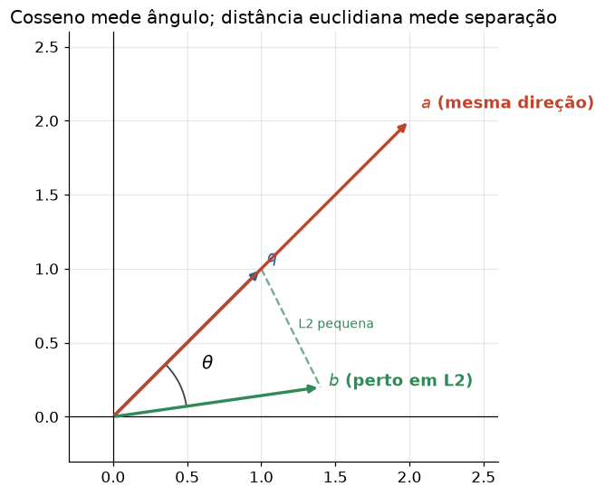

# Lição 035 — Métricas de distância e similaridade: cosseno, L2 e dot

> **Módulo:** M03 — NLP, Tokenização, Embeddings e Busca Vetorial · **Ordem de estudo:** 35 · **Tempo:** ~50 min
> **Pré-requisitos:** [005] Normas, produto interno e distâncias · [034] Embeddings
> **Classificação:** complemento de aprofundamento à ementa

> **Convenção de formatação:** matemática em LaTeX (`$...$` inline, `$$...$$` em
> destaque, render nativo na pré-visualização do VS Code); figuras reprodutíveis
> geradas por `tools/figuras/gerar_figuras_m03.py` e incorporadas por caminho
> relativo `assets/<NNN>-<slug>/<nome>.png`; blocos ```python só para código e
> saída.

## Seção_Teórica

### Motivação

Com embeddings em mãos, "buscar o documento mais relevante" vira "achar o vetor
mais parecido com a consulta". Mas **parecido como?** A escolha da métrica —
**cosseno**, **distância euclidiana (L2)** ou **produto interno (dot)** — define o
que conta como vizinho e pode mudar completamente o resultado da busca. É uma
decisão de projeto de todo banco vetorial (FAISS, pgvector, Qdrant) e uma das
perguntas mais frequentes em entrevistas de sistemas de RAG. Esta lição firma a
intuição geométrica de cada métrica e a relação prática entre elas.

### Princípio de funcionamento

Para vetores $\mathbf{u}, \mathbf{v} \in \mathbb{R}^n$:

$$ \mathbf{u}\cdot\mathbf{v} = \sum_i u_i v_i, \qquad \|\mathbf{u}-\mathbf{v}\|_2 = \sqrt{\sum_i (u_i - v_i)^2}, \qquad \cos\theta = \frac{\mathbf{u}\cdot\mathbf{v}}{\|\mathbf{u}\|_2\,\|\mathbf{v}\|_2}. $$

O **produto interno** cresce com o alinhamento *e* com a magnitude. A **distância
L2** mede a separação absoluta entre os pontos (sofre com a magnitude). O
**cosseno** isola o **ângulo**: é invariante à escala, por isso é o padrão para
embeddings, onde a magnitude costuma refletir comprimento de texto, não
significado.

A relação que amarra as três é simples e útil: se os vetores são **normalizados**
($\|\mathbf{u}\|_2 = \|\mathbf{v}\|_2 = 1$), então $\mathbf{u}\cdot\mathbf{v} = \cos\theta$ e

$$ \|\mathbf{u}-\mathbf{v}\|_2^2 = 2 - 2\,\mathbf{u}\cdot\mathbf{v}, $$

ou seja, **maior cosseno ⇔ menor distância L2**. Por isso, na prática,
normaliza-se uma vez e usa-se o produto interno (mais barato) para ranquear.



*Figura 1 — `a` tem a mesma direção de `q` (cosseno 1) mas está longe em L2; `b` está perto em L2 mas com direção diferente. Gerada por `tools/figuras/gerar_figuras_m03.py`.*

---

### Conceito central 1 — Similaridade do cosseno

O **cosseno** normaliza o produto interno pelas magnitudes e mede apenas a
direção. Vale 1 para vetores alinhados, 0 para ortogonais e −1 para opostos,
independentemente do tamanho. É a métrica padrão para comparar embeddings.

#### Exemplo_Resolvido 1.1

```python
import math

def dot(u, v):
    return sum(a * b for a, b in zip(u, v))

def norm(u):
    return math.sqrt(dot(u, u))

def cos_sim(u, v):
    return dot(u, v) / (norm(u) * norm(v))

def l2(u, v):
    return math.sqrt(sum((a - b) ** 2 for a, b in zip(u, v)))

u = [1.0, 2.0, 2.0]
v = [2.0, 0.0, 1.0]
print(f"dot = {dot(u, v):.4f}")
print(f"L2  = {l2(u, v):.4f}")
print(f"cos = {cos_sim(u, v):.4f}")
```

**Explicação passo a passo:**
- **Bloco 1 (`dot`/`norm`/`cos_sim`/`l2`):** as três medidas implementadas do zero.
- **Bloco 2 (`u`/`v`):** dois vetores 3D; $\|u\|_2 = 3$ e $\|v\|_2 = \sqrt{5}$.
- **Bloco 3 (`print`):** o produto interno é $1\cdot2 + 2\cdot0 + 2\cdot1 = 4$; a distância L2 é $\sqrt{6}\approx 2.4495$; o cosseno é $4/(3\sqrt{5})\approx 0.5963$.

**Saída esperada:**
```
dot = 4.0000
L2  = 2.4495
cos = 0.5963
```

---

### Conceito central 2 — Distância euclidiana (L2)

A **distância L2** mede a separação absoluta entre pontos. Diferente do cosseno,
ela **depende da magnitude**: um vetor alinhado mas muito maior pode ficar
"longe". Por isso os rankings por cosseno e por L2 podem discordar.

#### Exemplo_Resolvido 2.1

```python
import math

def dot(u, v):
    return sum(a * b for a, b in zip(u, v))

def norm(u):
    return math.sqrt(dot(u, u))

def cos_sim(u, v):
    return dot(u, v) / (norm(u) * norm(v))

def l2(u, v):
    return math.sqrt(sum((a - b) ** 2 for a, b in zip(u, v)))

q = [1.0, 1.0]
docs = {"A": [10.0, 10.0], "B": [1.0, 0.0], "C": [0.0, 2.0]}
top_cos = max(docs, key=lambda d: cos_sim(q, docs[d]))
top_l2 = min(docs, key=lambda d: l2(q, docs[d]))
print("ranking cosseno:", sorted(docs, key=lambda d: (-cos_sim(q, docs[d]), d)))
print("ranking L2:", sorted(docs, key=lambda d: (l2(q, docs[d]), d)))
print(f"top cosseno={top_cos} top L2={top_l2}")
```

**Explicação passo a passo:**
- **Bloco 1 (funções):** as mesmas medidas do exemplo anterior.
- **Bloco 2 (`q`/`docs`):** `A` tem exatamente a direção de `q` (cosseno 1), mas magnitude 10× maior.
- **Bloco 3 (rankings):** por cosseno, `A` vence (alinhamento perfeito); por L2, `B` vence (está mais perto em distância). As métricas **discordam** por causa da magnitude de `A`.

**Saída esperada:**
```
ranking cosseno: ['A', 'B', 'C']
ranking L2: ['B', 'C', 'A']
top cosseno=A top L2=B
```

---

### Conceito central 3 — Produto interno e normalização

Em vetores **normalizados**, o produto interno é exatamente o cosseno. Como
calcular um produto interno é mais barato do que recomputar normas a cada
comparação, bancos vetoriais normalizam os embeddings na ingestão e usam o dot
product para ranquear — obtendo a mesma ordem do cosseno.

#### Exemplo_Resolvido 3.1

```python
import math

def dot(u, v):
    return sum(a * b for a, b in zip(u, v))

def norm(u):
    return math.sqrt(dot(u, u))

def cos_sim(u, v):
    return dot(u, v) / (norm(u) * norm(v))

def normalizar(u):
    n = norm(u)
    return [x / n for x in u]

a = [3.0, 4.0]
b = [4.0, 3.0]
an, bn = normalizar(a), normalizar(b)
print(f"dot normalizado = {dot(an, bn):.4f}")
print(f"cosseno         = {cos_sim(a, b):.4f}")
print("dot(normalizado) == cosseno:", round(dot(an, bn), 6) == round(cos_sim(a, b), 6))
```

**Explicação passo a passo:**
- **Bloco 1 (funções):** produto interno, norma, cosseno e `normalizar` (divide pelo comprimento).
- **Bloco 2 (`a`/`b`):** dois vetores de norma 5 cada.
- **Bloco 3 (`print`):** após normalizar, o produto interno (`0.96`) coincide com o cosseno dos vetores originais — confirmando $\mathbf{u}\cdot\mathbf{v} = \cos\theta$ quando $\|\mathbf{u}\|=\|\mathbf{v}\|=1$.

**Saída esperada:**
```
dot normalizado = 0.9600
cosseno         = 0.9600
dot(normalizado) == cosseno: True
```

## Seção_Prática

> **Como reproduzir:** execute cada solução de referência com
> `python trilha/solucoes/035-metricas-distancia-similaridade/solucao_<n>.py` e
> compare a saída com o arquivo `.saida.txt` correspondente. Os
> enunciados/esqueletos ficam em `trilha/pratica/035-metricas-distancia-similaridade/exercicio_<n>.py`.

### Exercício 1 — As três métricas do zero
- **Entrada inicial / setup:** os vetores `u = [1.0, 2.0, 2.0]` e `v = [2.0, 3.0, 6.0]`; use apenas `math`.
- **Passos de execução:** implemente `dot`, `l2` e `cos_sim` e imprima as três medidas com 4 casas decimais.
- **Critério de conclusão (binário):** a saída é **exatamente** igual a `solucao_1.saida.txt` (`dot = 20.0000`, `L2 = 4.2426`, `cos = 0.9524`); qualquer divergência reprova.
- **Solução de referência:** `trilha/solucoes/035-metricas-distancia-similaridade/solucao_1.py`
- **Saída esperada:** `trilha/solucoes/035-metricas-distancia-similaridade/solucao_1.saida.txt`

### Exercício 2 — Quando cosseno e L2 discordam
- **Entrada inicial / setup:** a consulta `q = [1.0, 1.0]` e os documentos `A = [8.0, 8.0]`, `B = [1.0, 0.0]`, `C = [0.0, 3.0]`.
- **Passos de execução:** produza o ranking por cosseno (decrescente) e por L2 (crescente), com desempate alfabético, e indique o topo de cada e se eles discordam.
- **Critério de conclusão (binário):** a saída é **exatamente** igual a `solucao_2.saida.txt` (`top cosseno=A top L2=B` e `os rankings discordam: True`); qualquer divergência reprova.
- **Solução de referência:** `trilha/solucoes/035-metricas-distancia-similaridade/solucao_2.py`
- **Saída esperada:** `trilha/solucoes/035-metricas-distancia-similaridade/solucao_2.saida.txt`

### Exercício 3 — Normalizar torna dot = cosseno
- **Entrada inicial / setup:** a lista de pares `[([3,4],[4,3]), ([1,0],[0,5]), ([2,1],[4,2])]`.
- **Passos de execução:** implemente `normalizar` e, para cada par, compare o produto interno dos vetores normalizados com o cosseno dos originais (igualdade até 6 casas).
- **Critério de conclusão (binário):** a saída é **exatamente** igual a `solucao_3.saida.txt` (toda linha com `iguais=True`); qualquer divergência reprova.
- **Solução de referência:** `trilha/solucoes/035-metricas-distancia-similaridade/solucao_3.py`
- **Saída esperada:** `trilha/solucoes/035-metricas-distancia-similaridade/solucao_3.saida.txt`
