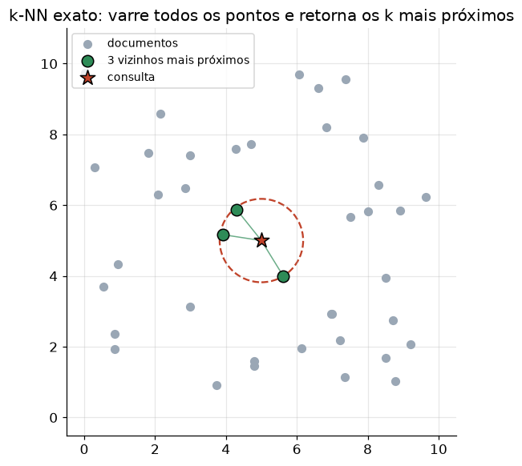

# Lição 036 — Busca vetorial e k-NN exato

> **Módulo:** M03 — NLP, Tokenização, Embeddings e Busca Vetorial · **Ordem de estudo:** 36 · **Tempo:** ~50 min
> **Pré-requisitos:** [035] Métricas de distância e similaridade
> **Classificação:** complemento de aprofundamento à ementa

> **Convenção de formatação:** matemática em LaTeX (`$...$` inline, `$$...$$` em
> destaque, render nativo na pré-visualização do VS Code); figuras reprodutíveis
> geradas por `tools/figuras/gerar_figuras_m03.py` e incorporadas por caminho
> relativo `assets/<NNN>-<slug>/<nome>.png`; blocos ```python só para código e
> saída.

## Seção_Teórica

### Motivação

Embeddings + métrica de similaridade dão a base; falta o **mecanismo de busca**:
dada uma consulta, encontrar os documentos mais parecidos numa coleção. É o
coração da recuperação em RAG e de qualquer busca semântica. A forma mais simples
e **exata** é o **k-NN por força bruta**: comparar a consulta com todos os
vetores e devolver os $k$ mais próximos. Ela é a referência de **recall perfeito**
contra a qual toda busca aproximada é medida. Entender exatamente como o k-NN
exato funciona — e por que seu custo explode com o tamanho da base — é o que
justifica os índices aproximados das próximas lições.

### Princípio de funcionamento

Seja uma base de $n$ vetores $\{\mathbf{x}_1, \ldots, \mathbf{x}_n\}$ em
$\mathbb{R}^d$ e uma consulta $\mathbf{q}$. A busca exata calcula a distância (ou
similaridade) de $\mathbf{q}$ a **cada** $\mathbf{x}_i$ e devolve os $k$ menores:

$$ \text{kNN}(\mathbf{q}) = \operatorname*{arg\,min}_{|S| = k}\ \sum_{\mathbf{x}_i \in S} \|\mathbf{q} - \mathbf{x}_i\|_2. $$

Operacionalmente: computa-se um vetor de $n$ distâncias e seleciona-se o topo
$k$. O resultado é **exato** — nenhum vizinho verdadeiro é perdido. O preço é o
custo: cada distância em $\mathbb{R}^d$ custa $O(d)$, e são $n$ delas, logo cada
consulta custa $O(n\cdot d)$. Com milhões de vetores e centenas de dimensões,
isso fica caro demais para latências de produção — daí a busca **aproximada**
(ANN) a seguir.



*Figura 1 — A busca exata varre todos os pontos; o círculo tracejado tem raio igual à distância do k-ésimo vizinho. Gerada por `tools/figuras/gerar_figuras_m03.py`.*

---

### Conceito central 1 — Busca linear exata

A **varredura linear** (brute force) compara a consulta com todos os vetores da
base e retorna o mais próximo. É simples, exata e serve de linha de base de
recall. O desempate determinístico (por identificador) garante resultados
reprodutíveis.

#### Exemplo_Resolvido 1.1

```python
import math

def l2(u, v):
    return math.sqrt(sum((a - b) ** 2 for a, b in zip(u, v)))

base = {
    "d1": [1.0, 1.0],
    "d2": [5.0, 5.0],
    "d3": [1.5, 0.5],
    "d4": [9.0, 1.0],
}
q = [1.0, 0.0]
mais_proximo = min(base, key=lambda d: (l2(q, base[d]), d))
print("mais proximo:", mais_proximo, f"(dist {l2(q, base[mais_proximo]):.4f})")
```

**Explicação passo a passo:**
- **Bloco 1 (`l2`):** distância euclidiana entre dois vetores.
- **Bloco 2 (`base`/`q`):** quatro vetores indexados e a consulta.
- **Bloco 3 (`min`):** percorre toda a base; a chave `(distância, id)` garante desempate determinístico. `d3 = [1.5, 0.5]` é o mais próximo de `[1, 0]`, a $\approx 0.7071$.

**Saída esperada:**
```
mais proximo: d3 (dist 0.7071)
```

---

### Conceito central 2 — k vizinhos mais próximos

Em recuperação, raramente queremos só o vizinho mais próximo: pegamos os **top-k**
para alimentar o gerador (em RAG) ou exibir resultados. Basta ordenar pela
distância e cortar nos $k$ primeiros.

#### Exemplo_Resolvido 2.1

```python
import math

def l2(u, v):
    return math.sqrt(sum((a - b) ** 2 for a, b in zip(u, v)))

base = {
    "d1": [1.0, 1.0],
    "d2": [5.0, 5.0],
    "d3": [1.5, 0.5],
    "d4": [9.0, 1.0],
}
q = [1.0, 0.0]

def knn(q, base, k):
    dists = sorted(((d, l2(q, base[d])) for d in base), key=lambda kv: (kv[1], kv[0]))
    return dists[:k]

for nome, dist in knn(q, base, 3):
    print(f"{nome}: {dist:.4f}")
```

**Explicação passo a passo:**
- **Bloco 1 (`l2`):** a mesma distância.
- **Bloco 2 (`knn`):** ordena todos os pares `(id, distância)` por distância (desempate por id) e devolve os `k` primeiros.
- **Bloco 3 (laço):** os 3 mais próximos de `[1, 0]` são `d3` (0.7071), `d1` (1.0) e `d2` (6.4031), nessa ordem.

**Saída esperada:**
```
d3: 0.7071
d1: 1.0000
d2: 6.4031
```

---

### Conceito central 3 — Custo da busca exata

A busca exata calcula **uma distância por vetor** da base, e cada distância
percorre as $d$ dimensões. Contar essas operações deixa explícito o custo
$O(n\cdot d)$ por consulta — que cresce linearmente com a base e motiva os índices
aproximados.

#### Exemplo_Resolvido 3.1

```python
import math

class ContaDist:
    def __init__(self):
        self.n = 0
    def l2(self, u, v):
        self.n += 1
        return math.sqrt(sum((a - b) ** 2 for a, b in zip(u, v)))

base = {
    "d1": [1.0, 1.0],
    "d2": [5.0, 5.0],
    "d3": [1.5, 0.5],
    "d4": [9.0, 1.0],
}
q = [1.0, 0.0]

c = ContaDist()
_ = sorted(base, key=lambda d: c.l2(q, base[d]))
print("vetores na base:", len(base))
print("calculos de distancia:", c.n)
print("custo ~ O(n*d):", f"{len(base)} x {len(q)} = {len(base) * len(q)} multiplicacoes")
```

**Explicação passo a passo:**
- **Bloco 1 (`ContaDist`):** envolve a distância num contador para medir quantas vezes ela é chamada.
- **Bloco 2 (`base`/`q`):** a mesma base de 4 vetores 2D.
- **Bloco 3 (`sorted` + `print`):** a varredura chama a distância exatamente `n = 4` vezes; como cada uma percorre `d = 2` dimensões, o custo é $4\times 2 = 8$ — o padrão $O(n\cdot d)$.

**Saída esperada:**
```
vetores na base: 4
calculos de distancia: 4
custo ~ O(n*d): 4 x 2 = 8 multiplicacoes
```

## Seção_Prática

> **Como reproduzir:** execute cada solução de referência com
> `python trilha/solucoes/036-busca-vetorial-knn-exato/solucao_<n>.py` e compare a
> saída com o arquivo `.saida.txt` correspondente. Os enunciados/esqueletos ficam
> em `trilha/pratica/036-busca-vetorial-knn-exato/exercicio_<n>.py`.

### Exercício 1 — Varredura linear exata
- **Entrada inicial / setup:** a base `{"doc_a":[2,3], "doc_b":[0,1], "doc_c":[5,4], "doc_d":[1,0]}` e a consulta `q = [1.0, 1.0]`.
- **Passos de execução:** implemente `l2`, imprima a distância de `q` a cada documento e o mais próximo (desempate por identificador).
- **Critério de conclusão (binário):** a saída é **exatamente** igual a `solucao_1.saida.txt` (`mais proximo: doc_b`); qualquer divergência reprova.
- **Solução de referência:** `trilha/solucoes/036-busca-vetorial-knn-exato/solucao_1.py`
- **Saída esperada:** `trilha/solucoes/036-busca-vetorial-knn-exato/solucao_1.saida.txt`

### Exercício 2 — Recuperar os top-3
- **Entrada inicial / setup:** a base com `doc_a`..`doc_e` (vetores 2D do esqueleto) e `q = [1.0, 1.0]`.
- **Passos de execução:** implemente `knn(q, base, k)` que ordena por distância (desempate por id) e devolve os `k` primeiros; imprima os 3 mais próximos com distância (4 casas).
- **Critério de conclusão (binário):** a saída é **exatamente** igual a `solucao_2.saida.txt` (os três primeiros são `doc_b`, `doc_d`, `doc_e`, todos a `1.0000`); qualquer divergência reprova.
- **Solução de referência:** `trilha/solucoes/036-busca-vetorial-knn-exato/solucao_2.py`
- **Saída esperada:** `trilha/solucoes/036-busca-vetorial-knn-exato/solucao_2.saida.txt`

### Exercício 3 — Custo O(n·d) da busca exata
- **Entrada inicial / setup:** uma base determinística de 8 vetores 4D (`v0..v7`, com `vi = [i, i+1, i+2, i+3]`) e `q = [3.0, 3.0, 3.0, 3.0]`.
- **Passos de execução:** instrumente a distância com um contador (classe `BaseVetorial`), faça a busca exata e imprima o vizinho mais próximo, o número de cálculos de distância e o custo `n*d`.
- **Critério de conclusão (binário):** a saída é **exatamente** igual a `solucao_3.saida.txt` (`calculos de distancia: 8` e `custo O(n*d) = 8 * 4 = 32 operacoes por consulta`); qualquer divergência reprova.
- **Solução de referência:** `trilha/solucoes/036-busca-vetorial-knn-exato/solucao_3.py`
- **Saída esperada:** `trilha/solucoes/036-busca-vetorial-knn-exato/solucao_3.saida.txt`
