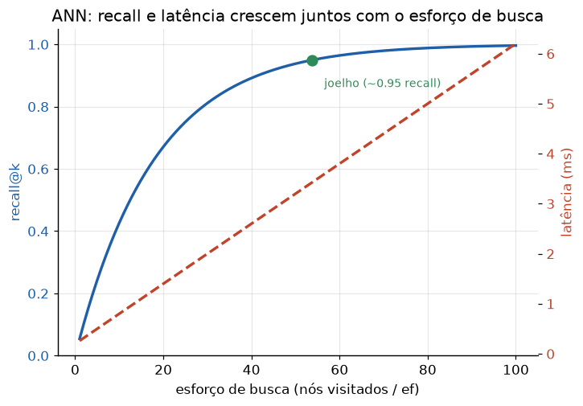

# Lição 037 — Busca aproximada (ANN) e trade-offs recall/latência

> **Módulo:** M03 — NLP, Tokenização, Embeddings e Busca Vetorial · **Ordem de estudo:** 37 · **Tempo:** ~55 min
> **Pré-requisitos:** [036] Busca vetorial e k-NN exato
> **Classificação:** complemento de aprofundamento à ementa

> **Convenção de formatação:** matemática em LaTeX (`$...$` inline, `$$...$$` em
> destaque, render nativo na pré-visualização do VS Code); figuras reprodutíveis
> geradas por `tools/figuras/gerar_figuras_m03.py` e incorporadas por caminho
> relativo `assets/<NNN>-<slug>/<nome>.png`; blocos ```python só para código e
> saída.

## Seção_Teórica

### Motivação

A busca exata da Lição 036 tem custo $O(n\cdot d)$ por consulta: ótima em
qualidade (recall perfeito), inviável em escala. Com milhões de embeddings e SLAs
de poucos milissegundos, não dá para varrer tudo. A **busca aproximada de
vizinhos** (ANN — *Approximate Nearest Neighbors*) troca um **pouco** de
qualidade por **muita** velocidade: aceita perder ocasionalmente um vizinho
verdadeiro em troca de examinar só uma fração da base. Todo banco vetorial de
produção (FAISS, pgvector, Qdrant, Milvus) é, no fundo, um índice ANN. Saber
medir e ajustar esse compromisso é a habilidade central de quem opera RAG em
escala.

### Princípio de funcionamento

A qualidade de uma busca aproximada é medida pelo **recall@k**: a fração dos $k$
vizinhos verdadeiros (os do k-NN exato) que o índice realmente recuperou:

$$ \text{recall@}k = \frac{|\,\text{aprox}_k \cap \text{exato}_k\,|}{k}. $$

Recall 1.0 significa resultado idêntico ao exato; 0.6667 significa que 2 de 3
vizinhos verdadeiros vieram. A estratégia ANN mais intuitiva é o **IVF** (*inverted
file*): particionar a base em clusters (por centróides) e, na consulta, examinar
apenas os clusters mais próximos — controlados pelo parâmetro **nprobe** (quantos
clusters visitar). Visitar poucos clusters é rápido mas pode perder vizinhos que
caíram num cluster vizinho; visitar mais clusters aproxima o resultado do exato.

Esse é o **trade-off recall × latência**: aumentar o esforço de busca (nprobe,
ou, em grafos, o parâmetro `ef`) eleva o recall **e** a latência juntos. Não
existe "melhor ponto" absoluto — existe o ponto adequado ao SLA da aplicação.



*Figura 1 — Quanto mais nós/clusters são visitados, maior o recall (satura perto de 1) e maior a latência. O "joelho" da curva costuma ser o melhor compromisso. Gerada por `tools/figuras/gerar_figuras_m03.py`.*

---

### Conceito central 1 — Busca aproximada e recall

A busca aproximada não garante os vizinhos verdadeiros; por isso medimos sua
qualidade pelo **recall@k** contra o k-NN exato como referência. É a métrica que
permite comparar índices e calibrar parâmetros.

#### Exemplo_Resolvido 1.1

```python
def recall_at_k(aprox, exato):
    return len(set(aprox) & set(exato)) / len(exato)

exato = ["d3", "d1", "d7"]
aprox = ["d3", "d1", "d9"]
print("exato:", exato)
print("aprox:", aprox)
print(f"recall@3 = {recall_at_k(aprox, exato):.4f}")
```

**Explicação passo a passo:**
- **Bloco 1 (`recall_at_k`):** o recall é o tamanho da interseção dividido por `k` (o tamanho do conjunto exato).
- **Bloco 2 (`exato`/`aprox`):** o índice aproximado acertou `d3` e `d1` mas trouxe `d9` no lugar de `d7`.
- **Bloco 3 (`print`):** 2 de 3 vizinhos corretos dão recall@3 $= 2/3 \approx 0.6667$.

**Saída esperada:**
```
exato: ['d3', 'd1', 'd7']
aprox: ['d3', 'd1', 'd9']
recall@3 = 0.6667
```

---

### Conceito central 2 — Índice IVF

O **IVF** particiona a base por centróides e guarda, para cada cluster, a lista
dos pontos que lhe pertencem (*inverted file*). Na consulta com `nprobe=1`,
examina-se só o cluster mais próximo — rápido, mas sujeito a perder vizinhos que
caíram em clusters vizinhos.

#### Exemplo_Resolvido 2.1

```python
import math

def l2(u, v):
    return math.sqrt(sum((a - b) ** 2 for a, b in zip(u, v)))

base = {
    "a0": [0.0, 0.0], "a1": [0.5, 0.5], "a2": [1.0, 1.0],
    "b0": [4.0, 4.0], "b1": [3.5, 3.5], "b2": [3.0, 3.0],
}
centroides = {"A": [0.5, 0.5], "B": [3.5, 3.5]}
listas = {c: [n for n in base
              if min(centroides, key=lambda c2: (l2(base[n], centroides[c2]), c2)) == c]
          for c in centroides}

q = [2.0, 2.0]
exato = [n for n, _ in sorted(((n, l2(q, base[n])) for n in base),
                              key=lambda kv: (kv[1], kv[0]))[:3]]
c_perto = min(centroides, key=lambda c: (l2(q, centroides[c]), c))
cand = sorted(((n, l2(q, base[n])) for n in listas[c_perto]), key=lambda kv: (kv[1], kv[0]))
aprox = [n for n, _ in cand[:3]]
print("exato:", exato)
print("aprox (nprobe=1):", aprox, "cluster:", c_perto)
print(f"recall@3 = {len(set(aprox) & set(exato)) / 3:.4f}")
```

**Explicação passo a passo:**
- **Bloco 1 (`l2`):** distância euclidiana.
- **Bloco 2 (`base`/`centroides`/`listas`):** dois clusters; `listas` é o inverted file (pontos de cada cluster).
- **Bloco 3 (`exato`):** o k-NN exato vê toda a base; a consulta `[2, 2]` está entre os dois clusters, e seu top-3 verdadeiro mistura `A` e `B` (`a2`, `b2`, `a1`).
- **Bloco 4 (`aprox`):** com `nprobe=1` só o cluster `A` é examinado; perde-se `b2`, resultando em recall@3 $\approx 0.6667$.

**Saída esperada:**
```
exato: ['a2', 'b2', 'a1']
aprox (nprobe=1): ['a2', 'a1', 'a0'] cluster: A
recall@3 = 0.6667
```

---

### Conceito central 3 — Trade-off recall × latência

Aumentar o esforço de busca aproxima o resultado do exato. No IVF, o controle é o
**nprobe**: visitar mais clusters eleva o recall e o custo (número de
comparações, proxy de latência). A escolha do ponto de operação depende do SLA.

#### Exemplo_Resolvido 3.1

```python
import math

def l2(u, v):
    return math.sqrt(sum((a - b) ** 2 for a, b in zip(u, v)))

base = {
    "a0": [0.0, 0.0], "a1": [0.5, 0.5], "a2": [1.0, 1.0],
    "b0": [4.0, 4.0], "b1": [3.5, 3.5], "b2": [3.0, 3.0],
    "c0": [0.0, 8.0], "c1": [0.5, 8.0], "c2": [1.0, 8.0],
}
centroides = {"A": [0.5, 0.5], "B": [3.5, 3.5], "C": [0.5, 8.0]}
listas = {c: [n for n in base
              if min(centroides, key=lambda c2: (l2(base[n], centroides[c2]), c2)) == c]
          for c in centroides}

q = [2.0, 2.0]
exato = [n for n, _ in sorted(((n, l2(q, base[n])) for n in base),
                              key=lambda kv: (kv[1], kv[0]))[:3]]

def ivf(q, k, nprobe):
    ordem = sorted(centroides, key=lambda c: (l2(q, centroides[c]), c))
    cand, comps = [], 0
    for c in ordem[:nprobe]:
        for n in listas[c]:
            comps += 1
            cand.append((n, l2(q, base[n])))
    top = [n for n, _ in sorted(cand, key=lambda kv: (kv[1], kv[0]))[:k]]
    return top, comps

print("exato top-3:", exato)
for nprobe in (1, 2, 3):
    top, comps = ivf(q, 3, nprobe)
    rec = len(set(top) & set(exato)) / 3
    print(f"nprobe={nprobe}: comparacoes={comps} recall@3={rec:.4f}")
```

**Explicação passo a passo:**
- **Bloco 1 (`l2`):** distância euclidiana.
- **Bloco 2 (`base`/`centroides`/`listas`):** três clusters; o terceiro (`C`) está longe da consulta.
- **Bloco 3 (`ivf`):** ordena os clusters por proximidade e examina os `nprobe` primeiros, contando comparações.
- **Bloco 4 (laço):** `nprobe=1` dá recall 0.6667 com 3 comparações; `nprobe=2` atinge recall 1.0 com 6 comparações; `nprobe=3` mantém recall 1.0 mas custa 9 comparações — mais esforço, mais latência, retorno decrescente.

**Saída esperada:**
```
exato top-3: ['a2', 'b2', 'a1']
nprobe=1: comparacoes=3 recall@3=0.6667
nprobe=2: comparacoes=6 recall@3=1.0000
nprobe=3: comparacoes=9 recall@3=1.0000
```

## Seção_Prática

> **Como reproduzir:** execute cada solução de referência com
> `python trilha/solucoes/037-busca-aproximada-ann/solucao_<n>.py` e compare a
> saída com o arquivo `.saida.txt` correspondente. Os enunciados/esqueletos ficam
> em `trilha/pratica/037-busca-aproximada-ann/exercicio_<n>.py`.

### Exercício 1 — Medir recall@k
- **Entrada inicial / setup:** três casos `(aprox, exato)`: idêntico, errando 1 de 3 e errando todos (dados no esqueleto).
- **Passos de execução:** implemente `recall_at_k(aprox, exato)` e imprima, para cada caso, `aprox`, `exato` e o recall@3 com 4 casas.
- **Critério de conclusão (binário):** a saída é **exatamente** igual a `solucao_1.saida.txt` (`1.0000`, `0.6667`, `0.0000`); qualquer divergência reprova.
- **Solução de referência:** `trilha/solucoes/037-busca-aproximada-ann/solucao_1.py`
- **Saída esperada:** `trilha/solucoes/037-busca-aproximada-ann/solucao_1.saida.txt`

### Exercício 2 — IVF com nprobe=1 vs k-NN exato
- **Entrada inicial / setup:** a base de 6 vetores (`a0..a2`, `b0..b2`) com centróides `A=[0.5,0.5]` e `B=[3.5,3.5]`; consulta `q = [2.0, 2.0]`.
- **Passos de execução:** construa o inverted file (`listas`), implemente `busca_exata` e `busca_ivf` e compare o top-3 exato com o aproximado de `nprobe=1`, imprimindo o recall.
- **Critério de conclusão (binário):** a saída é **exatamente** igual a `solucao_2.saida.txt` (`exato top-3: ['a2', 'b2', 'a1']` e `recall@3 = 0.6667`); qualquer divergência reprova.
- **Solução de referência:** `trilha/solucoes/037-busca-aproximada-ann/solucao_2.py`
- **Saída esperada:** `trilha/solucoes/037-busca-aproximada-ann/solucao_2.saida.txt`

### Exercício 3 — Varrer o trade-off recall × latência
- **Entrada inicial / setup:** a base de 9 vetores (`a*`, `b*`, `c*`) com três centróides; consulta `q = [2.0, 2.0]`.
- **Passos de execução:** implemente `busca_ivf(q, k, nprobe)` contando comparações e varra `nprobe ∈ {1, 2, 3}`, imprimindo comparações e recall@3 de cada.
- **Critério de conclusão (binário):** a saída é **exatamente** igual a `solucao_3.saida.txt` (recall sobe de `0.6667` para `1.0000` enquanto as comparações vão de 3 a 9); qualquer divergência reprova.
- **Solução de referência:** `trilha/solucoes/037-busca-aproximada-ann/solucao_3.py`
- **Saída esperada:** `trilha/solucoes/037-busca-aproximada-ann/solucao_3.saida.txt`
