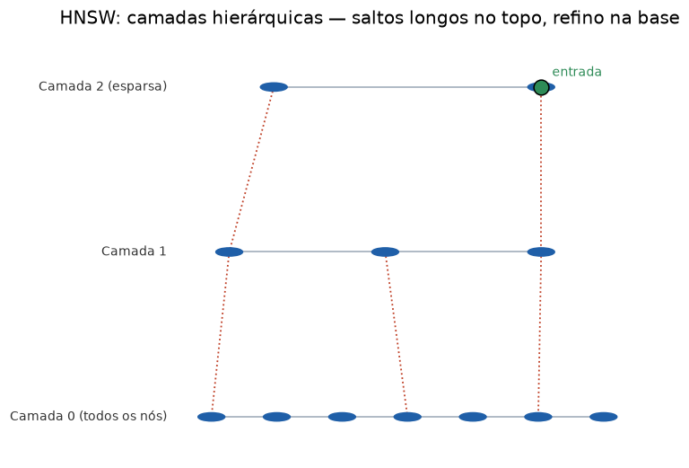

# Lição 038 — HNSW por dentro: grafos hierárquicos navegáveis

> **Módulo:** M03 — NLP, Tokenização, Embeddings e Busca Vetorial · **Ordem de estudo:** 38 · **Tempo:** ~55 min
> **Pré-requisitos:** [037] Busca aproximada (ANN) e trade-offs recall/latência
> **Classificação:** complemento de aprofundamento à ementa

> **Convenção de formatação:** matemática em LaTeX (`$...$` inline, `$$...$$` em
> destaque, render nativo na pré-visualização do VS Code); figuras reprodutíveis
> geradas por `tools/figuras/gerar_figuras_m03.py` e incorporadas por caminho
> relativo `assets/<NNN>-<slug>/<nome>.png`; blocos ```python só para código e
> saída.

## Seção_Teórica

### Motivação

O IVF da Lição 037 é uma família de índices ANN; a outra, dominante na prática, é
baseada em **grafos**. O **HNSW** (*Hierarchical Navigable Small World*) é o
algoritmo por trás de FAISS-HNSW, Qdrant, Weaviate e do `pgvector` com `hnsw`: na
maioria dos benchmarks é o que entrega o melhor recall por milissegundo. Entender
o HNSW "por dentro" — por que um grafo de vizinhança permite navegar até o
vizinho mais próximo, por que isso pode falhar, e como as camadas e o parâmetro
`ef` corrigem isso — é o que permite **ajustar** um banco vetorial com critério
em vez de aceitar os defaults.

### Princípio de funcionamento

A ideia base é o **grafo de vizinhança navegável**: cada vetor é um nó ligado a
alguns vizinhos próximos. A busca é **greedy** — partindo de um nó de entrada,
move-se sempre para o vizinho mais próximo da consulta, até que nenhum vizinho
melhore. Em grafos "small world" (com poucos atalhos longos), isso chega perto do
alvo em poucos passos.

O problema é que a busca greedy pode ficar presa num **ótimo local**: um nó cujos
vizinhos são todos piores, embora exista outro nó melhor não conectado a ele. O
HNSW ataca isso por dois mecanismos. Primeiro, **camadas hierárquicas**: como num
*skip list*, as camadas superiores são esparsas (poucos nós, arestas longas) e
servem para grandes saltos; a busca desce camada a camada, refinando, e a camada
0 contém todos os nós. Isso reduz o número de saltos de $O(n)$ para $O(\log n)$.
Segundo, a busca não guarda só o melhor nó, mas um **feixe** de tamanho `ef` (os
`ef` melhores candidatos a expandir): quanto maior o `ef`, mais o algoritmo
explora, escapa de ótimos locais e eleva o recall — ao custo de mais comparações.
Os dois parâmetros centrais são **M** (número de vizinhos por nó) e **ef**
(largura da busca), que reencarnam o trade-off recall × latência da lição
anterior.



*Figura 1 — As camadas superiores dão saltos longos; a busca desce até a camada 0, onde refina. Gerada por `tools/figuras/gerar_figuras_m03.py`.*

---

### Conceito central 1 — Grafo navegável e busca greedy

Num **grafo de vizinhança**, a busca greedy caminha sempre para o vizinho mais
próximo da consulta e para num ótimo local. Em grafos bem construídos, esse
ótimo local costuma ser o vizinho verdadeiro — mas nem sempre, como veremos.

#### Exemplo_Resolvido 1.1

```python
import math

def dist(u, v):
    return math.sqrt(sum((a - b) ** 2 for a, b in zip(u, v)))

coords = {i: [float(i), 0.0] for i in range(7)}
grafo = {0: [1, 3], 1: [0, 2], 2: [1, 3], 3: [2, 4, 0, 6],
         4: [3, 5], 5: [4, 6], 6: [5, 3]}
q = [4.2, 0.0]

def greedy(q, entrada):
    atual = entrada
    caminho = [atual]
    while True:
        melhor = min([atual] + grafo[atual], key=lambda n: (dist(q, coords[n]), n))
        if melhor == atual:
            break
        atual = melhor
        caminho.append(atual)
    return atual, caminho

no, caminho = greedy(q, 0)
print("caminho:", caminho)
print("no encontrado:", no, f"(dist {dist(q, coords[no]):.4f})")
```

**Explicação passo a passo:**
- **Bloco 1 (`dist`):** distância euclidiana.
- **Bloco 2 (`coords`/`grafo`):** 7 nós sobre uma reta; o nó 3 tem atalhos longos (para 0 e 6), tornando o grafo "small world".
- **Bloco 3 (`greedy`):** de cada nó, salta para o vizinho mais próximo de `q`; para quando o próprio nó é o melhor.
- **Bloco 4 (`print`):** partindo de 0, o atalho `0→3` aproxima rápido e `3→4` chega ao nó 4, o mais próximo de `4.2` — em apenas 2 saltos.

**Saída esperada:**
```
caminho: [0, 3, 4]
no encontrado: 4 (dist 0.2000)
```

---

### Conceito central 2 — Camadas hierárquicas

As **camadas** do HNSW funcionam como um *skip list* sobre o grafo: as superiores
são esparsas e dão saltos longos; a busca desce até a camada 0, onde refina. Isso
derruba o número de saltos de linear para logarítmico.

#### Exemplo_Resolvido 2.1

```python
import math

def dist(u, v):
    return math.sqrt(sum((a - b) ** 2 for a, b in zip(u, v)))

coords = {i: [float(i), 0.0] for i in range(10)}
layer0 = {i: [j for j in (i - 1, i + 1) if 0 <= j <= 9] for i in range(10)}
layer1 = {0: [5], 5: [0, 9], 9: [5]}
q = [8.3, 0.0]

def greedy_em(grafo, q, entrada):
    atual, hops = entrada, 0
    while True:
        melhor = min([atual] + grafo[atual], key=lambda n: (dist(q, coords[n]), n))
        if melhor == atual:
            break
        atual, hops = melhor, hops + 1
    return atual, hops

no_sl, hops_sl = greedy_em(layer0, q, 0)
entrada1, hops1 = greedy_em(layer1, q, 0)
no_h, hops0 = greedy_em(layer0, q, entrada1)
print(f"single-layer: no={no_sl} hops={hops_sl}")
print(f"hierarquico:  no={no_h} hops={hops1 + hops0} (L1={hops1} + L0={hops0})")
```

**Explicação passo a passo:**
- **Bloco 1 (`dist`):** distância euclidiana.
- **Bloco 2 (`coords`/`layer0`/`layer1`):** a camada 0 é uma cadeia (só vizinhos imediatos); a camada 1, esparsa, liga `0–5–9` com saltos longos.
- **Bloco 3 (`greedy_em`):** busca greedy genérica que conta saltos.
- **Bloco 4 (`print`):** na cadeia pura, ir de 0 ao nó 8 leva 8 saltos; com a camada 1, salta-se `0→5→9` e depois `9→8` na camada 0 — **3 saltos** para o mesmo resultado.

**Saída esperada:**
```
single-layer: no=8 hops=8
hierarquico:  no=8 hops=3 (L1=2 + L0=1)
```

---

### Conceito central 3 — Parâmetro ef

A busca do HNSW mantém um **feixe** dos `ef` melhores candidatos a expandir. Com
`ef=1` a busca é greedy pura e pode ficar presa num ótimo local; aumentar `ef`
explora mais, escapa da armadilha e eleva o recall, ao custo de mais comparações.

#### Exemplo_Resolvido 3.1

```python
import math

def dist(u, v):
    return math.sqrt(sum((a - b) ** 2 for a, b in zip(u, v)))

coords = {"e": [0.0, 0.0], "A": [1.0, 1.0], "B": [1.0, -1.0],
          "C": [2.0, 2.0], "T": [3.0, 0.0]}
grafo = {"e": ["A", "B"], "A": ["e", "C"], "B": ["e", "T"],
         "C": ["A"], "T": ["B"]}
q = [3.1, 0.0]
exato = min(coords, key=lambda n: (dist(q, coords[n]), n))

def search_layer(q, entrada, ef):
    visitados = {entrada}
    candidatos = [entrada]
    resultado = [entrada]
    comps = 1
    while candidatos:
        c = min(candidatos, key=lambda n: (dist(q, coords[n]), n))
        candidatos.remove(c)
        pior = max(resultado, key=lambda n: (dist(q, coords[n]), n))
        if dist(q, coords[c]) > dist(q, coords[pior]):
            break
        for nb in grafo[c]:
            if nb not in visitados:
                visitados.add(nb)
                comps += 1
                pior = max(resultado, key=lambda n: (dist(q, coords[n]), n))
                if dist(q, coords[nb]) < dist(q, coords[pior]) or len(resultado) < ef:
                    candidatos.append(nb)
                    resultado.append(nb)
                    if len(resultado) > ef:
                        pior = max(resultado, key=lambda n: (dist(q, coords[n]), n))
                        resultado.remove(pior)
    melhor = min(resultado, key=lambda n: (dist(q, coords[n]), n))
    return melhor, comps

print("exato:", exato)
for ef in (1, 2, 3):
    achado, comps = search_layer(q, "e", ef)
    print(f"ef={ef}: achado={achado} comparacoes={comps} acerto={achado == exato}")
```

**Explicação passo a passo:**
- **Bloco 1 (`dist`):** distância euclidiana.
- **Bloco 2 (`coords`/`grafo`):** o grafo tem uma armadilha — pela ramificação `A→C` a busca se afasta do alvo `T`, que só é alcançável via `B`.
- **Bloco 3 (`search_layer`):** a busca em feixe do HNSW; mantém os `ef` melhores candidatos e só para quando o melhor candidato a expandir é pior que o pior do resultado.
- **Bloco 4 (laço):** com `ef=1` a busca fica presa em `C` (ótimo local, erra); com `ef≥2` o feixe mantém também `B`, alcança `T` e acerta — pagando 1 comparação a mais.

**Saída esperada:**
```
exato: T
ef=1: achado=C comparacoes=4 acerto=False
ef=2: achado=T comparacoes=5 acerto=True
ef=3: achado=T comparacoes=5 acerto=True
```

## Seção_Prática

> **Como reproduzir:** execute cada solução de referência com
> `python trilha/solucoes/038-hnsw/solucao_<n>.py` e compare a saída com o arquivo
> `.saida.txt` correspondente. Os enunciados/esqueletos ficam em
> `trilha/pratica/038-hnsw/exercicio_<n>.py`.

### Exercício 1 — Busca greedy em grafo navegável
- **Entrada inicial / setup:** 7 nós em `coords = {i: [i, 0]}` e o `grafo` com atalhos no nó 3 (dado no esqueleto); consulta `q = [4.2, 0.0]`, entrada no nó 0.
- **Passos de execução:** implemente `greedy(q, entrada)` que salta para o vizinho mais próximo (desempate por id) até estabilizar; imprima o caminho e o nó final com a distância.
- **Critério de conclusão (binário):** a saída é **exatamente** igual a `solucao_1.saida.txt` (`caminho: [0, 3, 4]` e `no encontrado: 4 (dist 0.2000)`); qualquer divergência reprova.
- **Solução de referência:** `trilha/solucoes/038-hnsw/solucao_1.py`
- **Saída esperada:** `trilha/solucoes/038-hnsw/solucao_1.saida.txt`

### Exercício 2 — Camadas hierárquicas reduzem saltos
- **Entrada inicial / setup:** 10 nós em cadeia na `layer0` e a `layer1` esparsa `{0:[5], 5:[0,9], 9:[5]}`; consulta `q = [8.3, 0.0]`, entrada no nó 0.
- **Passos de execução:** implemente `greedy_em(grafo, q, entrada)` contando saltos; compare a busca de camada única (só `layer0`) com a hierárquica (`layer1` e depois `layer0`).
- **Critério de conclusão (binário):** a saída é **exatamente** igual a `solucao_2.saida.txt` (`single-layer ... hops=8` vs `hierarquico ... hops=3`); qualquer divergência reprova.
- **Solução de referência:** `trilha/solucoes/038-hnsw/solucao_2.py`
- **Saída esperada:** `trilha/solucoes/038-hnsw/solucao_2.saida.txt`

### Exercício 3 — Efeito do parâmetro ef
- **Entrada inicial / setup:** o grafo com armadilha `{"e","A","B","C","T"}` (dado no esqueleto); consulta `q = [3.1, 0.0]`, entrada em `"e"`.
- **Passos de execução:** implemente `search_layer(q, entrada, ef)` (busca em feixe do HNSW) e varra `ef ∈ {1, 2, 3}`, imprimindo o nó achado, as comparações e se acertou o vizinho exato.
- **Critério de conclusão (binário):** a saída é **exatamente** igual a `solucao_3.saida.txt` (`ef=1` erra em `C`; `ef≥2` acerta `T`); qualquer divergência reprova.
- **Solução de referência:** `trilha/solucoes/038-hnsw/solucao_3.py`
- **Saída esperada:** `trilha/solucoes/038-hnsw/solucao_3.saida.txt`
