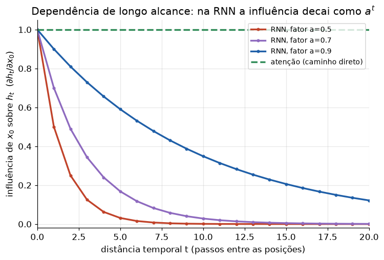

# Lição 039 — Limitações de RNNs e a motivação para atenção

> **Módulo:** M04 — Transformers por dentro · **Ordem de estudo:** 39 · **Tempo:** ~45 min
> **Pré-requisitos:** [030] RNN, LSTM e GRU
> **Classificação:** complemento de aprofundamento à ementa

> **Convenção de formatação:** matemática em LaTeX (`$...$` inline, `$$...$$` em
> destaque, render nativo na pré-visualização do VS Code); figuras reprodutíveis
> geradas por `tools/figuras/gerar_figuras_m04.py` e incorporadas por caminho
> relativo `assets/<NNN>-<slug>/<nome>.png`; blocos ```python só para código e
> saída.

## Seção_Teórica

### Motivação

Uma RNN (Lição 030) processa uma sequência $x_1, x_2, \dots, x_T$ **um passo de
cada vez**, comprimindo tudo o que já viu num único **estado oculto** $h_t$ de
dimensão fixa:

$$h_t = f(W_h\,h_{t-1} + W_x\,x_t).$$

Esse desenho tem três problemas que se agravam quando a sequência cresce. Primeiro,
todo o passado precisa caber num vetor de tamanho constante — um **gargalo de
informação**. Segundo, a influência de uma palavra distante sobre o presente
**decai** a cada passo, então **dependências de longo alcance** (o sujeito no
começo da frase que concorda com o verbo lá no fim) se perdem. Terceiro, como
$h_t$ depende de $h_{t-1}$, o cálculo é **inerentemente sequencial**: não dá para
paralelizar ao longo do tempo, o que limita o treino em GPUs. A **atenção** nasce
para atacar exatamente esses três pontos, conectando qualquer par de posições
**diretamente**, em um único passo paralelizável.

### Princípio de funcionamento

Modele a recorrência por uma versão linearizada, $h_t = a\,h_{t-1} + x_t$, com
$|a| < 1$ (o caso estável). Desenrolando,

$$h_t = \sum_{k=0}^{t} a^{\,t-k}\,x_k,$$

de modo que a sensibilidade de $h_t$ a uma entrada antiga $x_0$ é

$$\frac{\partial h_t}{\partial x_0} = a^{\,t},$$

que **decai exponencialmente** com a distância $t$. É a mesma física do
*vanishing gradient*: informação e gradiente somem na mesma taxa. LSTM/GRU
amenizam, mas não eliminam, o problema. Outra forma de ver: o **comprimento do
caminho** que liga duas posições $i$ e $j$ numa RNN é $|i-j|$ passos, enquanto na
atenção é **1**. Caminhos curtos preservam sinal e gradiente. Por fim, a atenção
calcula todas as posições **em paralelo** (um passo), contra os $T$ passos
sequenciais da RNN.



*Figura 1 — Na recorrência linear, a influência de $x_0$ sobre $h_t$ cai como $a^t$; a atenção mantém um caminho direto (influência constante) entre quaisquer posições. Gerada por `tools/figuras/gerar_figuras_m04.py`.*

---

### Conceito central 1 — Gargalo de contexto fixo

Todo o histórico precisa caber em $h_t$, um vetor de dimensão fixa. Numa
recorrência estável, contribuições antigas são multiplicadas por $a^{t-k}$ a cada
passo, então a "memória" de entradas distantes encolhe geometricamente — o estado
oculto privilegia o passado recente e esquece o começo da sequência.

#### Exemplo_Resolvido 1.1

```python
import numpy as np
# RNN linear: h_t = a*h_{t-1} + x_t. A influência de x_0 sobre h_t é a^t.
a = 0.6
T = 10
influencia = a ** np.arange(T + 1)   # influência de x_0 em h_0, h_1, ..., h_T
print("a =", a)
for t in [0, 2, 5, 10]:
    print(f"influencia de x0 em h{t:>2}: {influencia[t]:.6f}")
```

**Explicação passo a passo:**
- **Bloco 1 (`import`/parâmetros):** fixa o fator de decaimento $a = 0.6$ e o horizonte $T = 10$.
- **Bloco 2 (`influencia`):** $a^{t}$ para $t = 0, \dots, T$ é exatamente $\partial h_t/\partial x_0$ na recorrência linear.
- **Bloco 3 (laço):** imprime a influência de $x_0$ em alguns instantes; ela cai de $1$ para $\approx 0.006$ em 10 passos — a entrada inicial praticamente some do estado.

**Saída esperada:**
```
a = 0.6
influencia de x0 em h 0: 1.000000
influencia de x0 em h 2: 0.360000
influencia de x0 em h 5: 0.077760
influencia de x0 em h10: 0.006047
```

---

### Conceito central 2 — Dependências de longo alcance

O que mata a RNN em textos longos é a **distância**: ligar a posição $i$ à posição
$j$ exige atravessar $|i-j|$ passos, e cada passo atenua o sinal. A atenção liga
qualquer par com um **único** salto, de comprimento de caminho 1 — independente da
distância.

#### Exemplo_Resolvido 2.1

```python
# Comprimento do caminho de informação entre as posições i e j.
def caminho_rnn(i, j):
    return abs(i - j)        # RNN: percorre passo a passo a sequência
def caminho_atencao(i, j):
    return 1                 # atenção: conexão direta entre quaisquer posições
n = 8
for i, j in [(0, 7), (0, 3), (2, 5)]:
    print(f"({i},{j}) rnn={caminho_rnn(i, j)} atencao={caminho_atencao(i, j)}")
print("maior caminho rnn:", max(caminho_rnn(0, k) for k in range(n)))
```

**Explicação passo a passo:**
- **Bloco 1 (funções de caminho):** na RNN o caminho é $|i-j|$; na atenção é sempre 1.
- **Bloco 2 (laço):** para pares afastados (como $0 \to 7$) o caminho da RNN é longo, enquanto o da atenção continua 1.
- **Bloco 3 (`max`):** o pior caso numa RNN cresce com o tamanho da sequência ($n-1 = 7$); na atenção permanece 1.

**Saída esperada:**
```
(0,7) rnn=7 atencao=1
(0,3) rnn=3 atencao=1
(2,5) rnn=3 atencao=1
maior caminho rnn: 7
```

---

### Conceito central 3 — Sequencialidade versus paralelismo

Como $h_t$ depende de $h_{t-1}$, a RNN executa $T$ passos **em série** — o passo
$t$ não pode começar antes do $t-1$ terminar. A atenção computa todas as posições
**de uma vez**, em um único passo paralelizável, aproveitando melhor o hardware.

#### Exemplo_Resolvido 3.1

```python
# Passos SEQUENCIAIS para processar uma sequência de comprimento T.
def passos_rnn(T):
    return T          # cada estado depende do anterior -> serial
def passos_atencao(T):
    return 1          # todas as posições computadas em paralelo
for T in [4, 16, 64]:
    print(f"T={T:>2}: rnn={passos_rnn(T):>2} passos | atencao={passos_atencao(T)} passo")
```

**Explicação passo a passo:**
- **Bloco 1 (funções):** a RNN precisa de $T$ passos sequenciais; a atenção, de 1.
- **Bloco 2 (laço):** ao crescer $T$, a profundidade sequencial da RNN cresce linearmente, enquanto a da atenção permanece constante — daí a atenção treinar muito mais rápido em GPUs.

**Saída esperada:**
```
T= 4: rnn= 4 passos | atencao=1 passo
T=16: rnn=16 passos | atencao=1 passo
T=64: rnn=64 passos | atencao=1 passo
```

## Seção_Prática

> **Como reproduzir:** execute cada solução de referência com
> `python trilha/solucoes/039-motivacao-atencao/solucao_<n>.py` e compare a saída
> com o arquivo `.saida.txt` correspondente. Os enunciados/esqueletos ficam em
> `trilha/pratica/039-motivacao-atencao/exercicio_<n>.py`.

### Exercício 1 — Quantificar o decaimento de memória
- **Entrada inicial / setup:** recorrência linear $h_t = a\,h_{t-1} + x_t$ com $a = 0.8$ e horizonte $T = 12$.
- **Passos de execução:** calcule a influência $a^t$ de $x_0$ sobre $h_t$, imprima-a em $t \in \{0, 4, 8, 12\}$ com 6 casas decimais e reporte o **primeiro** $t$ em que a influência cai abaixo de $0.1$.
- **Critério de conclusão (binário):** a saída é **exatamente** igual a `solucao_1.saida.txt` (a influência em $t=12$ é `0.068719` e o primeiro $t$ abaixo de $0.1$ é `11`); qualquer divergência reprova.
- **Solução de referência:** `trilha/solucoes/039-motivacao-atencao/solucao_1.py`
- **Saída esperada:** `trilha/solucoes/039-motivacao-atencao/solucao_1.saida.txt`

### Exercício 2 — Comprimento do caminho de informação
- **Entrada inicial / setup:** sequência de comprimento $n = 10$ e os pares de posições $(0,9)$, $(1,8)$ e $(4,6)$.
- **Passos de execução:** implemente `caminho_rnn(i, j) = |i-j|` e `caminho_atencao(i, j) = 1`; imprima o caminho de cada par nas duas arquiteturas e o **maior** caminho possível em cada uma.
- **Critério de conclusão (binário):** a saída é **exatamente** igual a `solucao_2.saida.txt` (`maior caminho rnn: 9` e `maior caminho atencao: 1`); qualquer divergência reprova.
- **Solução de referência:** `trilha/solucoes/039-motivacao-atencao/solucao_2.py`
- **Saída esperada:** `trilha/solucoes/039-motivacao-atencao/solucao_2.saida.txt`

### Exercício 3 — Profundidade sequencial e paralelismo
- **Entrada inicial / setup:** comprimentos de sequência $T \in \{8, 32, 128\}$.
- **Passos de execução:** para cada $T$, imprima os passos sequenciais da RNN ($T$), os da atenção ($1$) e o fator de redução `rnn // atencao`.
- **Critério de conclusão (binário):** a saída é **exatamente** igual a `solucao_3.saida.txt` (para $T=128$, `reducao=128x`); qualquer divergência reprova.
- **Solução de referência:** `trilha/solucoes/039-motivacao-atencao/solucao_3.py`
- **Saída esperada:** `trilha/solucoes/039-motivacao-atencao/solucao_3.saida.txt`
