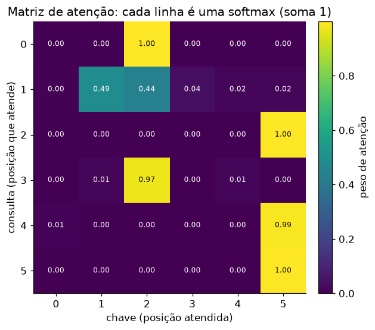

# Lição 040 — Self-attention com Query/Key/Value

> **Módulo:** M04 — Transformers por dentro · **Ordem de estudo:** 40 · **Tempo:** ~60 min
> **Pré-requisitos:** [034] Embeddings · [039] Limitações de RNNs e a motivação para atenção
> **Classificação:** complemento de aprofundamento à ementa

> **Convenção de formatação:** matemática em LaTeX (`$...$` inline, `$$...$$` em
> destaque, render nativo na pré-visualização do VS Code); figuras reprodutíveis
> geradas por `tools/figuras/gerar_figuras_m04.py` e incorporadas por caminho
> relativo `assets/<NNN>-<slug>/<nome>.png`; blocos ```python só para código e
> saída.

## Seção_Teórica

### Motivação

A Lição 039 mostrou *por que* precisamos de atenção; esta lição mostra *como* ela
funciona. A ideia central do **self-attention** é deixar cada posição da sequência
**olhar para todas as outras** e montar uma nova representação como uma **mistura
ponderada** delas, em que os pesos são aprendidos a partir do próprio conteúdo. É
o mecanismo que substitui a recorrência: em vez de empurrar informação passo a
passo, cada token consulta diretamente o que for relevante, esteja onde estiver.
Dominar a matemática de Query/Key/Value é o que permite ler papers, depurar
modelos e entender de verdade tudo o que vem depois (multi-head, Transformers,
LLMs).

### Princípio de funcionamento

De cada embedding de entrada $x_i$ derivamos três vetores por projeções lineares
aprendidas: a **Query** $q_i = x_i W^Q$ ("o que eu procuro"), a **Key**
$k_i = x_i W^K$ ("o que eu ofereço") e o **Value** $v_i = x_i W^V$ ("o que eu
entrego se for escolhido"). Empilhando os tokens em matrizes $Q, K, V$, a atenção
escalada por produto escalar (*scaled dot-product attention*) é

$$\text{Attention}(Q, K, V) = \operatorname{softmax}\!\left(\frac{Q K^\top}{\sqrt{d_k}}\right) V.$$

Lendo da esquerda para a direita: $Q K^\top$ produz uma matriz de **scores** em
que a entrada $(i, j)$ é o produto interno $q_i \cdot k_j$, uma medida de quão
relevante a posição $j$ é para a posição $i$. Dividimos por $\sqrt{d_k}$ porque,
para vetores com entradas de variância $\approx 1$, o produto interno em dimensão
$d_k$ tem desvio-padrão $\approx \sqrt{d_k}$; sem essa normalização os scores
ficam grandes, a **softmax satura** (vira quase one-hot) e os gradientes somem. A
softmax é aplicada **por linha**, transformando cada linha de scores numa
distribuição de probabilidade (pesos $\ge 0$ que somam 1). Por fim, multiplicar
esses pesos por $V$ devolve, para cada posição, uma **média ponderada** dos
Values — a nova representação contextualizada.

A softmax usa o truque de estabilidade numérica de subtrair o máximo de cada
linha antes de exponenciar:

$$\operatorname{softmax}(z)_j = \frac{e^{z_j - \max_\ell z_\ell}}{\sum_m e^{z_m - \max_\ell z_\ell}},$$

o que não muda o resultado (o fator $e^{-\max}$ cancela) mas evita *overflow*.



*Figura 1 — Matriz de pesos de atenção: linha $i$ mostra quanto a consulta $i$ distribui sua atenção pelas chaves; cada linha soma 1. Gerada por `tools/figuras/gerar_figuras_m04.py`.*

---

### Conceito central 1 — Projeções Query, Key e Value

Q, K e V são apenas o mesmo conjunto de embeddings visto por três "lentes"
lineares diferentes. As matrizes $W^Q, W^K, W^V$ são os parâmetros aprendidos;
elas decidem *como comparar* (Q contra K) e *o que transportar* (V).

#### Exemplo_Resolvido 1.1

```python
import numpy as np
np.set_printoptions(precision=4, suppress=True)
# Embeddings de 3 tokens (d_model = 4) e matrizes de projeção (d_model x d_k=2).
X = np.array([
    [1.0, 0.0, 1.0, 0.0],
    [0.0, 2.0, 0.0, 2.0],
    [1.0, 1.0, 1.0, 1.0],
])
Wq = np.array([[1.0, 0.0], [0.0, 1.0], [1.0, 0.0], [0.0, 1.0]])
Wk = np.array([[0.0, 1.0], [1.0, 0.0], [0.0, 1.0], [1.0, 0.0]])
Wv = np.array([[1.0, 0.0], [0.0, 1.0], [0.0, 1.0], [1.0, 0.0]])
Q = X @ Wq
K = X @ Wk
V = X @ Wv
print("Q =\n", Q)
print("K =\n", K)
print("V =\n", V)
```

**Explicação passo a passo:**
- **Bloco 1 (`X`):** três embeddings de dimensão 4, um por linha.
- **Bloco 2 (`Wq`/`Wk`/`Wv`):** três projeções $4 \times 2$ que levam cada embedding a um espaço de dimensão $d_k = 2$.
- **Bloco 3 (`Q`/`K`/`V`):** o produto $X W$ aplica a mesma projeção a todos os tokens de uma vez; cada matriz resultante tem uma linha por token.

**Saída esperada:**
```
Q =
 [[2. 0.]
 [0. 4.]
 [2. 2.]]
K =
 [[0. 2.]
 [4. 0.]
 [2. 2.]]
V =
 [[1. 1.]
 [2. 2.]
 [2. 2.]]
```

---

### Conceito central 2 — Scaled dot-product e softmax

Os scores $Q K^\top$ medem afinidade entre consultas e chaves. Dividi-los por
$\sqrt{d_k}$ mantém a escala sob controle antes da softmax, que converte cada
linha numa distribuição de atenção (valores não negativos que somam 1).

#### Exemplo_Resolvido 2.1

```python
import numpy as np
np.set_printoptions(precision=4, suppress=True)

def softmax(x, axis=-1):
    x = x - np.max(x, axis=axis, keepdims=True)   # estabilidade numérica
    e = np.exp(x)
    return e / np.sum(e, axis=axis, keepdims=True)

X = np.array([
    [1.0, 0.0, 1.0, 0.0],
    [0.0, 2.0, 0.0, 2.0],
    [1.0, 1.0, 1.0, 1.0],
])
Wq = np.array([[1.0, 0.0], [0.0, 1.0], [1.0, 0.0], [0.0, 1.0]])
Wk = np.array([[0.0, 1.0], [1.0, 0.0], [0.0, 1.0], [1.0, 0.0]])
Q = X @ Wq
K = X @ Wk

d_k = Q.shape[-1]
scores = Q @ K.T
escalados = scores / np.sqrt(d_k)
pesos = softmax(escalados, axis=-1)
print("scores brutos =\n", scores)
print("scores escalados (/sqrt(d_k)) =\n", escalados)
print("pesos (softmax por linha) =\n", pesos)
print("soma por linha =", pesos.sum(axis=1))
```

**Explicação passo a passo:**
- **Bloco 1 (`softmax`):** softmax estável por linha (subtrai o máximo antes de exponenciar).
- **Bloco 2 (`X`/`Wq`/`Wk`):** recria Q e K como no Exemplo 1.1.
- **Bloco 3 (`scores`/`escalados`):** $Q K^\top$ dá a afinidade bruta; a divisão por $\sqrt{2}$ encolhe a escala.
- **Bloco 4 (`pesos`):** a softmax por linha vira distribuição — note que cada linha soma exatamente 1.

**Saída esperada:**
```
scores brutos =
 [[0. 8. 4.]
 [8. 0. 8.]
 [4. 8. 8.]]
scores escalados (/sqrt(d_k)) =
 [[0.     5.6569 2.8284]
 [5.6569 0.     5.6569]
 [2.8284 5.6569 5.6569]]
pesos (softmax por linha) =
 [[0.0033 0.9411 0.0556]
 [0.4991 0.0017 0.4991]
 [0.0287 0.4856 0.4856]]
soma por linha = [1. 1. 1.]
```

---

### Conceito central 3 — Saída como média ponderada dos Values

A última multiplicação, $\text{pesos} \cdot V$, produz, para cada posição, uma
**combinação convexa** das linhas de $V$. Como os pesos somam 1 e são não
negativos, cada vetor de saída fica dentro do "envelope" dos Values — é
literalmente uma média ponderada.

#### Exemplo_Resolvido 3.1

```python
import numpy as np
np.set_printoptions(precision=4, suppress=True)

def softmax(x, axis=-1):
    x = x - np.max(x, axis=axis, keepdims=True)
    e = np.exp(x)
    return e / np.sum(e, axis=axis, keepdims=True)

X = np.array([
    [1.0, 0.0, 1.0, 0.0],
    [0.0, 2.0, 0.0, 2.0],
    [1.0, 1.0, 1.0, 1.0],
])
Wq = np.array([[1.0, 0.0], [0.0, 1.0], [1.0, 0.0], [0.0, 1.0]])
Wk = np.array([[0.0, 1.0], [1.0, 0.0], [0.0, 1.0], [1.0, 0.0]])
Wv = np.array([[1.0, 0.0], [0.0, 1.0], [0.0, 1.0], [1.0, 0.0]])

Q, K, V = X @ Wq, X @ Wk, X @ Wv
d_k = Q.shape[-1]
pesos = softmax(Q @ K.T / np.sqrt(d_k), axis=-1)
saida = pesos @ V
print("V =\n", V)
print("pesos =\n", pesos)
print("saida = pesos @ V =\n", saida)
print("linha 0 reconstruida:", pesos[0] @ V)
```

**Explicação passo a passo:**
- **Bloco 1 (`softmax`):** mesma softmax estável.
- **Bloco 2 (pipeline):** computa Q, K, V e os pesos de atenção como antes.
- **Bloco 3 (`saida`):** `pesos @ V` mistura os Values; a saída da posição 0 ($\approx [1.997, 1.997]$) pende fortemente para o Value da posição 1, que recebeu peso $0.9411$.
- **Bloco 4 (reconstrução):** confirma que a linha 0 da saída é exatamente $\sum_j \text{pesos}_{0j}\,v_j$.

**Saída esperada:**
```
V =
 [[1. 1.]
 [2. 2.]
 [2. 2.]]
pesos =
 [[0.0033 0.9411 0.0556]
 [0.4991 0.0017 0.4991]
 [0.0287 0.4856 0.4856]]
saida = pesos @ V =
 [[1.9967 1.9967]
 [1.5009 1.5009]
 [1.9713 1.9713]]
linha 0 reconstruida: [1.9967 1.9967]
```

## Seção_Prática

> **Como reproduzir:** execute cada solução de referência com
> `python trilha/solucoes/040-self-attention-qkv/solucao_<n>.py` e compare a saída
> com o arquivo `.saida.txt` correspondente. Os enunciados/esqueletos ficam em
> `trilha/pratica/040-self-attention-qkv/exercicio_<n>.py`.

### Exercício 1 — Atenção do zero (função reutilizável)
- **Entrada inicial / setup:** os embeddings `X` (4 tokens, $d_{model}=4$) e as projeções `Wq`, `Wk`, `Wv` ($4 \times 2$) dados no esqueleto.
- **Passos de execução:** implemente `softmax` estável e `self_attention(X, Wq, Wk, Wv)` que retorna `(saida, pesos)`; imprima a matriz de pesos arredondada a 4 casas e a posição mais atendida por linha (`pesos.argmax(axis=1).tolist()`).
- **Critério de conclusão (binário):** a saída é **exatamente** igual a `solucao_1.saida.txt` (`posicao mais atendida por linha: [1, 0, 3, 0]`); qualquer divergência reprova.
- **Solução de referência:** `trilha/solucoes/040-self-attention-qkv/solucao_1.py`
- **Saída esperada:** `trilha/solucoes/040-self-attention-qkv/solucao_1.saida.txt`

### Exercício 2 — Por que dividir por raiz de d_k
- **Entrada inicial / setup:** $d_k = 64$, com `Q` ($1 \times 64$) e `K` ($5 \times 64$) gerados por `np.random.default_rng(0)` (normais padrão).
- **Passos de execução:** compute os scores brutos e escalados ($/\sqrt{d_k}$); imprima o desvio-padrão de cada um (4 casas) e o **peso máximo** da softmax em cada caso, mostrando que sem escala a distribuição satura.
- **Critério de conclusão (binário):** a saída é **exatamente** igual a `solucao_2.saida.txt` (`peso maximo sem escala:  0.9997` contra `peso maximo com escala:  0.5314`); qualquer divergência reprova.
- **Solução de referência:** `trilha/solucoes/040-self-attention-qkv/solucao_2.py`
- **Saída esperada:** `trilha/solucoes/040-self-attention-qkv/solucao_2.saida.txt`

### Exercício 3 — Saída é combinação convexa dos Values
- **Entrada inicial / setup:** matriz de Values `V = [[0,10],[2,8],[5,5],[9,1]]` e pesos `[0.1, 0.2, 0.3, 0.4]`.
- **Passos de execução:** calcule `saida = pesos @ V`; imprima a soma dos pesos, a saída arredondada e verifique (booleano) que a saída cai dentro do envoltório convexo de `V` (coordenada a coordenada, entre o mínimo e o máximo das colunas).
- **Critério de conclusão (binário):** a saída é **exatamente** igual a `solucao_3.saida.txt` (`saida (media ponderada): [5.5 4.5]` e `dentro do envoltorio convexo de V: True`); qualquer divergência reprova.
- **Solução de referência:** `trilha/solucoes/040-self-attention-qkv/solucao_3.py`
- **Saída esperada:** `trilha/solucoes/040-self-attention-qkv/solucao_3.saida.txt`
