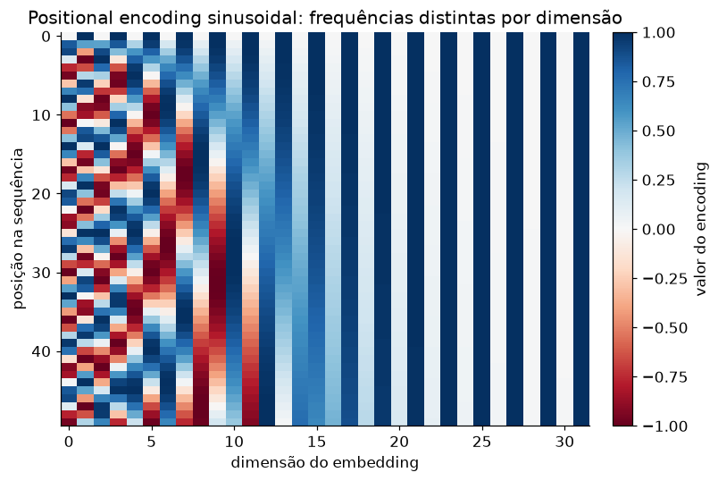

# Lição 041 — Positional encoding

> **Módulo:** M04 — Transformers por dentro · **Ordem de estudo:** 41 · **Tempo:** ~50 min
> **Pré-requisitos:** [040] Self-attention com Query/Key/Value
> **Classificação:** complemento de aprofundamento à ementa

> **Convenção de formatação:** matemática em LaTeX (`$...$` inline, `$$...$$` em
> destaque, render nativo na pré-visualização do VS Code); figuras reprodutíveis
> geradas por `tools/figuras/gerar_figuras_m04.py` e incorporadas por caminho
> relativo `assets/<NNN>-<slug>/<nome>.png`; blocos ```python só para código e
> saída.

## Seção_Teórica

### Motivação

O self-attention da Lição 040 trata a entrada como um **conjunto**, não como uma
**sequência**: ele calcula afinidades entre todos os pares de tokens, mas nada na
fórmula $\operatorname{softmax}(Q K^\top/\sqrt{d_k})V$ depende de *onde* cada
token está. Trocar a ordem dos tokens apenas troca a ordem das saídas, sem mudar
o conteúdo — uma propriedade chamada **equivariância a permutações**. Isso é um
problema: "o gato caça o rato" e "o rato caça o gato" têm os mesmos tokens em
ordens diferentes e significam coisas opostas. Como o Transformer abandona a
recorrência (que carregava a ordem implicitamente), precisamos **injetar a
posição** de outra forma. O **positional encoding** resolve isso somando a cada
embedding um vetor que codifica sua posição na sequência.

### Princípio de funcionamento

A ideia é construir, para cada posição $pos$, um vetor $PE_{pos} \in \mathbb{R}^d$
e **somá-lo** ao embedding daquele token antes de entrar na atenção. O Transformer
original usa um encoding **sinusoidal**: para a dimensão $i$ do vetor,

$$PE_{pos,\,2i} = \sin\!\left(\frac{pos}{10000^{2i/d}}\right), \qquad
PE_{pos,\,2i+1} = \cos\!\left(\frac{pos}{10000^{2i/d}}\right).$$

Cada par de dimensões $(2i, 2i+1)$ é um par seno/cosseno girando a uma frequência
própria: dimensões baixas oscilam **rápido** (codificam posição fina) e dimensões
altas oscilam **devagar** (codificam posição grossa), formando uma espécie de
"relógio binário contínuo". Como os valores ficam em $[-1, 1]$ e variam suavemente
com $pos$, o vetor posicional não domina o embedding e generaliza para
comprimentos não vistos no treino.

A escolha de seno/cosseno tem uma vantagem elegante: por identidades
trigonométricas, $PE_{pos+k}$ é uma **transformação linear fixa** de $PE_{pos}$
(uma rotação que só depende do deslocamento $k$). Em consequência, o produto
interno $PE_{pos} \cdot PE_{pos+k}$ depende **apenas de $k$**, não de $pos$ — o que
dá ao modelo um sinal natural de **posição relativa** entre dois tokens.



*Figura 1 — Positional encoding sinusoidal (50 posições × 32 dimensões): dimensões à esquerda oscilam em alta frequência, à direita em baixa frequência. Gerada por `tools/figuras/gerar_figuras_m04.py`.*

---

### Conceito central 1 — Invariância à permutação

Sem informação de posição, a atenção é **equivariante a permutações**: se
reordenarmos os tokens de entrada, as saídas saem na **mesma** ordem reordenada,
com os mesmos valores. Ou seja, a atenção sozinha não distingue uma ordem da
outra — daí a necessidade do positional encoding.

#### Exemplo_Resolvido 1.1

```python
import numpy as np
np.set_printoptions(precision=4, suppress=True)

def softmax(x, axis=-1):
    x = x - np.max(x, axis=axis, keepdims=True)
    e = np.exp(x)
    return e / np.sum(e, axis=axis, keepdims=True)

def atencao(X):                        # self-attention "crua": Wq=Wk=Wv=I
    pesos = softmax(X @ X.T / np.sqrt(X.shape[1]), axis=-1)
    return pesos @ X

X = np.array([[1.0, 0.0, 0.0],
              [0.0, 1.0, 0.0],
              [0.0, 0.0, 1.0]])
ordem = [2, 0, 1]
saida = atencao(X)
saida_perm = atencao(X[ordem])
print("saida original =\n", saida)
print("saida da entrada permutada =\n", saida_perm)
print("permutar a entrada permuta a saida:", np.allclose(saida_perm, saida[ordem]))
```

**Explicação passo a passo:**
- **Bloco 1 (`softmax`):** softmax estável por linha.
- **Bloco 2 (`atencao`):** atenção sem projeções ($W=I$), para isolar o efeito da ordem.
- **Bloco 3 (`X`/`ordem`):** três tokens e uma permutação de suas posições.
- **Bloco 4 (comparação):** a saída da entrada permutada é **exatamente** a saída original reordenada pela mesma permutação — a atenção não "viu" a mudança de posição, só a propagou.

**Saída esperada:**
```
saida original =
 [[0.4711 0.2645 0.2645]
 [0.2645 0.4711 0.2645]
 [0.2645 0.2645 0.4711]]
saida da entrada permutada =
 [[0.2645 0.2645 0.4711]
 [0.4711 0.2645 0.2645]
 [0.2645 0.4711 0.2645]]
permutar a entrada permuta a saida: True
```

---

### Conceito central 2 — Codificação sinusoidal

O encoding sinusoidal monta uma matriz $PE$ de forma $(n\_pos \times d)$ onde as
colunas pares usam $\sin$ e as ímpares usam $\cos$, cada par girando numa
frequência $1/10000^{2i/d}$. A construção é puramente determinística — não há
parâmetros a aprender.

#### Exemplo_Resolvido 2.1

```python
import numpy as np
np.set_printoptions(precision=4, suppress=True)

def positional_encoding(n_pos, d, base=10000.0):
    pos = np.arange(n_pos)[:, None]
    i = np.arange(d)[None, :]
    angulo = pos / (base ** (2 * (i // 2) / d))
    pe = np.zeros((n_pos, d))
    pe[:, 0::2] = np.sin(angulo[:, 0::2])   # dimensões pares -> seno
    pe[:, 1::2] = np.cos(angulo[:, 1::2])   # dimensões ímpares -> cosseno
    return pe

pe = positional_encoding(4, 4)
print("PE (4 posicoes x 4 dims) =\n", pe)
```

**Explicação passo a passo:**
- **Bloco 1 (`pos`/`i`):** vetor coluna de posições e vetor linha de índices de dimensão.
- **Bloco 2 (`angulo`):** divide a posição pela frequência $10000^{2i/d}$; `i // 2` garante que o par $(2i, 2i+1)$ compartilhe a mesma frequência.
- **Bloco 3 (`pe`):** preenche colunas pares com $\sin$ e ímpares com $\cos$.
- **Bloco 4 (`print`):** a posição 0 vira $[\sin 0, \cos 0, \dots] = [0, 1, 0, 1]$; posições seguintes giram cada par a frequências distintas.

**Saída esperada:**
```
PE (4 posicoes x 4 dims) =
 [[ 0.      1.      0.      1.    ]
 [ 0.8415  0.5403  0.01    1.    ]
 [ 0.9093 -0.4161  0.02    0.9998]
 [ 0.1411 -0.99    0.03    0.9996]]
```

---

### Conceito central 3 — Deslocamentos relativos

A propriedade que torna o encoding sinusoidal especial: o produto interno
$PE_{a} \cdot PE_{a+k}$ depende **somente do deslocamento $k$**, não da posição
absoluta $a$. Isso fornece ao modelo um sinal consistente de **distância relativa**
entre tokens, independente de onde eles estejam na sequência.

#### Exemplo_Resolvido 3.1

```python
import numpy as np

def positional_encoding(n_pos, d, base=10000.0):
    pos = np.arange(n_pos)[:, None]
    i = np.arange(d)[None, :]
    angulo = pos / (base ** (2 * (i // 2) / d))
    pe = np.zeros((n_pos, d))
    pe[:, 0::2] = np.sin(angulo[:, 0::2])
    pe[:, 1::2] = np.cos(angulo[:, 1::2])
    return pe

pe = positional_encoding(12, 16)
for a in [0, 3, 6]:
    valores = [round(float(pe[a] @ pe[a + k]), 4) for k in range(4)]
    print(f"a={a}: PE[a]·PE[a+k] (k=0..3) -> {valores}")
```

**Explicação passo a passo:**
- **Bloco 1 (`positional_encoding`):** mesma construção sinusoidal, agora com $d = 16$.
- **Bloco 2 (laço):** para três posições base $a \in \{0, 3, 6\}$, calcula o produto interno entre $PE_a$ e seus vizinhos $PE_{a+k}$ para $k = 0, 1, 2, 3$.
- **Resultado:** as três linhas são **idênticas** — o produto interno só depende de $k$, confirmando a propriedade de deslocamento relativo.

**Saída esperada:**
```
a=0: PE[a]·PE[a+k] (k=0..3) -> [8.0, 7.4852, 6.3683, 5.5431]
a=3: PE[a]·PE[a+k] (k=0..3) -> [8.0, 7.4852, 6.3683, 5.5431]
a=6: PE[a]·PE[a+k] (k=0..3) -> [8.0, 7.4852, 6.3683, 5.5431]
```

## Seção_Prática

> **Como reproduzir:** execute cada solução de referência com
> `python trilha/solucoes/041-positional-encoding/solucao_<n>.py` e compare a saída
> com o arquivo `.saida.txt` correspondente. Os enunciados/esqueletos ficam em
> `trilha/pratica/041-positional-encoding/exercicio_<n>.py`.

### Exercício 1 — Construir e inspecionar a matriz de positional encoding
- **Entrada inicial / setup:** `positional_encoding(n_pos, d)` conforme a fórmula sinusoidal, com `n_pos = 6` e `d = 8`.
- **Passos de execução:** construa a matriz $PE$, imprima seu `shape`, o mínimo e o máximo (4 casas) e a linha da posição 1 arredondada a 4 casas (`np.round(pe[1], 4)`).
- **Critério de conclusão (binário):** a saída é **exatamente** igual a `solucao_1.saida.txt` (`shape: (6, 8)`, `min: -0.9900  max: 1.0000`); qualquer divergência reprova.
- **Solução de referência:** `trilha/solucoes/041-positional-encoding/solucao_1.py`
- **Saída esperada:** `trilha/solucoes/041-positional-encoding/solucao_1.saida.txt`

### Exercício 2 — Somar o encoding aos embeddings
- **Entrada inicial / setup:** embedding fixo de um token `e = [1, 0, 0, 0]` e `positional_encoding(4, 4)`.
- **Passos de execução:** some `e` ao encoding das posições 0 e 2; imprima as duas representações arredondadas a 4 casas e o booleano que confirma que **o mesmo token em posições diferentes** recebe representações diferentes (`not np.allclose(rep0, rep2)`).
- **Critério de conclusão (binário):** a saída é **exatamente** igual a `solucao_2.saida.txt` (`token na posicao 0: [1. 1. 0. 1.]` e `representacoes diferentes: True`); qualquer divergência reprova.
- **Solução de referência:** `trilha/solucoes/041-positional-encoding/solucao_2.py`
- **Saída esperada:** `trilha/solucoes/041-positional-encoding/solucao_2.saida.txt`

### Exercício 3 — Propriedade de deslocamento relativo
- **Entrada inicial / setup:** `positional_encoding(12, 16)`.
- **Passos de execução:** imprima $PE_0 \cdot PE_k$ para $k = 0, \dots, 5$ (4 casas) e verifique (booleano) que $PE_2 \cdot PE_5$ é igual a $PE_4 \cdot PE_7$ (mesmo deslocamento $k = 3$).
- **Critério de conclusão (binário):** a saída é **exatamente** igual a `solucao_3.saida.txt` (`k=0: PE[0]·PE[0] = 8.0000` e `PE[2]·PE[5] == PE[4]·PE[7] (k=3): True`); qualquer divergência reprova.
- **Solução de referência:** `trilha/solucoes/041-positional-encoding/solucao_3.py`
- **Saída esperada:** `trilha/solucoes/041-positional-encoding/solucao_3.saida.txt`
