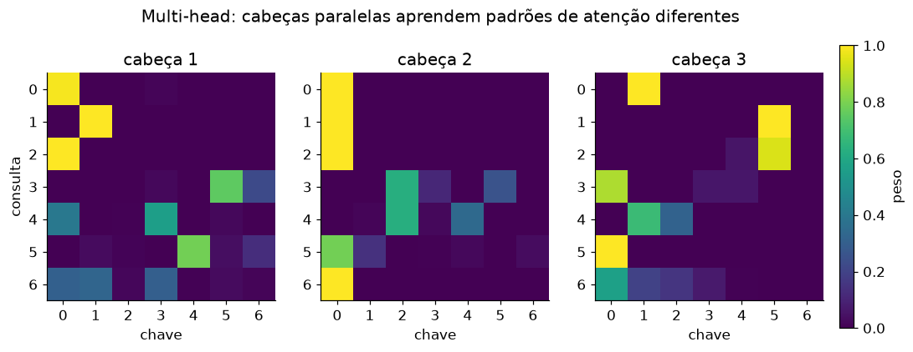

# Lição 042 — Multi-head attention

> **Módulo:** M04 — Transformers por dentro · **Ordem de estudo:** 42 · **Tempo:** ~55 min
> **Pré-requisitos:** [040] Self-attention com Query/Key/Value
> **Classificação:** complemento de aprofundamento à ementa

> **Convenção de formatação:** matemática em LaTeX (`$...$` inline, `$$...$$` em
> destaque, render nativo na pré-visualização do VS Code); figuras reprodutíveis
> geradas por `tools/figuras/gerar_figuras_m04.py` e incorporadas por caminho
> relativo `assets/<NNN>-<slug>/<nome>.png`; blocos ```python só para código e
> saída.

## Seção_Teórica

### Motivação

Uma única atenção (Lição 040) força todos os tokens a se compararem num **único**
espaço de projeção: existe apenas uma noção de "relevância". Mas linguagem tem
**vários tipos de relação** ao mesmo tempo — concordância sintática, correferência,
proximidade, semântica. Espremer tudo numa única matriz de atenção é limitante. A
**multi-head attention** resolve isso rodando **várias atenções em paralelo**
(as *cabeças*), cada uma com suas próprias projeções e, portanto, livre para se
especializar num tipo de relação. Ao final, as saídas das cabeças são
concatenadas e combinadas. É o componente que dá ao Transformer sua expressividade
sem aumentar o custo: cada cabeça opera numa dimensão menor.

### Princípio de funcionamento

Partimos de embeddings de dimensão $d_{model}$ e escolhemos $h$ cabeças. Cada
cabeça trabalha numa dimensão reduzida $d_k = d_{model}/h$. Em vez de uma única
projeção, dividimos $Q, K, V$ em $h$ blocos de largura $d_k$ — equivale a ter
projeções independentes $W^Q_i, W^K_i, W^V_i$ por cabeça. Cada cabeça $i$ calcula
sua própria atenção escalada:

$$\text{head}_i = \operatorname{softmax}\!\left(\frac{Q_i K_i^\top}{\sqrt{d_k}}\right) V_i.$$

As $h$ saídas (cada uma $n \times d_k$) são **concatenadas** de volta em uma matriz
$n \times d_{model}$ e passadas por uma projeção final $W^O$:

$$\text{MultiHead}(Q, K, V) = \big[\,\text{head}_1 \,\|\, \cdots \,\|\, \text{head}_h\,\big]\, W^O.$$

Como $h \cdot d_k = d_{model}$, o custo total é comparável ao de uma atenção única,
mas o modelo ganha $h$ "pontos de vista" independentes. Na prática, mantemos $Q$,
$K$ e $V$ em tensores de forma $(h, n, d_k)$ e aplicamos a atenção em lote ao longo
do eixo das cabeças.



*Figura 1 — Três cabeças sobre a mesma sequência produzem mapas de atenção distintos; cada cabeça aprende um padrão de relação diferente. Gerada por `tools/figuras/gerar_figuras_m04.py`.*

---

### Conceito central 1 — Projeção por cabeça

Dividir $d_{model}$ em $h$ blocos de tamanho $d_k$ é o coração da multi-head: cada
bloco é a "fatia" da projeção que pertence a uma cabeça. Em código, um `reshape`
seguido de `transpose` transforma uma matriz $(n, d_{model})$ num tensor
$(h, n, d_k)$.

#### Exemplo_Resolvido 1.1

```python
import numpy as np
np.set_printoptions(precision=4, suppress=True)

def split_heads(M, h):
    n, d_model = M.shape
    d_k = d_model // h
    return M.reshape(n, h, d_k).transpose(1, 0, 2)   # (h, n, d_k)

X = np.arange(12.0).reshape(2, 6)
print("X (2 tokens x d_model=6) =\n", X)
heads = split_heads(X, h=3)
print("apos split em h=3 cabecas, shape:", heads.shape)
for c in range(3):
    print(f"cabeca {c} =\n", heads[c])
```

**Explicação passo a passo:**
- **Bloco 1 (`split_heads`):** `reshape(n, h, d_k)` agrupa as colunas em $h$ blocos contíguos de largura $d_k$; `transpose(1, 0, 2)` move o eixo das cabeças para a frente.
- **Bloco 2 (`X`):** dois tokens com $d_{model} = 6$, valores $0..11$ para facilitar a leitura.
- **Bloco 3 (laço):** cada cabeça recebe 2 colunas consecutivas — cabeça 0 fica com as colunas $[0, 1]$, cabeça 1 com $[2, 3]$, cabeça 2 com $[4, 5]$.

**Saída esperada:**
```
X (2 tokens x d_model=6) =
 [[ 0.  1.  2.  3.  4.  5.]
 [ 6.  7.  8.  9. 10. 11.]]
apos split em h=3 cabecas, shape: (3, 2, 2)
cabeca 0 =
 [[0. 1.]
 [6. 7.]]
cabeca 1 =
 [[2. 3.]
 [8. 9.]]
cabeca 2 =
 [[ 4.  5.]
 [10. 11.]]
```

---

### Conceito central 2 — Atenção paralela por cabeça

Com $Q, K, V$ no formato $(h, n, d_k)$, aplicamos a mesma scaled dot-product
attention **em lote** ao longo do eixo das cabeças. Cada cabeça produz sua própria
matriz de pesos $(n, n)$, e elas costumam ser bem diferentes entre si.

#### Exemplo_Resolvido 2.1

```python
import numpy as np
np.set_printoptions(precision=4, suppress=True)

def softmax(x, axis=-1):
    x = x - np.max(x, axis=axis, keepdims=True)
    e = np.exp(x)
    return e / np.sum(e, axis=axis, keepdims=True)

def split_heads(M, h):
    n, d_model = M.shape
    return M.reshape(n, h, d_model // h).transpose(1, 0, 2)

def sdpa(Q, K, V):                       # scaled dot-product em lote por cabeça
    d_k = Q.shape[-1]
    pesos = softmax(Q @ K.transpose(0, 2, 1) / np.sqrt(d_k), axis=-1)
    return pesos @ V, pesos

rng = np.random.default_rng(42)
n, d_model, h = 4, 8, 2
X = rng.normal(0, 1, size=(n, d_model))
Wq = rng.normal(0, 1, size=(d_model, d_model))
Wk = rng.normal(0, 1, size=(d_model, d_model))
Wv = rng.normal(0, 1, size=(d_model, d_model))
Q = split_heads(X @ Wq, h)
K = split_heads(X @ Wk, h)
V = split_heads(X @ Wv, h)
ctx, pesos = sdpa(Q, K, V)
print("shape dos pesos (h, n, n):", pesos.shape)
print("pesos cabeca 0 =\n", np.round(pesos[0], 4))
print("pesos cabeca 1 =\n", np.round(pesos[1], 4))
print("cabecas diferem:", not np.allclose(pesos[0], pesos[1]))
```

**Explicação passo a passo:**
- **Bloco 1 (`softmax`/`split_heads`):** utilitários da cabeça anterior.
- **Bloco 2 (`sdpa`):** `K.transpose(0, 2, 1)` transpõe as duas últimas dimensões de cada cabeça; a softmax e o produto por $V$ rodam em lote sobre o eixo $h$.
- **Bloco 3 (pipeline):** projeta $X$ e fatia em 2 cabeças; cada uma calcula sua matriz de pesos $(4, 4)$.
- **Bloco 4 (comparação):** as duas cabeças produzem distribuições bem distintas — a cabeça 1, por exemplo, concentra quase toda a atenção na posição 0.

**Saída esperada:**
```
shape dos pesos (h, n, n): (2, 4, 4)
pesos cabeca 0 =
 [[0.0349 0.5595 0.0885 0.3171]
 [0.0791 0.4776 0.019  0.4243]
 [0.0941 0.1675 0.6108 0.1277]
 [0.3186 0.0145 0.5461 0.1208]]
pesos cabeca 1 =
 [[0.9995 0.0002 0.0003 0.    ]
 [0.9957 0.0005 0.0038 0.    ]
 [0.0058 0.7638 0.1523 0.0781]
 [0.8028 0.0137 0.1828 0.0007]]
cabecas diferem: True
```

---

### Conceito central 3 — Concatenação e projeção final

Depois que cada cabeça produz seu contexto $(n, d_k)$, voltamos ao formato
$(n, d_{model})$ concatenando as cabeças (o inverso do `split_heads`) e aplicamos a
projeção de saída $W^O$, que **mistura** as informações vindas das diferentes
cabeças.

#### Exemplo_Resolvido 3.1

```python
import numpy as np
np.set_printoptions(precision=4, suppress=True)

def softmax(x, axis=-1):
    x = x - np.max(x, axis=axis, keepdims=True)
    e = np.exp(x)
    return e / np.sum(e, axis=axis, keepdims=True)

def split_heads(M, h):
    n, d_model = M.shape
    return M.reshape(n, h, d_model // h).transpose(1, 0, 2)

def merge_heads(ctx):                    # inverso de split_heads: (h, n, d_k) -> (n, h*d_k)
    h, n, d_k = ctx.shape
    return ctx.transpose(1, 0, 2).reshape(n, h * d_k)

rng = np.random.default_rng(42)
n, d_model, h = 4, 8, 2
X = rng.normal(0, 1, size=(n, d_model))
Wq = rng.normal(0, 1, size=(d_model, d_model))
Wk = rng.normal(0, 1, size=(d_model, d_model))
Wv = rng.normal(0, 1, size=(d_model, d_model))
d_k = d_model // h
Q = split_heads(X @ Wq, h)
K = split_heads(X @ Wk, h)
V = split_heads(X @ Wv, h)
pesos = softmax(Q @ K.transpose(0, 2, 1) / np.sqrt(d_k), axis=-1)
ctx = pesos @ V
concat = merge_heads(ctx)
print("apos concatenar cabecas, shape:", concat.shape)
Wo = rng.normal(0, 1, size=(d_model, d_model))
saida = concat @ Wo
print("saida multi-head, shape:", saida.shape)
print("saida[0] =", np.round(saida[0], 4))
```

**Explicação passo a passo:**
- **Bloco 1 (`merge_heads`):** desfaz o `split_heads`, devolvendo $(n, d_{model})$.
- **Bloco 2 (pipeline):** recalcula as cabeças como no exemplo anterior e obtém o contexto por cabeça.
- **Bloco 3 (`concat`):** concatena as cabeças de volta numa matriz $4 \times 8$.
- **Bloco 4 (`Wo`/`saida`):** a projeção final $W^O$ mistura as cabeças; a forma da saída é igual à da entrada ($n \times d_{model}$), o que permite empilhar blocos.

**Saída esperada:**
```
apos concatenar cabecas, shape: (4, 8)
saida multi-head, shape: (4, 8)
saida[0] = [-1.1491  8.5147  8.2214 -0.4334 -8.7038 -6.9712  0.4685  1.6911]
```

## Seção_Prática

> **Como reproduzir:** execute cada solução de referência com
> `python trilha/solucoes/042-multi-head-attention/solucao_<n>.py` e compare a saída
> com o arquivo `.saida.txt` correspondente. Os enunciados/esqueletos ficam em
> `trilha/pratica/042-multi-head-attention/exercicio_<n>.py`.

### Exercício 1 — split_heads e merge_heads (ida e volta)
- **Entrada inicial / setup:** matriz `X = np.arange(24.0).reshape(4, 6)` e número de cabeças `h ∈ {1, 2, 3}`.
- **Passos de execução:** implemente `split_heads(M, h)` → `(h, n, d_k)` e `merge_heads(ctx)` → `(n, d_model)`; para cada `h`, imprima o shape das cabeças e o booleano `np.array_equal(merge_heads(split_heads(X, h)), X)`.
- **Critério de conclusão (binário):** a saída é **exatamente** igual a `solucao_1.saida.txt` (todas as três linhas terminam em `round-trip exato: True`); qualquer divergência reprova.
- **Solução de referência:** `trilha/solucoes/042-multi-head-attention/solucao_1.py`
- **Saída esperada:** `trilha/solucoes/042-multi-head-attention/solucao_1.saida.txt`

### Exercício 2 — Multi-head attention completa
- **Entrada inicial / setup:** `rng = np.random.default_rng(7)`, `n = 5`, `d_model = 12`, `h = 3`; `X`, `Wq`, `Wk`, `Wv`, `Wo` gerados nessa ordem por `rng.normal(0, 1, ...)`.
- **Passos de execução:** monte a multi-head (split → atenção por cabeça → merge → `@ Wo`); imprima o shape da saída, a soma de cada linha dos pesos por cabeça (`np.round(pesos.sum(axis=-1), 4)`, deve ser 1) e `np.round(saida[0], 4)`.
- **Critério de conclusão (binário):** a saída é **exatamente** igual a `solucao_2.saida.txt` (`saida shape: (5, 12)` e a matriz de somas toda igual a 1); qualquer divergência reprova.
- **Solução de referência:** `trilha/solucoes/042-multi-head-attention/solucao_2.py`
- **Saída esperada:** `trilha/solucoes/042-multi-head-attention/solucao_2.saida.txt`

### Exercício 3 — Cabeças se especializam
- **Entrada inicial / setup:** `rng = np.random.default_rng(0)`, `n = 6`, `d_model = 8`, `h = 4`; uma sequência `X` e projeções `Wq`, `Wk` ($d_{model} \times d_k$) geradas por cabeça, em ordem.
- **Passos de execução:** para cada cabeça, calcule a matriz de atenção e imprima a posição mais atendida por linha (`P.argmax(axis=1).tolist()`); ao final, imprima o booleano que confirma que **nem todas** as cabeças são iguais.
- **Critério de conclusão (binário):** a saída é **exatamente** igual a `solucao_3.saida.txt` (`cabeca 0: posicao mais atendida por linha = [2, 1, 1, 5, 2, 2]` e `todas as cabecas iguais: False`); qualquer divergência reprova.
- **Solução de referência:** `trilha/solucoes/042-multi-head-attention/solucao_3.py`
- **Saída esperada:** `trilha/solucoes/042-multi-head-attention/solucao_3.saida.txt`
