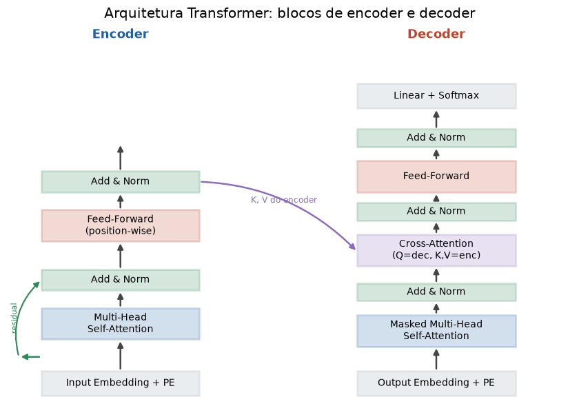

# Lição 043 — Arquitetura completa do Transformer

> **Módulo:** M04 — Transformers por dentro · **Ordem de estudo:** 43 · **Tempo:** ~60 min
> **Pré-requisitos:** [026] Batch e Layer Normalization · [041] Positional encoding · [042] Multi-head attention
> **Classificação:** complemento de aprofundamento à ementa

> **Convenção de formatação:** matemática em LaTeX (`$...$` inline, `$$...$$` em
> destaque, render nativo na pré-visualização do VS Code); figuras reprodutíveis
> geradas por `tools/figuras/gerar_figuras_m04.py` e incorporadas por caminho
> relativo `assets/<NNN>-<slug>/<nome>.png`; blocos ```python só para código e
> saída.

## Seção_Teórica

### Motivação

As lições anteriores construíram as peças: atenção (040), informação de posição
(041) e múltiplas cabeças (042). Falta montar a **máquina completa**. O Transformer
não é só atenção: empilha **blocos** idênticos, cada um com duas sub-camadas — uma
multi-head attention e uma rede feed-forward — envolvidas por **conexões residuais**
e **LayerNorm** (Lição 026). Esses dois ingredientes são o que torna possível
treinar redes profundas de dezenas de blocos sem que o sinal exploda ou desapareça.
Entender como as sub-camadas se encaixam é o que liga a teoria à arquitetura real
que roda em GPTs e BERTs.

### Princípio de funcionamento

Um **bloco de encoder** transforma uma matriz de entrada $X$ ($n$ tokens ×
$d_{model}$) em uma saída de **mesma forma**, aplicando duas sub-camadas em
sequência. Cada sub-camada segue o padrão *residual + norm*:

$$\text{saída} = \operatorname{LayerNorm}\big(x + \text{Sublayer}(x)\big).$$

A primeira sub-camada é a multi-head self-attention; a segunda é uma **rede
feed-forward position-wise** (FFN), aplicada **independentemente a cada token**:

$$\text{FFN}(x) = \max(0,\, x W_1 + b_1)\, W_2 + b_2,$$

com uma camada interna maior ($d_{ff} > d_{model}$, tipicamente $4\times$) e ReLU no
meio. A **conexão residual** $x + \text{Sublayer}(x)$ cria um atalho para o gradiente
(o caminho de identidade), e a **LayerNorm** normaliza cada token (média 0, variância
1 por linha) estabilizando as ativações. Como entrada e saída têm a mesma forma,
blocos podem ser **empilhados** indefinidamente.

O **encoder** completo é: embeddings + positional encoding, seguidos de $N$ blocos.
O **decoder** acrescenta uma atenção mascarada (cada posição só vê o passado) e uma
**cross-attention** que consulta a saída do encoder. A figura abaixo resume o fluxo.



*Figura 1 — Arquitetura Transformer: blocos de encoder e decoder, cada sub-camada com conexão residual seguida de normalização (Add & Norm). Gerada por `tools/figuras/gerar_figuras_m04.py`.*

---

### Conceito central 1 — Conexão residual e LayerNorm

Cada sub-camada é embrulhada por $x \mapsto \operatorname{LayerNorm}(x + \text{Sublayer}(x))$.
O termo residual $x +$ preserva um caminho direto para o gradiente; a LayerNorm
normaliza **cada linha** (cada token) para média 0 e variância 1, deixando as
ativações em escala estável independentemente da profundidade.

#### Exemplo_Resolvido 1.1

```python
import numpy as np
np.set_printoptions(precision=4, suppress=True)

def layer_norm(x, gamma, beta, eps=1e-5):
    mu = x.mean(axis=-1, keepdims=True)
    var = x.var(axis=-1, keepdims=True)
    return gamma * (x - mu) / np.sqrt(var + eps) + beta

x = np.array([[1.0, 2.0, 3.0, 4.0],
              [10.0, 10.0, 10.0, 10.0]])
sub = np.array([[0.5, -0.5, 0.5, -0.5],
                [1.0, 2.0, 3.0, 4.0]])
gamma = np.ones(4)
beta = np.zeros(4)
y = layer_norm(x + sub, gamma, beta)
print("x + sublayer =\n", x + sub)
print("apos LayerNorm =\n", y)
print("media por linha:", np.round(y.mean(axis=-1), 4))
print("desvio por linha:", np.round(y.std(axis=-1), 4))
```

**Explicação passo a passo:**
- **Bloco 1 (`layer_norm`):** normaliza ao longo do eixo das *features* (última dimensão), com `gamma`/`beta` aprendíveis (aqui identidade) e `eps` para estabilidade.
- **Bloco 2 (`x`/`sub`):** `x` é a entrada da sub-camada e `sub` o que a sub-camada produziu; somá-los é a conexão residual.
- **Bloco 3 (`y`):** aplica a normalização à soma residual.
- **Bloco 4 (`print`):** cada linha da saída tem média 0 e desvio 1 — inclusive a segunda linha, cuja entrada era constante antes do residual.

**Saída esperada:**
```
x + sublayer =
 [[ 1.5  1.5  3.5  3.5]
 [11.  12.  13.  14. ]]
apos LayerNorm =
 [[-1.     -1.      1.      1.    ]
 [-1.3416 -0.4472  0.4472  1.3416]]
media por linha: [0. 0.]
desvio por linha: [1. 1.]
```

---

### Conceito central 2 — Feed-forward position-wise

A segunda sub-camada é uma MLP de duas camadas com ReLU, aplicada **a cada token
separadamente** (os mesmos pesos para todas as posições). Ela expande a dimensão
para $d_{ff}$, aplica a não linearidade e projeta de volta a $d_{model}$.

#### Exemplo_Resolvido 2.1

```python
import numpy as np
np.set_printoptions(precision=4, suppress=True)

def relu(x):
    return np.maximum(0.0, x)

def ffn(x, W1, b1, W2, b2):
    return relu(x @ W1 + b1) @ W2 + b2

rng = np.random.default_rng(43)
d_model, d_ff = 4, 8
X = np.array([[1.0, -1.0, 2.0, 0.0],
              [0.0, 1.0, -2.0, 3.0]])
W1 = rng.normal(0, 1, size=(d_model, d_ff))
b1 = np.zeros(d_ff)
W2 = rng.normal(0, 1, size=(d_ff, d_model))
b2 = np.zeros(d_model)
Y = ffn(X, W1, b1, W2, b2)
print("entrada (2 tokens x 4) =\n", X)
print("saida da FFN (2 tokens x 4) =\n", np.round(Y, 4))
y0 = ffn(X[0:1], W1, b1, W2, b2)
print("FFN(token0) isolado == primeira linha:", np.allclose(y0, Y[0:1]))
```

**Explicação passo a passo:**
- **Bloco 1 (`relu`/`ffn`):** define a não linearidade e a MLP $\max(0, xW_1+b_1)W_2+b_2$.
- **Bloco 2 (setup):** entrada de 2 tokens; $W_1$ expande $4 \to 8$ e $W_2$ projeta $8 \to 4$.
- **Bloco 3 (`Y`):** aplica a FFN à matriz inteira de uma vez.
- **Bloco 4 (verificação):** rodar a FFN só no token 0 dá exatamente a primeira linha — confirmando que ela é **position-wise** (sem mistura entre tokens).

**Saída esperada:**
```
entrada (2 tokens x 4) =
 [[ 1. -1.  2.  0.]
 [ 0.  1. -2.  3.]]
saida da FFN (2 tokens x 4) =
 [[ 1.0522 -1.9414 -1.1579  1.2328]
 [ 0.4257 -8.3084  4.9812 -3.1662]]
FFN(token0) isolado == primeira linha: True
```

---

### Conceito central 3 — Bloco de encoder completo

Juntando as peças: atenção → residual + norm → FFN → residual + norm. O bloco recebe
$X$ e devolve algo da **mesma forma**, pronto para alimentar o próximo bloco.

#### Exemplo_Resolvido 3.1

```python
import numpy as np
np.set_printoptions(precision=4, suppress=True)

def softmax(x, axis=-1):
    x = x - np.max(x, axis=axis, keepdims=True)
    e = np.exp(x)
    return e / np.sum(e, axis=axis, keepdims=True)

def layer_norm(x, gamma, beta, eps=1e-5):
    mu = x.mean(axis=-1, keepdims=True)
    var = x.var(axis=-1, keepdims=True)
    return gamma * (x - mu) / np.sqrt(var + eps) + beta

def self_attention(X, Wq, Wk, Wv):
    Q, K, V = X @ Wq, X @ Wk, X @ Wv
    d_k = Q.shape[-1]
    pesos = softmax(Q @ K.T / np.sqrt(d_k), axis=-1)
    return pesos @ V

def encoder_block(X, p):
    a = self_attention(X, p["Wq"], p["Wk"], p["Wv"])
    x1 = layer_norm(X + a, p["g1"], p["b1"])                       # residual + norm
    f = np.maximum(0.0, x1 @ p["W1"] + p["bf1"]) @ p["W2"] + p["bf2"]
    return layer_norm(x1 + f, p["g2"], p["b2"])                    # residual + norm

rng = np.random.default_rng(2024)
n, d_model, d_ff = 3, 4, 8
X = rng.normal(0, 1, size=(n, d_model))
p = dict(
    Wq=rng.normal(0, 1, (d_model, d_model)),
    Wk=rng.normal(0, 1, (d_model, d_model)),
    Wv=rng.normal(0, 1, (d_model, d_model)),
    g1=np.ones(d_model), b1=np.zeros(d_model),
    W1=rng.normal(0, 1, (d_model, d_ff)), bf1=np.zeros(d_ff),
    W2=rng.normal(0, 1, (d_ff, d_model)), bf2=np.zeros(d_model),
    g2=np.ones(d_model), b2=np.zeros(d_model),
)
Y = encoder_block(X, p)
print("entrada shape:", X.shape, "-> saida shape:", Y.shape)
print("saida =\n", np.round(Y, 4))
print("media por linha (apos norm final):", np.round(Y.mean(axis=-1), 4))
```

**Explicação passo a passo:**
- **Bloco 1 (utilitários):** softmax, LayerNorm e a self-attention das lições anteriores.
- **Bloco 2 (`encoder_block`):** encadeia atenção + (residual+norm) + FFN + (residual+norm).
- **Bloco 3 (setup):** gera entrada e todos os pesos do bloco com semente fixa.
- **Bloco 4 (`print`):** a saída tem a **mesma forma** da entrada ($3 \times 4$) e cada linha sai normalizada (média 0), pronta para empilhar o próximo bloco.

**Saída esperada:**
```
entrada shape: (3, 4) -> saida shape: (3, 4)
saida =
 [[ 1.3466  0.5225 -1.2233 -0.6459]
 [-0.4415  1.6405 -0.1549 -1.044 ]
 [ 0.2657  0.9967  0.403  -1.6654]]
media por linha (apos norm final): [0. 0. 0.]
```

## Seção_Prática

> **Como reproduzir:** execute cada solução de referência com
> `python trilha/solucoes/043-arquitetura-transformer/solucao_<n>.py` e compare a saída
> com o arquivo `.saida.txt` correspondente. Os enunciados/esqueletos ficam em
> `trilha/pratica/043-arquitetura-transformer/exercicio_<n>.py`.

### Exercício 1 — LayerNorm do zero
- **Entrada inicial / setup:** matriz `X = [[2,4,6,8],[1,1,1,5],[-3,0,3,6]]` (3 tokens × 4 features).
- **Passos de execução:** implemente `layer_norm(x, eps=1e-5)` normalizando ao longo da última dimensão (sem `gamma`/`beta`); imprima a matriz normalizada (4 casas), a média e o desvio (`std`) por linha.
- **Critério de conclusão (binário):** a saída é **exatamente** igual a `solucao_1.saida.txt` (`media por linha: [0. 0. 0.]` e `desvio por linha: [1. 1. 1.]`); qualquer divergência reprova.
- **Solução de referência:** `trilha/solucoes/043-arquitetura-transformer/solucao_1.py`
- **Saída esperada:** `trilha/solucoes/043-arquitetura-transformer/solucao_1.saida.txt`

### Exercício 2 — Feed-forward com ReLU
- **Entrada inicial / setup:** `rng = np.random.default_rng(101)`, `d_model = 4`, `d_ff = 16`; gere, nesta ordem, `X` (3 × 4), `W1` (4 × 16) e `W2` (16 × 4) por `rng.normal(0, 1, ...)`.
- **Passos de execução:** calcule `H = relu(X @ W1)` e `Y = H @ W2`; imprima a fração de ativações ocultas zeradas pela ReLU (`(H == 0).mean()`, 4 casas), o shape de `Y` e `np.round(Y[0], 4)`.
- **Critério de conclusão (binário):** a saída é **exatamente** igual a `solucao_2.saida.txt` (`fracao de ativacoes ocultas zeradas (ReLU): 0.5208` e `saida shape: (3, 4)`); qualquer divergência reprova.
- **Solução de referência:** `trilha/solucoes/043-arquitetura-transformer/solucao_2.py`
- **Saída esperada:** `trilha/solucoes/043-arquitetura-transformer/solucao_2.saida.txt`

### Exercício 3 — Bloco de encoder preserva a forma
- **Entrada inicial / setup:** `rng = np.random.default_rng(55)`, `n = 4`, `d_model = 6`, `d_ff = 12`; gere, nesta ordem, `X`, `Wq`, `Wk`, `Wv` (6 × 6), `W1` (6 × 12) e `W2` (12 × 6). Use LayerNorm sem parâmetros e self-attention de cabeça única.
- **Passos de execução:** monte o bloco (atenção → residual+norm → FFN → residual+norm); imprima `entrada shape -> saida shape`, o booleano `X.shape == Y.shape`, a média por linha após a norma final e `np.round(Y[0], 4)`.
- **Critério de conclusão (binário):** a saída é **exatamente** igual a `solucao_3.saida.txt` (`shape preservado: True` e `media por linha (apos norm): [-0. -0. -0.  0.]`); qualquer divergência reprova.
- **Solução de referência:** `trilha/solucoes/043-arquitetura-transformer/solucao_3.py`
- **Saída esperada:** `trilha/solucoes/043-arquitetura-transformer/solucao_3.saida.txt`
