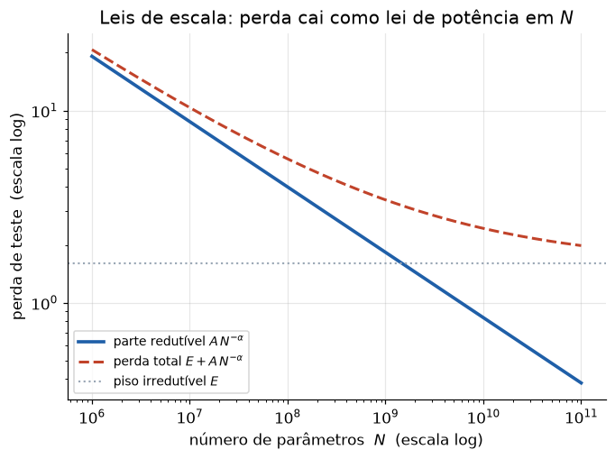

# Lição 044 — O que são LLMs: modelagem de linguagem e leis de escala

> **Módulo:** M05 — LLMs e Pipeline de Treino · **Ordem de estudo:** 44 · **Tempo:** ~55 min
> **Pré-requisitos:** [043] Arquitetura completa do Transformer
> **Classificação:** complemento de aprofundamento à ementa

> **Convenção de formatação:** matemática em LaTeX (`$...$` inline, `$$...$$` em
> destaque, render nativo na pré-visualização do VS Code); figuras reprodutíveis
> geradas por `tools/figuras/gerar_figuras_m05.py` e incorporadas por caminho
> relativo `assets/<NNN>-<slug>/<nome>.png`; blocos ```python só para código e
> saída.

## Seção_Teórica

### Motivação

Um **Large Language Model (LLM)** parece fazer mágica — escreve, resume, traduz,
programa — mas por baixo do capô faz **uma única coisa**: estima a probabilidade
do **próximo token** dado o que veio antes. Toda a versatilidade emerge de treinar
esse objetivo simples sobre uma quantidade colossal de texto, com um Transformer
(Lição 043) grande o suficiente. Entender essa redução — de "inteligência" para
"modelagem de linguagem por next-token" — é o que permite raciocinar sobre o que o
modelo pode e não pode fazer, medir sua qualidade (perplexidade) e prever o retorno
de investir mais parâmetros, dados e compute (**leis de escala**). Sem esse modelo
mental, um LLM é uma caixa-preta; com ele, é um objeto estatístico tratável.

### Princípio de funcionamento

Um modelo de linguagem define uma distribuição sobre sequências de tokens
$x_1, x_2, \dots, x_T$. Pela **regra da cadeia da probabilidade**, qualquer
distribuição conjunta se fatoriza em condicionais:

$$ P(x_1, \dots, x_T) = \prod_{t=1}^{T} P(x_t \mid x_1, \dots, x_{t-1}). $$

Um LLM **autoregressivo** modela exatamente cada fator $P(x_t \mid x_{<t})$ com um
Transformer: a rede recebe o prefixo e emite um vetor de **logits** sobre o
vocabulário, transformado em probabilidades por uma softmax. Treinar é ajustar os
parâmetros $\theta$ para maximizar a verossimilhança do texto observado — ou seja,
**minimizar a cross-entropy** do próximo token, exatamente a perda da Lição 012
aplicada em cada posição.

A qualidade é medida pela **perplexidade**, que é a exponencial da cross-entropy
média por token:

$$ \text{PPL} = \exp\!\left( -\frac{1}{T}\sum_{t=1}^{T} \log P(x_t \mid x_{<t}) \right). $$

Intuitivamente, a perplexidade é o "número efetivo de opções" que o modelo
hesita entre, a cada passo: quanto menor, mais confiante e melhor o modelo.

Empiricamente, a perda de teste cai de forma **previsível** quando aumentamos o
número de parâmetros $N$, o volume de dados $D$ ou o compute $C$ — as **leis de
escala**. Em larga faixa, a relação é uma **lei de potência** mais um piso
irredutível $E$ (a entropia inerente da linguagem):

$$ L(N) \approx E + \frac{A}{N^{\alpha}}. $$



*Figura 1 — Em escala log-log, a parte redutível da perda $A\,N^{-\alpha}$ vira uma reta; a perda total satura no piso irredutível $E$. Gerada por `tools/figuras/gerar_figuras_m05.py`.*

---

### Conceito central 1 — Modelagem de linguagem: next-token e regra da cadeia

Modelar linguagem é atribuir probabilidade ao próximo token e, por composição,
a sequências inteiras. A probabilidade de uma frase é o **produto** das
probabilidades condicionais de cada token dado o seu prefixo. Trabalhamos em
**log** para evitar underflow e transformar produto em soma.

#### Exemplo_Resolvido 1.1

```python
import numpy as np

# Vocabulário minúsculo e um "modelo" de linguagem determinístico:
# dado o prefixo (último token), devolve a distribuição do próximo token.
vocab = ["<s>", "o", "gato", "dorme", "</s>"]
idx = {t: i for i, t in enumerate(vocab)}

# Linha i = distribuição de P(proximo | token i). Linhas somam 1.
P = np.array([
    [0.0, 0.7, 0.2, 0.1, 0.0],   # depois de <s>
    [0.0, 0.0, 0.8, 0.1, 0.1],   # depois de "o"
    [0.0, 0.1, 0.0, 0.8, 0.1],   # depois de "gato"
    [0.0, 0.1, 0.0, 0.0, 0.9],   # depois de "dorme"
    [0.0, 0.0, 0.0, 0.0, 1.0],   # depois de </s>
])

sequencia = ["<s>", "o", "gato", "dorme", "</s>"]

# P(sequencia) = produto de P(token_t | token_{t-1}) pela regra da cadeia.
log_prob = 0.0
for ant, prox in zip(sequencia[:-1], sequencia[1:]):
    p = P[idx[ant], idx[prox]]
    log_prob += np.log(p)
    print(f"P({prox:>5} | {ant:>5}) = {p:.3f}")

prob = np.exp(log_prob)
print(f"log P(sequencia) = {log_prob:.4f}")
print(f"P(sequencia)     = {prob:.4f}")
```

**Explicação passo a passo:**
- **Bloco 1 (`vocab`/`idx`):** define um vocabulário de 5 tokens e o mapeamento token → índice.
- **Bloco 2 (`P`):** matriz de transição didática (modelo de linguagem de 1ª ordem); a linha $i$ é a distribuição $P(\text{próximo}\mid i)$ e soma 1.
- **Bloco 3 (laço):** aplica a regra da cadeia acumulando $\log P$ de cada par (anterior → próximo) da sequência.
- **Bloco 4 (`print`):** a probabilidade conjunta é $0.7 \times 0.8 \times 0.8 \times 0.9 = 0.4032$; o log-prob $-0.9083$ é a soma dos logs.

**Saída esperada:**
```
P(    o |   <s>) = 0.700
P( gato |     o) = 0.800
P(dorme |  gato) = 0.800
P( </s> | dorme) = 0.900
log P(sequencia) = -0.9083
P(sequencia)     = 0.4032
```

---

### Conceito central 2 — Perplexidade e cross-entropy

Para comparar modelos usamos a **cross-entropy média por token** (em nats) e sua
exponencial, a **perplexidade**. Quanto maior a probabilidade que o modelo
atribui aos tokens corretos, menor a cross-entropy e menor a perplexidade.

#### Exemplo_Resolvido 2.1

```python
import numpy as np

# Em cada passo o modelo previu uma distribuição sobre 4 tokens; o índice
# correto está em "alvos". Avaliamos cross-entropy e perplexidade.
distribuicoes = np.array([
    [0.60, 0.20, 0.15, 0.05],
    [0.10, 0.70, 0.10, 0.10],
    [0.25, 0.25, 0.40, 0.10],
    [0.05, 0.05, 0.10, 0.80],
])
alvos = [0, 1, 2, 3]

# probabilidade atribuída ao token correto em cada passo
p_corretos = distribuicoes[np.arange(len(alvos)), alvos]
nll = -np.log(p_corretos)                 # -log p por token
ce = nll.mean()                           # cross-entropy média (nats)
ppl = np.exp(ce)                          # perplexidade

for t, (p, l) in enumerate(zip(p_corretos, nll)):
    print(f"passo {t}: p_correto={p:.2f}  -log p={l:.4f}")
print(f"cross-entropy (nats) = {ce:.4f}")
print(f"perplexidade         = {ppl:.4f}")
```

**Explicação passo a passo:**
- **Bloco 1 (`distribuicoes`/`alvos`):** quatro previsões do modelo e o índice do token correto em cada passo.
- **Bloco 2 (`p_corretos`):** indexação avançada do numpy extrai a probabilidade do token correto em cada linha.
- **Bloco 3 (`nll`/`ce`/`ppl`):** a NLL por token é $-\log p$; a cross-entropy é a média; a perplexidade é $e^{\text{CE}}$.
- **Bloco 4 (`print`):** a perplexidade $\approx 1.65$ indica que o modelo hesita, em média, entre menos de 2 tokens — está bem confiante.

**Saída esperada:**
```
passo 0: p_correto=0.60  -log p=0.5108
passo 1: p_correto=0.70  -log p=0.3567
passo 2: p_correto=0.40  -log p=0.9163
passo 3: p_correto=0.80  -log p=0.2231
cross-entropy (nats) = 0.5017
perplexidade         = 1.6516
```

---

### Conceito central 3 — Leis de escala

As **leis de escala** descrevem como a perda cai ao aumentar parâmetros, dados ou
compute. A forma $L(N) = E + A\,N^{-\alpha}$ tem duas consequências práticas: há um
**piso irredutível** $E$ (não dá para ir abaixo da entropia da linguagem) e cada
multiplicação de $N$ por 10 reduz a **parte redutível** por um fator fixo
$10^{\alpha}$ — retornos decrescentes, mas previsíveis.

#### Exemplo_Resolvido 3.1

```python
import numpy as np

# Lei de escala: L(N) = E + A * N^(-alpha). Avaliamos a perda prevista para
# modelos cada vez maiores e o quanto a parte redutível encolhe.
E, A, alpha = 1.6, 2100.0, 0.34

def perda(N):
    return E + A * N ** (-alpha)

tamanhos = [1e7, 1e8, 1e9, 1e10]
anterior = None
for N in tamanhos:
    L = perda(N)
    reduzivel = L - E
    if anterior is None:
        print(f"N={N:.0e}: L={L:.4f} reduzivel={reduzivel:.4f}")
    else:
        queda = (anterior - L) / anterior * 100
        print(f"N={N:.0e}: L={L:.4f} reduzivel={reduzivel:.4f} queda={queda:.1f}%")
    anterior = L

# Multiplicar N por 10 reduz a parte redutível por um fator fixo 10^alpha.
print(f"fator por decada = {10 ** alpha:.4f}")
```

**Explicação passo a passo:**
- **Bloco 1 (`E`/`A`/`alpha`):** parâmetros da lei de potência; $E$ é o piso irredutível.
- **Bloco 2 (`perda`):** implementa $L(N) = E + A\,N^{-\alpha}$.
- **Bloco 3 (laço):** avalia a perda para modelos de $10^7$ a $10^{10}$ parâmetros e a queda percentual a cada década.
- **Bloco 4 (`print` final):** a parte redutível encolhe por um fator constante $10^{\alpha} \approx 2.19$ por década — daí a queda em $L$ ser cada vez menor à medida que nos aproximamos do piso $E$.

**Saída esperada:**
```
N=1e+07: L=10.3543 reduzivel=8.7543
N=1e+08: L=5.6015 reduzivel=4.0015 queda=45.9%
N=1e+09: L=3.4290 reduzivel=1.8290 queda=38.8%
N=1e+10: L=2.4360 reduzivel=0.8360 queda=29.0%
fator por decada = 2.1878
```

## Seção_Prática

> **Como reproduzir:** execute cada solução de referência com
> `python trilha/solucoes/044-llms-modelagem-linguagem-escala/solucao_<n>.py` e
> compare a saída com o arquivo `.saida.txt` correspondente. Os
> enunciados/esqueletos ficam em
> `trilha/pratica/044-llms-modelagem-linguagem-escala/exercicio_<n>.py`.

### Exercício 1 — Probabilidade de uma sequência pela regra da cadeia
- **Entrada inicial / setup:** a matriz de transição `P` (5×5) e o vocabulário dados no esqueleto; a sequência `["<s>", "o", "gato", "foge", "</s>"]` (note `foge` no lugar de `dorme`).
- **Passos de execução:** implemente o cálculo do log-prob acumulado pela regra da cadeia e imprima cada fator condicional, o `log P(sequencia)` (4 casas) e o `P(sequencia)` (4 casas).
- **Critério de conclusão (binário):** a saída é **exatamente** igual a `solucao_1.saida.txt` (`P(sequencia) = 0.1512`); qualquer divergência reprova.
- **Solução de referência:** `trilha/solucoes/044-llms-modelagem-linguagem-escala/solucao_1.py`
- **Saída esperada:** `trilha/solucoes/044-llms-modelagem-linguagem-escala/solucao_1.saida.txt`

### Exercício 2 — Cross-entropy e perplexidade de um modelo
- **Entrada inicial / setup:** a matriz `distribuicoes` (3×5) e a lista `alvos = [4, 2, 0]` dadas no esqueleto.
- **Passos de execução:** extraia a probabilidade do token correto em cada passo, calcule a NLL por token, a cross-entropy média e a perplexidade; imprima cada passo (2 casas em `p_correto`, 4 em `-log p`), a `cross-entropy` (4 casas) e a `perplexidade` (4 casas).
- **Critério de conclusão (binário):** a saída é **exatamente** igual a `solucao_2.saida.txt` (`perplexidade = 2.0274`); qualquer divergência reprova.
- **Solução de referência:** `trilha/solucoes/044-llms-modelagem-linguagem-escala/solucao_2.py`
- **Saída esperada:** `trilha/solucoes/044-llms-modelagem-linguagem-escala/solucao_2.saida.txt`

### Exercício 3 — Inverter a lei de escala
- **Entrada inicial / setup:** os parâmetros `E = 1.6`, `A = 2100.0`, `alpha = 0.34` e uma perda-alvo `L_alvo = 2.0`.
- **Passos de execução:** isole $N$ em $L = E + A\,N^{-\alpha}$ para obter $N = (A / (L - E))^{1/\alpha}$; imprima o $N$ necessário em notação científica (`{N:.3e}`) e verifique recomputando a perda nesse $N$ (4 casas).
- **Critério de conclusão (binário):** a saída é **exatamente** igual a `solucao_3.saida.txt` (`N necessario = 8.743e+10` e `perda recomputada = 2.0000`); qualquer divergência reprova.
- **Solução de referência:** `trilha/solucoes/044-llms-modelagem-linguagem-escala/solucao_3.py`
- **Saída esperada:** `trilha/solucoes/044-llms-modelagem-linguagem-escala/solucao_3.saida.txt`
