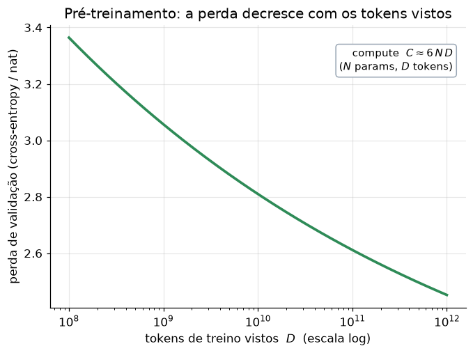

# Lição 045 — Pré-treinamento de LLMs: objetivo, dados e custo

> **Módulo:** M05 — LLMs e Pipeline de Treino · **Ordem de estudo:** 45 · **Tempo:** ~55 min
> **Pré-requisitos:** [044] O que são LLMs: modelagem de linguagem e leis de escala
> **Classificação:** complemento de aprofundamento à ementa

> **Convenção de formatação:** matemática em LaTeX (`$...$` inline, `$$...$$` em
> destaque, render nativo na pré-visualização do VS Code); figuras reprodutíveis
> geradas por `tools/figuras/gerar_figuras_m05.py` e incorporadas por caminho
> relativo `assets/<NNN>-<slug>/<nome>.png`; blocos ```python só para código e
> saída.

## Seção_Teórica

### Motivação

O **pré-treinamento** é a fase em que o LLM aprende a língua — gramática, fatos,
padrões de raciocínio — a partir de um oceano de texto bruto, **antes** de
qualquer ajuste para tarefas específicas. É a etapa mais cara e a que define o
"conhecimento base" do modelo. Duas perguntas dominam o planejamento de um
pré-treino: **de onde vem o sinal de treino sem rótulos humanos?** e **quanto vai
custar?** A resposta para a primeira é o objetivo **auto-supervisionado** de
next-token; para a segunda, é a aritmética de **tokens × parâmetros × compute**.
Dominar esses dois eixos é o que separa "rodar um fine-tuning" de entender por que
um modelo base custa milhões de dólares e como esse orçamento é alocado.

### Princípio de funcionamento

O objetivo de pré-treino é o mesmo da Lição 044, aplicado em escala: para cada
posição $t$ de cada documento, o modelo prevê $x_t$ a partir do prefixo $x_{<t}$ e
paga a **cross-entropy**. A perda total é a média sobre todos os tokens do corpus:

$$ \mathcal{L}(\theta) = -\frac{1}{T}\sum_{t=1}^{T} \log P_\theta(x_t \mid x_{<t}). $$

O sinal é **auto-supervisionado**: o "rótulo" de cada posição é simplesmente o
próximo token do próprio texto — não há anotação humana. Durante o treino usa-se
**teacher forcing**: o prefixo verdadeiro é dado como entrada (não as previsões do
modelo), o que permite calcular a perda de todas as posições de uma sequência em
**paralelo**, graças à máscara causal do Transformer.

O **custo** é governado por uma regra empírica notavelmente robusta: treinar um
Transformer denso de $N$ parâmetros sobre $D$ tokens consome aproximadamente

$$ C \approx 6\,N\,D \quad \text{FLOPs}, $$

onde o fator 6 vem de ~2 FLOPs por parâmetro no forward e ~4 no backward, por
token. Dado um **orçamento fixo de compute** $C$, as leis de escala de Chinchilla
mostram que existe uma alocação **compute-ótima** entre $N$ e $D$: na prática,
escalar parâmetros e dados **juntos** (cerca de 20 tokens por parâmetro) é melhor
do que inflar só o modelo.



*Figura 1 — A perda de validação decresce de forma suave com o volume de tokens de treino $D$; a regra $C \approx 6ND$ liga esse volume ao custo de compute. Gerada por `tools/figuras/gerar_figuras_m05.py`.*

---

### Conceito central 1 — O objetivo de pré-treino (next-token auto-supervisionado)

Treinar é minimizar a cross-entropy média do próximo token sobre o corpus.
Com teacher forcing, varremos os pares (prefixo → próximo token) do texto e
acumulamos $-\log P$. Não há rótulos: o supervisor é o próprio texto.

#### Exemplo_Resolvido 1.1

```python
import numpy as np

# Modelo de 1a ordem: P[i] = distribuicao do proximo token dado o token i.
vocab = ["a", "b", "c"]
idx = {t: i for i, t in enumerate(vocab)}
P = np.array([
    [0.1, 0.7, 0.2],   # depois de "a"
    [0.2, 0.2, 0.6],   # depois de "b"
    [0.5, 0.3, 0.2],   # depois de "c"
])
corpus = "abcabc"   # sequência de treino (teacher forcing)

nll_total = 0.0
n = 0
for ant, prox in zip(corpus[:-1], corpus[1:]):
    p = P[idx[ant], idx[prox]]
    nll_total += -np.log(p)
    n += 1
ce = nll_total / n
print(f"pares de treino    = {n}")
print(f"cross-entropy media= {ce:.4f}")
print(f"perplexidade       = {np.exp(ce):.4f}")
```

**Explicação passo a passo:**
- **Bloco 1 (`P`):** modelo de linguagem didático; cada linha é a distribuição do próximo token.
- **Bloco 2 (`corpus`):** a sequência de treino; o rótulo de cada posição é o próprio token seguinte (auto-supervisão).
- **Bloco 3 (laço):** percorre os pares (anterior → próximo) acumulando $-\log P$ — exatamente o que o teacher forcing faz em paralelo num Transformer.
- **Bloco 4 (`print`):** a perda média é ~0.49 nat e a perplexidade ~1.63 — o modelo prevê bem este corpus curto.

**Saída esperada:**
```
pares de treino    = 5
cross-entropy media= 0.4856
perplexidade       = 1.6252
```

---

### Conceito central 2 — Dados e tokens

O "tamanho" de um dataset de pré-treino se mede em **tokens**, não em arquivos.
O número de **passos** de treino é o total de tokens dividido pelos tokens
processados por passo (tamanho de lote × comprimento de contexto). Saber essa
conta dimensiona tempo e custo do treino.

#### Exemplo_Resolvido 2.1

```python
D = 300_000_000_000        # tokens no dataset (300B)
batch_tokens = 2_000_000   # tokens por passo de treino (2M)
epocas = 1

passos = epocas * D // batch_tokens
print(f"tokens no dataset    = {D:.3e}")
print(f"tokens por passo     = {batch_tokens:.3e}")
print(f"passos para {epocas} epoca = {passos}")
```

**Explicação passo a passo:**
- **Bloco 1 (`D`/`batch_tokens`):** o dataset tem 300 bilhões de tokens; cada passo consome 2 milhões (lote × contexto).
- **Bloco 2 (`passos`):** uma época percorre todos os tokens uma vez; o número de passos é $D / \text{batch\_tokens}$.
- **Bloco 3 (`print`):** 150 mil passos para ver o corpus inteiro uma vez — em pré-treino de LLMs costuma-se usar ≈1 época para evitar memorização.

**Saída esperada:**
```
tokens no dataset    = 3.000e+11
tokens por passo     = 2.000e+06
passos para 1 epoca = 150000
```

---

### Conceito central 3 — Custo de compute (C ≈ 6·N·D)

O compute de pré-treino escala com o produto **parâmetros × tokens**. A regra
$C \approx 6ND$ permite estimar FLOPs e, invertida, planejar a alocação
**compute-ótima**: dada uma quantidade de parâmetros, a heurística de Chinchilla
sugere cerca de **20 tokens por parâmetro**.

#### Exemplo_Resolvido 3.1

```python
N = 7_000_000_000          # 7B parametros
D = 140_000_000_000        # 140B tokens (~20 tokens/param, regra Chinchilla)

C = 6 * N * D
print(f"N (parametros) = {N:.3e}")
print(f"D (tokens)     = {D:.3e}")
print(f"C = 6*N*D      = {C:.3e} FLOPs")
print(f"tokens/param   = {D / N:.1f}")
```

**Explicação passo a passo:**
- **Bloco 1 (`N`/`D`):** modelo de 7B parâmetros treinado em 140B tokens.
- **Bloco 2 (`C`):** aplica $C = 6ND$; o fator 6 cobre forward (~2) e backward (~4) por parâmetro e por token.
- **Bloco 3 (`print`):** ~$5.9\times10^{21}$ FLOPs e exatamente 20 tokens por parâmetro — a razão compute-ótima sugerida por Chinchilla.

**Saída esperada:**
```
N (parametros) = 7.000e+09
D (tokens)     = 1.400e+11
C = 6*N*D      = 5.880e+21 FLOPs
tokens/param   = 20.0
```

## Seção_Prática

> **Como reproduzir:** execute cada solução de referência com
> `python trilha/solucoes/045-pre-treinamento/solucao_<n>.py` e compare a saída
> com o arquivo `.saida.txt` correspondente. Os enunciados/esqueletos ficam em
> `trilha/pratica/045-pre-treinamento/exercicio_<n>.py`.

### Exercício 1 — Perda de pré-treino sobre um corpus
- **Entrada inicial / setup:** a matriz `P` (3×3) e o `corpus = "cabbac"` dados no esqueleto.
- **Passos de execução:** acumule a NLL dos pares (anterior → próximo) do corpus, calcule a cross-entropy média e a perplexidade; imprima `pares de treino`, `cross-entropy media` (4 casas) e `perplexidade` (4 casas).
- **Critério de conclusão (binário):** a saída é **exatamente** igual a `solucao_1.saida.txt` (`cross-entropy media= 1.1756`); qualquer divergência reprova.
- **Solução de referência:** `trilha/solucoes/045-pre-treinamento/solucao_1.py`
- **Saída esperada:** `trilha/solucoes/045-pre-treinamento/solucao_1.saida.txt`

### Exercício 2 — Passos de treino e número de épocas
- **Entrada inicial / setup:** `D = 50_000_000_000` tokens, `batch_tokens = 500_000`, `passos_disponiveis = 200_000`.
- **Passos de execução:** calcule os passos para 1 época (`D // batch_tokens`) e quantas épocas completas cabem em `passos_disponiveis` (divisão inteira); imprima `passos por epoca`, `epocas completas` e os `tokens vistos` totais (`{:.3e}`).
- **Critério de conclusão (binário):** a saída é **exatamente** igual a `solucao_2.saida.txt` (`epocas completas = 2` e `tokens vistos = 1.000e+11`); qualquer divergência reprova.
- **Solução de referência:** `trilha/solucoes/045-pre-treinamento/solucao_2.py`
- **Saída esperada:** `trilha/solucoes/045-pre-treinamento/solucao_2.saida.txt`

### Exercício 3 — Tokens compute-ótimos e FLOPs
- **Entrada inicial / setup:** `N = 1_300_000_000` parâmetros e a razão alvo `tokens_por_param = 20`.
- **Passos de execução:** calcule `D = N * tokens_por_param`, o compute `C = 6 * N * D` e imprima `D (tokens)` (`{:.3e}`), `C = 6*N*D` (`{:.3e}` seguido de ` FLOPs`) e a razão `tokens/param` (1 casa).
- **Critério de conclusão (binário):** a saída é **exatamente** igual a `solucao_3.saida.txt` (`D (tokens)     = 2.600e+10` e `tokens/param   = 20.0`); qualquer divergência reprova.
- **Solução de referência:** `trilha/solucoes/045-pre-treinamento/solucao_3.py`
- **Saída esperada:** `trilha/solucoes/045-pre-treinamento/solucao_3.saida.txt`
