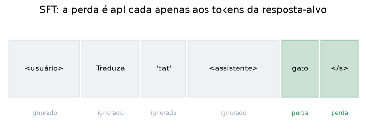

# Lição 046 — Instruction tuning e Supervised Fine-Tuning (SFT)

> **Módulo:** M05 — LLMs e Pipeline de Treino · **Ordem de estudo:** 46 · **Tempo:** ~50 min
> **Pré-requisitos:** [045] Pré-treinamento de LLMs: objetivo, dados e custo
> **Classificação:** complemento de aprofundamento à ementa

> **Convenção de formatação:** matemática em LaTeX (`$...$` inline, `$$...$$` em
> destaque, render nativo na pré-visualização do VS Code); figuras reprodutíveis
> geradas por `tools/figuras/gerar_figuras_m05.py` e incorporadas por caminho
> relativo `assets/<NNN>-<slug>/<nome>.png`; blocos ```python só para código e
> saída.

## Seção_Teórica

### Motivação

Um modelo recém **pré-treinado** é um excelente **completador de texto**, mas não
um **assistente**: peça "Traduza 'cat' para o português" e ele pode continuar a
frase ("...e 'dog' para...") em vez de responder "gato". O pré-treino ensinou a
língua, não o **hábito de seguir instruções**. O **instruction tuning** via
**Supervised Fine-Tuning (SFT)** corrige isso: continua o mesmo objetivo de
next-token, mas sobre um dataset curado de pares **(instrução, resposta ideal)**.
É a primeira etapa do alinhamento e a base sobre a qual RLHF/DPO (próximas lições)
operam. Entender o SFT — e o detalhe crucial da **máscara de perda** — é o que
evita treinar o modelo a repetir o enunciado em vez de aprender a respondê-lo.

### Princípio de funcionamento

No SFT, cada exemplo de treino é uma sequência única que concatena a instrução do
usuário e a resposta-alvo, num **formato (template) de chat** com tokens especiais
que delimitam os papéis (ex.: `<|user|>`, `<|assistant|>`). O modelo é treinado
com o mesmo objetivo de cross-entropy do próximo token, **mas** com uma diferença
essencial: a perda é **mascarada** sobre os tokens do prompt. Só os tokens da
**resposta** contribuem para o gradiente:

$$ \mathcal{L}_{\text{SFT}}(\theta) = -\frac{1}{\sum_t m_t}\sum_{t=1}^{T} m_t \,\log P_\theta(x_t \mid x_{<t}), \qquad m_t \in \{0, 1\}, $$

onde $m_t = 1$ se a posição $t$ pertence à resposta e $m_t = 0$ se pertence ao
prompt. Sem a máscara, o modelo seria recompensado por prever bem o **enunciado** —
algo que ele não controla em inferência e que diluiria o sinal. Com a máscara, todo
o gradiente foca em "dada esta instrução, **produza esta resposta**".



*Figura 1 — A perda do SFT ignora os tokens do prompt (cinza) e é aplicada apenas aos tokens da resposta-alvo (verde). Gerada por `tools/figuras/gerar_figuras_m05.py`.*

---

### Conceito central 1 — Formato instrução-resposta

O dado de SFT não é texto solto: é estruturado por um **template** que marca onde
começa a instrução e onde começa a resposta. Esses tokens especiais são o que, em
inferência, sinalizam ao modelo "agora é a sua vez de responder".

#### Exemplo_Resolvido 1.1

```python
def montar_prompt(instrucao, resposta):
    return (f"<|user|>\n{instrucao}\n"
            f"<|assistant|>\n{resposta}<|end|>")

texto = montar_prompt("Traduza 'cat' para portugues.", "gato")
print(texto)
tokens = texto.split()
print("n_tokens (split):", len(tokens))
```

**Explicação passo a passo:**
- **Bloco 1 (`montar_prompt`):** monta o exemplo de treino no formato de chat, com tokens especiais delimitando os papéis usuário/assistente.
- **Bloco 2 (`texto`):** instancia o template com uma instrução e a resposta ideal "gato".
- **Bloco 3 (`print`):** o exemplo é uma **única** sequência; a contagem por `split()` (didática, não é um tokenizer real) ilustra que prompt e resposta vivem juntos.

**Saída esperada:**
```
<|user|>
Traduza 'cat' para portugues.
<|assistant|>
gato<|end|>
n_tokens (split): 7
```

---

### Conceito central 2 — Perda mascarada

A máscara $m_t$ zera a contribuição dos tokens do prompt. A perda é a média de
$-\log P$ **apenas** sobre as posições da resposta. É isso que faz o SFT ensinar a
**responder**, não a **repetir** o enunciado.

#### Exemplo_Resolvido 2.1

```python
import numpy as np

# Em cada posicao: prob atribuida ao token-alvo e mascara (1=resposta, 0=prompt).
p_alvo  = np.array([0.5, 0.2, 0.6, 0.9, 0.8])
mascara = np.array([0,   0,   0,   1,   1  ])

nll = -np.log(p_alvo)
perda_mascarada = (nll * mascara).sum() / mascara.sum()
print("nll por token   :", np.round(nll, 4).tolist())
print("tokens de resposta:", int(mascara.sum()))
print(f"perda mascarada   = {perda_mascarada:.4f}")
```

**Explicação passo a passo:**
- **Bloco 1 (`p_alvo`/`mascara`):** as três primeiras posições são do prompt ($m=0$); as duas últimas, da resposta ($m=1$).
- **Bloco 2 (`nll`):** NLL por token, $-\log p$, para todas as posições.
- **Bloco 3 (`perda_mascarada`):** soma das NLLs ponderadas pela máscara, dividida pelo número de tokens de resposta — só `0.1054` e `0.2231` entram, dando `0.1643`.

**Saída esperada:**
```
nll por token   : [0.6931, 1.6094, 0.5108, 0.1054, 0.2231]
tokens de resposta: 2
perda mascarada   = 0.1643
```

---

### Conceito central 3 — SFT vs pré-treino

O SFT reaproveita a maquinaria do pré-treino (next-token + cross-entropy), mas a
**máscara** muda o que o gradiente otimiza. Comparar a perda mascarada com a perda
sem máscara torna concreto por que ignorar o prompt é decisivo.

#### Exemplo_Resolvido 3.1

```python
import numpy as np

p_alvo  = np.array([0.5, 0.2, 0.6, 0.9, 0.8])
mascara = np.array([0,   0,   0,   1,   1  ])
nll = -np.log(p_alvo)

perda_sem_mascara = nll.mean()                              # estilo pré-treino
perda_com_mascara = (nll * mascara).sum() / mascara.sum()   # estilo SFT
print(f"perda sem mascara (pre-treino) = {perda_sem_mascara:.4f}")
print(f"perda com mascara (SFT)        = {perda_com_mascara:.4f}")
print("mascara muda o gradiente:", perda_sem_mascara != perda_com_mascara)
```

**Explicação passo a passo:**
- **Bloco 1 (dados):** os mesmos vetores do exemplo anterior.
- **Bloco 2 (`perda_sem_mascara`):** média sobre **todos** os tokens — é o objetivo do pré-treino, que inclui o enunciado.
- **Bloco 3 (`perda_com_mascara`):** média só sobre a resposta — o objetivo do SFT.
- **Bloco 4 (`print`):** as perdas diferem (`0.6284` vs `0.1643`); como o gradiente vem da perda, mascarar muda o que o modelo aprende.

**Saída esperada:**
```
perda sem mascara (pre-treino) = 0.6284
perda com mascara (SFT)        = 0.1643
mascara muda o gradiente: True
```

## Seção_Prática

> **Como reproduzir:** execute cada solução de referência com
> `python trilha/solucoes/046-instruction-tuning-sft/solucao_<n>.py` e compare a
> saída com o arquivo `.saida.txt` correspondente. Os enunciados/esqueletos ficam
> em `trilha/pratica/046-instruction-tuning-sft/exercicio_<n>.py`.

### Exercício 1 — Construir um exemplo de SFT e marcar a máscara
- **Entrada inicial / setup:** a instrução `"Some 2 e 3."`, a resposta `"5"` e a lista de tokens já segmentada `tokens = ["<|user|>", "Some", "2", "e", "3", "<|assistant|>", "5", "<|end|>"]`.
- **Passos de execução:** construa a máscara `m_t` (0 para tudo até `<|assistant|>` inclusive; 1 para os tokens após ele); imprima a lista de tokens, a máscara e o número de tokens de resposta.
- **Critério de conclusão (binário):** a saída é **exatamente** igual a `solucao_1.saida.txt` (`mascara: [0, 0, 0, 0, 0, 0, 1, 1]` e `tokens de resposta: 2`); qualquer divergência reprova.
- **Solução de referência:** `trilha/solucoes/046-instruction-tuning-sft/solucao_1.py`
- **Saída esperada:** `trilha/solucoes/046-instruction-tuning-sft/solucao_1.saida.txt`

### Exercício 2 — Perda mascarada do SFT
- **Entrada inicial / setup:** `p_alvo = [0.4, 0.7, 0.3, 0.95, 0.5, 0.6]` e `mascara = [0, 0, 0, 1, 1, 1]`.
- **Passos de execução:** calcule a NLL por token, a perda mascarada (média sobre os tokens de resposta) e imprima `nll por token` (4 casas, como lista), `tokens de resposta` e `perda mascarada` (4 casas).
- **Critério de conclusão (binário):** a saída é **exatamente** igual a `solucao_2.saida.txt` (`perda mascarada   = 0.4184`); qualquer divergência reprova.
- **Solução de referência:** `trilha/solucoes/046-instruction-tuning-sft/solucao_2.py`
- **Saída esperada:** `trilha/solucoes/046-instruction-tuning-sft/solucao_2.saida.txt`

### Exercício 3 — Comparar perda mascarada e não-mascarada
- **Entrada inicial / setup:** os mesmos `p_alvo` e `mascara` do Exercício 2.
- **Passos de execução:** calcule a perda sem máscara (média sobre todos os tokens) e com máscara (só a resposta); imprima ambas (4 casas) e se diferem.
- **Critério de conclusão (binário):** a saída é **exatamente** igual a `solucao_3.saida.txt` (`perda com mascara (SFT)        = 0.4184` e `mascara muda o gradiente: True`); qualquer divergência reprova.
- **Solução de referência:** `trilha/solucoes/046-instruction-tuning-sft/solucao_3.py`
- **Saída esperada:** `trilha/solucoes/046-instruction-tuning-sft/solucao_3.saida.txt`
