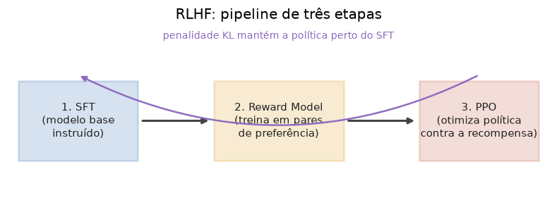

# Lição 047 — Otimização por preferência: RLHF e PPO

> **Módulo:** M05 — LLMs e Pipeline de Treino · **Ordem de estudo:** 47 · **Tempo:** ~55 min
> **Pré-requisitos:** [046] Instruction tuning e Supervised Fine-Tuning (SFT)
> **Classificação:** complemento de aprofundamento à ementa

> **Convenção de formatação:** matemática em LaTeX (`$...$` inline, `$$...$$` em
> destaque, render nativo na pré-visualização do VS Code); figuras reprodutíveis
> geradas por `tools/figuras/gerar_figuras_m05.py` e incorporadas por caminho
> relativo `assets/<NNN>-<slug>/<nome>.png`; blocos ```python só para código e
> saída.

## Seção_Teórica

### Motivação

Depois do SFT (Lição 046), o modelo **segue instruções**, mas ainda não sabe qual
de duas respostas plausíveis é a **melhor**: mais útil, mais segura, menos
prolixa. O problema é que "qualidade de resposta" raramente tem um rótulo único e
escrito — é mais fácil para uma pessoa **comparar** duas respostas ("A é melhor que
B") do que redigir a resposta perfeita. O **RLHF** (*Reinforcement Learning from
Human Feedback*) explora exatamente isso: aprende um **modelo de recompensa** a
partir de **preferências** humanas e depois usa **RL** para empurrar a política do
modelo na direção de recompensas maiores. É o método que transformou modelos base
em assistentes alinhados (InstructGPT, ChatGPT) e a etapa onde entra o **PPO**
(*Proximal Policy Optimization*). Entender essa engrenagem — e o porquê da
penalidade KL e do clipping — é o que separa repetir "RLHF" de saber por que ele
funciona e onde ele quebra.

### Princípio de funcionamento

O RLHF clássico tem **três etapas**:

1. **SFT** — ponto de partida: um modelo já instruído (a política inicial $\pi_{\text{ref}}$).
2. **Reward model (RM)** — treina-se um modelo $r_\phi(x, y)$ que pontua uma
   resposta $y$ a um prompt $x$. O dado é um par $(y_w, y_l)$ onde $y_w$ ("winner")
   foi preferido a $y_l$ ("loser"). Sob o modelo **Bradley-Terry**, a probabilidade
   de preferir $y_w$ é $\sigma(r_\phi(x,y_w) - r_\phi(x,y_l))$, então o RM minimiza
   $$ \mathcal{L}_{\text{RM}} = -\,\mathbb{E}_{(x,y_w,y_l)}\big[\log \sigma\big(r_\phi(x,y_w) - r_\phi(x,y_l)\big)\big]. $$
3. **Otimização por RL** — a política $\pi_\theta$ gera respostas, recebe a
   recompensa do RM e é atualizada para maximizá-la. Para não "fugir" do modelo de
   linguagem original (e *hackear* a recompensa), adiciona-se uma **penalidade KL**
   contra a referência:
   $$ \max_{\theta}\ \mathbb{E}\big[\,r_\phi(x,y)\,\big] - \beta\,\mathrm{KL}\big(\pi_\theta(\cdot\mid x)\,\|\,\pi_{\text{ref}}(\cdot\mid x)\big). $$



*Figura 1 — As três etapas do RLHF. O reward model converte preferências em um escalar; o PPO otimiza a política contra esse escalar, com a penalidade KL mantendo-a próxima do SFT. Gerada por `tools/figuras/gerar_figuras_m05.py`.*

A atualização por RL usa o **PPO**, que maximiza um **objetivo substituto clipado**.
Seja $\rho_t = \pi_\theta(a_t\mid s_t) / \pi_{\theta_{\text{old}}}(a_t\mid s_t)$ a
razão entre a política nova e a antiga, e $A_t$ a **vantagem** estimada:

$$ \mathcal{L}^{\text{CLIP}}(\theta) = \mathbb{E}_t\Big[\min\big(\rho_t A_t,\ \mathrm{clip}(\rho_t, 1-\epsilon, 1+\epsilon)\,A_t\big)\Big]. $$

O `clip` impede que um único passo mude a política demais: se $\rho_t$ sai da faixa
$[1-\epsilon, 1+\epsilon]$, o ganho é **truncado**, removendo o incentivo a passos
gigantes. É isso que torna o PPO **estável** — o "proximal" do nome.

---

### Conceito central 1 — Reward model a partir de preferências

O reward model aprende um **escalar** de qualidade comparando pares. A perda de
Bradley-Terry, $-\log \sigma(r_w - r_l)$, é pequena quando a margem $r_w - r_l$ é
**positiva e grande** (o modelo prefere o vencedor com folga) e cresce quando a
margem é negativa (o modelo erra a ordem).

#### Exemplo_Resolvido 1.1

```python
import numpy as np

def sigmoid(x):
    return 1.0 / (1.0 + np.exp(-x))

# Recompensas do reward model: resposta escolhida (w) vs rejeitada (l).
r_chosen   = np.array([2.0, 0.5, 1.5])
r_rejected = np.array([1.0, 1.0, -0.5])

margens = r_chosen - r_rejected
perdas = -np.log(sigmoid(margens))
for i, (m, p) in enumerate(zip(margens, perdas)):
    print(f"par {i}: margem={m:+.2f}  perda={p:.4f}")
print(f"perda media = {perdas.mean():.4f}")
```

**Explicação passo a passo:**
- **Bloco 1 (`sigmoid`):** a logística que converte a margem de recompensa em probabilidade de preferência.
- **Bloco 2 (`r_chosen`/`r_rejected`):** pontuações do RM para o par escolhido/rejeitado em três exemplos.
- **Bloco 3 (`margens`/`perdas`):** a perda de Bradley-Terry é $-\log \sigma(r_w - r_l)$; margem $+2$ dá perda baixa (0.1269), margem negativa $-0.5$ dá perda alta (0.9741).
- **Bloco 4 (`print`):** a perda média resume o quão bem o RM respeita as preferências do conjunto.

**Saída esperada:**
```
par 0: margem=+1.00  perda=0.3133
par 1: margem=-0.50  perda=0.9741
par 2: margem=+2.00  perda=0.1269
perda media = 0.4714
```

---

### Conceito central 2 — Recompensa com penalidade KL

Maximizar só a recompensa leva o modelo a **explorar falhas** do RM (textos
estranhos com recompensa alta — *reward hacking*) e a esquecer a língua. A solução
é subtrair $\beta$ vezes a divergência da referência: a **recompensa efetiva** é
$r - \beta\,\mathrm{KL}$. Assim, o modelo só "gasta" distância da referência onde o
ganho de recompensa compensa.

#### Exemplo_Resolvido 2.1

```python
import numpy as np

# Recompensa do reward model por amostra e KL(politica || referencia).
r = np.array([1.2, 0.8, -0.3])
kl = np.array([0.5, 2.0, 0.1])
beta = 0.2

r_efetiva = r - beta * kl
for i, (ri, ki, re) in enumerate(zip(r, kl, r_efetiva)):
    print(f"amostra {i}: r={ri:+.2f} kl={ki:.2f} r_efetiva={re:+.4f}")
print(f"recompensa efetiva media = {r_efetiva.mean():.4f}")
```

**Explicação passo a passo:**
- **Bloco 1 (`r`/`kl`/`beta`):** recompensa bruta do RM, divergência KL contra a referência e o peso $\beta$ da penalidade.
- **Bloco 2 (`r_efetiva`):** subtrai $\beta\,\mathrm{KL}$ de cada recompensa.
- **Bloco 3 (`print`):** a amostra 1 tem recompensa alta (0.8) mas KL grande (2.0); a penalidade derruba sua recompensa efetiva para 0.4 — o modelo é desincentivado a se afastar tanto da referência.

**Saída esperada:**
```
amostra 0: r=+1.20 kl=0.50 r_efetiva=+1.1000
amostra 1: r=+0.80 kl=2.00 r_efetiva=+0.4000
amostra 2: r=-0.30 kl=0.10 r_efetiva=-0.3200
recompensa efetiva media = 0.3933
```

---

### Conceito central 3 — Objetivo clipado do PPO

O PPO atualiza a política maximizando $\min(\rho A, \mathrm{clip}(\rho, 1-\epsilon,
1+\epsilon)\,A)$. Quando a vantagem $A$ é **positiva**, o `clip` limita o ganho se a
razão $\rho$ subir demais (não vale a pena mudar muito de uma vez); quando $A$ é
**negativa**, o `min` garante que a penalização não seja suavizada por uma razão
fora da faixa. O efeito líquido é um passo **conservador**.

#### Exemplo_Resolvido 3.1

```python
import numpy as np

def clip(x, lo, hi):
    return np.minimum(np.maximum(x, lo), hi)

# Razao nova/antiga e vantagem estimada por amostra.
ratio = np.array([1.10, 0.80, 1.50, 0.95])
A     = np.array([2.0, -1.0, 1.0, -2.0])
eps = 0.2

nao_clipado = ratio * A
clipado = clip(ratio, 1 - eps, 1 + eps) * A
objetivo = np.minimum(nao_clipado, clipado)
for i in range(len(ratio)):
    print(f"i={i}: ratio={ratio[i]:.2f} A={A[i]:+.1f} L_clip={objetivo[i]:+.4f}")
print(f"objetivo PPO (media) = {objetivo.mean():.4f}")
```

**Explicação passo a passo:**
- **Bloco 1 (`clip`):** trunca a razão à faixa $[1-\epsilon, 1+\epsilon] = [0.8, 1.2]$.
- **Bloco 2 (`ratio`/`A`):** quatro amostras com razões e vantagens variadas.
- **Bloco 3 (`objetivo`):** toma o mínimo entre o termo não-clipado e o clipado. Na amostra 2 ($\rho=1.5$, $A=+1$) o ganho é **cortado** de 1.5 para 1.2; nas demais, $\rho$ está na faixa e nada muda.
- **Bloco 4 (`print`):** o clipping só "morde" quando a política tentou andar longe demais numa direção vantajosa — exatamente o que estabiliza o treino.

**Saída esperada:**
```
i=0: ratio=1.10 A=+2.0 L_clip=+2.2000
i=1: ratio=0.80 A=-1.0 L_clip=-0.8000
i=2: ratio=1.50 A=+1.0 L_clip=+1.2000
i=3: ratio=0.95 A=-2.0 L_clip=-1.9000
objetivo PPO (media) = 0.1750
```

## Seção_Prática

> **Como reproduzir:** execute cada solução de referência com
> `python trilha/solucoes/047-rlhf-ppo/solucao_<n>.py` e compare a saída com o
> arquivo `.saida.txt` correspondente. Os enunciados/esqueletos ficam em
> `trilha/pratica/047-rlhf-ppo/exercicio_<n>.py`.

### Exercício 1 — Perda de preferência do reward model
- **Entrada inicial / setup:** `r_chosen = [3.0, 0.5, 2.0, -0.5]` e `r_rejected = [1.0, 1.5, 2.0, -1.5]` dados no esqueleto.
- **Passos de execução:** calcule a margem `r_chosen - r_rejected`, a perda de Bradley-Terry `-log sigmoid(margem)` por par e a perda média; imprima cada par (`margem` com sinal e 2 casas, `perda` com 4 casas) e a `perda media` (4 casas).
- **Critério de conclusão (binário):** a saída é **exatamente** igual a `solucao_1.saida.txt` (`perda media = 0.6116`); qualquer divergência reprova.
- **Solução de referência:** `trilha/solucoes/047-rlhf-ppo/solucao_1.py`
- **Saída esperada:** `trilha/solucoes/047-rlhf-ppo/solucao_1.saida.txt`

### Exercício 2 — Recompensa efetiva com penalidade KL
- **Entrada inicial / setup:** `r = [2.0, 1.0, -0.5, 0.4]`, `kl = [0.5, 3.0, 0.2, 1.0]` e `beta = 0.2`.
- **Passos de execução:** calcule `r_efetiva = r - beta * kl` e imprima cada amostra (`r` e `r_efetiva` com sinal; `kl` com 2 casas) e a `recompensa efetiva media` (4 casas).
- **Critério de conclusão (binário):** a saída é **exatamente** igual a `solucao_2.saida.txt` (`recompensa efetiva media = 0.4900`); qualquer divergência reprova.
- **Solução de referência:** `trilha/solucoes/047-rlhf-ppo/solucao_2.py`
- **Saída esperada:** `trilha/solucoes/047-rlhf-ppo/solucao_2.saida.txt`

### Exercício 3 — Objetivo clipado do PPO
- **Entrada inicial / setup:** `ratio = [1.30, 0.70, 1.05, 0.90]`, `A = [1.0, 1.0, -1.0, -1.0]` e `eps = 0.2`.
- **Passos de execução:** calcule o termo não-clipado `ratio*A`, o clipado `clip(ratio, 1-eps, 1+eps)*A` e o objetivo `min` dos dois; imprima cada `i` (`ratio` com 2 casas, `A` com sinal, `L_clip` com 4 casas) e o `objetivo PPO (media)` (4 casas).
- **Critério de conclusão (binário):** a saída é **exatamente** igual a `solucao_3.saida.txt` (`objetivo PPO (media) = -0.0125`); qualquer divergência reprova.
- **Solução de referência:** `trilha/solucoes/047-rlhf-ppo/solucao_3.py`
- **Saída esperada:** `trilha/solucoes/047-rlhf-ppo/solucao_3.saida.txt`
