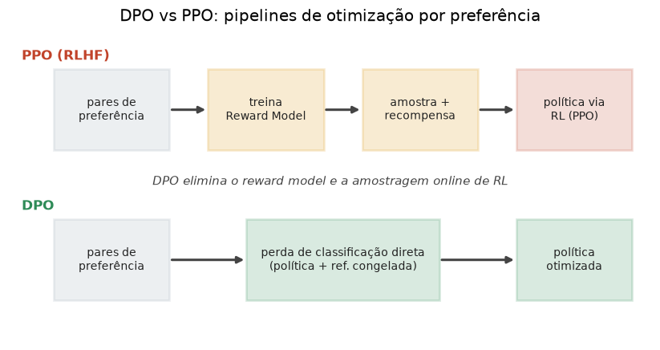

# Lição 048 — DPO e comparação DPO vs PPO

> **Módulo:** M05 — LLMs e Pipeline de Treino · **Ordem de estudo:** 48 · **Tempo:** ~55 min
> **Pré-requisitos:** [047] Otimização por preferência: RLHF e PPO
> **Classificação:** complemento de aprofundamento à ementa

> **Convenção de formatação:** matemática em LaTeX (`$...$` inline, `$$...$$` em
> destaque, render nativo na pré-visualização do VS Code); figuras reprodutíveis
> geradas por `tools/figuras/gerar_figuras_m05.py` e incorporadas por caminho
> relativo `assets/<NNN>-<slug>/<nome>.png`; blocos ```python só para código e
> saída.

## Seção_Teórica

### Motivação

O RLHF com PPO (Lição 047) funciona, mas é **caro e frágil**: exige treinar um
**reward model** separado, **amostrar** respostas online da política e equilibrar
um laço de RL com vários hiperparâmetros sensíveis. O **DPO** (*Direct Preference
Optimization*) faz uma pergunta provocadora: e se déssemos para pular o reward
model e o RL, otimizando a política **diretamente** sobre os pares de preferência?
A sacada do DPO é mostrar, com álgebra, que a política ótima do objetivo
KL-regularizado do RLHF tem uma forma fechada — e que isso permite reescrever todo
o problema como uma **única perda de classificação** sobre os pares. O resultado é
um método estável, com a simplicidade de um fine-tuning supervisionado, que
disputa de igual para igual com o PPO. É um dos tópicos mais cobrados em entrevista
de LLM justamente porque conecta teoria (a forma da política ótima) e prática
(menos máquinas, menos código, menos instabilidade).

### Princípio de funcionamento

No RLHF, a política que maximiza $\mathbb{E}[r(x,y)] - \beta\,\mathrm{KL}(\pi_\theta
\,\|\,\pi_{\text{ref}})$ tem solução analítica $\pi^*(y\mid x) \propto
\pi_{\text{ref}}(y\mid x)\,\exp\!\big(r(x,y)/\beta\big)$. Invertendo, a recompensa
fica **implícita** na própria política:

$$ r(x,y) = \beta\,\log\frac{\pi_\theta(y\mid x)}{\pi_{\text{ref}}(y\mid x)} + \beta\log Z(x). $$

Como a perda de preferência (Bradley-Terry, Lição 047) depende só da **diferença**
$r(x,y_w) - r(x,y_l)$, o termo $\beta\log Z(x)$ **se cancela**. Substituindo, o DPO
otimiza diretamente:

$$ \mathcal{L}_{\text{DPO}} = -\,\mathbb{E}\!\left[\log \sigma\!\left(\beta\,\log\frac{\pi_\theta(y_w\mid x)}{\pi_{\text{ref}}(y_w\mid x)} - \beta\,\log\frac{\pi_\theta(y_l\mid x)}{\pi_{\text{ref}}(y_l\mid x)}\right)\right]. $$

Ou seja: nenhum reward model, nenhuma amostragem online. Só precisamos das
**log-probabilidades** da política $\pi_\theta$ (que treinamos) e de uma referência
$\pi_{\text{ref}}$ **congelada** (tipicamente o modelo após SFT), avaliadas nas
respostas escolhida e rejeitada.



*Figura 1 — PPO precisa de reward model + amostragem online + RL; DPO colapsa tudo numa perda de classificação direta sobre os pares, usando a política e uma referência congelada. Gerada por `tools/figuras/gerar_figuras_m05.py`.*

A comparação resumida: o **PPO** é *online* (gera respostas durante o treino) e
pode explorar além do dataset de preferências, ao custo de complexidade e
instabilidade; o **DPO** é *offline* (usa um dataset fixo de pares), muito mais
simples e estável, mas limitado ao que está nos dados e sensível à escolha de
$\beta$ e da referência.

---

### Conceito central 1 — A perda do DPO

A perda do DPO é a perda de Bradley-Terry aplicada às **recompensas implícitas**
$r = \beta\,(\log \pi_\theta - \log \pi_{\text{ref}})$. Treinar com ela **aumenta**
a log-prob (relativa à referência) da resposta escolhida e **diminui** a da
rejeitada.

#### Exemplo_Resolvido 1.1

```python
import numpy as np

def sigmoid(x):
    return 1.0 / (1.0 + np.exp(-x))

# Log-probs (somadas sobre a resposta) da politica e da referencia.
logp_pi  = {"chosen": -2.0, "rejected": -3.0}
logp_ref = {"chosen": -2.5, "rejected": -2.5}
beta = 0.1

r_chosen   = beta * (logp_pi["chosen"]   - logp_ref["chosen"])
r_rejected = beta * (logp_pi["rejected"] - logp_ref["rejected"])
perda = -np.log(sigmoid(r_chosen - r_rejected))
print(f"r_chosen   = {r_chosen:+.4f}")
print(f"r_rejected = {r_rejected:+.4f}")
print(f"margem     = {r_chosen - r_rejected:+.4f}")
print(f"perda DPO  = {perda:.4f}")
```

**Explicação passo a passo:**
- **Bloco 1 (`sigmoid`):** a logística da perda de preferência.
- **Bloco 2 (`logp_pi`/`logp_ref`):** log-probs da política treinada e da referência congelada, para a resposta escolhida e a rejeitada.
- **Bloco 3 (`r_chosen`/`r_rejected`):** a recompensa implícita é $\beta\,(\log\pi_\theta - \log\pi_{\text{ref}})$; aqui a política já favorece a escolhida ($+0.05$) sobre a rejeitada ($-0.05$).
- **Bloco 4 (`print`):** com margem $+0.10$, a perda fica em 0.6444 — abaixo de $\log 2 \approx 0.6931$ (o valor de margem zero), indicando que a ordem das preferências já está correta.

**Saída esperada:**
```
r_chosen   = +0.0500
r_rejected = -0.0500
margem     = +0.1000
perda DPO  = 0.6444
```

---

### Conceito central 2 — Recompensa implícita e o papel de $\beta$

O DPO não tem reward model: a recompensa é **implícita** na razão de log-probs, e
$\beta$ controla **quão forte** a margem é traduzida em perda. Para uma mesma
diferença de log-ratios, aumentar $\beta$ amplia a margem efetiva e reduz a perda —
mas $\beta$ alto também deixa o treino mais agressivo em se afastar da referência.

#### Exemplo_Resolvido 2.1

```python
import numpy as np

def sigmoid(x):
    return 1.0 / (1.0 + np.exp(-x))

# Diferenca de log-ratios entre escolhida e rejeitada (fixa); variamos beta.
delta = 1.0
for beta in [0.05, 0.1, 0.5]:
    margem = beta * delta
    perda = -np.log(sigmoid(margem))
    print(f"beta={beta}: margem={margem:.3f} perda={perda:.4f}")
```

**Explicação passo a passo:**
- **Bloco 1 (`sigmoid`):** a logística da perda.
- **Bloco 2 (`delta`):** a diferença de log-ratios entre escolhida e rejeitada, mantida fixa em 1.0 para isolar o efeito de $\beta$.
- **Bloco 3 (laço de `beta`):** a margem efetiva é $\beta\cdot\delta$; com $\beta=0.5$ a margem chega a 0.5 e a perda cai para 0.4741, contra 0.6685 em $\beta=0.05$ — o mesmo "sinal" de preferência vira uma perda menor quanto maior o $\beta$.

**Saída esperada:**
```
beta=0.05: margem=0.050 perda=0.6685
beta=0.1: margem=0.100 perda=0.6444
beta=0.5: margem=0.500 perda=0.4741
```

---

### Conceito central 3 — DPO vs PPO

Além da estrutura de pipeline, é útil medir o comportamento do DPO sobre um
**batch** de pares: a perda média e a **acurácia de preferência** (fração de pares
em que a margem implícita é positiva, isto é, a política ordena escolhida acima de
rejeitada). É a métrica direta de "o modelo já aprendeu as preferências?".

#### Exemplo_Resolvido 3.1

```python
import numpy as np

def sigmoid(x):
    return 1.0 / (1.0 + np.exp(-x))

# Log-ratios (logp_pi - logp_ref) para escolhida (h_w) e rejeitada (h_l).
h_w = np.array([0.5, 0.2, -0.1, 1.0])
h_l = np.array([0.0, 0.4, -0.3, 0.2])
beta = 0.1

margem = beta * (h_w - h_l)
perda = -np.log(sigmoid(margem)).mean()
acuracia = (margem > 0).mean()
print("margens:", np.round(margem, 4).tolist())
print(f"perda DPO media = {perda:.4f}")
print(f"acuracia de preferencia = {acuracia:.2f}")
```

**Explicação passo a passo:**
- **Bloco 1 (`sigmoid`):** a logística da perda.
- **Bloco 2 (`h_w`/`h_l`):** os log-ratios já calculados para a resposta escolhida e a rejeitada de cada par do batch.
- **Bloco 3 (`margem`/`perda`/`acuracia`):** a margem é $\beta\,(h_w - h_l)$; a perda média resume o batch e a acurácia conta quantos pares têm margem positiva.
- **Bloco 4 (`print`):** três dos quatro pares têm margem positiva (acurácia 0.75); o par com $h_w < h_l$ (margem $-0.02$) é o que o modelo ainda ordena errado.

**Saída esperada:**
```
margens: [0.05, -0.02, 0.02, 0.08]
perda DPO media = 0.6772
acuracia de preferencia = 0.75
```

## Seção_Prática

> **Como reproduzir:** execute cada solução de referência com
> `python trilha/solucoes/048-dpo-vs-ppo/solucao_<n>.py` e compare a saída com o
> arquivo `.saida.txt` correspondente. Os enunciados/esqueletos ficam em
> `trilha/pratica/048-dpo-vs-ppo/exercicio_<n>.py`.

### Exercício 1 — Perda do DPO a partir de log-probs
- **Entrada inicial / setup:** `logp_pi = {"chosen": -1.5, "rejected": -3.0}`, `logp_ref = {"chosen": -2.0, "rejected": -2.0}` e `beta = 0.1`.
- **Passos de execução:** calcule as recompensas implícitas `r = beta*(logp_pi - logp_ref)` para escolhida e rejeitada, a margem e a perda `-log sigmoid(margem)`; imprima `r_chosen`, `r_rejected`, `margem` (todos com sinal e 4 casas) e `perda DPO` (4 casas).
- **Critério de conclusão (binário):** a saída é **exatamente** igual a `solucao_1.saida.txt` (`margem = +0.1500` e `perda DPO = 0.6210`); qualquer divergência reprova.
- **Solução de referência:** `trilha/solucoes/048-dpo-vs-ppo/solucao_1.py`
- **Saída esperada:** `trilha/solucoes/048-dpo-vs-ppo/solucao_1.saida.txt`

### Exercício 2 — Efeito de $\beta$ sobre a perda do DPO
- **Entrada inicial / setup:** uma diferença de log-ratios fixa `delta = 2.0` e a lista `beta in [0.05, 0.1, 0.5]`.
- **Passos de execução:** para cada `beta`, calcule a margem `beta*delta` e a perda `-log sigmoid(margem)`; imprima `beta`, `margem` (3 casas) e `perda` (4 casas).
- **Critério de conclusão (binário):** a saída é **exatamente** igual a `solucao_2.saida.txt` (`beta=0.5: margem=1.000 perda=0.3133`); qualquer divergência reprova.
- **Solução de referência:** `trilha/solucoes/048-dpo-vs-ppo/solucao_2.py`
- **Saída esperada:** `trilha/solucoes/048-dpo-vs-ppo/solucao_2.saida.txt`

### Exercício 3 — Perda média e acurácia de preferência num batch
- **Entrada inicial / setup:** `h_w = [0.8, 0.1, -0.2, 1.0, 0.3]`, `h_l = [0.2, 0.4, -0.5, 0.5, 0.3]` e `beta = 0.2`.
- **Passos de execução:** calcule `margem = beta*(h_w - h_l)`, a perda DPO média e a acurácia de preferência (`fração de margens > 0`); imprima `margens` (lista, 4 casas), `perda DPO media` (4 casas) e `acuracia de preferencia` (2 casas).
- **Critério de conclusão (binário):** a saída é **exatamente** igual a `solucao_3.saida.txt` (`perda DPO media = 0.6719` e `acuracia de preferencia = 0.60`); qualquer divergência reprova.
- **Solução de referência:** `trilha/solucoes/048-dpo-vs-ppo/solucao_3.py`
- **Saída esperada:** `trilha/solucoes/048-dpo-vs-ppo/solucao_3.saida.txt`
