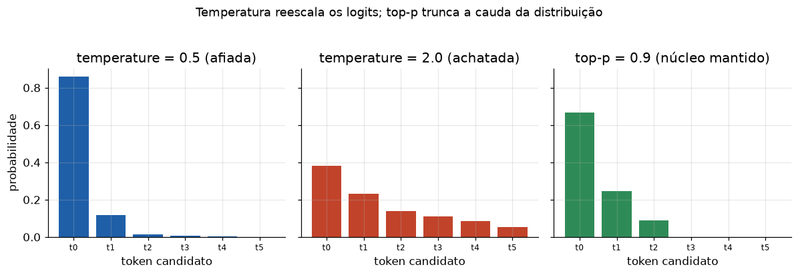

# Lição 049 — Sampling e decodificação: temperature, top-p e top-k

> **Módulo:** M05 — LLMs e Pipeline de Treino · **Ordem de estudo:** 49 · **Tempo:** ~50 min
> **Pré-requisitos:** [044] O que são LLMs: modelagem de linguagem e leis de escala
> **Classificação:** complemento de aprofundamento à ementa

> **Convenção de formatação:** matemática em LaTeX (`$...$` inline, `$$...$$` em
> destaque, render nativo na pré-visualização do VS Code); figuras reprodutíveis
> geradas por `tools/figuras/gerar_figuras_m05.py` e incorporadas por caminho
> relativo `assets/<NNN>-<slug>/<nome>.png`; blocos ```python só para código e
> saída.

## Seção_Teórica

### Motivação

Um LLM produz, a cada passo, uma **distribuição** sobre o próximo token (Lição
044). Mas para gerar texto é preciso **escolher** um token concreto — e essa
escolha não é única. Pegar sempre o token mais provável (*greedy*) gera texto
correto porém repetitivo e sem graça; amostrar da distribuição inteira injeta
diversidade, mas arrisca tokens absurdos da cauda. A **decodificação** é o conjunto
de regras que controla esse trade-off, e três botões dominam a prática: a
**temperatura**, o **top-k** e o **top-p (nucleus)**. São os parâmetros que você
ajusta em toda API de LLM (Lição 051) e a causa nº 1 de "por que o modelo ficou
repetitivo / por que ele alucinou". Entender o que cada um faz na distribuição é o
que transforma o ajuste de "tentativa e erro" em decisão informada.

### Princípio de funcionamento

A geração parte dos **logits** $z = (z_1, \dots, z_V)$ sobre o vocabulário. A
**temperatura** $T > 0$ os reescala **antes** da softmax:

$$ p_i = \frac{\exp(z_i / T)}{\sum_{j} \exp(z_j / T)}. $$

Com $T < 1$ a distribuição fica mais **afiada** (concentra nos tokens prováveis,
mais determinística); com $T > 1$ fica mais **achatada** (mais diversidade); no
limite $T \to 0$ recuperamos o *greedy*. A temperatura **não zera** nenhum token —
só redistribui massa.

Para cortar a cauda ruim, usam-se dois filtros de **truncamento**:

- **top-k:** mantém apenas os $k$ tokens de maior probabilidade e renormaliza;
  zera todo o resto. Simples, mas usa um $k$ fixo independente do formato da
  distribuição.
- **top-p (nucleus):** ordena os tokens por probabilidade e mantém o **menor
  conjunto** cuja massa acumulada atinge $p$ (ex.: 0.9), renormalizando. O tamanho
  do conjunto **se adapta**: poucos tokens quando o modelo está confiante, muitos
  quando está incerto.

Na prática, aplica-se temperatura e **depois** um filtro (top-k ou top-p), e então
**amostra-se** da distribuição truncada.



*Figura 1 — Temperatura reescala os logits (afia em $T=0.5$, achata em $T=2.0$); o top-p mantém o núcleo de massa 0.9 e zera a cauda (cinza). Gerada por `tools/figuras/gerar_figuras_m05.py`.*

---

### Conceito central 1 — Temperatura

A temperatura divide os logits antes da softmax. Como a exponencial amplifica
diferenças, $T < 1$ aumenta a vantagem do token mais provável (distribuição
afiada) e $T > 1$ a reduz (distribuição achatada). É o botão de "criatividade vs
foco".

#### Exemplo_Resolvido 1.1

```python
import numpy as np

def softmax(logits, T=1.0):
    z = np.asarray(logits, dtype=float) / T
    z = z - z.max()
    e = np.exp(z)
    return e / e.sum()

logits = np.array([3.0, 2.0, 1.0, -1.0])
for T in [0.5, 1.0, 2.0]:
    p = softmax(logits, T)
    dist = " ".join(f"{x:.4f}" for x in p)
    print(f"T={T}: [{dist}]  max={p.max():.4f}")
```

**Explicação passo a passo:**
- **Bloco 1 (`softmax`):** divide os logits por $T$ e subtrai o máximo (estabilidade numérica) antes de exponenciar.
- **Bloco 2 (`logits`):** quatro tokens candidatos com logits decrescentes.
- **Bloco 3 (laço de `T`):** com $T=0.5$ a probabilidade do token top sobe para 0.8666; com $T=2.0$ cai para 0.4740 — a mesma ordem de tokens, mas massa cada vez mais espalhada.

**Saída esperada:**
```
T=0.5: [0.8666 0.1173 0.0159 0.0003]  max=0.8666
T=1.0: [0.6572 0.2418 0.0889 0.0120]  max=0.6572
T=2.0: [0.4740 0.2875 0.1744 0.0641]  max=0.4740
```

---

### Conceito central 2 — Top-k

O top-k mantém os $k$ tokens mais prováveis e **zera** o resto, renormalizando para
somar 1. Garante que nenhum token fora dos $k$ melhores seja amostrado, ao custo de
um $k$ fixo que pode ser pequeno demais (corta opções válidas) ou grande demais
(deixa cauda ruim passar).

#### Exemplo_Resolvido 2.1

```python
import numpy as np

def softmax(logits):
    z = logits - logits.max()
    e = np.exp(z)
    return e / e.sum()

logits = np.array([2.0, 1.0, 0.0, -0.5])
p = softmax(logits)
k = 2
idx = np.argsort(-p)[:k]
mascara = np.zeros_like(p)
mascara[idx] = 1.0
p_top = p * mascara
p_top = p_top / p_top.sum()
print("p original:", np.round(p, 4).tolist())
print(f"top-{k} indices:", sorted(idx.tolist()))
print("p top-k   :", np.round(p_top, 4).tolist())
```

**Explicação passo a passo:**
- **Bloco 1 (`softmax`):** converte os logits em probabilidades.
- **Bloco 2 (`idx`):** `argsort(-p)` ordena por probabilidade decrescente; os primeiros $k=2$ índices são os mantidos.
- **Bloco 3 (`p_top`):** zera os tokens fora do top-k e renormaliza; a massa dos dois melhores (0.6308 e 0.2321) é reescalada para 0.7311 e 0.2689.
- **Bloco 4 (`print`):** os dois tokens da cauda viram exatamente 0 — nunca serão amostrados.

**Saída esperada:**
```
p original: [0.6308, 0.2321, 0.0854, 0.0518]
top-2 indices: [0, 1]
p top-k   : [0.7311, 0.2689, 0.0, 0.0]
```

---

### Conceito central 3 — Top-p (nucleus) e amostragem

O top-p mantém o **menor** conjunto de tokens cuja massa acumulada alcança $p$. O
tamanho do núcleo se **adapta** à confiança do modelo. Depois de truncar e
renormalizar, amostramos da distribuição resultante; com uma semente fixa, a
amostragem é **reprodutível**.

#### Exemplo_Resolvido 3.1

```python
import numpy as np

def softmax(logits):
    z = logits - logits.max()
    e = np.exp(z)
    return e / e.sum()

logits = np.array([3.0, 2.0, 1.0, 0.0, -1.0])
p = softmax(logits)
ordem = np.argsort(-p)
acum = np.cumsum(p[ordem])
corte = int(np.searchsorted(acum, 0.9)) + 1
manter = ordem[:corte]
p_top = np.zeros_like(p)
p_top[manter] = p[manter]
p_top = p_top / p_top.sum()

rng = np.random.default_rng(0)
amostras = rng.choice(len(p), size=1000, p=p_top)
contagens = np.bincount(amostras, minlength=len(p))

print(f"tokens no nucleo (p=0.9): {corte}")
print("p top-p   :", np.round(p_top, 4).tolist())
print("contagens :", contagens.tolist())
```

**Explicação passo a passo:**
- **Bloco 1 (`softmax`):** probabilidades do próximo token.
- **Bloco 2 (`ordem`/`acum`/`corte`):** ordena por probabilidade, soma cumulativamente e acha o menor conjunto cuja massa $\geq 0.9$; aqui são 3 tokens.
- **Bloco 3 (`p_top`):** zera a cauda fora do núcleo e renormaliza.
- **Bloco 4 (`rng`/`contagens`):** com semente fixa (`default_rng(0)`), amostra 1000 tokens da distribuição truncada; as contagens (640/269/91) seguem as probabilidades 0.6652/0.2447/0.0900 e os dois tokens zerados nunca aparecem.

**Saída esperada:**
```
tokens no nucleo (p=0.9): 3
p top-p   : [0.6652, 0.2447, 0.09, 0.0, 0.0]
contagens : [640, 269, 91, 0, 0]
```

## Seção_Prática

> **Como reproduzir:** execute cada solução de referência com
> `python trilha/solucoes/049-sampling-decodificacao/solucao_<n>.py` e compare a
> saída com o arquivo `.saida.txt` correspondente. Os enunciados/esqueletos ficam
> em `trilha/pratica/049-sampling-decodificacao/exercicio_<n>.py`.

### Exercício 1 — Temperatura sobre a softmax
- **Entrada inicial / setup:** `logits = [2.0, 1.0, 0.5, -1.0]` e a lista `T in [0.5, 1.0, 2.0]`.
- **Passos de execução:** implemente uma softmax com temperatura (divide os logits por `T`, subtrai o máximo, exponencia e normaliza) e, para cada `T`, imprima a distribuição (4 casas, entre colchetes) e o `max` (4 casas).
- **Critério de conclusão (binário):** a saída é **exatamente** igual a `solucao_1.saida.txt` (`T=0.5: [0.8420 0.1140 0.0419 0.0021]  max=0.8420`); qualquer divergência reprova.
- **Solução de referência:** `trilha/solucoes/049-sampling-decodificacao/solucao_1.py`
- **Saída esperada:** `trilha/solucoes/049-sampling-decodificacao/solucao_1.saida.txt`

### Exercício 2 — Filtragem top-k
- **Entrada inicial / setup:** `logits = [2.0, 1.0, 0.5, 0.0, -1.0]` e `k = 3`.
- **Passos de execução:** calcule a softmax, selecione os `k` índices de maior probabilidade, zere os demais e renormalize; imprima `p original` (lista, 4 casas), `top-k indices` (ordenados) e `p top-k` (lista, 4 casas).
- **Critério de conclusão (binário):** a saída é **exatamente** igual a `solucao_2.saida.txt` (`top-3 indices: [0, 1, 2]` e `p top-k   : [0.6285, 0.2312, 0.1402, 0.0, 0.0]`); qualquer divergência reprova.
- **Solução de referência:** `trilha/solucoes/049-sampling-decodificacao/solucao_2.py`
- **Saída esperada:** `trilha/solucoes/049-sampling-decodificacao/solucao_2.saida.txt`

### Exercício 3 — Top-p (nucleus) e amostragem reprodutível
- **Entrada inicial / setup:** `logits = [3.0, 2.0, 1.0, 0.0, -1.0]`, alvo de massa `p = 0.9` e semente `np.random.default_rng(0)`, amostrando 1000 tokens.
- **Passos de execução:** ordene as probabilidades, ache o menor núcleo com massa $\geq 0.9$, zere a cauda e renormalize; amostre 1000 tokens da distribuição truncada e conte as ocorrências por token; imprima `tokens no nucleo (p=0.9)`, `p top-p` (lista, 4 casas) e `contagens` (lista).
- **Critério de conclusão (binário):** a saída é **exatamente** igual a `solucao_3.saida.txt` (`tokens no nucleo (p=0.9): 3` e `contagens : [640, 269, 91, 0, 0]`); qualquer divergência reprova.
- **Solução de referência:** `trilha/solucoes/049-sampling-decodificacao/solucao_3.py`
- **Saída esperada:** `trilha/solucoes/049-sampling-decodificacao/solucao_3.saida.txt`
