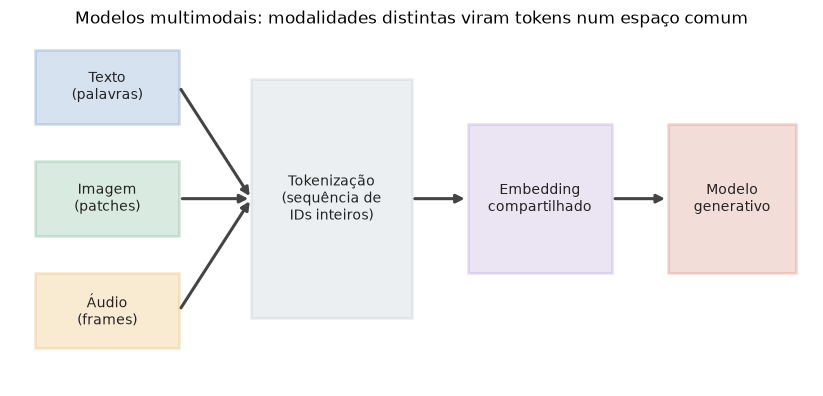

# Lição 050 — Panorama de GenAI e modelos multimodais

> **Módulo:** M06 — GenAI Aplicado, Prompt Engineering e APIs · **Ordem de estudo:** 50 · **Tempo:** ~45 min
> **Pré-requisitos:** [044] O que são LLMs: modelagem de linguagem e leis de escala
> **Classificação:** coberto pela ementa

> **Convenção de formatação:** matemática em LaTeX (`$...$` inline, `$$...$$` em
> destaque, render nativo na pré-visualização do VS Code); figuras reprodutíveis
> geradas por `tools/figuras/gerar_figuras_m06.py` e incorporadas por caminho
> relativo `assets/<NNN>-<slug>/<nome>.png`; blocos ```python só para código e
> saída.

## Seção_Teórica

### Motivação

Até aqui estudamos como um LLM modela a linguagem (Lição 044) e como ele decide o
próximo token (Lição 049). Mas o termo **GenAI** (IA *generativa*) é mais amplo:
abrange qualquer modelo treinado para **produzir conteúdo novo** — texto, imagem,
áudio, código — em vez de apenas rotular uma entrada existente. E os sistemas mais
recentes são **multimodais**: um único modelo recebe texto **e** imagem **e** áudio
e responde combinando essas fontes. Para usar essas APIs com competência (o resto
do módulo M06), você precisa de um mapa mental de três coisas: o que diferencia um
modelo generativo, como uma imagem ou um áudio viram "tokens" que o modelo entende,
e por que um **espaço de embedding compartilhado** é o que permite casar uma
legenda com a imagem certa. Esta lição constrói esse mapa com exemplos
determinísticos em Python puro — sem chamar nenhuma API real.

### Princípio de funcionamento

Um modelo **discriminativo** aprende $p(y \mid x)$: dado um $x$, prevê um rótulo
$y$ (ex.: "esta foto é de um gato?"). Um modelo **generativo** aprende a própria
distribuição dos dados e sabe **amostrar** dela — em linguagem, isso é a fatoração
autorregressiva

$$p(x_1, x_2, \dots, x_T) = \prod_{t=1}^{T} p(x_t \mid x_1, \dots, x_{t-1}),$$

que gera uma sequência um token de cada vez (Lições 044 e 049). A grande virada
**multimodal** é perceber que *qualquer* modalidade pode ser fatiada em uma
**sequência de tokens**: o texto em subpalavras, a imagem em **patches**
(quadradinhos de pixels), o áudio em **quadros** curtos. Cada token vira um vetor;
todos os vetores vivem num **espaço de embedding compartilhado**, onde a
proximidade mede semelhança de significado **independente da modalidade**. É por
isso que um modelo estilo CLIP consegue dizer que a legenda "uma montanha nevada"
está mais perto da *foto* de uma montanha do que da de um carro: ambas foram
projetadas no mesmo espaço, e comparamos por **similaridade do cosseno**

$$\cos(\mathbf{a}, \mathbf{b}) = \frac{\mathbf{a} \cdot \mathbf{b}}{\lVert \mathbf{a}\rVert\,\lVert \mathbf{b}\rVert}.$$



*Figura 1 — Modalidades distintas (texto, imagem, áudio) viram sequências de tokens, são projetadas num espaço de embedding comum e alimentam um único modelo generativo. Gerada por `tools/figuras/gerar_figuras_m06.py`.*

---

### Conceito central 1 — Generativo vs discriminativo

Um modelo generativo de linguagem **amostra** da distribuição do próximo token; em
vez de treinar a rede completa, podemos ilustrar a ideia com um **bigrama**: contar,
num corpus, qual palavra costuma seguir cada palavra e gerar texto sempre seguindo a
transição mais provável (decodificação **gulosa**). É um gerador de brinquedo, mas
captura a essência autorregressiva: a saída de um passo vira a entrada do próximo.

#### Exemplo_Resolvido 1.1

```python
# Modelo generativo minimo: bigrama por contagem + decodificacao gulosa.
from collections import Counter, defaultdict

corpus = "o gato caca o rato o gato dorme".split()
trans = defaultdict(Counter)
for a, b in zip(corpus, corpus[1:]):
    trans[a][b] += 1

def proximo(palavra):
    candidatos = trans[palavra]
    return max(sorted(candidatos), key=lambda w: candidatos[w])

seq = ["o"]
for _ in range(4):
    seq.append(proximo(seq[-1]))
print("corpus:", " ".join(corpus))
print("gerado:", " ".join(seq))
```

**Explicação passo a passo:**
- **Bloco 1 (`corpus`/`trans`):** percorre pares consecutivos de palavras e conta as transições palavra → próxima palavra (a "tabela de bigrama").
- **Bloco 2 (`proximo`):** dado uma palavra, devolve a próxima mais frequente; `sorted` garante desempate alfabético, tornando a geração **determinística**.
- **Bloco 3 (laço):** parte de `"o"` e gera 4 palavras, realimentando a última palavra gerada — exatamente a estrutura autorregressiva $p(x_t \mid x_{<t})$.

**Saída esperada:**
```
corpus: o gato caca o rato o gato dorme
gerado: o gato caca o gato
```

---

### Conceito central 2 — Modalidades e tokens

Para um modelo multimodal, **tudo vira token**. O texto é fatiado em palavras (ou
subpalavras), a imagem em **patches** quadrados e o áudio em **quadros**. Saber
contar esses tokens é prático: o "orçamento de tokens" de uma entrada multimodal
determina custo e se ela cabe na janela de contexto (assunto da Lição 051).

#### Exemplo_Resolvido 2.1

```python
def tokens_texto(texto):
    return len(texto.split())          # uma palavra = um token (aproximacao)

def tokens_imagem(altura, largura, patch):
    return (altura // patch) * (largura // patch)   # patches quadrados

def tokens_audio(duracao_s, taxa_quadros):
    return int(duracao_s * taxa_quadros)            # um token por quadro

texto = "descreva a cena nesta imagem"
n_texto = tokens_texto(texto)
n_imagem = tokens_imagem(224, 224, 16)
n_audio = tokens_audio(2.0, 50)
total = n_texto + n_imagem + n_audio
print(f"tokens texto : {n_texto}")
print(f"tokens imagem: {n_imagem}")
print(f"tokens audio : {n_audio}")
print(f"total        : {total}")
```

**Explicação passo a passo:**
- **Bloco 1 (funções):** cada modalidade tem sua regra de tokenização — palavras para texto, patches $16 \times 16$ para a imagem ($224/16 = 14$ por lado, $14^2 = 196$), quadros para o áudio.
- **Bloco 2 (cálculo):** aplica as três funções e soma; uma imagem $224 \times 224$ sozinha (196 tokens) domina o orçamento frente ao texto curto.
- **Bloco 3 (`print`):** exibe a decomposição e o total de 301 tokens.

**Saída esperada:**
```
tokens texto : 5
tokens imagem: 196
tokens audio : 100
total        : 301
```

---

### Conceito central 3 — Espaço de embedding compartilhado

Projetadas no **mesmo** espaço, uma legenda de texto e várias imagens podem ser
comparadas diretamente por **similaridade do cosseno**. Quanto maior o cosseno,
mais "alinhados" estão os significados — é a base da recuperação multimodal (achar
a imagem que melhor corresponde a um texto, como em modelos estilo CLIP).

#### Exemplo_Resolvido 3.1

```python
import numpy as np

def cosseno(a, b):
    a = np.asarray(a, dtype=float)
    b = np.asarray(b, dtype=float)
    return float(a @ b / (np.linalg.norm(a) * np.linalg.norm(b)))

texto_emb = np.array([0.9, 0.1, 0.2])      # embedding da legenda
imagens = {
    "gato":   np.array([0.8, 0.2, 0.1]),
    "praia":  np.array([0.1, 0.9, 0.3]),
    "cidade": np.array([0.2, 0.1, 0.9]),
}
sims = {nome: cosseno(texto_emb, emb) for nome, emb in imagens.items()}
melhor = max(sims, key=sims.get)
for nome, s in sims.items():
    print(f"{nome:>6}: {s:.4f}")
print("melhor match:", melhor)
```

**Explicação passo a passo:**
- **Bloco 1 (`cosseno`):** produto interno normalizado pelas normas — mede o ângulo entre os vetores, ignorando magnitude.
- **Bloco 2 (`texto_emb`/`imagens`):** a legenda e três imagens já projetadas no espaço comum (vetores fixos para reprodutibilidade).
- **Bloco 3 (`sims`/`melhor`):** calcula a similaridade da legenda com cada imagem; `"gato"` (0.9866) vence com folga sobre `"cidade"` e `"praia"`, recuperando a correspondência correta.

**Saída esperada:**
```
  gato: 0.9866
 praia: 0.2713
cidade: 0.4302
melhor match: gato
```

## Seção_Prática

> **Como reproduzir:** execute cada solução de referência com
> `python trilha/solucoes/050-genai-multimodais/solucao_<n>.py` e compare a saída
> com o arquivo `.saida.txt` correspondente. Os enunciados/esqueletos ficam em
> `trilha/pratica/050-genai-multimodais/exercicio_<n>.py`.

### Exercício 1 — Geração gulosa com um bigrama
- **Entrada inicial / setup:** `corpus = "a ia gera texto a ia ajuda pessoas a ia aprende".split()` e a palavra inicial `"a"`.
- **Passos de execução:** treine um bigrama por contagem (palavra → `Counter` de próximas), implemente `proximo(palavra)` com desempate alfabético (`max(sorted(...), key=...)`), gere 5 palavras a partir de `"a"` e imprima `corpus:` e `gerado:`.
- **Critério de conclusão (binário):** a saída é **exatamente** igual a `solucao_1.saida.txt` (`gerado: a ia ajuda pessoas a ia`); qualquer divergência reprova.
- **Solução de referência:** `trilha/solucoes/050-genai-multimodais/solucao_1.py`
- **Saída esperada:** `trilha/solucoes/050-genai-multimodais/solucao_1.saida.txt`

### Exercício 2 — Orçamento de tokens multimodal
- **Entrada inicial / setup:** texto `"transcreva e resuma este clipe de audio"`, imagem `256 x 256` com patch `16`, áudio de `3.0` s a `25` quadros/s.
- **Passos de execução:** implemente `tokens_texto`, `tokens_imagem` (`(altura // patch) * (largura // patch)`) e `tokens_audio` (`int(duracao_s * taxa_quadros)`); imprima a decomposição e o `total` no formato alinhado mostrado.
- **Critério de conclusão (binário):** a saída é **exatamente** igual a `solucao_2.saida.txt` (`tokens imagem: 256` e `total        : 338`); qualquer divergência reprova.
- **Solução de referência:** `trilha/solucoes/050-genai-multimodais/solucao_2.py`
- **Saída esperada:** `trilha/solucoes/050-genai-multimodais/solucao_2.saida.txt`

### Exercício 3 — Recuperação multimodal por cosseno
- **Entrada inicial / setup:** `legenda = np.array([0.2, 0.8, 0.3])` e três imagens (`cachorro`, `montanha`, `carro`) com os vetores dados no esqueleto.
- **Passos de execução:** implemente `cosseno(a, b)`, calcule a similaridade da legenda com cada imagem, ordene em ordem **decrescente** e imprima `nome: similaridade` (campo de 9 à direita, 4 casas) e o `melhor match`.
- **Critério de conclusão (binário):** a saída é **exatamente** igual a `solucao_3.saida.txt` (`melhor match: montanha`); qualquer divergência reprova.
- **Solução de referência:** `trilha/solucoes/050-genai-multimodais/solucao_3.py`
- **Saída esperada:** `trilha/solucoes/050-genai-multimodais/solucao_3.saida.txt`
